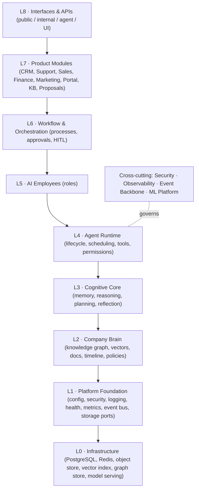

# Genesis — Glossary & Canonical Decisions

This is the **spine** of the Genesis specification. Every other document in
`docs/genesis/` derives its terminology and its binding technical choices from
here. Where a later document appears to contradict this one, this document
wins and the contradiction is a bug to be fixed.

Genesis is the operating model for the **PB Platform** foundation
(`docs/ARCHITECTURE.md`). It does not redesign the foundation; it specifies how
everything built on top of it must behave.

---

## 1. What Genesis is

**Genesis is an Autonomous Digital Workforce Platform.** It lets a business
deploy **AI Employees** — long-lived, role-specialised agents — that collaborate
through a shared **Company Brain** to perform real business work under governed
autonomy.

Genesis is **not** a chatbot, **not** a CRM, and **not** a generic automation
platform. Those are surfaces or consumers; Genesis is the cognitive and
operational substrate beneath them.

---

## 2. Core vocabulary (use these exact terms everywhere)

| Term                  | Definition                                                                                                                                                                                                                                  |
| --------------------- | ------------------------------------------------------------------------------------------------------------------------------------------------------------------------------------------------------------------------------------------- |
| **Tenant**            | An isolated customer organisation. All data, memory, and agents are scoped to a `tenant_id`. Multi-tenant by design. "Company" is **not** a synonym for Tenant.                                                                             |
| **Account**           | The CRM aggregate representing a customer/prospect/partner organisation the Tenant does business with. (The word "Company" is reserved for the compound product terms **Company Brain** and **Company Policies**, never for a data entity.) |
| **AI Employee**       | A named, role-specialised, persistent agent (e.g. Sales Manager) with a mission, KPIs, authority, and memory.                                                                                                                               |
| **Agent**             | The runtime instance executing an AI Employee's role. One AI Employee → one or more agent instances.                                                                                                                                        |
| **Company Brain**     | The shared, per-tenant knowledge substrate: knowledge graph + vector store + document store + timeline + policies.                                                                                                                          |
| **Memory**            | Cognitive state an agent reads/writes. Six types (§5). Semantic and long-term memory physically live in the Brain.                                                                                                                          |
| **Working Set**       | The assembled context for one reasoning step (a.k.a. context window payload). Built by the Context Builder.                                                                                                                                 |
| **Event**             | An immutable, past-tense fact recorded on the event backbone. The only sanctioned way modules learn what happened.                                                                                                                          |
| **Aggregate**         | A consistency boundary that owns state and emits events (DDD). Rebuilt by replaying its events.                                                                                                                                             |
| **Bounded Context**   | A domain with its own model and language (DDD). Contexts integrate only via events and published APIs.                                                                                                                                      |
| **Capability**        | A declared skill an agent can perform (e.g. `send_email`, `create_proposal`), gated by permissions and authority.                                                                                                                           |
| **Tool**              | A concrete executable behind a Capability (an API call, a query, a model invocation) run in a sandbox.                                                                                                                                      |
| **Authority Level**   | How much an agent may act without a human (A0–A5, §8). Distinct from RBAC identity permissions.                                                                                                                                             |
| **Reflection**        | An agent's structured self-review of its own actions/outcomes that produces learning and memory.                                                                                                                                            |
| **Port / Adapter**    | Hexagonal architecture: a `Port` is an interface Genesis depends on; an `Adapter` is a swappable implementation.                                                                                                                            |
| **Small model / Net** | A narrow, specialised ML model (e.g. `MemoryRankNet`) — never a foundation LLM. See `011_ML_Platform.md`.                                                                                                                                   |
| **HITL**              | Human-in-the-loop: a required human approval/step before or during an agent action.                                                                                                                                                         |

---

## 3. Locked architectural decisions

These are binding. Alternatives are compared in the referenced documents, but
the **selected** option is fixed here so documents cannot diverge.

### 3.1 Layered architecture (referenced by `002`, `006`, `013`)

**Dependency rule (inviolable):** a layer may depend only on layers **below**
it, and only through **ports**. Lower layers never import higher ones. Product
modules (L7) never import each other; they integrate via events (L1 backbone)
and published APIs (L8) — the same rule the foundation enforces for `apps/`.

### 3.2 Ports and default adapters (referenced by `002`, `004`, `008`, `009`, `011`, `012`)

Genesis depends on **ports**, never concrete vendors. Each port ships a default
adapter chosen for "no new infrastructure beyond the foundation, no lock-in",
plus at least one scale-up adapter.

| Port            | Purpose                              | Default adapter (v1)                                         | Scale-up adapters                                          |
| --------------- | ------------------------------------ | ------------------------------------------------------------ | ---------------------------------------------------------- |
| `EventStore`    | Append-only system of record         | PostgreSQL (append-only table)                               | EventStoreDB, Kafka+compaction                             |
| `EventBus`      | Pub/sub distribution                 | Redis Streams                                                | NATS JetStream, Kafka                                      |
| `VectorStore`   | Embedding search                     | PostgreSQL + `pgvector`                                      | Qdrant, Milvus                                             |
| `GraphStore`    | Knowledge graph                      | PostgreSQL (edges + CTE) / AGE                               | Neo4j                                                      |
| `DocumentStore` | Markdown / structured knowledge docs | PostgreSQL + object store                                    | —                                                          |
| `BlobStore`     | Files, attachments, artifacts        | S3-compatible (MinIO self-host)                              | AWS S3, GCS                                                |
| `ModelProvider` | Hosted LLM reasoning                 | Anthropic Claude                                             | OpenAI, Google, local vLLM                                 |
| `Embeddings`    | Text→vector embedding                | Self-hosted `bge-large-en-v1.5` (1024-dim) via `ModelServer` | Hosted embedding model (Voyage/OpenAI) via `ModelProvider` |
| `ModelServer`   | Serving small Nets                   | ONNX Runtime behind FastAPI                                  | Triton, TorchServe                                         |
| `FeatureStore`  | ML features (offline + online)       | PostgreSQL (+ Redis online)                                  | Feast                                                      |
| `SecretStore`   | Secrets                              | Environment (foundation)                                     | Vault, AWS SSM                                             |
| `Scheduler`     | Time/cron/delayed work               | PostgreSQL-backed queue                                      | Temporal                                                   |

**Rationale:** the foundation already runs PostgreSQL and Redis. Defaulting to
them keeps v1 operable on a single Docker Compose stack (`docs/DEPLOYMENT.md`)
while the port boundary lets any component be replaced without touching callers.
LLM reasoning is abstracted so Genesis is never locked to one model vendor.

### 3.3 Backbone: event-sourced, event-driven

Everything of consequence is an **event**. Aggregates persist by appending
events to the `EventStore` (source of truth); the `EventBus` distributes them to
subscribers (agents, projections, ML feature pipelines, audit). Read models are
**projections** rebuilt from events. See `005_Event_Model.md`.

### 3.4 Reasoning strategy

Reasoning uses **hosted LLMs via `ModelProvider`** (no foundation-model
training). Genesis trains only **small specialised Nets** for ranking, scoring,
and prediction (`011_ML_Platform.md`). The default reasoning model tier is the
latest Claude family; the provider is swappable.

---

## 4. Canonical module / bounded-context map

Genesis contexts map onto the reserved platform namespaces already declared in
the foundation (`apps/api/src/pb_api/platform/modules.py`,
`GET /api/v1/platform/modules`). Use these names and slugs verbatim.

| Bounded context           | Namespace / slug             | Notes                                                                                                                                                                                                |
| ------------------------- | ---------------------------- | ---------------------------------------------------------------------------------------------------------------------------------------------------------------------------------------------------- |
| Identity & Access         | `identity`                   | Foundation: auth, RBAC. Extended with ABAC + authority.                                                                                                                                              |
| Observability             | `observability`              | Foundation: health, metrics, logs, audit.                                                                                                                                                            |
| Company Brain / Knowledge | `ai-services` → `/api/v1/ai` | Registry slug is `ai-services` (see `platform/modules.py`); the API namespace and the umbrella event/namespace token are `ai`. Brain, memory, cognition, agent runtime, workflows, and ML live here. |
| CRM                       | `crm`                        | Contacts, accounts, deals.                                                                                                                                                                           |
| Client Portal             | `client-portal`              | Customer-facing workspace.                                                                                                                                                                           |
| Billing & Invoicing       | `billing`                    | Finance employee's product surface.                                                                                                                                                                  |
| Ticketing                 | `ticketing`                  | Support employee's product surface.                                                                                                                                                                  |
| Knowledge Base            | `knowledge-base`             | Curated articles (a Brain projection).                                                                                                                                                               |
| Proposal Engine           | `proposal-engine`            | Solutions Architect / Sales surface.                                                                                                                                                                 |
| Marketing Website         | `marketing-website`          | Marketing employee's public surface.                                                                                                                                                                 |
| Outbound Sales Engine     | `outbound-sales`             | **Compliance-gated** (governance §Legal).                                                                                                                                                            |

New Genesis-internal contexts not yet in the registry — **Memory**, **Events/Audit**,
**Agent Workforce**, **Workflows**, **ML & Feature Store** — are platform-internal
and are added to the registry when implemented.

---

## 5. Canonical memory taxonomy (referenced by `003`, `004`, `008`)

Exactly six memory types. Define them only as below.

| Memory           | Horizon         | Lives in                      | Purpose                                             |
| ---------------- | --------------- | ----------------------------- | --------------------------------------------------- |
| **Working**      | Seconds–minutes | In-process / Redis            | The Working Set for the current reasoning step.     |
| **Conversation** | A session       | PostgreSQL (+ Redis cache)    | Turn-by-turn dialogue with a human or agent.        |
| **Episodic**     | Days–months     | EventStore + Memory tables    | "What happened": time-indexed experiences/outcomes. |
| **Semantic**     | Long            | Company Brain (graph+vectors) | "What is true": facts, entities, relationships.     |
| **Procedural**   | Long            | Company Brain + Workflow defs | "How to": skills, playbooks, workflow templates.    |
| **Long-term**    | Durable         | Company Brain (consolidated)  | Consolidated, ranked, deduplicated knowledge.       |

The **Memory Engine** (`008`) governs importance, decay, ranking, recall,
promotion, consolidation, and archiving across these types.

---

## 6. Canonical AI Employee roster (referenced by `007`)

Exactly twelve founding roles. Each is specified in `007_AI_Employees.md` with
Mission, KPIs, Responsibilities, Inputs, Outputs, Tools, Memory usage, Authority,
and Learning objectives.

CEO · CTO · Program Manager · Sales Manager · Support · Finance ·
Knowledge Manager · Solutions Architect · Research · Developer · QA · Marketing.

Employees that contact people (Sales Manager, Marketing, and the Outbound Sales
Engine surface) inherit the governance outreach-compliance controls
(`AI_DEPLOY_AUTHORIZATION.md` §Legal; `apps/api/src/pb_api/platform/modules.py`
`OUTREACH_COMPLIANCE_CONTROLS`) and require HITL before first contact.

---

## 7. Canonical agent lifecycle states (referenced by `006`, `010`)

`Provisioned → Registered → Idle → Planning → Acting → Reflecting`, with
`Blocked` (awaiting approval or input), `Suspended`, `Recovering` (after error),
and terminal `Retired`. Full state machine and transitions in `006_Agent_Runtime.md`.

---

## 8. Canonical authority levels (referenced by `006`, `007`, `010`, `012`)

Authority is **what an agent may do without a human**, orthogonal to RBAC/ABAC
identity permissions. An action requires the caller to hold **both** the
permission and sufficient authority; the lower of the two governs.

| Level | Name                       | Meaning                                                            |
| ----- | -------------------------- | ------------------------------------------------------------------ |
| A0    | Observe                    | Read-only. May perceive and record, never mutate.                  |
| A1    | Suggest                    | May draft/recommend; a human or higher agent must approve.         |
| A2    | Act with approval          | May execute a specific action after explicit HITL approval.        |
| A3    | Act autonomously (bounded) | Acts without approval inside declared limits (value, scope, rate). |
| A4    | Act autonomously (broad)   | Acts across a context; still bounded by policy and budget.         |
| A5    | Govern                     | May change policy, authority, or configuration (admin-class).      |

First-contact outreach is **never** above A2 regardless of an employee's level.

---

## 9. Canonical event naming (referenced by `005`, and all producers)

Pattern: `pb.<context>.<aggregate>.<event>` where `<event>` is **past tense**.
Examples: `pb.crm.lead.created`, `pb.memory.item.consolidated`,
`pb.agent.task.completed`, `pb.workflow.approval.granted`. Envelope, correlation
and causation IDs, and lifecycle are defined once in `005_Event_Model.md`.

### 9.1 Closed event-context registry

`<context>` **must** be one of the tokens below. `005_Event_Model.md` is the
authoritative event catalogue; every `pb.*` event in any Genesis document
resolves to one of these contexts. New contexts are added here first.

| Context         | Domain / owner                                                                                  |
| --------------- | ----------------------------------------------------------------------------------------------- |
| `identity`      | Identity & Access: users, tenants, authority.                                                   |
| `crm`           | CRM: contacts, accounts, deals, leads.                                                          |
| `support`       | Support/Ticketing (registry slug `ticketing`; event domain name `support`).                     |
| `billing`       | Billing & Finance: invoices, subscriptions, forecasts.                                          |
| `marketing`     | Marketing: campaigns, content, MQLs.                                                            |
| `outbound`      | Outbound Sales Engine (compliance-gated).                                                       |
| `proposal`      | Proposals and solution patterns.                                                                |
| `kb`            | Knowledge Base articles.                                                                        |
| `knowledge`     | Company Brain: entities, facts, rules, conflicts.                                               |
| `memory`        | Memory Engine: `MemoryItem` lifecycle.                                                          |
| `agent`         | Agent runtime + cognition: tasks, plans, thoughts, decisions, reflections, actions, objectives. |
| `engineering`   | Developer/QA/CTO/Solutions-Architect work: changes, tests, deploys, architecture decisions.     |
| `workflow`      | Workflow Engine: instances, steps, approvals.                                                   |
| `ml`            | ML Platform: models, training, drift.                                                           |
| `observability` | Alerts and operational signals.                                                                 |
| `audit`         | Security/audit meta-events (see `012_Security.md`).                                             |

There is deliberately **no `cognition` context**: cognitive events (thought,
plan, decision, reflection, learning) belong to `agent`, the runtime that
emits them.

### 9.2 Canonical spellings for cross-document facts

Where more than one document emits the same fact, use exactly these names:

| Fact                             | Canonical event                  |
| -------------------------------- | -------------------------------- |
| Agent finished a self-review     | `pb.agent.reflection.recorded`   |
| Agent produced a cognitive plan  | `pb.agent.plan.created`          |
| An approved action ran           | `pb.agent.action.executed`       |
| A memory item was written        | `pb.memory.item.created`         |
| An agent's authority changed     | `pb.identity.authority.changed`  |
| A support ticket opened/resolved | `pb.support.ticket.*`            |
| A knowledge conflict was found   | `pb.knowledge.conflict.detected` |
| A workflow task was assigned     | `pb.workflow.task.assigned`      |

---

## 10. Canonical small-model roster (referenced by `011`)

`MemoryRankNet` · `ProposalNet` · `SalesNet` · `WorkflowNet` · `TaskPriorityNet`
· `CustomerHealthNet` · `LeadScoreNet` · `ReflectionNet`. Each has a purpose,
feature inputs, output, training source, offline metric, and a
champion/challenger deployment, specified in `011_ML_Platform.md`.

---

## 11. Document index & cross-reference convention

Refer to sibling documents by filename (e.g. "see `004_Company_Brain.md`").
The canonical set:

| #   | Document                        | Owns                                          |
| --- | ------------------------------- | --------------------------------------------- |
| 000 | `000_Glossary.md`               | This spine.                                   |
| 001 | `001_Vision.md`                 | Mission, positioning, roadmap-at-a-glance.    |
| 002 | `002_System_Architecture.md`    | Layers, modules, communication, plugins.      |
| 003 | `003_Cognitive_Architecture.md` | Memory→reasoning→decision pipeline.           |
| 004 | `004_Company_Brain.md`          | Shared knowledge substrate.                   |
| 005 | `005_Event_Model.md`            | Event taxonomy, sourcing, replay, audit.      |
| 006 | `006_Agent_Runtime.md`          | Lifecycle, scheduling, tools, recovery.       |
| 007 | `007_AI_Employees.md`           | The twelve roles.                             |
| 008 | `008_Memory_Engine.md`          | Memory objects and their lifecycle.           |
| 009 | `009_Knowledge_Graph.md`        | Ontology, traversal, inference.               |
| 010 | `010_Workflow_Engine.md`        | State machines, approvals, long-running work. |
| 011 | `011_ML_Platform.md`            | Small Nets, training, serving, evaluation.    |
| 012 | `012_Security.md`               | AuthN/Z, RBAC/ABAC, zero trust, compliance.   |
| 013 | `013_APIs.md`                   | Public/internal/agent/memory/knowledge APIs.  |
| 014 | `014_Data_Model.md`             | Bounded contexts, aggregates, entities.       |
| 015 | `015_Roadmap.md`                | v1→v2→v3→Enterprise→Marketplace→Workforce.    |

---

## 12. Design principles (apply to every decision)

1. **Challenge and compare.** Every significant choice states alternatives and
   why the selected one wins.
2. **Modular and replaceable.** Depend on ports; keep adapters swappable.
3. **No vendor lock-in**, including the reasoning LLM.
4. **Event-driven and auditable.** If it mattered, it is an event.
5. **Governed autonomy.** Authority is explicit; HITL and compliance are
   first-class, never bolted on.
6. **Tenant isolation is absolute.** Every record, memory, and event carries a
   `tenant_id`; cross-tenant access is impossible by construction.
7. **Prefer simplicity.** Reach for the default adapter until scale forces the
   alternative — and record that trigger.

---

## 13. Foundation deltas required for Genesis v1

Genesis builds on the existing PB Platform foundation without redesigning it,
but v1 does require the following **additive** changes to the foundation. They
are listed here so they are explicit deltas, not silent assumptions; each is
implemented under the normal governance loop (migration + ADR + tests) when its
phase lands (`015_Roadmap.md`).

| Delta                                                                                                        | Touched                               | Detailed in         |
| ------------------------------------------------------------------------------------------------------------ | ------------------------------------- | ------------------- |
| `tenant_id` on `User` (and `(tenant_id, email)` uniqueness)                                                  | `db/models/user.py` + migration       | `014`, `012`        |
| Multi-tenancy: shared schema + `tenant_id` + PostgreSQL RLS                                                  | DB layer, session `SET app.tenant_id` | `004`, `012`, `014` |
| New `service` token type for agent/service identities                                                        | `core/security.py` (issuer)           | `012`, `013`        |
| Structured error envelope middleware (keeps `detail`)                                                        | new middleware                        | `013`               |
| `pb_api/platform/ports` package + per-module `domain/events/projections`                                     | new packages                          | `002`               |
| Registry entries for Memory, Events/Audit, Agent Workforce, Workflows, ML; `PB_API_<PORT>_ADAPTER` selectors | `platform/modules.py`, config         | `002`, `015`        |
| New principal tables (`agent_employees`, `api_keys`, service registry)                                       | migrations                            | `012`, `014`        |

None of these contradict the foundation; they extend it. Until they land, the
default adapters and the existing single-tenant-shaped models remain in force.
