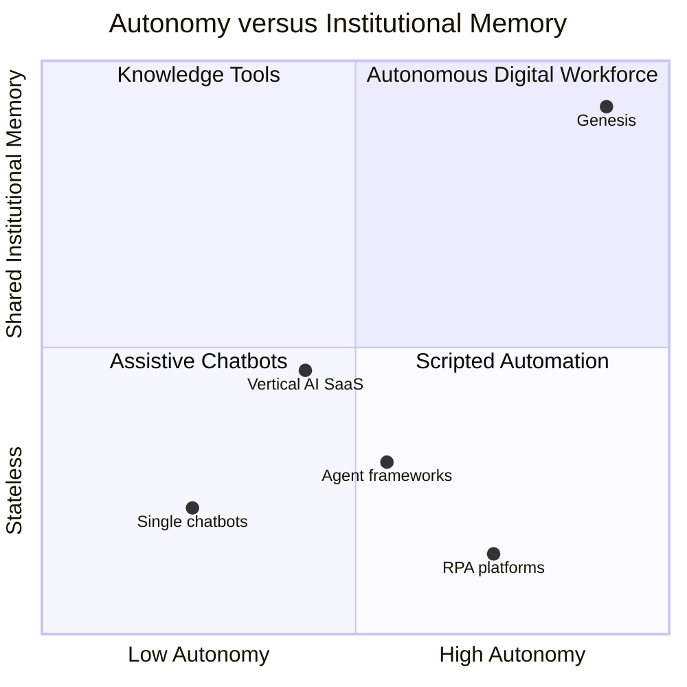

# 001 — Vision

This document states _why_ Genesis exists, _what_ it is (and is deliberately
not), _how_ it is sold, and _who_ it is for. It derives every term and every
locked technical fact from `000_Glossary.md` — the spine — and never contradicts
it. The phased execution plan referenced at the end is owned by `015_Roadmap.md`.

Genesis is the operating model layered on top of the PB Platform foundation
(`../ARCHITECTURE.md`). It does not redesign the foundation; it specifies how the
Autonomous Digital Workforce behaves on top of it, under the governance in
`../../AI_DEPLOY_AUTHORIZATION.md`.

---

## Mission

**Give any company a full, governed workforce of AI Employees that do real
business work — reliably, auditably, and without hiring.**

Concretely: a business should be able to deploy a Sales Manager, a Support
agent, a Knowledge Manager, and their peers (the twelve founding roles in
`000_Glossary.md` §6), have them share one institutional memory — the **Company
Brain** — and trust them to act inside explicit authority limits with a human in
the loop wherever the stakes require it.

The mission is not "better AI features inside an app." It is to move the unit of
software from a _tool a person operates_ to a _colleague that operates tools_.

## Vision

Within its horizon Genesis makes the _digital employee_ a first-class, hireable
unit of software:

- A company "hires" an AI Employee the way it hires a person — for a role, with a
  mission, KPIs, an authority level, and access — and the platform onboards it
  into the Company Brain in minutes, not quarters.
- Employees accumulate institutional memory. A decision made in March is
  recalled in September because it is an **Event** on the backbone and a
  consolidated fact in the Brain (`000_Glossary.md` §5, §9), not a message lost
  in a thread.
- Autonomy is earned and bounded. An employee starts at A0 (Observe) and is
  promoted toward higher **Authority Levels** (`000_Glossary.md` §8) only as its
  track record justifies it — never past A2 for first-contact outreach.
- The workforce compounds. Reflection turns outcomes into learning; small
  specialised **Nets** (`000_Glossary.md` §10) make recall, scoring, and
  prioritisation sharper over time; nothing is thrown away because everything is
  event-sourced and replayable.

The end state (`015_Roadmap.md`, _AI Workforce_) is a self-improving,
multi-tenant fleet where deploying a business function is a configuration act,
not an engineering project.

## Core Philosophy

Genesis is built on one central bet and four convictions that follow from it.

**The bet: durable memory and governed autonomy, not bigger prompts, are what
turn a language model into an employee.** A foundation model is raw reasoning.
An _employee_ is reasoning plus memory, plus a role, plus accountable authority,
plus the ability to act through governed tools. Genesis invests in everything
_around_ the model — because the model is a swappable **Port** (`ModelProvider`,
`000_Glossary.md` §3.2), and the durable value is the substrate.

From that bet:

1. **The Company Brain is the product's centre of gravity.** Intelligence
   emerges from shared, persistent, per-tenant knowledge, not from a cleverer
   single call. See `004_Company_Brain.md`.
2. **If it mattered, it is an Event.** Every consequential act is an immutable,
   past-tense fact on the backbone (`005_Event_Model.md`). Auditability,
   learning, and recovery are consequences of this, not bolt-ons.
3. **Autonomy is a dial, not a switch.** Authority (A0–A5) is explicit, orthogonal
   to identity permissions, and the _lower_ of the two always governs an action
   (`000_Glossary.md` §8, `012_Security.md`).
4. **Depend on ports, not vendors.** Every external dependency — database, bus,
   vector index, and the reasoning LLM itself — sits behind a port with a
   no-new-infrastructure default adapter and a documented scale-up path
   (`000_Glossary.md` §3.2). Simplicity first; record the trigger before you
   trade up.

## Guiding Principles

These extend the platform-wide principles in `000_Glossary.md` §12 into product
and commercial terms. They are testable, not aspirational.

- **Sell outcomes, ship employees.** The customer buys a role that gets work
  done; the implementation detail (models, prompts, Nets) is ours to optimise.
- **Governed by default.** HITL, suppression/opt-out, and compliance controls
  (`../../AI_DEPLOY_AUTHORIZATION.md` §Legal;
  `apps/api/src/pb_api/platform/modules.py` `OUTREACH_COMPLIANCE_CONTROLS`) are
  present from the first customer-facing action, never retrofitted.
- **Tenant isolation is absolute.** Every record, memory, and event carries a
  `tenant_id`; cross-tenant access is impossible by construction, and this is a
  precondition for selling to more than one company.
- **Earn autonomy with evidence.** Promotion up the authority ladder is driven by
  measured reliability (reflection outcomes, KPI attainment), not by a config
  toggle a customer flips on day one.
- **Prefer the default adapter.** Ship v1 on the foundation's PostgreSQL and
  Redis; move a port to a scale-up adapter only when a recorded trigger fires
  (`015_Roadmap.md`).
- **No fabricated capability.** Per governance, we never claim an employee can do
  what it cannot verifiably do, and never present a demo path as a shipped one.

## Non-goals

Genesis explicitly is **not** the following. Naming what it is not is as
load-bearing as naming what it is, because each of these is a category customers
will pattern-match onto — wrongly.

### It is not a chatbot

A chatbot answers a turn and forgets. Genesis employees are **persistent agents**
with a lifecycle (`000_Glossary.md` §7), six memory types
(`000_Glossary.md` §5), KPIs, and authority. Conversation is one input surface,
not the product. _Instead_, Genesis is a **workforce**: roles that pursue
missions across many sessions and collaborate through the Brain, whether or not a
human is chatting with them.

### It is not a CRM (or any single product module)

A CRM is a system of record for contacts and deals. Genesis _drives_ a CRM — the
`crm` bounded context is a **product surface** an AI Employee acts through
(`000_Glossary.md` §4), one of several (Ticketing, Proposal Engine, Billing,
Knowledge Base). _Instead_, Genesis is the **cognitive and operational substrate
beneath** those surfaces: the Sales Manager reasons over the Brain and _uses_ the
CRM as a tool; it is not the CRM.

### It is not a generic automation platform

RPA and no-code automation execute pre-authored, deterministic scripts that break
when a screen or field changes, and that carry no memory or judgment. Genesis
employees **reason, plan, reflect, and adapt** (`003_Cognitive_Architecture.md`),
act through typed **Capabilities** and sandboxed **Tools** rather than brittle
UI macros, and record every action as an event. _Instead_, Genesis is a
**governed autonomous workforce**: it decides _what_ to do from a mission and its
memory, not merely _replays_ a flow someone recorded.

## Commercial Positioning

Genesis is sold as an **Autonomous Digital Workforce** — priced and packaged
around the _AI Employee_ as the unit of value, because that is the unit the buyer
already understands from hiring people.

### Positioning against adjacent categories

Genesis is the only offering that sits in the top-right: high autonomy _and_
shared institutional memory, governed. Agent frameworks give autonomy without
memory or governance; RPA gives scripted action without reasoning or recall;
chatbots give neither. That corner is the whole thesis.

### How Genesis is sold

The headline is a subscription per **deployed AI Employee**, tiered by the role's
authority ceiling and the product surfaces it may act through. A customer starts
with a small team (v1: two to three employees, `015_Roadmap.md`) and adds roles
as trust and value accrue.

### Pricing model thinking

Four candidate pricing units, compared on how well the _price_ tracks the
_value_ and the _cost_:

| Model               | Unit priced                 | Value alignment                                    | Cost alignment                | Why it is not the headline                                                              |
| ------------------- | --------------------------- | -------------------------------------------------- | ----------------------------- | --------------------------------------------------------------------------------------- |
| Per human seat      | A human user login          | Weak — Genesis replaces work, not logins           | None                          | Penalises the customer for the exact automation they are buying; caps expansion.        |
| **Per AI Employee** | A deployed role             | Strong — matches "we hired a Sales Manager"        | Approximate                   | **Selected headline.** Predictable, expands with the workforce, legible to buyers.      |
| Per outcome         | A completed business result | Strongest — pay for resolved tickets, closed deals | Exposed to LLM token variance | Metering and attribution are hard; margin swings with model cost. Best as an _add-on_.  |
| Consumption / token | Tokens or compute consumed  | Weak — abstract to the buyer                       | Perfect                       | Commoditises the offer, pushes cost variance onto the customer, invites price shopping. |

**Selected model:** a per-AI-Employee subscription as the headline, with
**outcome-based add-ons** for well-metered, high-value actions (e.g. accepted
proposals, resolved tickets) once attribution is trustworthy. Consumption is
treated as an internal cost lever — offloaded to small **Nets** and model-tier
routing (`011_ML_Platform.md`) — not exposed as the customer's meter.

**Alternatives rejected and why:** per-seat inverts the incentive (the customer
pays more the fewer humans they need, which is backwards); pure per-outcome makes
the invoice unpredictable and couples our revenue to a metering problem we do not
yet solve cleanly; pure consumption turns a differentiated workforce into a
metered commodity and hands the buyer our cost structure.

**Future scaling risk:** under a _flat_ per-employee price, a spike in LLM token
cost (`ModelProvider`) or a customer running employees far harder than modelled
can invert unit margins. Mitigations are the small-Net offload, model-tier
routing across swappable providers, and per-employee budget/rate caps enforced by
authority policy (`006_Agent_Runtime.md`, `012_Security.md`). The pricing must
retain a consumption-linked ceiling so a runaway tenant cannot be served at a
loss.

## Target Customers

Segments ordered by fit, each with the job-to-be-done it hires Genesis for.

| Segment                            | Profile                                                                      | Job to be done                                                                        | First employees hired                               |
| ---------------------------------- | ---------------------------------------------------------------------------- | ------------------------------------------------------------------------------------- | --------------------------------------------------- |
| Lean scale-ups                     | 5–50 people, more demand than headcount                                      | "Run a full back office and front office without hiring for every function."          | Knowledge Manager, Support, Research                |
| Digital agencies and consultancies | Deliver client work at volume; PB Solutions is the first, dogfooded customer | "Deliver more client outcomes per person without diluting quality or governance."     | Solutions Architect, Sales Manager, Program Manager |
| Mid-market operations teams        | Established functions drowning in repetitive knowledge work                  | "Absorb the repetitive judgment work my team does, auditably, so people do the rest." | Support, Finance, Knowledge Manager                 |
| Regulated / audit-sensitive B2B    | Later-stage; needs provable who-did-what                                     | "Automate work where every action is provable and every message is compliant."        | Full roster under strict authority policy           |

The wedge is the first segment: a lean company that cannot justify a headcount
for every function but has real work in each. Genesis lets it stand up a
governed workforce on a single Docker Compose stack (`../DEPLOYMENT.md`) and grow
the team as trust builds. PB Solutions itself is customer zero, which keeps the
roadmap honest.

## Competitive Advantages

Five advantages, each a _structural_ property of the architecture in
`000_Glossary.md`, not a feature that a competitor can add in a sprint. Each is
stated against the category it beats.

1. **The Company Brain.** Shared, per-tenant knowledge graph + vectors + docs +
   timeline + policies (`004_Company_Brain.md`, `009_Knowledge_Graph.md`).
   _Versus generic agent frameworks_ (LangChain, AutoGPT, CrewAI), which give you
   primitives and leave persistent, governed, multi-agent memory as an exercise:
   Genesis ships institutional memory as the core, so employees share context and
   compound learning instead of starting cold each run.
2. **Governed autonomy.** Explicit authority A0–A5, orthogonal to permissions,
   with HITL and compliance first-class (`000_Glossary.md` §8;
   `012_Security.md`). _Versus RPA_ (UiPath, Automation Anywhere), which executes
   scripts with no notion of "how much may this act on its own": Genesis makes
   autonomy an accountable, promotable dial with a hard A2 ceiling on
   first-contact outreach.
3. **Event-sourced auditability.** Every consequential action is an immutable
   event; read models are projections; state is replayable (`005_Event_Model.md`).
   _Versus single chatbots_ (support-bot point solutions, GPT wrappers), which
   leave you a chat log and no system of record: Genesis can reconstruct exactly
   what any employee did, when, and why — a precondition for regulated buyers and
   for recovery after failure.
4. **Small-Net specialisation.** Narrow trained Nets — `MemoryRankNet`,
   `LeadScoreNet`, `ProposalNet`, and the rest (`000_Glossary.md` §10;
   `011_ML_Platform.md`) — sharpen recall, scoring, and prioritisation and
   offload work the LLM should not pay for. _Versus prompt-only stacks_: Genesis
   drives down cost and variance and improves quality on the exact decisions that
   repeat, without training a foundation model.
5. **No vendor lock-in.** Everything, including the reasoning LLM, sits behind a
   port with a default adapter and a scale-up path (`000_Glossary.md` §3.2).
   _Versus vertical AI SaaS_ bound to one model vendor and one datastore: Genesis
   can swap Claude for another provider, PostgreSQL vectors for Qdrant, Redis
   Streams for NATS, without touching callers — protecting both margin and the
   customer's exit rights.

**Future scaling risk on the moat:** the Company Brain is also the largest
per-tenant scaling surface. As graph size and embedding volume grow, the default
PostgreSQL/`pgvector` and edges-plus-CTE adapters will hit recall-latency limits;
the moat depends on executing the port migrations to Qdrant and Neo4j _on their
recorded triggers_ (`015_Roadmap.md`) before customers feel it. The advantage is
the port boundary that makes those swaps invisible — not any one datastore.

## Roadmap

Genesis grows by _accreting capability on a stable substrate_, never by rewrites.
The narrative, owned in full by `015_Roadmap.md`:

- **v1 — Foundation Workforce.** The substrate proves out on the existing
  foundation: Company Brain + Memory Engine + Agent Runtime + the event backbone,
  all on default adapters (PostgreSQL, Redis, Docker Compose), with the first two
  to three employees online.
- **v2 — Revenue Workforce.** Workflows and approvals (`010_Workflow_Engine.md`),
  the first small Nets (`011_ML_Platform.md`), and the outreach-capable employees
  under full compliance controls.
- **v3 — Delivery Workforce.** The full twelve-role roster, advanced Nets, and
  multi-agent orchestration doing end-to-end delivery work.
- **Enterprise.** ABAC, zero-trust hardening, and the first port migrations to
  scale-up adapters under load.
- **Marketplace.** Third-party capabilities, plugins, and partner-built roles on
  the same governed substrate.
- **AI Workforce.** A self-improving, multi-tenant fleet where deploying a
  business function is configuration, not engineering.

Every phase preserves the governance acceptance rule
(`../../AI_DEPLOY_AUTHORIZATION.md`) and every phase-gate criterion, including the
compliance controls on outreach modules. For phase-by-phase capabilities,
employees, port triggers, entry/exit criteria, risks, and the definition of done,
see `015_Roadmap.md`.
