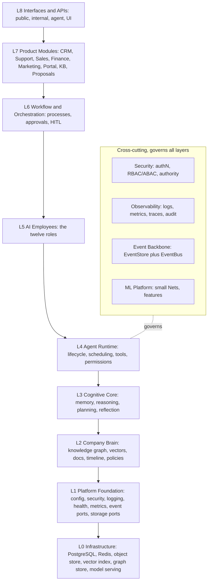
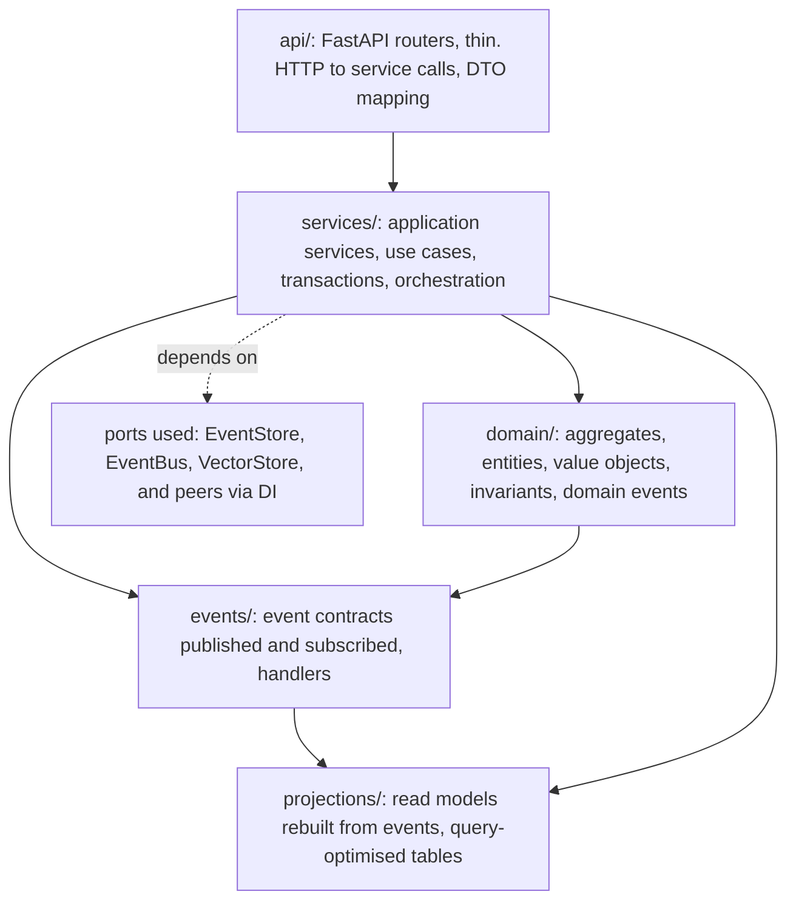
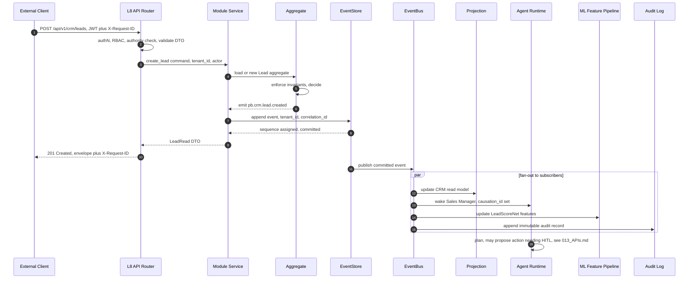
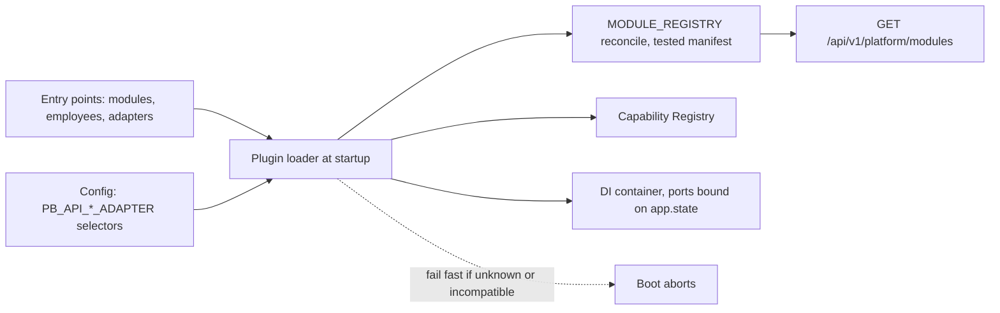

# 002 — System Architecture

This document specifies **how Genesis is structured** on top of the PB Platform
foundation (`docs/ARCHITECTURE.md`): the layers, the module (bounded-context)
boundaries, how modules communicate, the inviolable dependency rules, and the
plugin/extension model that lets new modules, AI Employees, tools, and adapters
be added without editing the core.

It derives every binding term and choice from `000_Glossary.md` (the spine).
Where this document and the glossary appear to disagree, the glossary wins.
Event mechanics live in `005_Event_Model.md`; API surfaces live in
`013_APIs.md`; the cognitive pipeline lives in `003_Cognitive_Architecture.md`.

---

## Overview

Genesis is an **Autonomous Digital Workforce Platform**: a per-tenant substrate
on which **AI Employees** (long-lived, role-specialised agents) collaborate
through a shared **Company Brain** to perform business work under governed
autonomy. It is not a redesign of the foundation — it is the operating model
that the foundation hosts.

The architecture rests on four load-bearing commitments, each inherited from the
glossary and the foundation:

1. **Layered with a one-way dependency rule.** Nine layers (L0–L8); a layer may
   depend only on layers below it, and only through **ports**. This is the same
   rule `apps/` already enforces ("apps never import from other apps").
2. **Ports and adapters everywhere.** Genesis depends on interfaces
   (`EventStore`, `EventBus`, `VectorStore`, `ModelProvider`, …), never on
   concrete vendors. Default adapters reuse the foundation's PostgreSQL + Redis
   so v1 runs on a single Docker Compose stack; scale-up adapters swap in behind
   the same port. See `000_Glossary.md` §3.2.
3. **Event-sourced and event-driven.** Everything of consequence is an immutable,
   past-tense **Event**. Aggregates persist by appending to the `EventStore`
   (system of record); the `EventBus` distributes to subscribers. Read models
   are **projections** rebuilt from events. See `005_Event_Model.md`.
4. **Modular monolith first.** Modules are compile-time-separated bounded
   contexts inside the existing `apps/api` deployable, integrating only via
   events and published APIs — never via cross-module imports. The boundaries
   are drawn so any module can later be extracted into its own service without
   rewriting callers (see [Modular monolith vs microservices](#modular-monolith-vs-microservices-now)).

Genesis reuses the foundation's real machinery rather than inventing parallel
infrastructure: the `create_app(settings)` factory and `app.state` port bag; the
`/api/v1` prefix; structlog JSON logging with `X-Request-ID` propagation;
Prometheus metrics at `/metrics`; JWT (HS256, `jti`, `iss`, role claim) with the
`require_roles` RBAC dependency; and the platform module registry
(`apps/api/src/pb_api/platform/modules.py`, served at
`GET /api/v1/platform/modules`) as the module manifest.

---

## The layered architecture

The glossary (§3.1) locks nine layers, L0 at the bottom to L8 at the top, with a
strict downward dependency rule and cross-cutting concerns that govern the agent
tier. This section expands each layer's responsibilities and states exactly
what lives where.



| Layer                             | Owns                                                                                                                                                                                                                                                                                                                                                                                         | Lives in (repo)                                                                            | Depends on                  |
| --------------------------------- | -------------------------------------------------------------------------------------------------------------------------------------------------------------------------------------------------------------------------------------------------------------------------------------------------------------------------------------------------------------------------------------------- | ------------------------------------------------------------------------------------------ | --------------------------- |
| **L0 Infrastructure**             | The running stores and serving engines: PostgreSQL 17, Redis 7, S3-compatible object store (MinIO), a vector index, a graph store, and model serving. No business logic.                                                                                                                                                                                                                     | Docker Compose, `infra/`, managed services                                                 | —                           |
| **L1 Platform Foundation**        | Cross-cutting primitives already built: config (`core/config.py`), security (`core/security.py`), structured logging, health/readiness, Prometheus metrics, rate limiting, DB session wiring, and the **port interfaces** (`EventStore`, `EventBus`, `VectorStore`, `GraphStore`, `DocumentStore`, `BlobStore`, `ModelProvider`, `ModelServer`, `FeatureStore`, `SecretStore`, `Scheduler`). | `apps/api/src/pb_api/core`, `db`, `middleware`, plus a new `pb_api/platform/ports` package | L0                          |
| **L2 Company Brain**              | The shared, per-tenant knowledge substrate: knowledge graph, vector store, document store, timeline, and policies. Owns semantic and long-term memory physically. See `004_Company_Brain.md`, `009_Knowledge_Graph.md`.                                                                                                                                                                      | `pb_api/brain` (module)                                                                    | L1 ports                    |
| **L3 Cognitive Core**             | The memory→reasoning→decision pipeline: Context Builder (assembles the Working Set), the six memory types, planning, reflection. Consumes `ModelProvider` for reasoning and `ModelServer` for small Nets. See `003_Cognitive_Architecture.md`, `008_Memory_Engine.md`.                                                                                                                       | `pb_api/cognition`                                                                         | L2, L1                      |
| **L4 Agent Runtime**              | Agent lifecycle state machine (`Provisioned → … → Retired`), scheduling, tool invocation in a sandbox, capability/permission and **authority** enforcement, recovery. See `006_Agent_Runtime.md`.                                                                                                                                                                                            | `pb_api/agent_runtime`                                                                     | L3, L2, L1                  |
| **L5 AI Employees**               | The twelve founding roles (CEO, CTO, Program Manager, Sales Manager, Support, Finance, Knowledge Manager, Solutions Architect, Research, Developer, QA, Marketing) — each a mission, KPIs, tools, memory usage, and authority binding over the runtime. See `007_AI_Employees.md`.                                                                                                           | `pb_api/employees`                                                                         | L4                          |
| **L6 Workflow and Orchestration** | Long-running business processes, multi-step approvals, HITL gates, saga coordination across modules. See `010_Workflow_Engine.md`.                                                                                                                                                                                                                                                           | `pb_api/workflow`                                                                          | L5, L4, L1                  |
| **L7 Product Modules**            | Customer-facing bounded contexts: CRM, Ticketing, Billing, Proposal Engine, Client Portal, Knowledge Base, Marketing, Outbound Sales. Each maps to a reserved namespace in the module registry.                                                                                                                                                                                              | `pb_api/modules/<slug>`                                                                    | L6, L1 (events + APIs only) |
| **L8 Interfaces and APIs**        | The four API surfaces — public, internal, agent, UI/BFF — versioned under `/api/v1`. See `013_APIs.md`.                                                                                                                                                                                                                                                                                      | `pb_api/api` (routers)                                                                     | L7 and below via services   |

**Cross-cutting concerns** (Security, Observability, Event Backbone, ML
Platform) are not a layer; they are aspects wired through every layer via
dependency injection. Concretely they are already `app.state` singletons
(settings, metrics registry, Redis) plus the new port bag; a handler at L8 and a
projection at L2 both obtain them the same way, so governance is uniform.

**Why nine layers rather than a flat service or a 3-tier split.**

| Option                                                           | Pros                                                                                                                       | Cons                                                                                                             | Verdict                                                                |
| ---------------------------------------------------------------- | -------------------------------------------------------------------------------------------------------------------------- | ---------------------------------------------------------------------------------------------------------------- | ---------------------------------------------------------------------- |
| Flat (routes → services → models), as the foundation ships today | Simplest; already in place                                                                                                 | No home for cognition, memory, agents, or the Brain; the agent tier would leak into product code                 | Insufficient for a workforce platform                                  |
| Classic 3-tier (presentation / business / data)                  | Familiar                                                                                                                   | Collapses agent runtime, cognition, and the Brain into one "business" blob; can't express the authority boundary | Rejected                                                               |
| **Nine layers (selected)**                                       | Each cognitive/agent concern has one home; the downward-only rule makes reasoning about change local; matches DDD contexts | More layers to learn; risk of ceremony                                                                           | Selected — the extra layers are the product, not accidental complexity |

**Future scaling risk.** As modules grow, L7 will dwarf the others and the
temptation to let a product module reach "down" into L3/L4 directly (for speed)
will be strong. The mitigation is the dependency rule plus import-linter tests
(below); the split-out trigger for extraction is defined at the end of this
document.

---

## Module boundaries

A **module** is the code realisation of a **bounded context** (`000_Glossary.md`
§2, §4). Contexts have their own model and language and integrate **only** via
events and published APIs. Genesis contexts map onto the reserved namespaces in
the foundation's registry — use the slugs verbatim.

| Bounded context           | Slug                | Namespace                       | Layer | Status (registry)          |
| ------------------------- | ------------------- | ------------------------------- | ----- | -------------------------- |
| Identity and Access       | `identity`          | `/api/v1/auth`, `/api/v1/users` | L1/L8 | available                  |
| Observability             | `observability`     | `/api/v1/health`, `/metrics`    | L1    | available                  |
| Company Brain / Knowledge | `ai`                | `/api/v1/ai`                    | L2–L5 | planned                    |
| CRM                       | `crm`               | `/api/v1/crm`                   | L7    | planned                    |
| Client Portal             | `client-portal`     | `/api/v1/portal`                | L7    | planned                    |
| Billing and Invoicing     | `billing`           | `/api/v1/billing`               | L7    | planned                    |
| Ticketing                 | `ticketing`         | `/api/v1/ticketing`             | L7    | planned                    |
| Knowledge Base            | `knowledge-base`    | `/api/v1/kb`                    | L7    | planned                    |
| Proposal Engine           | `proposal-engine`   | `/api/v1/proposals`             | L7    | planned                    |
| Marketing Website         | `marketing-website` | `/api/v1/marketing`             | L7    | available                  |
| Outbound Sales Engine     | `outbound-sales`    | `/api/v1/outbound`              | L7    | planned (compliance-gated) |

Genesis-internal contexts not yet in the registry — **Memory**, **Events/Audit**,
**Agent Workforce**, **Workflows**, **ML and Feature Store** — are
platform-internal; each is added to the registry (a new `PlatformModule` entry)
when implemented, so the manifest never drifts from reality.

### How a module is structured internally

Every module follows the same internal shape, extending the foundation's
`routes → services → models` layering with the DDD building blocks the workforce
needs. This is the single template for CRM, Ticketing, Billing, Brain, etc.



| Sub-package    | Responsibility                                                                                                                                                                     | Foundation analogue         |
| -------------- | ---------------------------------------------------------------------------------------------------------------------------------------------------------------------------------- | --------------------------- |
| `api/`         | Route handlers, request/response Pydantic schemas, auth + authority dependencies. Thin — translate HTTP to service calls; map domain errors to the error envelope (`013_APIs.md`). | `apps/api/.../api/routes/*` |
| `services/`    | Application/use-case services: open a transaction, load an aggregate, invoke domain logic, append resulting events, return DTOs. No HTTP concerns.                                 | `apps/api/.../services/*`   |
| `domain/`      | Aggregates (consistency boundaries that own state and emit events), entities, value objects, invariants. The only place business rules live.                                       | new (extends `models/`)     |
| `events/`      | The module's **published** event contracts (`pb.<context>.<aggregate>.<verb>`) and its **subscriptions** to other contexts' events, with idempotent handlers.                      | new                         |
| `projections/` | Read models: query-optimised tables rebuilt by replaying events. A projection may join events from several contexts (that is the sanctioned way one context reads another's data). | new                         |

An aggregate is rebuilt by replaying its events from the `EventStore`; a
projection is rebuilt by replaying the relevant event stream. Neither reaches
into another module's tables directly — cross-context reads happen through that
context's published API (synchronous) or by subscribing to its events and
maintaining a local projection (asynchronous).

**Why this uniform shape.** It makes every module legible to any engineer or AI
Employee (the Developer role, `007`), makes the extract-to-service path
mechanical, and keeps the event contract — the thing other contexts couple to —
in one discoverable place (`events/`). The alternative, letting each module
invent its own internal layout, was rejected: it would make the dependency-rule
tests unwritable and cross-module review unreliable.

---

## Communication

Two, and only two, sanctioned integration mechanisms exist between modules —
the same discipline the foundation applies to `apps/` ("cross-app communication
happens over HTTP contracts, never through code").

| Mechanism               | Transport                                                                                              | Coupling                                     | Use when                                                                                                                                                |
| ----------------------- | ------------------------------------------------------------------------------------------------------ | -------------------------------------------- | ------------------------------------------------------------------------------------------------------------------------------------------------------- |
| **Synchronous API**     | HTTP under `/api/v1` (internal calls in-process via the service layer today; over HTTP once split out) | Temporal — caller waits, needs the callee up | A read the caller needs **now** to serve its own request; a command that must succeed-or-fail within the request (with the callee as the authority).    |
| **Asynchronous events** | `EventBus` (Redis Streams default) fed from the `EventStore`                                           | Loose — publisher does not know subscribers  | A fact has occurred that other contexts may care about; fan-out; anything that can be eventually consistent; anything that must be audited or replayed. |

**Decision rule:** prefer events. Reach for a synchronous call only when the
caller genuinely cannot proceed without the answer _inside the current request_
and eventual consistency is unacceptable. Everything that "happened" is an event
regardless, because the event log is also the audit trail (`005_Event_Model.md`).

**No cross-module imports (inviolable).** A module's Python package must not
import another module's `domain/`, `services/`, or `models/`. It may import
only:

- the L1 **ports** and shared platform primitives (config, logging, security);
- another context's **published event contracts** (the `events/` DTOs), to
  subscribe;
- another context's **API client / DTOs** at L8, to make a synchronous call.

This is enforced, not merely documented — see [Dependency rules](#dependency-rules).

**Why not shared database tables for integration.** A tempting shortcut is to let
CRM read the Billing tables directly. Rejected: it welds the two schemas
together, breaks tenant-scoping guarantees at the single query choke-point, and
makes the extract-to-service trigger impossible to pull. Events + projections
give the same data with a versioned contract. **Future scaling risk:** popular
events (e.g. `pb.crm.lead.created`) accrete many subscribers; a schema change
then ripples widely. Mitigated by event versioning (`005`) and by treating an
event contract as public API.

---

## Events

Event-driven flow is what ties the modules into one organism. A concrete
walk-through: a new lead lands in CRM; the CRM aggregate appends
`pb.crm.lead.created`; the `EventBus` fans it out; the Agent Workforce wakes the
Sales Manager employee, the Company Brain projects the lead into semantic memory,
the ML feature pipeline updates `LeadScoreNet` features, and the audit projection
records it — none of these modules import CRM, and CRM does not know they exist.

Genesis is **event-sourced** (aggregates persist as appended events; state is a
fold over history) **and event-driven** (subscribers react to distributed
events). The `EventStore` is the system of record; the `EventBus` is the
distribution fabric; projections are disposable and rebuildable. The full
taxonomy, envelope, correlation/causation model, replay, snapshots, retention,
audit, and lifecycle are specified once in **`005_Event_Model.md`** — this
document only establishes that events are the backbone that couples modules
loosely and the [Data flow](#data-flow) below shows the shape of one pass.

---

## Data flow

The canonical path of a single external request that triggers agent work,
end to end: request → API → aggregate → event → projections/agents/ML features.
Note the `EventStore` append is the commit point; everything downstream is a
reaction to the distributed event.



The client's request commits at step 9 (the `EventStore` append) and returns
immediately; the fan-out (steps 11–15) is asynchronous and eventually
consistent. If a subscriber is down, the event is redelivered on recovery
(`005_Event_Model.md` — replay and idempotency), so no work is lost.

---

## Dependency rules

The single inviolable rule, restated precisely:

> A layer may depend only on layers **below** it, and only through **ports**.
> Lower layers never import higher ones. Product modules (L7) never import each
> other; they integrate via events (L1 backbone) and published APIs (L8).

This is the glossary's §3.1 rule and it is identical in spirit to the
foundation's monorepo rules (`docs/ARCHITECTURE.md` §2). Corollaries:

1. **Port-only downward calls.** L3 does not `import` a concrete `pgvector`
   client; it depends on the `VectorStore` port and receives an adapter via DI.
   Swapping Qdrant in later touches one wiring line, not the callers.
2. **No lateral module imports.** Enforced across L7 contexts and internal
   contexts alike.
3. **No upward imports, ever.** L1 must not know L4 exists; cross-cutting
   concerns reach the agent tier by being injected, not imported upward.
4. **Cross-context data flows through events or published APIs**, never shared
   tables or reached-into services.

### Enforcement — review plus tests, mirroring the foundation

The foundation already treats architecture rules as testable (the module
registry is covered by tests so "drift between the intended architecture and the
running system is caught automatically"). Genesis extends that discipline:

| Guard                       | What it catches                                                                | How                                                                                                                 |
| --------------------------- | ------------------------------------------------------------------------------ | ------------------------------------------------------------------------------------------------------------------- |
| **Import-linter contracts** | Upward imports; lateral module imports; concrete-adapter imports from above L1 | A `importlinter` config declaring the layered contract and per-module "independence" contracts, run in `make lint`. |
| **Ports-only test**         | A module importing another module's `domain`/`services`/`models`               | Static AST test asserting each `pb_api/modules/*` package imports only allowed packages.                            |
| **Registry parity test**    | A namespace served that is not in `MODULE_REGISTRY`, or vice-versa             | Extends the existing manifest test.                                                                                 |
| **Event-contract test**     | A published event whose schema changed without a version bump                  | Snapshot test over `events/` contracts (`005_Event_Model.md`).                                                      |
| **Human/AI review**         | Intent-level violations (e.g. an event used as a disguised RPC)                | PR review against `AI_DEPLOY_AUTHORIZATION.md`; the Developer and QA employees apply the same checklist.            |

**Why static enforcement over convention.** Conventions rot under deadline
pressure; the foundation's philosophy is "leave the repository better than you
found it" and "no placeholder logic." Encoding the dependency rule as a failing
test is the only way it survives an autonomous workforce editing the codebase.
**Future scaling risk:** import-linter operates at package granularity; once
modules are extracted to separate services the in-repo check no longer covers
cross-service calls — at that point the contract moves to the OpenAPI/event
schema registry and consumer-driven contract tests (`013_APIs.md`).

---

## Plugin architecture

Genesis must grow — new product modules, new AI Employees, new tools, new port
adapters — without editing the core. The extension model is a small set of
**contracts** plus a **discovery** mechanism, anchored on the manifest the
foundation already ships: the platform module registry.

### The four extension points

| Extension                         | Contract (interface)                                                                                                                | Registered as                                                              | Discovered by                                                     |
| --------------------------------- | ----------------------------------------------------------------------------------------------------------------------------------- | -------------------------------------------------------------------------- | ----------------------------------------------------------------- |
| **Module** (bounded context)      | `ModulePlugin`: exposes `router()`, `event_subscriptions()`, `projections()`, `migrations()`, and a `PlatformModule` manifest entry | Python entry point group `pb_platform.modules` + a `MODULE_REGISTRY` entry | Registry loader at startup; `GET /api/v1/platform/modules`        |
| **AI Employee** (role)            | `EmployeePlugin`: mission, KPIs, `capabilities()`, default authority level, memory bindings                                         | Entry point group `pb_platform.employees`                                  | Employee registry (L5); `007_AI_Employees.md`                     |
| **Tool / Capability**             | `Tool`: `name`, `input_schema`, `output_schema`, `required_authority`, `required_permissions`, `run(ctx, args)` sandboxed           | `@capability(...)` decorator registering into the Capability Registry      | Agent Runtime tool resolver (L4); `006_Agent_Runtime.md`          |
| **Adapter** (port implementation) | The relevant port interface, e.g. `EventBus`, `VectorStore`, `ModelProvider`                                                        | Entry point group `pb_platform.adapters` keyed by port name                | DI container reads config `PB_API_<PORT>_ADAPTER=...` and selects |

### The Plugin/Extension contract

A plugin is a Python package that declares one or more of the above via
`importlib.metadata` **entry points** (no core edits, no import of the core's
internals — only the published contract packages). Sketch:

```python
# in a plugin package's pyproject.toml
[project.entry-points."pb_platform.modules"]
crm = "pb_crm.plugin:CrmModule"

[project.entry-points."pb_platform.adapters"]
event_bus.nats = "pb_adapters_nats:NatsJetStreamBus"
```

```python
# pb_crm/plugin.py
class CrmModule(ModulePlugin):
    manifest = PlatformModule(slug="crm", name="CRM", ...)   # registry entry
    api_version = "v1"                                        # surface version
    plugin_version = "1.4.0"                                  # semver of the plugin
    requires = {"pb_platform": ">=1.0,<2.0"}                 # core compat range

    def router(self) -> APIRouter: ...
    def event_subscriptions(self) -> list[Subscription]: ...
    def projections(self) -> list[Projection]: ...
    def migrations(self) -> str: ...                          # alembic path
```

### Capability registration and discovery

Tools/capabilities self-register into a **Capability Registry** at import time
via a decorator. Each capability declares the machine-checkable gates the
runtime enforces before execution — the `required_authority` (A0–A5) and
`required_permissions` (RBAC/ABAC). The registry is the single source the Agent
Runtime consults to answer "may this agent do this now?" (the lower of authority
and permission governs, per `000_Glossary.md` §8).

```python
@capability(
    name="send_email",
    required_authority=AuthorityLevel.A2,     # act with approval
    required_permissions=("crm:contact:write",),
    input_schema=SendEmailArgs,
    compliance=("suppression-list", "opt-out", "first-contact-hitl"),  # AI_DEPLOY_AUTHORIZATION §Legal
)
async def send_email(ctx: ToolContext, args: SendEmailArgs) -> SendEmailResult: ...
```

Outreach-capable capabilities inherit the `OUTREACH_COMPLIANCE_CONTROLS` from the
registry (`apps/api/src/pb_api/platform/modules.py`) and cannot be first-contact
above A2 — the same guardrail the foundation encodes as machine-readable
requirements.

### The registry as the manifest

`MODULE_REGISTRY` is the authoritative, tested manifest of what the platform
hosts. Plugin discovery **reconciles** entry points against the registry at
startup:



Discovery is **fail-fast**: a module whose entry point is present but whose slug
is absent from the registry (or whose `requires` range excludes the running core
version) aborts boot with a clear error — the same "refuse to boot on
misconfiguration" stance the foundation takes with placeholder secrets. This
keeps the codebase free of half-wired plugins.

### Plugin versioning

- **Plugin semver** (`plugin_version`): breaking change to the plugin's own
  behaviour bumps major.
- **Core compatibility range** (`requires`): a plugin declares the core versions
  it supports; the loader enforces it.
- **API surface version**: the plugin's HTTP surface is versioned independently
  under `/api/v1` (deprecation policy in `013_APIs.md`).
- **Event contract version**: each published event carries `schema_version`
  (`005_Event_Model.md`); subscribers negotiate via upcasting.

**Why entry points over a hand-edited registry or dynamic scanning.**

| Option                                                             | Pros                                                                                                                     | Cons                                                                   | Verdict                                                                   |
| ------------------------------------------------------------------ | ------------------------------------------------------------------------------------------------------------------------ | ---------------------------------------------------------------------- | ------------------------------------------------------------------------- |
| Hand-edited central `include_router` list (today's foundation)     | Explicit, simple                                                                                                         | Every new module edits core; merge contention; core knows every plugin | Fine for a handful of foundation routers; does not scale to a marketplace |
| Filesystem/module scanning ("import everything under `modules/`")  | Zero registration                                                                                                        | Import-order surprises, silent partial loads, hard to test             | Rejected                                                                  |
| **`importlib.metadata` entry points + tested registry (selected)** | Standard Python; plugins ship independently; discovery is explicit and fail-fast; the registry stays the tested manifest | Slightly more ceremony per plugin                                      | Selected                                                                  |

**Future scaling risk.** A third-party marketplace (roadmap v-Marketplace,
`015_Roadmap.md`) means running untrusted plugin code. The entry-point model must
then gain sandboxing (tools already run sandboxed per `006`), capability
signing, and per-plugin resource budgets — the contract is designed to carry
that metadata (`compliance`, `required_authority`) from day one so the tightening
is additive, not a rewrite.

---

## Modular monolith vs microservices now

Genesis ships as a **modular monolith**: one deployable (`apps/api`) containing
compile-time-separated modules that already obey the service-extraction
contract (events + published APIs, no cross-module imports). This is a deliberate
choice over standing up microservices immediately.

| Approach                                   | Pros                                                                                                                                                                                                                                         | Cons                                                                                                                                                                                                               | Fit for PB Platform v1                                                       |
| ------------------------------------------ | -------------------------------------------------------------------------------------------------------------------------------------------------------------------------------------------------------------------------------------------- | ------------------------------------------------------------------------------------------------------------------------------------------------------------------------------------------------------------------ | ---------------------------------------------------------------------------- |
| **Microservices now**                      | Independent scaling and deploy per context; team autonomy; failure isolation                                                                                                                                                                 | Distributed transactions, network failure modes, and multi-service observability from day one; operational cost multiplies; premature boundaries are expensive to move; the foundation runs a single Compose stack | Poor — pays distributed-systems tax before there is scale to justify it      |
| **Big ball of mud (no module boundaries)** | Fastest to write initially                                                                                                                                                                                                                   | No path to scale; violates the dependency rule; unmaintainable under an autonomous workforce                                                                                                                       | Rejected outright                                                            |
| **Modular monolith first (selected)**      | One deployable, one Compose stack, in-process calls (fast, transactional); modules already event-integrated so extraction is mechanical; matches the foundation exactly ("apps stay independently deployable" is preserved at the app level) | Shared process means a bad module can affect neighbours; shared database until extraction                                                                                                                          | **Selected** — maximal architectural cleanliness at minimal operational cost |

**Why the modular monolith wins on this stack.** The foundation is explicitly a
"modular monolith today and a set of independently deployable services tomorrow"
(`apps/api/src/pb_api/platform/modules.py` docstring). Genesis honours that: v1
runs on the existing PostgreSQL + Redis Compose stack with no new infrastructure,
in-process service calls stay transactional and fast, and because modules
communicate only via events and published APIs, each is _already shaped_ like a
service. We buy the cleanliness of microservices without the operations bill.

**The split-out trigger (when a module becomes its own service).** Extract a
module when **any** of these fire, and not before:

1. **Independent scaling pressure** — the module's resource profile (CPU, memory,
   or a specialised store like a GPU model server) diverges sharply from the
   monolith and co-tenancy causes contention.
2. **Deploy-cadence conflict** — the module needs to ship on a materially
   different schedule (e.g. the Outbound Sales Engine under compliance change
   control) than the core.
3. **Fault-isolation requirement** — the module's failure must not be able to
   take down the request path (e.g. heavy ML inference behind `ModelServer`).
4. **Team/ownership boundary** — a dedicated team (or a dedicated AI Employee
   squad) owns the context end to end and the shared codebase becomes a
   coordination bottleneck.
5. **Data-sovereignty / tenancy** — a large tenant requires physically isolated
   storage for a context.

Because the boundary already exists (own `domain/`, `events/`, `projections/`,
migrations, and a `ModulePlugin` manifest), extraction is: split the database
schema, promote in-process event delivery to the `EventBus` across the wire,
turn in-process service calls into HTTP calls behind the same DTOs, and give the
module its own Dockerfile — exactly the growth path
`docs/ARCHITECTURE.md` §7 already describes. The scale-up **adapters** (NATS
JetStream, Kafka, Neo4j, Qdrant, Temporal) named in `000_Glossary.md` §3.2 are
what the extracted services run behind, still through the same ports.

---

## Cross-references

- `000_Glossary.md` — binding terms, layers, ports table, context map, authority
  levels, event naming. This document never overrides it.
- `003_Cognitive_Architecture.md` — the L3 memory→reasoning→decision pipeline.
- `004_Company_Brain.md`, `009_Knowledge_Graph.md` — the L2 substrate.
- `005_Event_Model.md` — event taxonomy, envelope, replay, audit, lifecycle.
- `006_Agent_Runtime.md` — L4 lifecycle, tool sandbox, authority enforcement.
- `007_AI_Employees.md` — the twelve L5 roles.
- `010_Workflow_Engine.md` — L6 processes, approvals, HITL.
- `012_Security.md` — RBAC/ABAC, authority, tenant isolation, zero trust.
- `013_APIs.md` — the L8 surfaces, error envelope, versioning, streaming.
