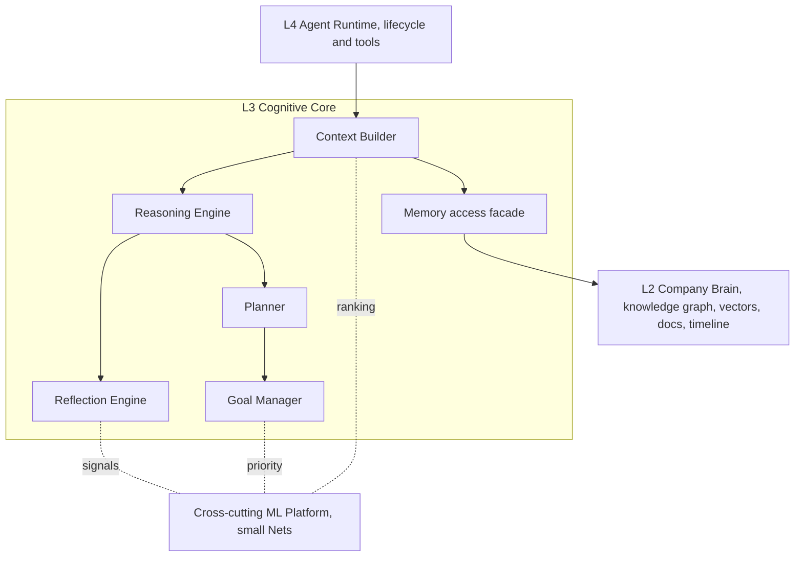
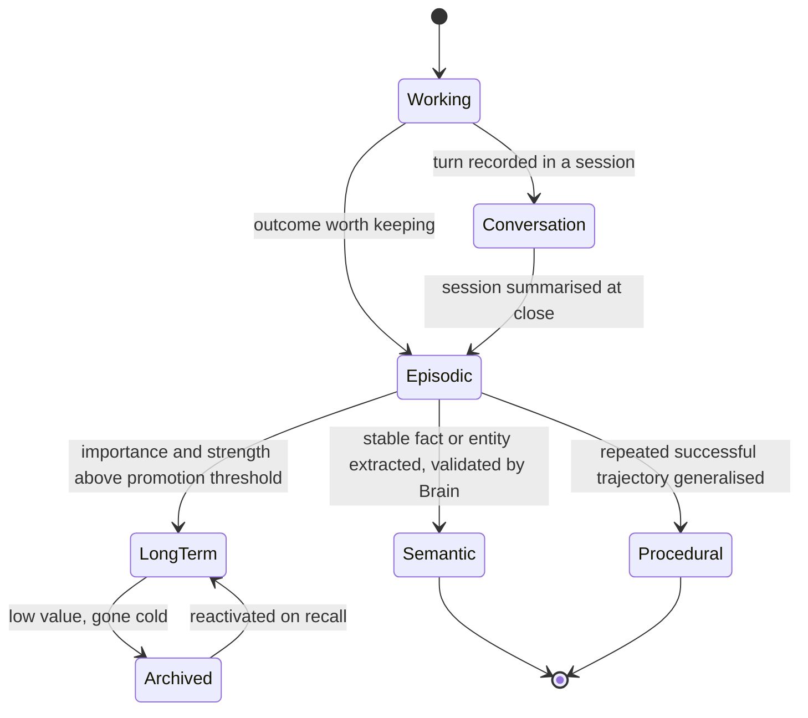
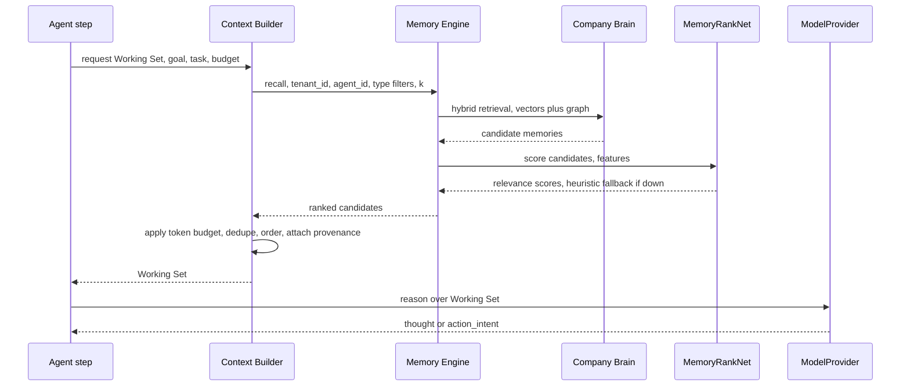
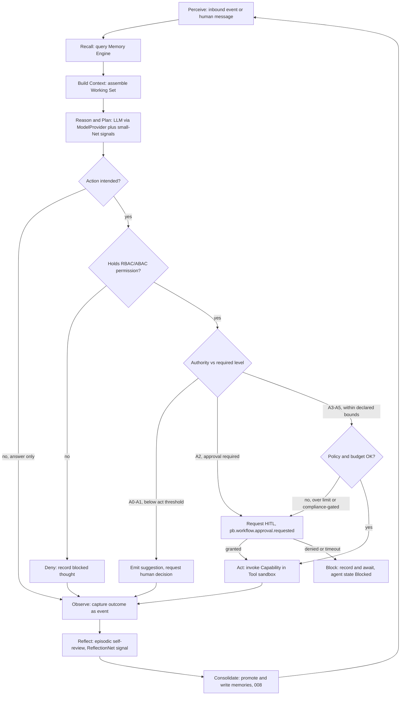
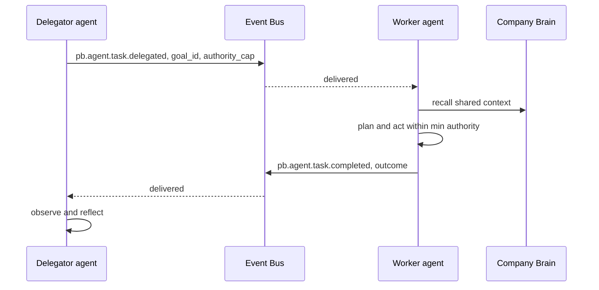

# 003 — Cognitive Architecture

This document specifies the **Cognitive Core** (layer L3 in the glossary
`§3.1` stack): how an agent perceives, remembers, reasons, plans, decides,
acts under governed authority, and learns. It is the connective tissue between
the **Company Brain** (`004_Company_Brain.md`, layer L2) beneath it and the
**Agent Runtime** (`006_Agent_Runtime.md`, layer L4) above it.

It is binding on all cognition. It never redefines the spine: the six memory
types, ports, authority levels, event naming, and the small-Net roster are used
exactly as fixed in `000_Glossary.md`. Physical storage for **Semantic** and
**Long-term** memory belongs to `004_Company_Brain.md`; the knowledge graph
belongs to `009_Knowledge_Graph.md`; the mechanics of importance, decay,
ranking, recall, promotion, consolidation, and archiving belong to
`008_Memory_Engine.md`; small-Net training belongs to `011_ML_Platform.md`.
This document describes cognition; it _uses_ those subsystems through ports.

---

## 1. Scope and position in the stack

The Cognitive Core is a per-tenant, per-agent capability that turns events and
messages into governed action. It owns:

- The **cognitive representation** of the six memory types (access patterns and
  lifecycle _at the cognition level_), deferring bytes-on-disk to `004`/`008`.
- **Reasoning**, **Planning**, **Goal Management**, and **Reflection**.
- The **Context Builder** that assembles the **Working Set** for each step.
- The **Decision Pipeline** that binds it all together under **Authority
  Levels** (`§8` of the glossary) and HITL.
- **Internal Thought Objects** — the typed record of an agent's intermediate
  cognition.

It does **not** own tool execution sandboxes (`006`), workflow state machines
(`010`), or model training (`011`). It depends on the `ModelProvider`,
`ModelServer`, `VectorStore`, `GraphStore`, `EventStore`, `EventBus`,
`FeatureStore`, and `Scheduler` ports only.



---

## 2. The cognitive loop, at a glance

Every unit of agent work is one pass of the **Decision Pipeline** (`§12`):

`perceive → recall → build context → reason/plan → check authority + policy →
act or request HITL → observe → reflect → consolidate`

Each pass is triggered by an inbound **Event** or human message, is scoped to a
single `tenant_id` and `agent_id`, runs inside one agent lifecycle transition
(`Planning`/`Acting`/`Reflecting` per glossary `§7`), and emits events at each
consequential step so the whole trajectory is auditable and replayable
(`005_Event_Model.md`).

---

## 3. Memory at the cognition level

The six memory types are fixed by glossary `§5`. This section defines how
cognition _reads and writes_ each type and the lifecycle it observes; it does
**not** re-specify their physical stores. The reproduced table below is the
authority; any drift is a bug.

| Memory           | Horizon         | Lives in                      | Purpose                                             |
| ---------------- | --------------- | ----------------------------- | --------------------------------------------------- |
| **Working**      | Seconds–minutes | In-process / Redis            | The Working Set for the current reasoning step.     |
| **Conversation** | A session       | PostgreSQL (+ Redis cache)    | Turn-by-turn dialogue with a human or agent.        |
| **Episodic**     | Days–months     | EventStore + Memory tables    | "What happened": time-indexed experiences/outcomes. |
| **Semantic**     | Long            | Company Brain (graph+vectors) | "What is true": facts, entities, relationships.     |
| **Procedural**   | Long            | Company Brain + Workflow defs | "How to": skills, playbooks, workflow templates.    |
| **Long-term**    | Durable         | Company Brain (consolidated)  | Consolidated, ranked, deduplicated knowledge.       |

### 3.1 Working Memory

The volatile scratch space for one reasoning step: the assembled Working Set
plus intermediate **Internal Thought Objects** (`§4`) produced during a ReAct
loop. It is owned by the agent process and mirrored to Redis keyed
`wm:{tenant_id}:{agent_id}:{step_id}` with a short TTL so a crashed step can be
resumed by `Recovering` (glossary `§7`) without replaying the whole task.

- **Access:** read/write in-process; never queried cross-agent.
- **Lifecycle:** created by the Context Builder, mutated during reasoning,
  discarded at step end. Anything worth keeping is _promoted_ to Conversation
  or Episodic memory before discard (see `008_Memory_Engine.md §8`).

**Alternatives considered.** (a) _In-process only_ — fastest, but loses the step
on crash and cannot be inspected by an operator. (b) _Redis-mirrored_
(selected) — near in-process latency, survives a step crash, inspectable, and
already available in the foundation stack. (c) _PostgreSQL-backed_ — durable but
adds write latency on the hot path for state that is disposable by design.
**Future scaling risk:** very large Working Sets (long tool transcripts) can
pressure Redis memory; mitigate with per-agent size caps and spill-to-Episodic
of overflow thoughts.

### 3.2 Conversation Memory

The ordered turns of one session (human↔agent or agent↔agent). Cognition reads
the recent tail to preserve dialogue coherence and writes each new turn. It is
distinct from Episodic memory: Conversation is _verbatim and session-scoped_;
Episodic is _summarised and durable_.

- **Access:** append-only writes; bounded-window reads (last _k_ turns or last
  _n_ tokens) plus semantic recall over older turns when relevant.
- **Lifecycle:** at session close, the session is summarised into an Episodic
  memory (`008 §10`) and the raw turns are retained per tenant retention policy.

### 3.3 Episodic Memory

Time-indexed records of _what happened_: an action taken, its context, and its
outcome. Episodic memory is the join point between the **EventStore** (the
immutable fact) and the **Memory tables** (the cognitively-enriched, ranked
`MemoryItem`, `008 §2`). Every consequential Decision Pipeline pass leaves an
episodic trace.

- **Access:** written on `observe`; recalled by similarity + recency + entity
  links during `recall`.
- **Lifecycle:** subject to importance, decay, promotion, consolidation, and
  archiving in `008`. High-value episodes promote to Long-term; stable facts
  extracted from them promote to Semantic (`004`).

### 3.4 Semantic Memory

_What is true_: facts, entities, and relationships. Physically the Company
Brain's knowledge graph + vector store (`004`, `009`). At the cognition level an
agent **reads** Semantic memory to ground reasoning and **proposes** additions
or corrections — it does not write the graph directly. Writes flow as _knowledge
evolution_ proposals (`§15`) that `004` validates and applies.

- **Access:** hybrid retrieval (vector + graph traversal) via the Brain's
  published API; strictly tenant-scoped.
- **Lifecycle:** owned by `004`/`009`. Cognition only supplies candidate
  assertions with provenance (`source_event_id`).

### 3.5 Procedural Memory

_How to_: reusable skills, playbooks, and workflow templates. Read when the
Planner selects a strategy; written when Reflection generalises a repeated
successful trajectory into a reusable procedure. Executable procedures live as
**Workflow definitions** (`010_Workflow_Engine.md`); their _indexing and
retrieval_ is Procedural memory.

- **Access:** retrieved by task-type match and success priors; ranked by the
  procedure's historical outcome.
- **Lifecycle:** a candidate procedure is proposed by Reflection, versioned in
  `010`, and its performance tracked so `WorkflowNet` (`011`) can score it.

### 3.6 Long-term Memory

Consolidated, ranked, deduplicated knowledge — the durable residue of many
episodes. It is not a seventh store; it is the _consolidated tier_ of the Brain
(`004`) produced by the Memory Engine's consolidation job (`008 §13`). Cognition
reads Long-term memory for durable context and background priors.

- **Access:** same hybrid retrieval as Semantic, filtered to consolidated items.
- **Lifecycle:** produced by promotion + consolidation; low-value items archive
  (reversibly) to cold storage.



---

## 4. Internal Thought Objects

An **Internal Thought Object** (ITO) is the typed, immutable record of one
intermediate cognitive act — an observation, a reasoning thought, a plan, a
decision, a reflection. ITOs make the agent's cognition inspectable, replayable,
and trainable. They are the raw material of Episodic memory and of the small-Net
retraining datasets (`008 §12`, `011`).

### 4.1 Schema

| Field             | Type           | Description                                                                                          |
| ----------------- | -------------- | ---------------------------------------------------------------------------------------------------- |
| `id`              | UUID           | Stable identifier.                                                                                   |
| `tenant_id`       | UUID           | Tenant scope (mandatory, glossary `§12.6`).                                                          |
| `agent_id`        | UUID           | Producing agent instance.                                                                            |
| `session_id`      | UUID \| null   | Conversation/session if any.                                                                         |
| `task_id`         | UUID \| null   | Task under which the thought was produced.                                                           |
| `step_id`         | UUID           | Decision Pipeline pass that produced it.                                                             |
| `kind`            | enum           | `observation` \| `thought` \| `plan` \| `decision` \| `action_intent` \| `reflection` \| `question`. |
| `content`         | text           | The natural-language thought or a structured payload.                                                |
| `structured`      | JSON \| null   | Machine-readable payload (plan tree, tool call, scores).                                             |
| `refs`            | UUID[]         | Linked ITOs, MemoryItems, goals, tasks.                                                              |
| `cited_memory`    | UUID[]         | MemoryItem ids that grounded this thought (feeds MemoryRankNet labels).                              |
| `authority_at`    | enum A0–A5     | The agent's authority when the thought was formed.                                                   |
| `confidence`      | float [0,1]    | Model/self-estimated confidence.                                                                     |
| `source_event_id` | UUID \| null   | Triggering event.                                                                                    |
| `produces_event`  | string \| null | Event emitted when this thought is externally consequential.                                         |
| `created_at`      | timestamptz    | Creation time.                                                                                       |

### 4.2 Storage and events

- ITOs are written to Working Memory during a step, then **persisted as Episodic
  memory** at `observe`/`consolidate` (they become `MemoryItem`s of type
  `episodic`, subtype = `kind`, in `008 §2`).
- Consequential ITOs also emit an event: `pb.agent.thought.recorded` for the
  general case, and specific events for `plan` (`pb.agent.plan.created`),
  `decision` (`pb.agent.decision.made`), and `reflection`
  (`pb.agent.reflection.recorded`). Naming follows glossary `§9`
  (`pb.<context>.<aggregate>.<past-verb>`).
- **Why persist thoughts as events + memory rather than logs only?** Logs are
  not replayable and are not tenant-partitioned as first-class state. Modelling
  thoughts as events keeps the audit trail authoritative (glossary `§12.4`) and
  lets projections and ML pipelines subscribe without bespoke log parsing.
  **Future scaling risk:** verbose chains-of-thought inflate event volume;
  mitigate by persisting _summarised_ thoughts by default and full transcripts
  only when `confidence` is low or an error occurred (sampling policy in `011`).

### 4.3 Example

```json
{
  "id": "9f1c0b2e-2a41-4b7e-9d0a-2c9b6c4e1f77",
  "tenant_id": "b3d9a1c4-7e52-4c8a-9f10-1a2b3c4d5e6f",
  "agent_id": "3a7e5d21-9c44-4e0b-8a11-7f6e5d4c3b2a",
  "session_id": null,
  "task_id": "c1a2b3c4-d5e6-4f70-8192-a3b4c5d6e7f8",
  "step_id": "d4e5f6a7-b8c9-40d1-9e2f-3a4b5c6d7e8f",
  "kind": "decision",
  "content": "Draft the renewal proposal now; value is within A3 bounds, no HITL needed.",
  "structured": {
    "chosen_capability": "create_proposal",
    "estimated_value_eur": 4200,
    "policy_checks": ["value_under_limit", "not_first_contact"]
  },
  "refs": ["c1a2b3c4-d5e6-4f70-8192-a3b4c5d6e7f8"],
  "cited_memory": ["6b1e...", "77aa..."],
  "authority_at": "A3",
  "confidence": 0.82,
  "source_event_id": "e5f6a7b8-c9d0-41e2-83f4-5a6b7c8d9e0f",
  "produces_event": "pb.agent.decision.made",
  "created_at": "2026-07-13T09:14:02Z"
}
```

---

## 5. Reasoning

Reasoning turns a Working Set into thoughts, tool calls, and decisions. It uses
a **hosted LLM via the `ModelProvider` port** (default Anthropic Claude,
glossary `§3.2`/`§3.4`) augmented with **tool use** and **small-Net signals**
(`MemoryRankNet`, `TaskPriorityNet`, etc. served via `ModelServer`).

### 5.1 The ReAct-style loop

Reasoning runs a bounded **Reason → Act → Observe** loop:

1. **Reason:** the LLM produces a `thought` ITO and either a final answer or an
   `action_intent` (a tool call).
2. **Authority + policy gate:** every `action_intent` passes the check in `§12`
   before any tool executes. Read-only tools are permitted at A0+; mutating
   tools require the level the Capability declares.
3. **Act:** the Runtime executes the approved Capability in its sandbox (`006`).
4. **Observe:** the tool result becomes an `observation` ITO, appended to
   Working Memory, and the loop repeats until a stop condition.

Small-Net signals are injected as structured context: e.g. the Context Builder
attaches `MemoryRankNet` relevance so the LLM sees _why_ a memory was included,
and `TaskPriorityNet` scores frame which subgoal to pursue.

```text
loop until answer or budget exhausted:
  thought, intent = model.reason(working_set, tools, net_signals)
  record ITO(thought)
  if intent is None: break
  decision = authority_gate(intent)          # §12
  if decision == REQUEST_HITL: pause, emit pb.workflow.approval.requested
  if decision == DENY: record blocked ITO, break
  result = runtime.execute(intent)           # 006 sandbox
  record ITO(observation=result)
```

### 5.2 Guardrails

- **Step and token budgets** per task (from the goal, `§8`); exceeding them
  forces a summarise-and-continue or escalate.
- **Tool allow-list** derived from the agent's Capabilities ∩ Authority
  (glossary `§8`) — the LLM cannot call a tool it is not entitled to.
- **Grounding requirement:** assertions written to Semantic memory must carry a
  `cited_memory`/`source_event_id`; ungrounded claims are quarantined as
  `question` ITOs for verification (`§15`).
- **Loop-breaking:** repeated identical `action_intent`s or oscillation trip a
  circuit breaker that escalates to `Blocked`.
- **Output validation:** structured tool arguments are schema-validated before
  execution; validation failure is an `observation`, not a crash.

**Alternatives considered.** (a) _Plan-then-execute_ (rigid upfront plan) —
predictable and cheap but brittle when reality diverges. (b) _Pure ReAct_
(selected as the base loop) — adapts step-by-step, integrates tools and
small-Net signals naturally. (c) _Reflexion / self-critique every step_ —
highest quality but multiplies LLM cost. **Selected:** ReAct as the base loop
with _plan-scaffolding_ from the Planner (`§6`) and _episodic_ (not per-step)
reflection (`§7`), balancing adaptivity against cost. **Future scaling risk:**
per-step LLM latency dominates long tasks; mitigate with response caching keyed
on Working-Set hash, cheaper model tiers for low-stakes steps, and small-Nets
handling ranking/scoring the LLM would otherwise do.

---

## 6. Planning

Planning decomposes a **Goal** (`§8`) into an ordered/partially-ordered set of
**Tasks**. The plan is a first-class artifact, not an ephemeral prompt.

### 6.1 Plan representation

A **Plan** is a directed acyclic graph of Tasks:

| Field          | Type         | Description                                                  |
| -------------- | ------------ | ------------------------------------------------------------ |
| `id`           | UUID         | Plan identifier.                                             |
| `goal_id`      | UUID         | Goal this plan serves.                                       |
| `tasks`        | Task[]       | Nodes.                                                       |
| `edges`        | (from,to)[]  | Dependencies (a DAG; cycles rejected).                       |
| `strategy_ref` | UUID \| null | Procedural memory (playbook) the plan was instantiated from. |
| `budget`       | object       | Step/token/value/time ceilings inherited by tasks.           |
| `status`       | enum         | `draft` \| `active` \| `blocked` \| `done` \| `abandoned`.   |
| `version`      | int          | Bumped on replan; prior versions retained for audit.         |

A **Task** carries `id`, `plan_id`, `title`, `capability` (target Capability),
`inputs`, `required_authority`, `priority` (from `TaskPriorityNet`, `§8`),
`preconditions`, `status`, and `outcome_ref`.

Plan creation emits `pb.agent.plan.created`; each task start/finish emits
`pb.agent.task.started` / `pb.agent.task.completed` (glossary example).

### 6.2 How plans are formed

1. The Planner retrieves candidate **Procedural** memories matching the goal's
   task-type and picks the highest historical-success playbook (`WorkflowNet`
   score, `011`), or asks the LLM to synthesise a plan when none fits.
2. The LLM expands the strategy into concrete tasks with explicit
   `required_authority` per task.
3. `TaskPriorityNet` scores task priority; the Planner topologically orders the
   DAG, breaking ties by priority.
4. **Replanning** is triggered by a failed task, a new blocking observation, or
   a goal change — it produces a new plan `version`, never mutating history.

**Alternatives considered.** (a) _Linear task list_ — simplest, but cannot
express parallelism or conditional branches. (b) _Task DAG_ (selected) —
expresses dependencies and parallelism, maps cleanly onto `010`'s workflow
engine, and is easy to visualise/audit. (c) _Full HTN planner_ — most
expressive but heavy to author and operate for v1. **Future scaling risk:**
deep DAGs across many agents create scheduling contention; delegate long-running
or cross-agent plans to the Workflow Engine (`010`) rather than holding them in
a single agent's cognition.

---

## 7. Reflection

**Reflection** (glossary `§2`) is an agent's structured self-review of its own
actions and outcomes. It runs at episode boundaries (task completion, error,
goal closure) — not every step (see `§5.2` cost rationale). It produces three
outputs:

1. **Learning** — a natural-language lesson and, when general enough, a proposed
   Procedural memory or a correction to Semantic memory (`§15`).
2. **Memory** — a `reflection` ITO persisted as Episodic memory, and importance
   re-scoring of the episode's memories (`008 §3`).
3. **A `ReflectionNet` signal** — a structured training row (features of the
   episode + measured outcome) that feeds `ReflectionNet` in `011`. This
   document does **not** define how `ReflectionNet` is trained; it defines the
   signal's shape and emission.

### 7.1 Reflection record

| Field          | Type        | Description                                                    |
| -------------- | ----------- | -------------------------------------------------------------- |
| `id`           | UUID        | Reflection identifier.                                         |
| `task_id`      | UUID        | Episode reviewed.                                              |
| `outcome`      | enum        | `success` \| `partial` \| `failure`.                           |
| `kpi_delta`    | JSON        | Measured effect on the agent's KPIs (`007_AI_Employees.md`).   |
| `lessons`      | text[]      | Extracted lessons.                                             |
| `proposals`    | JSON        | Proposed Procedural/Semantic updates (candidate, not applied). |
| `net_features` | JSON        | Feature vector for `ReflectionNet` (`011`).                    |
| `created_at`   | timestamptz | Time of reflection.                                            |

Reflection emits `pb.agent.reflection.recorded`; accepted proposals emit
`pb.knowledge.assertion.proposed` for `004` to validate (`§15`).

**Alternatives considered.** (a) _No structured reflection_ (rely on raw logs) —
cheapest, but nothing improves behaviour systematically. (b) _Per-step
self-critique_ — best quality signal, highest cost. (c) _Episodic reflection_
(selected) — one bounded LLM review per episode yields learning + a clean
training label at manageable cost. **Future scaling risk:** reflection quality
is itself unmeasured early on; bootstrap with heuristic outcome labels
(KPI deltas) until `ReflectionNet` has enough data to score reflections.

---

## 8. Goal Management

### 8.1 Goal objects and hierarchy

A **Goal** is a durable intent an agent pursues. Goals form a hierarchy:
mission-level goals (from the AI Employee's charter, `007`) decompose into
sub-goals, which the Planner (`§6`) turns into Tasks.

| Field              | Type                | Description                                                       |
| ------------------ | ------------------- | ----------------------------------------------------------------- |
| `id`               | UUID                | Goal identifier.                                                  |
| `tenant_id`        | UUID                | Tenant scope.                                                     |
| `agent_id`         | UUID                | Owning agent (may be shared, `§16`).                              |
| `parent_goal_id`   | UUID \| null        | Hierarchy link.                                                   |
| `statement`        | text                | The intent, in outcome terms.                                     |
| `success_criteria` | JSON                | Measurable done-conditions.                                       |
| `priority`         | float               | Ranked by `TaskPriorityNet` (`011`), heuristic fallback below.    |
| `authority_cap`    | enum A0–A5          | Ceiling authority for actions under this goal.                    |
| `budget`           | object              | Value/time/step ceilings.                                         |
| `status`           | enum                | `proposed` \| `active` \| `blocked` \| `achieved` \| `abandoned`. |
| `deadline`         | timestamptz \| null | Optional due time.                                                |

### 8.2 Priority

Priority is set by **`TaskPriorityNet`** (glossary `§10`), which scores goals and
tasks from features like deadline proximity, KPI leverage, blocking-dependency
count, and stakeholder value. **Heuristic fallback** (used when the Net is
unavailable, matching the `MemoryRankNet` fallback pattern in `008 §6`):

```text
priority = 0.4 * deadline_urgency
         + 0.3 * kpi_leverage
         + 0.2 * unblock_impact
         + 0.1 * stakeholder_value      # each term normalised to [0,1]
```

### 8.3 Lifecycle and events

`proposed → active → (blocked ⇄ active) → achieved | abandoned`. Transitions
emit `pb.agent.goal.created`, `pb.agent.goal.activated`,
`pb.agent.goal.blocked`, `pb.agent.goal.achieved`, `pb.agent.goal.abandoned`.
A goal's `authority_cap` and `budget` are inherited by its Plans and Tasks and
are enforced at the Decision Pipeline gate (`§12`).

**Alternatives considered.** (a) _Static priority integers_ — trivial but stale;
they don't reflect changing deadlines/KPIs. (b) _Learned `TaskPriorityNet`_
(selected) — adapts to tenant-specific value signals and improves with
outcomes. (c) _LLM re-ranks goals each cycle_ — flexible but costly and
non-deterministic for a scheduling decision made constantly. **Future scaling
risk:** many agents contending for shared goals need global arbitration; a
tenant-level goal-scheduler (owned by `006`/`010`) mediates using the same
priority scores.

---

## 9. Context Building

The **Context Builder** assembles the **Working Set** (glossary `§2`) for one
reasoning step: it retrieves, ranks, budgets, and orders the material the LLM
sees. It is the single choke-point where memory meets reasoning.

### 9.1 Responsibilities

1. **Retrieve** candidates across memory types via the Memory Engine's recall
   (`008 §7`): recent Conversation turns, relevant Episodic/Long-term/Semantic
   memories (hybrid vector + graph), and matching Procedural memories.
2. **Rank** candidates by relevance using **`MemoryRankNet`** (the learned
   ranker; heuristic fallback in `008 §6`).
3. **Budget** to the model's token window: allocate a fixed share to system +
   goal + plan, and fill the remainder greedily by rank, dropping or summarising
   overflow.
4. **Order** for the model: stable framing first (identity, goal, authority),
   then ranked memories, then the live task tail — most-relevant nearest the
   query where models attend best.
5. **Attach provenance**: each included memory carries its `id`, `type`, and
   rank score so thoughts can cite it (`cited_memory`, `§4`).

### 9.2 Token budget policy

```text
budget = model_context_window - reserved_output
alloc  = { system+identity: 10%, goal+plan: 15%, memories: 60%, live_tail: 15% }
fill memories greedily by MemoryRankNet score until the memories slot is full;
summarise the marginal overflow via 008 §11 rather than hard-truncating.
```

### 9.3 Sequence



**Alternatives considered.** (a) _Recency-only context_ — cheap, but forgets
relevant older knowledge. (b) _Pure vector top-k_ — semantically relevant but
ignores importance, strength, and graph structure. (c) _`MemoryRankNet`-ranked
hybrid_ (selected) — combines similarity, importance, strength, recency, and
graph proximity, learned from real usefulness labels. **Future scaling risk:**
retrieval + ranking latency grows with memory volume; mitigate with ANN indexes
(`pgvector` → Qdrant per `008`), cached Working Sets for repeated steps, and a
recall-budget cap on candidate count.

---

## 10. Decision Pipeline

The Decision Pipeline is the canonical control flow of cognition. Authority and
HITL checks are **explicit and mandatory** per glossary `§8`.



Stage notes:

- **Perceive:** an inbound event/message opens a step scoped to `tenant_id`.
- **Recall + Build Context:** `§9`, backed by `008 §7`.
- **Reason/Plan:** `§5`/`§6`.
- **Permission gate:** RBAC/ABAC identity check (`012_Security.md`). Independent
  of authority; both must pass (glossary `§8`: "the lower of the two governs").
- **Authority gate:** required level per Capability vs the agent's level under
  the goal's `authority_cap`. First-contact outreach is capped at A2 regardless
  of level (glossary `§8`, `AI_DEPLOY_AUTHORIZATION.md §Legal`).
- **Policy/budget:** value/rate/scope limits and outreach-compliance controls
  (`OUTREACH_COMPLIANCE_CONTROLS`); breach downgrades to HITL.
- **Act/HITL:** execute in the sandbox (`006`) or request approval via the
  Workflow Engine (`010`).
- **Observe → Reflect → Consolidate:** `§7`, `008 §8`/`§13`.

---

## 11. Memory Consolidation, Retrieval, and Ranking (cognitive view)

These three are _mechanised_ in `008_Memory_Engine.md`; here is only how
cognition uses them.

- **Consolidation** — at `consolidate` the agent flushes Working/Conversation
  state into durable Episodic memory and marks episodes eligible for the Memory
  Engine's periodic promotion/summarisation (`008 §13`). Cognition never writes
  Long-term/Semantic directly; it proposes (`§15`).
- **Retrieval** — cognition calls recall with a query, type filters, and a
  candidate budget; the Memory Engine performs hybrid retrieval and returns
  ranked `MemoryItem`s (`008 §7`).
- **Ranking** — the ranker is **`MemoryRankNet`** (glossary `§10`); cognition
  treats it as a black box that scores relevance, with the heuristic fallback in
  `008 §6`. Training is `011`.

---

## 12. Learning Pipeline

Learning is how experience becomes improved behaviour and retraining datasets.
Cognition is the _producer_ of signals; `011_ML_Platform.md` owns training and
deployment. The flow:

1. **Experience** — every Decision Pipeline pass emits ITOs and events with
   outcomes.
2. **Reflection** — episodic self-review (`§7`) attaches measured `kpi_delta`
   and lessons, converting raw experience into _labelled_ outcomes.
3. **Dataset generation** — the Memory Engine joins recall events + outcomes +
   reflections into labelled rows (`008 §12`), landing them in the
   `FeatureStore` for the small Nets (`MemoryRankNet`, `TaskPriorityNet`,
   `ReflectionNet`, `WorkflowNet`, …).
4. **Retraining + evaluation** — `011` trains challengers and promotes them via
   champion/challenger (glossary `§10`).
5. **Behaviour change** — improved Nets change ranking, priority, and reflection
   scoring on the next cycle; improved Procedural/Semantic memory changes plans
   and grounding. **No foundation-model training** occurs (glossary `§3.4`); the
   LLM improves only through better context and better small-Net signals.

Emits `pb.agent.learning.captured` when a reflection yields an accepted
proposal, and (via `008`) `pb.memory.dataset.generated` when a training batch is
materialised.

---

## 13. Knowledge Evolution

New or contradicting knowledge must update the Brain without corrupting it.
Cognition **proposes**; `004_Company_Brain.md` (with `009_Knowledge_Graph.md`)
**validates and applies**. This document defines the proposal contract only.

- A grounded assertion (`§5.2`) becomes a `pb.knowledge.assertion.proposed`
  event carrying the claim, `source_event_id`, `confidence`, and any
  contradicted node ids.
- `004` reconciles: additive facts are linked; contradictions trigger a
  resolution policy (recency, source authority, corroboration count) that `004`
  owns. Cognition is notified via `pb.knowledge.assertion.accepted` /
  `pb.knowledge.assertion.rejected` and updates the episode's importance
  accordingly (`008 §3`).
- Superseded facts are versioned, not deleted (auditability, glossary `§12.4`).

**Alternatives considered.** (a) _Agents write the graph directly_ — fast but
lets one agent corrupt shared truth. (b) _Propose-and-validate_ (selected) —
keeps `004` the single authority for truth, enforces provenance, and makes
contradiction handling one policy in one place. **Future scaling risk:**
proposal volume can bottleneck validation; batch low-confidence proposals and
fast-path high-confidence corroborated ones.

---

## 14. Authority Levels in the cognitive loop

Authority (glossary `§8`, levels A0–A5) is enforced at the **Authority gate**
(`§10`) on every intended action. Rules the cognitive loop implements:

| Level | In the loop, the agent may…                                                                         |
| ----- | --------------------------------------------------------------------------------------------------- |
| A0    | Perceive, recall, reason, and record ITOs only. Every mutating `action_intent` is denied.           |
| A1    | Additionally produce suggestions/drafts, emitted for human/higher-agent approval.                   |
| A2    | Execute a specific action **after** an explicit HITL grant (`pb.workflow.approval.granted`).        |
| A3    | Act without approval inside declared value/scope/rate limits; over-limit intents downgrade to HITL. |
| A4    | Act across a context, still bounded by policy and budget.                                           |
| A5    | Change policy/authority/configuration (admin-class); such changes are themselves events.            |

Invariants: (1) the **effective** capability is `min(permission, authority)`; (2)
**first-contact outreach never exceeds A2**; (3) authority in force is recorded
on every `decision`/`action_intent` ITO (`authority_at`) for audit; (4)
authority is data on the agent/goal, changeable only by an A5 action.

---

## 15. Agent Cooperation

Agents cooperate through the shared **Company Brain** and the **event
backbone** — never by importing each other (the L7/inter-context rule in
glossary `§3.1`).

### 15.1 Shared context, goals, and memory

- **Shared Brain:** Semantic, Procedural, and Long-term memory are per-tenant
  and shared across that tenant's agents (`004`). One agent's consolidated
  knowledge is another's recall — with tenant isolation absolute (glossary
  `§12.6`).
- **Shared goals:** a Goal may be owned by a team; sub-goals are assigned to
  specific agents. Priority arbitration uses `TaskPriorityNet` scores (`§8`).
- **Working/Conversation memory stays private** to the producing agent/session
  unless explicitly shared in an agent-to-agent conversation.

### 15.2 Delegation with authority bounds

Delegation is a message modelled as an event: `pb.agent.task.delegated` carrying
`from_agent`, `to_agent`, `goal_id`, `task`, and a **delegated authority cap**.
The delegate's effective authority is `min(own_authority, delegated_cap,
goal.authority_cap)` — delegation can only **narrow**, never widen, authority.
Completion returns via `pb.agent.task.completed`; the delegator observes it as a
normal perception and reflects on the outcome.



**Alternatives considered.** (a) _Direct agent-to-agent calls_ — low latency but
couples agents and bypasses audit/authority. (b) _Event-mediated delegation_
(selected) — preserves the inter-context rule, is fully auditable, and lets
authority be bounded at the message boundary. (c) _Central orchestrator only_ —
simple governance but a single bottleneck. **Selected:** event-mediated
delegation with the Workflow Engine (`010`) orchestrating multi-agent,
long-running collaborations. **Future scaling risk:** delegation storms
(agents delegating in cycles) need a delegation-depth cap and loop detection,
enforced by `006`.

---

## 16. Cross-references

- `000_Glossary.md` — the spine (memory taxonomy `§5`, authority `§8`, events
  `§9`, small Nets `§10`).
- `004_Company_Brain.md` — physical Semantic/Long-term storage; knowledge
  evolution validation.
- `006_Agent_Runtime.md` — lifecycle states, tool sandbox, recovery.
- `008_Memory_Engine.md` — importance, decay, ranking, recall, promotion,
  consolidation, archiving; dataset generation.
- `009_Knowledge_Graph.md` — ontology, traversal, inference.
- `010_Workflow_Engine.md` — approvals/HITL, long-running and multi-agent work.
- `011_ML_Platform.md` — training/serving of `MemoryRankNet`, `TaskPriorityNet`,
  `ReflectionNet`, `WorkflowNet`.
- `012_Security.md` — RBAC/ABAC permission gate; authority enforcement.
