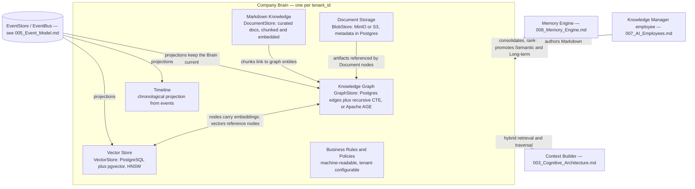
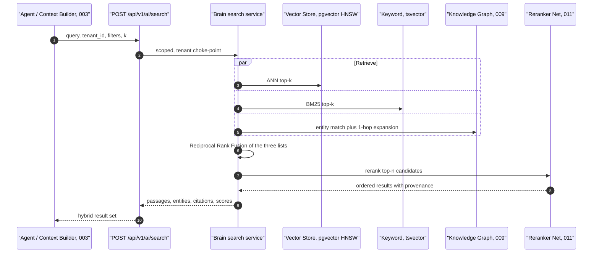
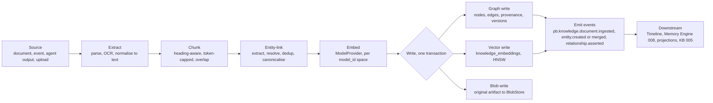

# 004 — Company Brain

The **Company Brain** is the shared, per-tenant knowledge substrate defined in
`000_Glossary.md` §2 and located at layer **L2** of the canonical stack
(`000_Glossary.md` §3.1). Every AI Employee (`007_AI_Employees.md`) reads from
and writes to one Brain, and there is exactly one Brain per **Tenant**.
The Brain is _where knowledge physically lives_; it is **not** where the memory
lifecycle is governed. Importance, decay, ranking, recall, promotion,
consolidation and archiving are owned by the **Memory Engine**
(`008_Memory_Engine.md`) and the cognitive pipeline (`003_Cognitive_Architecture.md`).
This document specifies the substrate — its stores, schemas, embeddings,
ingestion, search, versioning and evolution — and defers those cognitive
mechanics to their owning documents.

This document never contradicts `000_Glossary.md`. Where it names a store it
uses the ports and default adapters locked in `000_Glossary.md` §3.2.

---

## Overview and role

The Brain is the single source of shared, durable truth for a company's digital
workforce. Its role is fourfold:

1. **Shared long-term and semantic memory.** Of the six canonical memory types
   (`000_Glossary.md` §5), **Semantic** ("what is true") and **Long-term**
   (consolidated, ranked, deduplicated knowledge) live _in_ the Brain, and the
   Brain-resident half of **Procedural** memory (playbooks and knowledge docs;
   workflow definitions live in `010_Workflow_Engine.md`) is stored here too.
   **Working**, **Conversation** and **Episodic** memory live elsewhere and are
   referenced, not owned, by the Brain — see `008_Memory_Engine.md`.
2. **A cross-employee knowledge commons.** Because all agents for a tenant share
   one Brain, a fact learned by the Sales Manager is immediately available to the
   Support and Finance employees without message passing.
3. **A queryable substrate for reasoning.** The Decision Pipeline in
   `003_Cognitive_Architecture.md` assembles a Working Set from the Brain via the
   Context Builder; the Brain provides hybrid retrieval (vector + graph + keyword)
   and multi-hop traversal (`009_Knowledge_Graph.md`).
4. **A governed record.** Business rules, machine-readable policies, and the
   outreach-compliance controls (`AI_DEPLOY_AUTHORIZATION.md` §Legal) are stored
   and evaluated here so autonomy stays inside declared bounds.

**Tenant isolation is absolute** (`000_Glossary.md` §12.6). Every row, node,
edge, chunk, blob and event carries a non-null `tenant_id`; every query is scoped
at a single choke-point in the Brain service; cross-tenant reads are impossible
by construction. Isolation options were compared:

| Isolation option                              | Pros                                                                                             | Cons                                                                           | Verdict                                                                                           |
| --------------------------------------------- | ------------------------------------------------------------------------------------------------ | ------------------------------------------------------------------------------ | ------------------------------------------------------------------------------------------------- |
| Database-per-tenant                           | Hard blast-radius isolation                                                                      | Migrations and pooling explode with tenant count; costly for long-tail tenants | Rejected for v1; an enterprise-tier option                                                        |
| Schema-per-tenant                             | Strong isolation, one instance                                                                   | Thousands of schemas strain the catalog; cross-tenant ops queries painful      | Rejected for v1                                                                                   |
| **Shared tables + `tenant_id` + row scoping** | One schema, one migration path, cheapest per tenant, works on the foundation's single PostgreSQL | Discipline required; a missing filter is a leak                                | **Selected** — enforced by a mandatory tenant-scoped session and Postgres RLS as defence in depth |

**Future scaling risk:** shared-table isolation depends on every query passing
through the tenant choke-point. A single hand-written query that forgets the
filter is a cross-tenant leak. Mitigation: PostgreSQL Row-Level Security policies
keyed on a `SET app.tenant_id` GUC, plus a repository layer that refuses to build
an unscoped statement. The move trigger to schema- or database-per-tenant is a
regulated tenant requiring physical separation, or a single tenant large enough
to need independent scaling of its Brain.

---

## Composition

The Brain is an assembly of six cooperating stores behind the Brain service, each
backed by a port from `000_Glossary.md` §3.2.



Each store maps to a port so any component is swappable without touching callers:

| Brain store        | Port (`000_Glossary.md` §3.2) | Default adapter (v1)                | Scale-up trigger                                                                    |
| ------------------ | ----------------------------- | ----------------------------------- | ----------------------------------------------------------------------------------- |
| Knowledge Graph    | `GraphStore`                  | PostgreSQL edges + CTE / Apache AGE | See `009_Knowledge_Graph.md` (Neo4j)                                                |
| Vector Store       | `VectorStore`                 | PostgreSQL + `pgvector`             | Qdrant / Milvus when recall latency at p95 breaks SLO or index RAM exceeds one node |
| Markdown Knowledge | `DocumentStore`               | PostgreSQL + object store           | —                                                                                   |
| Document Storage   | `BlobStore`                   | S3-compatible (MinIO self-host)     | AWS S3 / GCS at multi-region                                                        |
| Timeline           | projection over `EventStore`  | PostgreSQL read model               | Partitioned / columnar store when history dominates                                 |
| Rules & Policies   | `DocumentStore` + evaluator   | PostgreSQL + CEL evaluator          | Dedicated policy engine (OPA) if policy volume warrants                             |

---

## Knowledge Graph (summary)

The graph is the Brain's structural backbone: typed **entities** (Account,
Contact, Deal, Ticket, Document, Policy, Product, Employee(AI), Project, Task,
Event, KnowledgeItem) connected by typed, directional, provenance-bearing
**relationships** (WORKS_AT, OWNS, RELATES_TO, DERIVED_FROM, SUPERSEDES, …). It
answers "what is true and how do facts connect", and it is the anchor entity
linking and versioning attach to.

The default adapter is `GraphStore` = PostgreSQL adjacency tables traversed with
recursive CTEs, upgradable in place to **Apache AGE** (openCypher over the same
PostgreSQL instance), with **Neo4j** as the scale-up adapter. Full ontology,
edge catalogue, traversal patterns, inference and reasoning support are specified
in **`009_Knowledge_Graph.md`**; this section defers to it.

---

## Vector Store

Embeddings power similarity search over unstructured knowledge — Markdown chunks,
document text, event summaries, and node/edge descriptions from
`009_Knowledge_Graph.md`.

**Adapter:** `VectorStore` default = PostgreSQL + `pgvector`. Keeping vectors in
the same PostgreSQL the foundation already runs means a chunk, its graph entity,
and its provenance can be joined in one transaction — no dual-write consistency
problem across a separate vector database.

**Schema** (`knowledge_embeddings`):

| Column         | Type           | Notes                                                                    |
| -------------- | -------------- | ------------------------------------------------------------------------ |
| `id`           | `Uuid` PK      | `uuid4` default, per `db/models` convention                              |
| `tenant_id`    | `Uuid`         | not null, RLS-scoped, first column of every index                        |
| `owner_type`   | enum           | `chunk` \| `document` \| `graph_node` \| `graph_edge` \| `event_summary` |
| `owner_id`     | `Uuid`         | FK to the owning row (chunk, node, …)                                    |
| `model_id`     | `String`       | embedding model identity, e.g. `bge-large-en-v1.5`                       |
| `dim`          | `int`          | dimensionality of this vector space                                      |
| `embedding`    | `vector(dim)`  | pgvector column                                                          |
| `content_hash` | `String(64)`   | sha256 of the embedded text; dedup and re-embed guard                    |
| `created_at`   | `DateTime(tz)` |                                                                          |

**Index type — HNSW vs IVFFlat.**

| Index            | Build                                                              | Query recall/latency                                          | Memory                       | Verdict                                                       |
| ---------------- | ------------------------------------------------------------------ | ------------------------------------------------------------- | ---------------------------- | ------------------------------------------------------------- |
| **HNSW**         | Slower to build, incremental inserts fine                          | Best recall at low latency, robust to query distribution      | Higher RAM (graph in memory) | **Selected default** — read-heavy Brain, moderate write rate  |
| IVFFlat          | Fast build, needs `lists` tuned and periodic reindex as data grows | Good recall only when probes tuned; degrades as clusters skew | Lower RAM                    | Fallback for very large, write-heavy, RAM-constrained tenants |
| Exact (no index) | None                                                               | Perfect recall, linear scan                                   | None                         | Only for tiny tenants or correctness baselines                |

HNSW is selected because the Brain is overwhelmingly read-heavy and recall
quality directly gates reasoning quality. `pgvector` HNSW is built per
`(tenant_id, model_id)` filter using partial indexes so each tenant's vectors are
searched in isolation.

**Per-tenant partitioning.** `knowledge_embeddings` is declaratively
**partitioned by `tenant_id`** (`LIST`/`HASH`), so a tenant's vectors are a
distinct physical partition — pruned automatically, indexed independently, and
detachable for export or deletion (right-to-erasure). Every ANN query carries the
`tenant_id` predicate so the planner prunes to one partition before the HNSW
probe.

**Future scaling risk:** HNSW indexes are memory-resident; a tenant with tens of
millions of chunks can exceed a single node's RAM, and pgvector cannot yet shard
one index across nodes. The recorded move trigger is p95 ANN latency breaching the
retrieval SLO or index resident-set exceeding the node budget — at which point the
`VectorStore` port is repointed to Qdrant or Milvus for that tenant with no caller
changes.

---

## Markdown Knowledge

Curated, human- and agent-authored knowledge documents (playbooks, company facts,
process notes, decision records) are first-class citizens. They are the
Brain-resident form of **Procedural** and **Semantic** knowledge that humans and
agents write in prose.

**Store:** `DocumentStore` = PostgreSQL rows for structure and text, with large
originals spilled to `BlobStore`.

**Schema** (`knowledge_documents`, `knowledge_chunks`):

| `knowledge_documents`       | Type           | Notes                                                                          |
| --------------------------- | -------------- | ------------------------------------------------------------------------------ |
| `id` / `tenant_id`          | `Uuid`         |                                                                                |
| `title`                     | `String(512)`  |                                                                                |
| `body_md`                   | `Text`         | GitHub-flavoured Markdown source of record                                     |
| `doc_kind`                  | enum           | `playbook` \| `fact_sheet` \| `policy_note` \| `decision_record` \| `imported` |
| `status`                    | enum           | `draft` \| `curated` \| `archived`                                             |
| `author_type` / `author_id` | enum / `Uuid`  | `human` or `agent` provenance                                                  |
| `version`                   | `int`          | monotonically increasing                                                       |
| `supersedes_id`             | `Uuid?`        | previous version, if any                                                       |
| `created_at` / `updated_at` | `DateTime(tz)` |                                                                                |

**Chunking and embedding.** On save, a document is chunked **structure-first**:
split on Markdown headings, then pack into ~500–800 token windows with ~15%
overlap, preserving `heading_path` for citation. Each chunk row
(`knowledge_chunks`: `document_id`, `chunk_index`, `text`, `heading_path`,
`token_count`, `content_hash`) is embedded (see **Embeddings**) into
`knowledge_embeddings` with `owner_type='chunk'`.

| Chunking strategy                       | Trade-off                                                           | Verdict                                                      |
| --------------------------------------- | ------------------------------------------------------------------- | ------------------------------------------------------------ |
| Fixed-size token windows                | Simple, uniform; splits mid-thought                                 | Baseline                                                     |
| **Heading-aware + token cap + overlap** | Respects author structure, keeps citations meaningful, bounded size | **Selected**                                                 |
| Semantic/embedding-boundary chunking    | Best coherence                                                      | Costly to compute at ingest; adopt later for high-value docs |

**Linking to the graph.** Every document becomes a `Document` node in
`009_Knowledge_Graph.md`; entity linking (below) attaches `MENTIONS` edges from
that node to the Account/Contact/Product/etc. entities the text references, so
retrieved prose is always traceable to structured entities and vice versa.

**Future scaling risk:** re-chunking on a chunker upgrade rewrites every chunk and
embedding for a tenant. Mitigation: chunk rows carry a `chunker_version`; a
migration re-chunks lazily on next access or via a batched `pb.knowledge.reindex`
job, never blocking writes.

---

## Document Storage

Files and artifacts — uploaded PDFs, images, exported proposals, email
attachments, generated reports — are stored as **blobs** with **metadata in
Postgres**.

- **Blobs** live in `BlobStore` (MinIO self-host default; AWS S3 / GCS scale-up),
  keyed `tenant/{tenant_id}/documents/{document_id}/{filename}` so a tenant's
  objects share a prefix that can be listed, lifecycle-policied, or deleted as a
  unit.
- **Metadata** lives in `blob_objects` (`id`, `tenant_id`, `bucket`, `object_key`,
  `content_type`, `size_bytes`, `sha256`, `document_id?`, `created_at`). The
  database is authoritative for existence and access control; the object store
  holds only bytes.

Text-bearing artifacts (PDF, DOCX) are run through extraction at ingest (below) so
their content is chunked, embedded and entity-linked exactly like Markdown. The
binary stays in `BlobStore`; the derived knowledge lands in the vector store and
graph.

**Alternatives:** storing blobs _in_ Postgres (`bytea`/large objects) was rejected
— it bloats the WAL, complicates backups, and wastes the primary's IO on bytes
that never need transactional semantics. A pure object-store-only design (metadata
as object tags) was rejected because tags are not queryable or joinable with the
graph. Metadata-in-Postgres, bytes-in-blob is the standard split and is selected.

**Future scaling risk:** the Postgres row and the object can diverge (orphaned
blob, or metadata pointing at a missing object). Mitigation: writes are ordered
blob-then-row inside an outbox pattern, and a reconciliation job emits
`pb.knowledge.document.ingested` only after both succeed; orphans are swept on a
schedule.

---

## Embeddings

**Model provider.** Embedding models are obtained through the `ModelProvider`
port (`000_Glossary.md` §3.2), the same abstraction that fronts the reasoning LLM,
so the embedding vendor is swappable and never hard-coded.

| Embedding adapter                                                    | Pros                                                                              | Cons                                       | Role                                                                   |
| -------------------------------------------------------------------- | --------------------------------------------------------------------------------- | ------------------------------------------ | ---------------------------------------------------------------------- |
| **Self-hosted `bge-large-en-v1.5` via `ModelServer` (ONNX Runtime)** | No per-call cost, no data egress, fully self-hostable on the foundation, 1024-dim | Must serve and scale it; English-strong    | **Selected default** — matches "no new managed dependency, no lock-in" |
| Hosted embedding model via `ModelProvider` (e.g. Voyage / OpenAI)    | Higher quality, multilingual, zero ops                                            | Per-call cost, sends text to a third party | Scale-up / quality tier, tenant-configurable                           |
| Instruction-tuned local models (E5, GTE)                             | Task-conditioned quality                                                          | Extra ops, prompt discipline               | Alternative self-host                                                  |

**Dimensionality** defaults to **1024** and is stored per vector (`dim`) and per
model (`model_id`), because different embedding spaces are not comparable. A
tenant may run more than one space concurrently during a migration; queries always
filter by `model_id` so vectors from different models are never compared.

**Re-embedding on model change.** Switching a tenant's embedding model is an
explicit operation: a new `model_id` space is created, chunks are re-embedded in
the background, retrieval dual-reads old+new until parity, then the old space is
retired. The process is event-driven — `pb.knowledge.reindex.completed` signals
cutover — and never blocks live writes. `content_hash` on each chunk means only
changed text is re-embedded on ordinary edits.

**Chunking strategy** is shared with Markdown Knowledge above: heading-aware,
token-capped (~500–800), ~15% overlap, `heading_path` preserved for citation.
Non-Markdown sources are normalised to text first, then chunked identically.

**Future scaling risk:** embeddings are a frozen snapshot of a model's worldview;
model drift silently degrades retrieval over quarters. Mitigation: a periodic
offline retrieval-quality evaluation (`011_ML_Platform.md`) tracks recall@k on a
labelled set and triggers a re-embed when it regresses past threshold.

---

## Entity Linking

Entity linking turns unstructured text (documents, event summaries, conversation
excerpts) into edges against real graph nodes, so prose becomes navigable
structure.

Pipeline per ingested unit:

1. **Extract mentions.** An LLM extraction pass (via `ModelProvider`) plus
   deterministic matchers (email, domain, phone, deal/ticket IDs) produce
   candidate mentions with types.
2. **Resolve to canonical nodes.** Each mention is matched against existing nodes
   by (a) exact canonical key (email, domain, external ID), (b) blocking key +
   vector similarity of the node's embedding, and (c) attribute agreement. A
   match above threshold links; below it, a new node is proposed.
3. **Deduplicate / canonicalise.** When two nodes are judged the same entity, they
   are **merged**: one becomes canonical, the other an alias
   (`alias_of` attribute), edges are repointed, and `pb.knowledge.entity.merged`
   is emitted with both IDs so downstream projections and the Memory Engine
   converge. Merges are reversible via the event log.
4. **Attach `MENTIONS` edges** from the source Document/Event node to each resolved
   entity, with confidence and the character span as provenance.

| Resolution strategy                                         | Trade-off                                       | Verdict            |
| ----------------------------------------------------------- | ----------------------------------------------- | ------------------ |
| Exact key only                                              | Precise, misses variants ("Acme" vs "Acme Inc") | Insufficient alone |
| Pure vector similarity                                      | Catches variants, over-merges distinct entities | Risky alone        |
| **Blocking key + vector + attribute agreement + threshold** | Balanced precision/recall, explainable, tunable | **Selected**       |

Ambiguous resolutions below the auto-merge threshold but above the ignore
threshold become a **curation task** for the **Knowledge Manager** employee
(`007_AI_Employees.md`) rather than an automatic merge — human-in-the-loop for
identity decisions.

**Future scaling risk:** pairwise resolution is O(n²) on the candidate set.
Mitigation: blocking keys bound comparisons to plausible neighbourhoods, and a
learned entity-resolution Net (`011_ML_Platform.md`) can replace the heuristic
scorer as volumes grow.

---

## Relationships and provenance

Facts connect through typed edges in the graph (catalogue in
`009_Knowledge_Graph.md`). Every asserted relationship and every entity attribute
carries **provenance** so the Brain can explain _why_ it believes something:

- `source_type` / `source_id` — the Document, Event, or agent action it came from.
- `asserted_by` — the AI Employee or human that wrote it, and their authority level
  at the time (`000_Glossary.md` §8).
- `confidence` — a `[0,1]` score from the extractor or rule.
- `observed_at` / `recorded_at` — bitemporal stamps (see **Versioning**).

Provenance is not decoration: retrieval ranking and conflict resolution both read
it, and the audit trail in `012_Security.md` depends on it. A fact with no
provenance is rejected at write time.

---

## Business Rules

Business rules are **tenant-configurable** conditions that govern how agents may
act and how knowledge is interpreted (e.g. "deals over €50k require Finance
sign-off", "escalate a ticket idle >48h").

**Representation** (`business_rules`): `id`, `tenant_id`, `name`, `when`
(a boolean expression over a typed fact context), `then` (declared effects —
raise an event, require HITL, set a flag), `priority`, `enabled`,
`min_authority` (`000_Glossary.md` §8), `version`, `effective_from`.

**Expression language — comparison.**

| Option                               | Pros                                                                  | Cons                                            | Verdict           |
| ------------------------------------ | --------------------------------------------------------------------- | ----------------------------------------------- | ----------------- |
| Hand-rolled DSL                      | Fits domain exactly                                                   | We own a parser, a security surface, and a spec | Rejected          |
| Embedded Python `eval`               | Maximum power                                                         | Arbitrary code execution — unacceptable         | Rejected outright |
| **CEL (Common Expression Language)** | Sandboxed, non-Turing-complete, typed, fast, well-specified, portable | Learning curve; not as expressive as full code  | **Selected**      |
| Full rules engine (Drools/Rete)      | Handles large rule sets efficiently                                   | Heavy dependency, JVM, overkill for v1          | Scale-up option   |

**Evaluation.** Rules are evaluated by a stateless evaluator invoked by the
Decision Pipeline (`003_Cognitive_Architecture.md`) before an agent acts, and by
event projections as facts change. Because `when`/`then` are data, rules are
versioned, auditable, and changeable without a deploy — a change emits
`pb.knowledge.rule.updated`.

**Future scaling risk:** naïve evaluation is O(rules × facts). Mitigation: index
rules by the fact types they reference so only relevant rules fire; graduate to a
Rete engine only if a tenant's rule count makes that insufficient (recorded
trigger).

---

## Company Policies

Policies are **machine-readable** constraints that are stricter than rules: they
express what the workforce _must_ and _must never_ do, independent of any single
decision. They are the executable form of governance.

**Representation** (`policies`): `id`, `tenant_id`, `policy_type`, `scope`,
`spec` (JSON), `source_ref` (the governing document), `version`, `effective_from`,
`enforced` (bool). Policies are evaluated with the same CEL evaluator as rules but
sit at a higher precedence and cannot be overridden by a rule or an agent.

**Outreach compliance controls (binding).** Any employee or module that contacts
customers or prospects — the Sales Manager, Marketing, and the Outbound Sales
Engine surface (`000_Glossary.md` §6) — inherits the six controls encoded in
`apps/api/src/pb_api/platform/modules.py` as `OUTREACH_COMPLIANCE_CONTROLS` and
mandated by `AI_DEPLOY_AUTHORIZATION.md` §Legal. The Brain seeds these as
non-deletable, `enforced=true` policies per tenant:

| Policy (`policy_type = outreach.*`) | Control (`OUTREACH_COMPLIANCE_CONTROLS`)       | Brain-side enforcement                                                                                      |
| ----------------------------------- | ---------------------------------------------- | ----------------------------------------------------------------------------------------------------------- |
| `outreach.suppression`              | `maintain-suppression-and-opt-out-lists`       | Suppression/opt-out list stored as graph state; every send checked against it                               |
| `outreach.dedupe`                   | `prevent-duplicate-outreach`                   | Outreach history in the Timeline; duplicate target within window is blocked                                 |
| `outreach.history`                  | `log-outreach-history`                         | Each contact recorded as an immutable Event and Timeline entry                                              |
| `outreach.configurable`             | `configurable-compliance-rules`                | Tenant may tighten, never loosen below baseline                                                             |
| `outreach.first_contact_hitl`       | `human-review-before-first-contact-by-default` | First contact capped at authority **A2** (`000_Glossary.md` §8) regardless of employee level; HITL required |
| `outreach.no_deception`             | `no-deceptive-or-misleading-messaging`         | Message content policy-checked before send                                                                  |

These policies are read by the Decision Pipeline and the Agent Runtime
(`006_Agent_Runtime.md`) before any outbound action; the Brain is the store of
record, `012_Security.md` owns enforcement points, and the controls "cannot ship
without them" property from the registry is preserved because the seed is part of
tenant provisioning.

**Future scaling risk:** policy logic living in application code drifts from the
stored spec. Mitigation: policies are data evaluated by one shared evaluator, and
a conformance test asserts every `OUTREACH_COMPLIANCE_CONTROLS` entry maps to a
seeded, `enforced` policy per tenant.

---

## Timeline

The Timeline is the per-tenant **chronological view** of everything that happened
— a read model, never a source of truth. It is a projection over the `EventStore`
(`005_Event_Model.md`), which owns the event envelope, correlation and causation
IDs.

**Schema** (`timeline_entries`): `id`, `tenant_id`, `occurred_at`, `actor_type`,
`actor_id`, `subject_ref` (a graph node), `event_type`
(`pb.<context>.<aggregate>.<event>`), `summary`, `event_id`, `correlation_id`.

The Timeline answers "what has this Contact/Deal/Employee done or had done to it,
in order", powers the outreach-history and dedupe policies above, and gives the
Episodic memory referenced by `008_Memory_Engine.md` a queryable presentation.
Because it is a projection, it can be rebuilt from events at any time and extended
with new views without migrations to source data.

**Alternatives:** deriving the timeline on the fly by scanning the `EventStore`
per request was rejected as too slow for interactive use; a denormalised
projection trades storage for read latency and is selected. Storing the timeline
as the primary record was rejected — it would duplicate the event log and risk
divergence.

---

## Event Store consumption

The Brain stays current by **consuming events**, never by being written to
directly from product modules. Modules emit events (`005_Event_Model.md`); Brain
**projectors** subscribe on the `EventBus` (Redis Streams default) and update the
graph, vectors and timeline.

```mermaid
sequenceDiagram
    autonumber
    participant Mod as "Product module, e.g. CRM"
    participant ES as "EventStore, 005"
    participant Bus as "EventBus, Redis Streams"
    participant Proj as "Brain projector"
    participant KG as "Knowledge Graph"
    participant VS as "Vector Store"
    participant TL as "Timeline"

    Mod->>ES: append pb.crm.deal.updated
    ES-->>Bus: publish event
    Bus->>Proj: deliver, ordered per aggregate
    Proj->>KG: upsert Deal node and edges
    Proj->>VS: embed changed text if any
    Proj->>TL: append timeline entry
    Proj-->>Bus: emit pb.knowledge.entity.updated
    Note over Proj: idempotent by event_id; checkpoint stored per projector
```

Projectors are **idempotent** (keyed on `event_id`) and **checkpointed**, so
replay after a crash or a schema change re-derives the same state. This is the
projection contract from `005_Event_Model.md`; the Brain adds no new eventing
mechanism.

**Alternatives:** synchronous dual-writes from modules into the Brain were
rejected — they couple modules to Brain internals and break the layer rule
(`000_Glossary.md` §3.1, L7 modules never reach into L2). Event projection keeps
the Brain a pure downstream consumer.

---

## Search

The Brain exposes **hybrid retrieval** — vector similarity, graph traversal and
keyword search fused — because no single method suffices: vectors find the
semantically near, keywords find exact terms and IDs, and the graph supplies
structure and multi-hop context.

- **Vector:** pgvector HNSW ANN over `knowledge_embeddings`, filtered by
  `tenant_id` and `model_id`.
- **Keyword:** PostgreSQL full-text (`tsvector` + GIN) over chunk and document
  text for exact terms, codes and names embeddings blur.
- **Graph:** neighbourhood expansion from resolved entities
  (`009_Knowledge_Graph.md`) to pull structurally related facts.

Results are combined with **Reciprocal Rank Fusion** (robust, parameter-light),
then optionally re-ranked by a small cross-encoder Net (`011_ML_Platform.md`).



**Ranking** blends the fused retrieval score with provenance signals — recency,
`confidence`, source authority — but **importance/decay ranking of memory is owned
by `008_Memory_Engine.md`** (`MemoryRankNet`); the Brain provides candidates and
their features, the Memory Engine decides long-term salience. This document does
not redefine that ranking.

**Alternatives:** vector-only search was rejected (misses exact IDs/codes and
structure); keyword-only was rejected (misses paraphrase); a learned single-stage
ranker over all candidates was deferred (needs labelled data). RRF + optional
rerank is the pragmatic, explainable default.

**Future scaling risk:** three parallel retrievers plus a reranker inflate tail
latency. Mitigation: cap per-retriever `k`, cache hot queries in Redis, and make
the reranker optional under latency pressure.

---

## Versioning

Knowledge is **bitemporal**. Every fact carries **valid time** (`valid_from`,
`valid_to` — when the fact was true in the world) and **system time** (derived
from the immutable event that asserted it). Nothing is destructively updated:

- **Update** = close the current version's `valid_to` and insert a new version;
  the old row remains for point-in-time queries.
- **Supersession** = link the new fact to the old with a `SUPERSEDES` edge
  (`009_Knowledge_Graph.md`) and emit `pb.knowledge.fact.superseded`.
- **Point-in-time query** = "what did the Brain believe about X as of T" filters
  on `valid_from <= T < valid_to`, exposed as `?as_of=<timestamp>` on read APIs.

| Versioning approach                  | Trade-off                                                                                  | Verdict                                              |
| ------------------------------------ | ------------------------------------------------------------------------------------------ | ---------------------------------------------------- |
| Overwrite in place                   | Cheapest, loses history and auditability                                                   | Rejected — violates "if it mattered, it is an event" |
| Append-only + system time only       | Full audit, but can't ask "true as of when"                                                | Insufficient for retroactive corrections             |
| **Bitemporal (valid + system time)** | Answers both "when did we learn it" and "when was it true", supports backdated corrections | **Selected**                                         |

**Future scaling risk:** bitemporal tables grow without bound and every read gains
a temporal predicate. Mitigation: current-version rows are kept in a partial index
(`valid_to IS NULL`) so hot reads never scan history; cold versions are partitioned
by time and can be archived to `BlobStore`.

---

## Knowledge Evolution

Knowledge changes; the Brain manages change without losing truth or provenance.

- **Conflict detection.** When a new assertion contradicts an existing one (same
  subject + predicate, incompatible object), a projector emits
  `pb.knowledge.conflict.detected`. Contradiction is decided by type-specific
  comparators (e.g. a Contact cannot hold two current `WORKS_AT` companies unless
  the predicate is multi-valued).
- **Confidence and provenance drive resolution.** The higher-confidence,
  higher-authority, more recent, better-sourced assertion wins by default; the
  loser is retained as a superseded version, not deleted.
- **Update vs supersede.** A correction to the _same_ fact updates its version
  chain; a genuinely new state of the world _supersedes_ via `SUPERSEDES`. The two
  are distinguished by whether valid-time intervals overlap.
- **Human curation.** Conflicts the automated policy cannot resolve confidently
  become curation tasks for the **Knowledge Manager** AI Employee
  (`007_AI_Employees.md`), who can merge entities, accept/reject facts, and author
  Markdown corrections. Curation actions are themselves events
  (`pb.knowledge.document.curated`, `pb.knowledge.entity.merged`) so the record
  stays complete.

The _ranking, decay and consolidation_ that decide which evolved facts are
promoted to Long-term memory are owned by `008_Memory_Engine.md`; the Brain surfaces
conflicts and stores outcomes, the Memory Engine governs salience.

**Future scaling risk:** contradiction comparators are per-predicate and multiply
with the ontology. Mitigation: comparators are declared alongside edge types in the
ontology registry (`009_Knowledge_Graph.md`), defaulting to "append, flag for
curation" when none is declared, so growth degrades safely to human review rather
than silent overwrite.

---

## Ingestion pipeline

All knowledge enters the Brain through one pipeline, whatever the source
(uploaded document, product event, agent output, external sync). The pipeline is
the concrete realisation of the sections above.



Steps:

1. **Extract** — parse the source; OCR/convert non-text; normalise to UTF-8 text;
   keep the original in `BlobStore`.
2. **Chunk** — heading-aware, token-capped chunks with overlap and `heading_path`.
3. **Entity-link** — extract mentions, resolve to canonical nodes, dedup/merge,
   attach `MENTIONS` edges with provenance.
4. **Embed** — vectorise chunks and new node/edge descriptions via `ModelProvider`
   into the tenant's active `model_id` space.
5. **Graph + vector write** — upsert nodes/edges (bitemporal), insert embeddings,
   record blob metadata — committed together so retrieval never sees a chunk
   without its entity.
6. **Emit events** — `pb.knowledge.*` past-tense events (`005_Event_Model.md`)
   let the Timeline, Memory Engine, KB projection and other subscribers react.

The pipeline is idempotent per source (`content_hash` + `event_id`), so
re-ingesting the same source is a no-op and a retried event never duplicates
knowledge.

**Endpoints** (under the `ai` context, `000_Glossary.md` §4):

| Route                                     | Purpose                                  |
| ----------------------------------------- | ---------------------------------------- |
| `POST /api/v1/ai/brain/ingest`            | Submit a source for ingestion            |
| `POST /api/v1/ai/knowledge/documents`     | Create/curate a Markdown document        |
| `PUT /api/v1/ai/knowledge/documents/{id}` | New version (supersession)               |
| `POST /api/v1/ai/search`                  | Hybrid search                            |
| `GET /api/v1/ai/knowledge/entities/{id}`  | Entity read, `?as_of=` for point-in-time |
| `GET /api/v1/ai/brain/timeline`           | Chronological view                       |
| `GET /api/v1/ai/knowledge/policies`       | Read seeded and tenant policies          |

Every route is tenant-scoped and authority-gated (`000_Glossary.md` §8): reads
require **A0**, knowledge writes require the authoring employee's declared level,
and policy changes require **A5**.

---

## Cross-references

- `000_Glossary.md` — the spine: ports, memory taxonomy, event naming, authority.
- `003_Cognitive_Architecture.md` — memory→reasoning→decision pipeline; Context Builder; owns Internal Thought Objects and cognitive access patterns (the `MemoryItem` object is owned by `008_Memory_Engine.md`).
- `005_Event_Model.md` — event envelope, correlation/causation, projection contract.
- `007_AI_Employees.md` — the Knowledge Manager curator and outreach-capable roles.
- `008_Memory_Engine.md` — importance, decay, ranking, recall, consolidation; `MemoryRankNet`.
- `009_Knowledge_Graph.md` — ontology, edge catalogue, traversal, inference, reasoning support.
- `011_ML_Platform.md` — embedding-quality evaluation, reranker and resolution Nets.
- `012_Security.md` — tenant isolation enforcement, ABAC, audit.
- `013_APIs.md` — the knowledge and memory API surface.
- `AI_DEPLOY_AUTHORIZATION.md` and `apps/api/src/pb_api/platform/modules.py` — outreach compliance controls.
