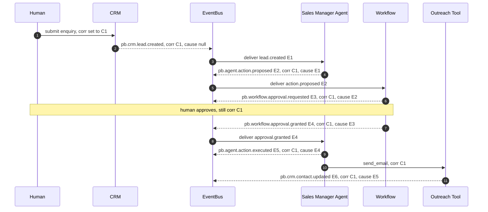
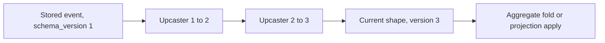

# 005 — Event Model

This document specifies the **event backbone** of Genesis: how events are named,
shaped, stored, distributed, correlated, replayed, snapshotted, retained,
audited, and evolved. It is the single authority for event mechanics; every
event producer and consumer in the platform conforms to it.

It derives its binding decisions from `000_Glossary.md` (the spine) — the
event-sourced/event-driven backbone (§3.3), the `EventStore`/`EventBus` ports and
default adapters (§3.2), and the canonical naming pattern
`pb.<context>.<aggregate>.<event>` (§9). Where this document and the glossary
appear to disagree, the glossary wins. System structure is in
`002_System_Architecture.md`; API-facing event surfaces are in `013_APIs.md`.

---

## Principles

Genesis is **event-sourced** and **event-driven**, and keeps the two roles in
separate ports:

- **Event-sourced.** An **Aggregate** (a consistency boundary that owns state,
  `000_Glossary.md` §2) does not persist rows of current state as the source of
  truth. It persists the **sequence of events** it emitted; its current state is
  a left-fold over that history. This makes history complete by construction —
  nothing is overwritten, so the "why" behind every state is always present.
- **Event-driven.** Once an event is durably recorded, it is **distributed** to
  subscribers (agents, projections, ML feature pipelines, audit). Modules learn
  what happened _only_ from events — the sanctioned integration mechanism
  (`002_System_Architecture.md` — Communication).

### EventStore vs EventBus (two ports, two jobs)

| Concern                     | `EventStore`                              | `EventBus`                                       |
| --------------------------- | ----------------------------------------- | ------------------------------------------------ |
| Role                        | Append-only **system of record**          | Pub/sub **distribution fabric**                  |
| Guarantee                   | Durable, ordered per aggregate, immutable | At-least-once delivery, per-stream ordering      |
| Default adapter (v1)        | PostgreSQL append-only table              | Redis Streams                                    |
| Scale-up adapters           | EventStoreDB, Kafka + compaction          | NATS JetStream, Kafka                            |
| Source of truth?            | **Yes**                                   | No — a cache of what the store already committed |
| Rebuildable from the other? | No — it _is_ the truth                    | Yes — replayed from the store                    |

The **commit point is the `EventStore` append**, inside the same database
transaction that mutates the aggregate's write model. Only after that commit is
the event published to the `EventBus`. This ordering is what makes the audit
trail trustworthy: nothing is ever distributed that was not first durably
recorded. To avoid the dual-write hazard (committed to the store but lost before
publish), v1 uses the **transactional outbox** pattern — the append and an
outbox row commit atomically in PostgreSQL, and a relay pumps the outbox into the
`EventBus` with at-least-once delivery. Subscribers are therefore **idempotent**
by contract (see [Replay](#replay)).

**Why two ports rather than one log (e.g. Kafka as both).** Using a single log
as both store and bus is viable at scale (the Kafka + compaction scale-up path),
but for v1 it would mean introducing new infrastructure the foundation does not
run. PostgreSQL gives transactional append alongside the write model (no dual
write inside the commit) and Redis Streams — already in the stack — gives cheap
fan-out. The port split lets either side move independently. **Future scaling
risk:** the outbox relay is a throughput choke point; its mitigation is the move
to a log-backed bus (below), which the port boundary makes a config change.

---

## Event taxonomy

Events are organised as **context × aggregate × verb**. The context is the
bounded context (`000_Glossary.md` §4); the aggregate is the state owner within
it; the verb is a past-tense fact. The following are concrete, canonical example
events spanning the core contexts. This is a representative set, not the closed
universe — new events are added under the same rules.

| Event type                           | Context   | Aggregate        | Emitted when                                 |
| ------------------------------------ | --------- | ---------------- | -------------------------------------------- |
| `pb.crm.lead.created`                | crm       | Lead             | A new lead is captured                       |
| `pb.crm.lead.qualified`              | crm       | Lead             | A lead passes qualification                  |
| `pb.crm.lead.scored`                 | crm       | Lead             | `LeadScoreNet` assigns a score               |
| `pb.crm.contact.updated`             | crm       | Contact          | Contact details change                       |
| `pb.crm.deal.won`                    | crm       | Deal             | A deal closes won                            |
| `pb.crm.deal.lost`                   | crm       | Deal             | A deal closes lost                           |
| `pb.agent.task.assigned`             | agent     | Task             | Work is assigned to an agent                 |
| `pb.agent.task.started`              | agent     | Task             | An agent begins a task                       |
| `pb.agent.task.completed`            | agent     | Task             | A task finishes successfully                 |
| `pb.agent.task.failed`               | agent     | Task             | A task errors terminally                     |
| `pb.agent.action.proposed`           | agent     | Action           | An agent proposes an action needing approval |
| `pb.agent.action.approved`           | agent     | Action           | A human or higher agent approves it          |
| `pb.agent.action.executed`           | agent     | Action           | The approved action runs                     |
| `pb.agent.reflection.recorded`       | agent     | Reflection       | An agent completes a self-review             |
| `pb.memory.item.created`             | memory    | MemoryItem       | A memory is written                          |
| `pb.memory.item.recalled`            | memory    | MemoryItem       | A memory is recalled into a Working Set      |
| `pb.memory.item.consolidated`        | memory    | MemoryItem       | Memories merge into long-term memory         |
| `pb.memory.item.decayed`             | memory    | MemoryItem       | Importance decays below threshold            |
| `pb.memory.item.archived`            | memory    | MemoryItem       | A memory moves to cold storage               |
| `pb.workflow.instance.started`       | workflow  | WorkflowInstance | A process instance starts                    |
| `pb.workflow.step.completed`         | workflow  | WorkflowInstance | A step finishes                              |
| `pb.workflow.approval.requested`     | workflow  | Approval         | A HITL approval is requested                 |
| `pb.workflow.approval.granted`       | workflow  | Approval         | Approval is granted                          |
| `pb.workflow.approval.denied`        | workflow  | Approval         | Approval is denied                           |
| `pb.workflow.instance.completed`     | workflow  | WorkflowInstance | A process instance completes                 |
| `pb.knowledge.entity.created`        | knowledge | Entity           | A Company Brain entity is created            |
| `pb.knowledge.relationship.asserted` | knowledge | Relationship     | A graph edge is asserted                     |
| `pb.knowledge.document.ingested`     | knowledge | Document         | A document enters the doc store              |
| `pb.knowledge.fact.superseded`       | knowledge | Fact             | A newer fact supersedes an old one           |
| `pb.billing.invoice.issued`          | billing   | Invoice          | An invoice is issued                         |
| `pb.billing.invoice.paid`            | billing   | Invoice          | Payment is received                          |
| `pb.billing.payment.failed`          | billing   | Payment          | A charge fails                               |
| `pb.billing.subscription.renewed`    | billing   | Subscription     | A subscription renews                        |
| `pb.support.ticket.opened`           | support   | Ticket           | A support ticket opens                       |
| `pb.support.ticket.assigned`         | support   | Ticket           | A ticket is assigned                         |
| `pb.support.ticket.escalated`        | support   | Ticket           | A ticket breaches or escalates               |
| `pb.support.ticket.resolved`         | support   | Ticket           | A ticket is resolved                         |
| `pb.identity.user.registered`        | identity  | User             | A user account is created                    |
| `pb.identity.authority.changed`      | identity  | Principal        | An agent's authority level changes           |

> Note: the `support` context is the `ticketing` module's domain language
> (`000_Glossary.md` §4 maps the Support employee to the `ticketing` slug); the
> `knowledge` context is the `ai`/Company Brain surface. Event contexts use the
> domain name; API namespaces use the registry slug.

---

## Naming conventions

**Pattern (binding):** `pb.<context>.<aggregate>.<verb>` where `<verb>` is
**past tense** — the event is a fact that already happened (`000_Glossary.md`
§9).

| Rule      | Requirement                                                                                | Example                                                                                                                                                                       |
| --------- | ------------------------------------------------------------------------------------------ | ----------------------------------------------------------------------------------------------------------------------------------------------------------------------------- |
| Prefix    | Always `pb.`                                                                               | `pb.crm.lead.created`                                                                                                                                                         |
| Context   | One of the tokens in the closed registry (`000_Glossary.md` §9.1), lower-case, hyphen-free | `crm`, `agent`, `memory`, `workflow`, `knowledge`, `billing`, `support`, `identity`, `marketing`, `outbound`, `proposal`, `kb`, `engineering`, `ml`, `observability`, `audit` |
| Aggregate | The state owner, singular, `snake_case` if multi-word                                      | `lead`, `task`, `memory_item`, `workflow_instance`                                                                                                                            |
| Verb      | **Past tense**, `snake_case` if multi-word                                                 | `created`, `approval_requested`, `consolidated`                                                                                                                               |
| Casing    | Whole type is lower `snake_case` within dot segments; never camelCase                      | `pb.workflow.approval.granted`                                                                                                                                                |
| Forbidden | Present/imperative verbs (`create`, `send`); command-shaped names                          | not `pb.crm.lead.create`                                                                                                                                                      |

**Versioning suffix strategy.** The event _type string_ stays stable across
backward-compatible changes; the machine-readable version lives in the envelope
field `schema_version` (an integer). A **breaking** change that cannot be handled
by upcasting (see [Lifecycle](#lifecycle)) introduces a new type with an explicit
suffix: `pb.crm.lead.created.v2`. Rationale: keeping the version in the envelope
keeps 99% of evolution invisible to routing, while the explicit `.vN` suffix
gives a hard, greppable boundary for the rare breaking split. Consumers subscribe
to the unsuffixed type by default and opt into `.vN` deliberately.

- **Additive/backward-compatible** (new optional field, widened enum): bump
  `schema_version`, keep the type string. Old consumers ignore new fields.
- **Breaking** (removed/renamed/retyped field, changed semantics): new
  `.vN` type; publisher may dual-publish during migration.

---

## Event envelope and metadata

Every event — regardless of context — is wrapped in one **envelope**. The
envelope is the contract the backbone and cross-cutting concerns depend on; the
`payload` is context-specific. Every envelope carries `tenant_id` (tenant
isolation is absolute, `000_Glossary.md` §12).

| Field             | Type         | Required | Meaning                                                                                      |
| ----------------- | ------------ | -------- | -------------------------------------------------------------------------------------------- |
| `event_id`        | UUIDv7       | yes      | Globally unique id of this event. Time-ordered (UUIDv7) for natural sort and index locality. |
| `type`            | string       | yes      | The `pb.<context>.<aggregate>.<verb>` type (see naming).                                     |
| `schema_version`  | int          | yes      | Version of the payload schema for `type`.                                                    |
| `occurred_at`     | RFC 3339 UTC | yes      | When the fact happened (domain time).                                                        |
| `recorded_at`     | RFC 3339 UTC | yes      | When the `EventStore` committed it (system time).                                            |
| `tenant_id`       | UUID         | yes      | Owning tenant. Cross-tenant access is impossible by construction.                            |
| `aggregate_type`  | string       | yes      | e.g. `lead`.                                                                                 |
| `aggregate_id`    | UUID         | yes      | The aggregate instance.                                                                      |
| `sequence`        | int64        | yes      | Monotonic per-aggregate version (1,2,3,…). Enables optimistic concurrency and ordering.      |
| `global_position` | int64        | yes      | Store-assigned total order across the tenant's log (gap-tolerant).                           |
| `actor`           | object       | yes      | Who/what caused it: `{ kind: user\|agent\|system, id, role, authority_level }`.              |
| `correlation_id`  | UUID         | yes      | Groups all events of one business transaction/saga.                                          |
| `causation_id`    | UUID         | no       | The `event_id` (or command id) that directly caused this event. Null for a root event.       |
| `trace`           | object       | no       | W3C trace context: `{ traceparent, tracestate }` for distributed tracing.                    |
| `request_id`      | string       | no       | The `X-Request-ID` that entered at L8 (foundation propagates it).                            |
| `payload`         | object       | yes      | Context-specific data for this `type` + `schema_version`.                                    |
| `metadata`        | object       | no       | Non-authoritative extras (source adapter, ip, user agent), never used for routing.           |

`request_id` deliberately reuses the foundation's `X-Request-ID`
(`middleware/request_context.py`) so a log line, a metric, and an event can be
joined on the same identifier end to end.

### JSON example

```json
{
  "event_id": "018f8c2e-7b6a-7c1d-9f2a-4a1c9d3e5b70",
  "type": "pb.agent.action.proposed",
  "schema_version": 1,
  "occurred_at": "2026-07-13T09:41:12.104Z",
  "recorded_at": "2026-07-13T09:41:12.139Z",
  "tenant_id": "3f1a7d20-2b44-4d2e-9d0c-1b7e6a2f4c88",
  "aggregate_type": "action",
  "aggregate_id": "a2c5e9d1-0f3b-4c6a-8e21-77b0c9f4a512",
  "sequence": 1,
  "global_position": 148223,
  "actor": {
    "kind": "agent",
    "id": "emp-sales-manager-01",
    "role": "sales_manager",
    "authority_level": "A2"
  },
  "correlation_id": "6b1f0c7a-9d2e-4b83-a1c4-2e9f7d6b5a30",
  "causation_id": "d41d8cd9-8f00-4204-a980-0998ecf8427e",
  "trace": {
    "traceparent": "00-4bf92f3577b34da6a3ce929d0e0e4736-00f067aa0ba902b7-01"
  },
  "request_id": "req-8f2c1a90",
  "payload": {
    "action": "send_email",
    "target_contact_id": "c77a...",
    "draft_subject": "Following up on your enquiry",
    "requires_authority": "A2",
    "approval_deadline": "2026-07-13T17:00:00Z"
  },
  "metadata": { "source_adapter": "crm.services.outreach" }
}
```

---

## Correlation IDs and causation IDs

These two ids are what turn a flat event log into a legible causal graph — the
difference between "here are 4,000 events" and "here is exactly why the platform
sent that email."

- **`correlation_id`** — the **business transaction / saga** identifier. Every
  event produced anywhere in the handling of one logical flow shares it. It is
  minted at the **root** (usually where an external request or a schedule tick
  first produces an event) and copied unchanged onto every descendant. Answer to
  _"what whole story does this belong to?"_
- **`causation_id`** — the **direct parent**: the `event_id` (or command id) that
  immediately caused this event. It forms a tree within a correlation group.
  Answer to _"what one thing directly triggered this?"_

**How they thread a saga.** A subscriber that reacts to event _E_ and emits _F_
sets `F.correlation_id = E.correlation_id` (same story) and
`F.causation_id = E.event_id` (E caused F). Root events set `causation_id = null`
and `correlation_id = event_id` (or the originating request/command id). Every
adapter and handler propagates the pair automatically via the ambient context, so
producers rarely set them by hand.



Every event above shares `correlation_id = C1` (one saga), while the
`causation_id` chain `E1 → E2 → E3 → E4 → E5 → E6` reconstructs the exact
decision path. This is what powers the audit trail (below) and agent reflection
(`003`, `006`): an agent reviews its own causal chain to learn.

---

## Replay

Because the `EventStore` is the source of truth, any derived state can be thrown
away and **rebuilt by replaying events**. Two things are rebuilt this way:

1. **Aggregates.** Load the aggregate's stream by `aggregate_id`, fold events in
   `sequence` order, apply each to reach current state. A write then appends at
   `sequence = last + 1` with optimistic concurrency: if another writer has
   advanced the sequence, the append is rejected and retried.
2. **Projections (read models).** A projection is a materialised view built by
   consuming a filtered event stream from `global_position 0` (full rebuild) or
   from a stored checkpoint (catch-up). Rebuilds are how a new read model is
   introduced or a corrupted one is repaired — drop the table, replay.

**Ordering guarantee.** Order is guaranteed **per aggregate** (via `sequence`),
not globally. `global_position` gives a total order per tenant for projection
catch-up, but subscribers must not assume cross-aggregate causal order beyond
what `causation_id` encodes. This matches the default `EventBus` (Redis Streams
preserves order within a stream, and streams are keyed per aggregate/partition).

**Idempotency (mandatory for every subscriber).** Delivery is **at-least-once**,
so the same event may arrive more than once (retries, relay restarts, replays). A
subscriber must produce the same result whether it sees an event once or five
times. The standard mechanism: each projection/handler records the last
`global_position` (or the set of processed `event_id`s) it has applied in a
`consumer_checkpoint` row, and skips anything already applied. Handlers that
cause external side effects (sending mail, charging a card) deduplicate on an
**idempotency key** derived from `causation_id` + action (`013_APIs.md` —
idempotency keys).

**Why replayable projections over authoritative read tables.** Keeping read
models disposable means schema changes to a view are a rebuild, not a fragile
migration, and a bug in a projection is fixed by correcting code and replaying —
the historical truth in the store is never at risk. The cost is rebuild time on
large logs, which snapshots and retention (below) bound.

---

## Snapshots

Replaying a long aggregate stream (say, a Deal with thousands of events) on every
load is wasteful. A **snapshot** is a periodically persisted materialisation of
an aggregate's folded state at a known `sequence`, so loading becomes "restore
snapshot, then fold only the tail."

| Aspect           | Policy                                                                                                                                                                                                                                               |
| ---------------- | ---------------------------------------------------------------------------------------------------------------------------------------------------------------------------------------------------------------------------------------------------- |
| **When**         | Take a snapshot every _N_ events per aggregate (default `N = 200`) or when tail-fold latency exceeds a budget. Snapshots are an optimisation, never a source of truth.                                                                               |
| **Storage**      | A `snapshots` table keyed by `(tenant_id, aggregate_type, aggregate_id, sequence)` in PostgreSQL (default); large snapshots may spill to `BlobStore`.                                                                                                |
| **Format**       | Versioned JSON (`snapshot_schema_version`) matching the aggregate's current fold. On restore, if the snapshot version is stale, discard it and replay from an older snapshot or from zero — never trust a snapshot the code can no longer interpret. |
| **Invalidation** | Changing an aggregate's fold logic bumps `snapshot_schema_version`, invalidating old snapshots; they are lazily regenerated on next load.                                                                                                            |
| **Rebuild**      | Snapshots are fully derivable; they can be dropped en masse and regenerated without data loss.                                                                                                                                                       |

**Why sequence-interval snapshots over time-interval or none.** "None" is correct
but O(stream length) on load — unacceptable for hot aggregates. Time-interval
snapshots waste work on idle aggregates and starve hot ones. Interval-per-event
ties snapshot cost to actual growth. **Future scaling risk:** snapshot storage
grows with aggregate count; retention prunes superseded snapshots (keep the
latest one or two per aggregate).

---

## Retention

The event log is the system of record and the audit trail, so events are
**never mutated or deleted in place** — but they do **tier** from hot to cold and
are governed by per-class and per-tenant lifecycle policy.

| Tier     | Store                                                | Latency | Contents                                                                                                              |
| -------- | ---------------------------------------------------- | ------- | --------------------------------------------------------------------------------------------------------------------- |
| **Hot**  | PostgreSQL `EventStore` (default adapter)            | ms      | Recent events (rolling window, default 90 days) and all events for open aggregates/sagas.                             |
| **Cold** | `BlobStore` (S3/MinIO), compressed partitioned files | seconds | Older events, sealed and immutable. Still replayable — a cold-replay job streams partitions back through projections. |

**Per-event-class policy.** Retention differs by the nature of the event:

| Class                     | Examples                                                | Hot window           | Cold retention                              |
| ------------------------- | ------------------------------------------------------- | -------------------- | ------------------------------------------- |
| Financial / legal         | `pb.billing.invoice.*`, `pb.identity.authority.changed` | 1 year               | 7–10 years (regulatory)                     |
| Business record           | `pb.crm.*`, `pb.support.ticket.*`, `pb.workflow.*`      | 90 days              | Tenant-configurable, default 3 years        |
| Operational / high-volume | `pb.memory.item.recalled`, `pb.agent.task.started`      | 30 days              | 6–12 months, may be down-sampled/aggregated |
| Ephemeral signal          | working-memory churn                                    | not stored as events | —                                           |

**Tenant data-lifecycle.** Because every event carries `tenant_id`, retention,
export, and erasure are tenant-scoped operations. On tenant offboarding or a
right-to-erasure request, the platform runs a tenant-scoped lifecycle job. Since
events are immutable, personal-data erasure uses **crypto-shredding**: sensitive
payload fields are stored encrypted with a per-tenant (or per-subject) key, and
erasure destroys the key, rendering the ciphertext unrecoverable while preserving
the event's structural presence for audit integrity.

**Why tiering + crypto-shredding over hard-delete.** Hard-deleting events would
break replay determinism and the audit guarantee. Tiering keeps the log intact
and cheap; crypto-shredding reconciles immutability with GDPR-style erasure.
**Future scaling risk:** key management for crypto-shredding is operationally
heavy at scale — it belongs behind the `SecretStore` port (Vault/SSM scale-up).

---

## Audit

The event log **is** the audit trail — there is no separate, parallel audit
system that could disagree with it. This falls straight out of the principles:
if it mattered, it is an event (`000_Glossary.md` §12.4), and events are
immutable facts recorded before anything acts on them.

| Audit question               | Answered by                                                                                                   |
| ---------------------------- | ------------------------------------------------------------------------------------------------------------- |
| **Who/what**                 | `actor` (kind, id, role, `authority_level`)                                                                   |
| **When**                     | `occurred_at` (domain time) and `recorded_at` (system time)                                                   |
| **What happened**            | `type` + `payload`                                                                                            |
| **Why / by whose authority** | `causation_id` chain + `actor.authority_level`; approval events (`pb.workflow.approval.granted`) capture HITL |
| **In what context**          | `correlation_id`, `tenant_id`, `request_id`, `trace`                                                          |

**Immutability guarantees.** The `EventStore` table is append-only: no `UPDATE`
or `DELETE` grants for the application role; corrections are made by appending
**compensating events** (e.g. `pb.billing.invoice.voided`), never by editing
history. Integrity is strengthened by chaining: each event optionally stores a
hash of `(prev_hash, canonical(event))`, forming a per-tenant hash chain so
tampering is detectable. A dedicated **audit projection** presents the log in a
review-friendly, queryable form for `012_Security.md` and compliance
(`AI_DEPLOY_AUTHORIZATION.md` §Legal), including the mandatory outreach history
for outreach-capable modules.

**Why the log-as-audit over a separate audit table.** A separate audit table can
drift from reality (developers forget to write to it) and doubles the write path.
Making the authoritative event stream the audit source means correctness of the
system and completeness of the audit are the same property — you cannot do work
without leaving the trail.

---

## Lifecycle

Event schemas evolve over years; the model must let producers and consumers
change at different speeds without a flag-day migration.

**Schema evolution rules.**

1. **Additive is free.** New optional payload fields and widened enums bump
   `schema_version` but keep the `type`. Old consumers ignore unknown fields
   (tolerant reader).
2. **Breaking needs a new type.** Removing/renaming/retyping a field or changing
   an event's meaning creates `pb.<...>.<verb>.v2`. The producer may
   **dual-publish** v1 and v2 during migration; consumers migrate at their pace.
3. **Never rewrite history.** Stored events keep the schema they were written
   with. Interpretation catches up via upcasting (below), not by mutating the
   store.

**Upcasting.** When a consumer or an aggregate reads an old event under new code,
an **upcaster** transforms the old envelope/payload to the current shape _in
memory at read time_. Upcasters form a chain (v1→v2→v3); the store keeps
originals, so a fold or projection always sees today's shape without touching
history.



**Deprecation.** A `.vN` type or a `schema_version` is marked deprecated in the
event-contract registry (the `events/` package per module,
`002_System_Architecture.md`) with a sunset date. The event-contract test fails a
build that publishes a schema change without a version bump, and flags consumers
still bound to a deprecated type. Producers stop emitting a deprecated type only
after telemetry shows no consumer bound to it.

**Why explicit upcasting over "just migrate the data."** Migrating stored events
in place violates immutability and the audit guarantee, and is irreversible if
the migration is wrong. Read-time upcasting keeps the original truth forever and
makes evolution a pure, testable, reversible function. The cost — an upcaster
chain to maintain — is bounded by periodic **snapshot rebaselining** (snapshots
absorb the chain so hot aggregates rarely run long upcast chains).

---

## Broker choice: Redis Streams vs NATS vs Kafka

The `EventBus` port has a locked default (`000_Glossary.md` §3.2: Redis Streams)
and named scale-up adapters. The comparison and the **trigger to move** are
recorded here.

| Broker                         | Ordering      | Durability                                                         | Throughput ceiling           | Ops cost                                     | Fit                                                         |
| ------------------------------ | ------------- | ------------------------------------------------------------------ | ---------------------------- | -------------------------------------------- | ----------------------------------------------------------- |
| **Redis Streams (default v1)** | Per-stream    | In-memory + AOF/RDB; adequate with the outbox as the durable truth | ~10^4–10^5 msg/s single node | **None new** — Redis is already in the stack | v1: modular monolith, moderate volume                       |
| **NATS JetStream**             | Per-subject   | Disk-backed streams, replicated                                    | ~10^5–10^6 msg/s             | Moderate — one more clustered service        | Many services, high fan-out, low-latency needs              |
| **Kafka (+ compaction)**       | Per-partition | Replicated log, long retention; can double as `EventStore`         | ~10^6+ msg/s                 | High — cluster, ZK/KRaft, schema registry    | Very high volume, log-as-store consolidation, big analytics |

**Selected default: Redis Streams**, because the foundation already runs Redis 7,
so v1 adds no infrastructure and stays on a single Compose stack — consistent
with "reach for the default adapter until scale forces the alternative"
(`000_Glossary.md` §12.7). The transactional outbox (above) supplies the
durability guarantee, so Redis's weaker persistence is not on the critical path
of the source of truth.

**Trigger to move off Redis Streams (any one):**

1. **Sustained throughput** approaches the single-node Redis ceiling (persistent
   consumer lag that horizontal projection workers cannot clear).
2. **Retention/replay window** must exceed what fits comfortably in memory —
   long-lived, replayable streams point to a log-backed broker.
3. **Cross-service fan-out** after module extraction (`002` — split-out trigger)
   makes per-subject routing and multi-tenant stream isolation a first-class
   need → NATS JetStream.
4. **Analytics/consolidation** pressure to make one log both store and bus, with
   ecosystem connectors → Kafka + compaction (also a candidate `EventStore`
   scale-up).

Because subscribers depend only on the `EventBus` port and events are already
idempotent and replayable, the migration is a config/adapter change plus a
back-fill replay — no consumer code rewrite.

---

## Cross-references

- `000_Glossary.md` — event naming (§9), EventStore/EventBus ports (§3.2),
  event-sourced/event-driven backbone (§3.3), tenant isolation (§12). Binding.
- `002_System_Architecture.md` — where events sit in the layers, module `events/`
  and `projections/` sub-packages, communication rules, split-out trigger.
- `003_Cognitive_Architecture.md`, `008_Memory_Engine.md` — how memory events
  drive the cognitive pipeline.
- `006_Agent_Runtime.md` — agents as event producers/consumers; reflection over
  causal chains.
- `010_Workflow_Engine.md` — sagas, approvals, and HITL as event flows.
- `012_Security.md` — the audit projection, immutability, compliance.
- `013_APIs.md` — idempotency keys, streaming event surfaces (SSE/WebSocket).
