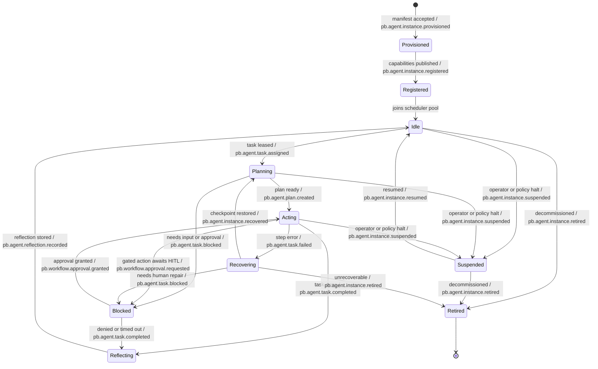
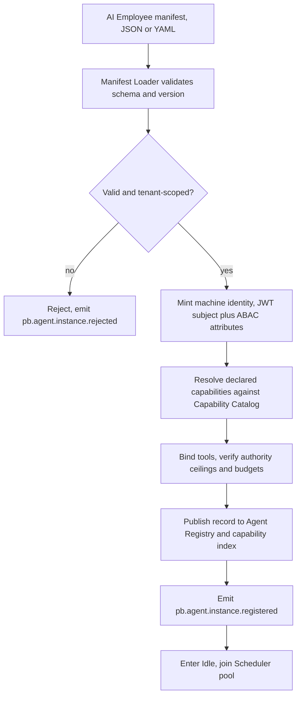
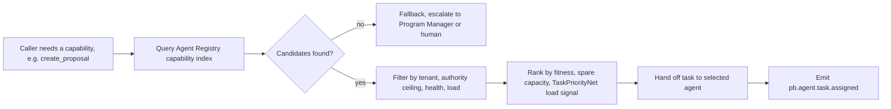
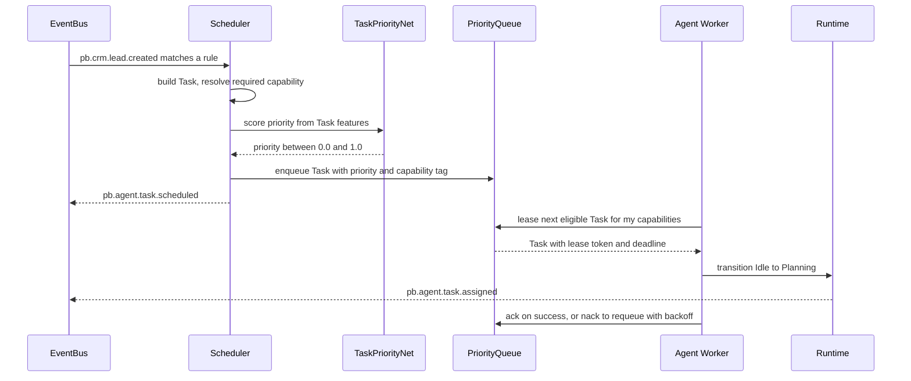
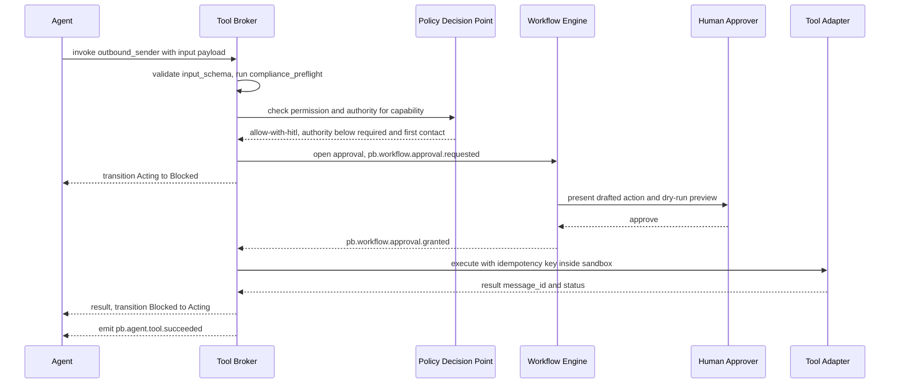
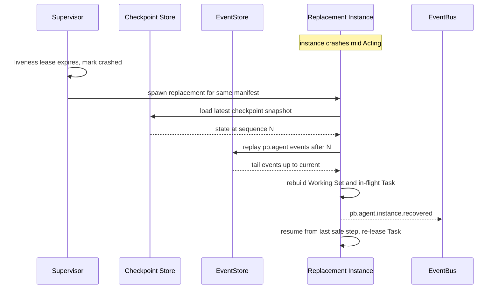

# 006 — Agent Runtime

The Agent Runtime is layer **L4** of the Genesis stack (`000_Glossary.md` §3.1):
the substrate that turns an **AI Employee** definition into a live, governed
**Agent**. It owns lifecycle, registration, discovery, scheduling, permissions,
capabilities, tool execution, memory brokering, reflection scheduling,
recovery, and failure handling. It does **not** own how an agent reasons
(`003_Cognitive_Architecture.md`), how memory items are ranked and consolidated
(`008_Memory_Engine.md`), how long-running processes and approvals are modelled
(`010_Workflow_Engine.md`), or the detail of RBAC/ABAC evaluation
(`012_Security.md`). It integrates with those through ports and events.

The runtime lives in the `ai` bounded context and is served under the reserved
`/api/v1/ai` namespace (`000_Glossary.md` §4;
`apps/api/src/pb_api/platform/modules.py`). Every route, event, and record it
produces is scoped by `tenant_id`; cross-tenant access is impossible by
construction (`000_Glossary.md` §12.6).

---

## Overview

The runtime provides every AI Employee with the same eight guarantees, so that
`007_AI_Employees.md` can describe _roles_ rather than _plumbing_:

1. **A lifecycle.** A formal state machine (`Provisioned → Registered → Idle →
Planning → Acting → Reflecting`, plus `Blocked`, `Suspended`, `Recovering`,
   terminal `Retired`) with observable transitions emitted as `pb.agent.*`
   events.
2. **An identity.** A machine principal minted at registration: a JWT subject
   carrying an RBAC role plus ABAC attributes, orthogonal to its **Authority
   Level** (`000_Glossary.md` §8).
3. **A registry entry.** A capability-indexed record so other agents and
   services can discover it.
4. **Scheduled work.** Event-triggered, queued, and cron work assigned through
   the `Scheduler` port, prioritised by `TaskPriorityNet`, with concurrency and
   backpressure controls.
5. **Gated capabilities and tools.** Every action is checked against
   **permission AND authority** before a sandboxed tool runs, with dry-run,
   idempotency, and HITL escalation.
6. **Brokered memory.** Scoped reads/writes across the six memory types and the
   Company Brain through the Memory APIs.
7. **Reflection hooks.** Automatic post-task self-review that feeds learning.
8. **Durability.** Checkpointed, event-sourced state so a crashed agent resumes
   without losing work, with retries, dead-lettering, circuit breakers, and
   escalation for everything that goes wrong.

The runtime is deliberately thin: it is an **orchestrator and policy enforcer**,
not a brain. Reasoning is delegated to `003`, knowledge to `004`, learning
signals to `011`. This keeps L4 replaceable and keeps the cognitive core
testable without a running scheduler.

---

## Agent lifecycle

The lifecycle expands the canonical states in `000_Glossary.md` §7. Every
transition has a trigger and emits an event on the backbone
(`005_Event_Model.md`); events use the `pb.agent.<aggregate>.<event>` pattern
(`000_Glossary.md` §9). Approval transitions are owned by the Workflow Engine
and therefore carry `pb.workflow.approval.*` events (`010_Workflow_Engine.md`).



`Planning`, `Acting`, and `Reflecting` are where the cognitive pipeline runs;
the runtime only sequences them and enforces guards. See
`003_Cognitive_Architecture.md` for what happens _inside_ those states.

---

## State machine

The runtime implements the lifecycle as an explicit machine so transitions are
auditable and testable. Each transition has a **guard** (a precondition the
runtime checks) and, where relevant, a **timeout** that forces an alternative
transition. Timeouts are configurable per manifest; the values below are v1
defaults.

| From        | To         | Trigger                   | Guard                                                    | Timeout → action                                 |
| ----------- | ---------- | ------------------------- | -------------------------------------------------------- | ------------------------------------------------ |
| Provisioned | Registered | manifest validated        | schema valid, identity minted, no slug/version collision | 30s → `Retired` with `pb.agent.instance.retired` |
| Registered  | Idle       | joins scheduler pool      | health check green, capabilities indexed                 | —                                                |
| Idle        | Planning   | task leased               | capability match, lease acquired, budget available       | —                                                |
| Planning    | Acting     | plan produced             | plan valid, all steps within authority ceiling           | 120s → `Recovering` (planning stall)             |
| Planning    | Blocked    | missing input or A1 draft | required datum absent or authority insufficient          | —                                                |
| Acting      | Blocked    | gated action              | action authority > agent authority, or HITL flag set     | approval TTL (default 24h) → `Reflecting`        |
| Acting      | Reflecting | task steps complete       | all steps acked, no open tool leases                     | step budget → `Recovering`                       |
| Acting      | Recovering | unrecoverable step error  | retry budget exhausted or circuit open                   | —                                                |
| Blocked     | Acting     | approval granted          | `pb.workflow.approval.granted` for this task             | —                                                |
| Reflecting  | Idle       | reflection persisted      | reflection stored, learning signals emitted              | 60s → `Idle` (reflection best-effort, non-fatal) |
| any active  | Suspended  | operator or policy halt   | halt command authorised, or budget/kill-switch tripped   | —                                                |
| Suspended   | Idle       | resume                    | resume authorised, health green                          | —                                                |
| Recovering  | Planning   | checkpoint restored       | snapshot loaded, tail events replayed, task re-leasable  | recovery deadline → `Retired`                    |
| any         | Retired    | decommission              | drain complete, leases released                          | —                                                |

Guards that fail do not silently drop the transition: they emit
`pb.agent.task.blocked` or route to `Recovering`/`Suspended` and surface on the
agent's health record. `Suspended` is reachable from every active state so an
operator kill-switch or a tripped tenant budget can halt an agent immediately
without waiting for a task boundary.

**Design choice — explicit machine vs implicit status field.**

- **Explicit, event-emitting state machine (selected).** Transitions are typed,
  guarded, and each emits an event, so the lifecycle is replayable and
  auditable (`000_Glossary.md` §12.4). Slightly more code than a status column.
- **Implicit status column with ad-hoc updates (rejected).** Cheapest, but
  transitions become uncheckable and un-auditable; illegal jumps (e.g. `Idle →
Acting` skipping planning) cannot be prevented centrally.
- **External durable-execution engine, e.g. Temporal (deferred).** Gives
  bulletproof state and timers, but adds infrastructure the foundation does not
  yet run; it is the `Scheduler` scale-up adapter, adopted when volume demands.
- **Scaling risk.** As authority policies grow, the transition table can bloat
  into a rules tangle. Mitigation: keep guards as small composable predicates
  and move policy evaluation into the Policy Decision Point (see _Permissions_).

---

## Agent registration

An AI Employee is defined by a declarative, versioned **manifest** and made live
by registering it. Registration is a validation-and-publish pipeline, never
imperative code, so a role can change without a redeploy.



**Manifest schema (v1 fields).**

| Field                      | Meaning                                                                    |
| -------------------------- | -------------------------------------------------------------------------- |
| `schema_version`           | Manifest contract version; loader rejects unknown majors.                  |
| `employee_role`            | One of the twelve roles (`007_AI_Employees.md`); the stable slug.          |
| `model_tier`               | Reasoning tier resolved against the `ModelProvider` port (§3.2).           |
| `default_authority`        | Baseline Authority Level A0–A5 (`000_Glossary.md` §8).                     |
| `authority_ceiling`        | Hard cap the agent may never exceed, even when delegated more.             |
| `capabilities`             | Declared skills, each with `authority_required` and `permission`.          |
| `tools`                    | Named tools the capabilities are allowed to invoke (see _Tool execution_). |
| `memory_scopes`            | Per-memory-type read/write grants plus permitted Brain areas.              |
| `rbac` / `abac_attributes` | Identity role and attributes for the Policy Decision Point.                |
| `nets`                     | Small Nets the role consumes and feeds (`011_ML_Platform.md`).             |
| `scheduling`               | Event subscriptions, cron, `max_concurrent_tasks`, priority net.           |
| `budgets`                  | Token, spend, rate, and value limits that bound autonomy.                  |
| `outreach`                 | Present only if the role contacts people; carries compliance controls.     |
| `reflection`               | When reflection hooks fire.                                                |

Example manifest (Sales Manager — an outreach role, so it carries the compliance
block and a first-contact authority cap; see `007_AI_Employees.md`):

```json
{
  "schema_version": "1.0",
  "employee_role": "sales_manager",
  "display_name": "Sales Manager",
  "description": "Owns pipeline progression and qualified-lead conversion.",
  "tenant_scope": "per-tenant",
  "model_tier": "reasoning-standard",
  "default_authority": "A3",
  "authority_ceiling": "A3",
  "rbac": {
    "identity_role": "staff",
    "required_scopes": ["crm:read", "crm:write", "outbound:draft"]
  },
  "abac_attributes": {
    "department": "sales",
    "region": "eu",
    "data_classification_max": "confidential"
  },
  "capabilities": [
    { "name": "qualify_lead", "authority_required": "A3", "permission": "crm:write" },
    { "name": "draft_outreach_email", "authority_required": "A1", "permission": "outbound:draft" },
    {
      "name": "send_outreach_email",
      "authority_required": "A2",
      "permission": "outbound:send",
      "hitl": "before-first-contact"
    }
  ],
  "tools": ["crm_query", "lead_scorer", "email_composer", "outbound_sender"],
  "memory_scopes": {
    "working": "read-write",
    "conversation": "read-write",
    "episodic": "read-write",
    "semantic": "read",
    "procedural": "read",
    "long_term": "read",
    "brain_areas": ["crm.accounts", "crm.deals", "playbooks.sales"]
  },
  "nets": { "consumes": ["LeadScoreNet", "SalesNet"], "feeds": ["SalesNet", "LeadScoreNet"] },
  "scheduling": {
    "event_subscriptions": ["pb.crm.lead.created", "pb.crm.deal.stage_changed"],
    "cron": ["0 7 * * 1-5"],
    "max_concurrent_tasks": 5,
    "priority_net": "TaskPriorityNet"
  },
  "budgets": {
    "model_tokens_per_day": 2000000,
    "outreach_sends_per_day": 200,
    "max_deal_value_autonomous": 5000
  },
  "outreach": {
    "contacts_people": true,
    "first_contact_authority_cap": "A2",
    "compliance_controls": [
      "maintain-suppression-and-opt-out-lists",
      "prevent-duplicate-outreach",
      "log-outreach-history",
      "configurable-compliance-rules",
      "human-review-before-first-contact-by-default",
      "no-deceptive-or-misleading-messaging"
    ]
  },
  "reflection": { "on_task_complete": true, "on_failure": true, "cadence_cron": "0 18 * * 5" }
}
```

Registration is exposed as `POST /api/v1/ai/agents` (guarded by
`require_roles(UserRole.ADMIN, UserRole.STAFF)`, following the existing
`apps/api/src/pb_api/api/deps.py` pattern). The loader validates the `outreach`
block against `OUTREACH_COMPLIANCE_CONTROLS`
(`apps/api/src/pb_api/platform/modules.py`): a role that declares
`contacts_people: true` but omits any control is rejected, mirroring the
build-time guarantee in ADR-0009.

**Design choice — declarative manifest vs code-defined agents vs external
discovery.**

- **Declarative, versioned manifest (selected).** Roles are data: validated,
  diffable, and changeable without redeploying the runtime; the schema is a
  single enforcement point for compliance and authority ceilings.
- **Hardcoded agent classes (rejected).** Type-safe but rigid; every KPI or
  authority tweak is a code change and deploy, and compliance lives in scattered
  constructors.
- **External service discovery, e.g. Consul (rejected for v1).** Solves
  discovery but adds infrastructure the foundation does not run, and duplicates
  state the EventStore already owns.
- **Scaling risk.** Manifest sprawl and drift across many tenants. Mitigation:
  strict `schema_version` gating, a validation suite, and treating the registry
  itself as an event-sourced projection so history is auditable.

---

## Discovery

Agents and services find each other through the **Agent Registry**: a
per-tenant, capability-indexed projection kept in PostgreSQL (the default
`DocumentStore`/relational store — no new infrastructure) and cached in Redis
for read-hot lookups. Discovery is **capability-based**, never name-based, so
callers ask for _what they need done_ rather than _who does it_.



Lookup API: `GET /api/v1/ai/agents/discover?capability=create_proposal&min_authority=A2`.
The registry answers with candidates and their live health and load. Services
(the Brain, product modules) register their published APIs the same way, so an
agent can discover a _service capability_ (e.g. `proposal-engine.render`) with
the same query shape.

**Design choice — central registry vs gossip vs service mesh.**

- **Central capability registry, PostgreSQL + Redis cache (selected).**
  Strongly consistent, trivially queryable, tenant-scoped, and reuses
  foundation infrastructure; the capability inverted index makes lookup O(1) on
  a skill.
- **Gossip/broadcast discovery (rejected).** Scales writes but only eventually
  consistent; capability freshness lag is dangerous when authority and health
  gate task assignment.
- **Service mesh / sidecar discovery (rejected for v1).** Strong at network
  routing but oriented to endpoints, not business capabilities, and adds infra.
- **Scaling risk.** The registry read path becomes hot at high fan-out.
  Mitigation: the Redis projection already absorbs reads; shard the index by
  `tenant_id` and, if needed, promote to a dedicated read replica.

---

## Scheduling

Work reaches an agent three ways, all normalised into a **Task** aggregate and
placed on a priority queue through the `Scheduler` port (default:
PostgreSQL-backed queue; scale-up: Temporal — `000_Glossary.md` §3.2):

1. **Event-triggered.** A subscription rule (e.g. `pb.crm.lead.created`) creates
   a Task. This is the primary path — the platform is event-driven.
2. **Queued / request.** A direct enqueue via the Agent API's task-intake route
   (`POST /api/v1/ai/agents/{id}/tasks`, defined in `013_APIs.md`) — from a
   human, a workflow step in `010`, or another agent's delegation.
3. **Cron.** Time-based Tasks from a manifest's `scheduling.cron`, materialised
   by the `Scheduler` port.

Every Task is scored by **`TaskPriorityNet`** (`011_ML_Platform.md`) from
features such as SLA deadline, business value, tenant tier, and staleness. The
score orders the queue; capability tags route it to eligible agents.



**Concurrency and backpressure.** Each agent declares `max_concurrent_tasks`;
the runtime never leases beyond it. Per-tenant and per-capability concurrency
caps prevent one tenant or one hot skill from starving others. When the queue
depth for a capability exceeds a high-water mark, the Scheduler applies
backpressure: it stops accepting low-priority enqueues, sheds by dropping the
lowest-priority expired Tasks to the dead-letter queue, and raises
`pb.agent.queue.saturated` for autoscaling and alerting.

**Design choice — central scheduler vs actor model vs pull-based workers.**

- **Hybrid: central priority queue with pull-based leasing (selected).** The
  Scheduler owns one priority-ordered queue per tenant (global fairness,
  `TaskPriorityNet` ordering, central budget and HITL gating, one place to
  observe), while agents **lease** the highest-priority Task matching their
  capabilities (natural backpressure — a busy agent simply stops pulling). This
  combines the global priority of a central scheduler with the self-throttling
  of pull workers.
- **Pure central push scheduler (rejected).** The scheduler must track every
  agent's live capacity and becomes a bottleneck and a single point of failure
  on the hot path; push also fights backpressure.
- **Pure actor model, per-agent mailboxes (rejected).** Excellent concurrency
  and locality, but global priority, cross-agent fairness, tenant budgets, and
  centralised HITL gating are hard to enforce and observability scatters across
  mailboxes.
- **Scaling risk.** A single queue table develops lock contention at high
  throughput. Mitigation: partition the queue by `tenant_id` and capability;
  when contention persists, swap the `Scheduler` adapter to Temporal or a
  streaming broker (NATS JetStream) behind the same port — callers are
  unaffected.

---

## Permissions

Agent identity reuses the foundation's model and extends it. Every agent
authenticates with a JWT whose `role` claim (`admin` / `staff` / `client`,
`apps/api/src/pb_api/db/models/user.py`) is validated exactly as human requests
are, and the database record remains authoritative (`require_roles` in
`apps/api/src/pb_api/api/deps.py`). On top of RBAC, agents carry **ABAC
attributes** (department, region, data classification, budget envelope) declared
in the manifest, and — separately — an **Authority Level** (§8, below in
_Capabilities_).

Authorisation is evaluated by a **Policy Decision Point (PDP)** that combines
three axes for every action:

| Axis       | Source                         | Question answered                          |
| ---------- | ------------------------------ | ------------------------------------------ |
| RBAC role  | JWT `role` claim + DB record   | Is this identity class allowed the route?  |
| ABAC attrs | Manifest attributes + resource | Do attributes match this resource/context? |
| Authority  | Manifest authority + task cap  | May it act without a human here?           |

The runtime enforces RBAC and Authority inline; the full ABAC/zero-trust
evaluation model, attribute sourcing, and policy language are owned by
`012_Security.md`. The PDP returns `allow`, `deny`, or `allow-with-hitl`.

**Design choice — RBAC-only vs RBAC+ABAC+Authority vs external policy engine.**

- **RBAC (foundation) + ABAC attributes + Authority axis, in-process PDP
  (selected).** Reuses the proven `require_roles` guard, adds the attribute and
  autonomy dimensions Genesis needs, and keeps evaluation on the request path
  with no extra hop.
- **RBAC only (rejected).** Cannot express "this agent, in this region, up to
  this value, without a human" — exactly the governance Genesis requires.
- **External policy engine, e.g. OPA/Rego (deferred).** Powerful and
  declarative, and a natural scale-up, but adds a network hop and operational
  surface not justified at v1 volumes.
- **Scaling risk.** Per-action three-axis evaluation adds latency as policies
  grow. Mitigation: cache PDP decisions keyed by (principal, action, resource
  class) with short TTLs; externalise to OPA when policy volume warrants.

---

## Capabilities

A **Capability** is a declared skill (`000_Glossary.md` §2), e.g. `qualify_lead`
or `send_outreach_email`. Capabilities are declared in the manifest, each
binding a `permission` and an `authority_required`. Gating is the core
governance rule of `000_Glossary.md` §8:

> An action requires the caller to hold **both** the permission **and**
> sufficient authority; **the lower of the two governs.**

Concretely, an action is allowed only if `permission_ok(agent, capability)` AND
`agent_authority ≥ capability.authority_required` AND `agent_authority ≤
authority_ceiling`. If the agent has the permission but insufficient authority,
the capability is not denied outright — it degrades to **`allow-with-hitl`**,
routing to an approval (a `Blocked` transition) rather than failing. This is how
an A1 "Suggest" agent still contributes: it drafts, and a human or higher agent
approves.

**First-contact outreach is capped at A2 regardless of the employee's level**
(`000_Glossary.md` §8), enforced by the runtime through the `outreach` manifest
block and reasserted at tool preflight (see _Tool execution_).

Capability catalog entries are discoverable at `GET /api/v1/ai/capabilities` and
`GET /api/v1/ai/tools`, so the registry, workflows (`010`), and audit can reason
about what any agent is permitted to attempt.

---

## Tool execution

A **Tool** is the concrete executable behind a Capability (`000_Glossary.md`
§2): an API call, a query, or a model invocation, run in a sandbox. Tools are
declared with a strict contract so execution is safe, idempotent where possible,
and auditable.

**The tool contract.**

| Element                                      | Purpose                                                                            |
| -------------------------------------------- | ---------------------------------------------------------------------------------- |
| `input_schema`                               | JSON Schema; inputs are validated before the tool runs. Invalid input never fires. |
| `output_schema`                              | JSON Schema for the result, so downstream steps are typed.                         |
| `side_effect`                                | Classification: `read`, `write`, `external`, `irreversible`.                       |
| `reversible`                                 | Whether the effect can be compensated; irreversible effects always warrant HITL.   |
| `authority_required` / `permission_required` | The gate the PDP checks before execution.                                          |
| `idempotency`                                | Key strategy so retries do not double-apply effects.                               |
| `timeout_ms`                                 | Hard wall-clock limit; exceeded calls are cancelled and treated as failures.       |
| `retry`                                      | Attempts, backoff, and which errors are retryable.                                 |
| `dry_run_supported`                          | If true, the tool can simulate and return the intended effect without applying it. |
| `sandbox`                                    | Egress allowlist, filesystem policy, CPU/memory ceilings.                          |
| `binds_to`                                   | The port (§3.2) or product-module API the adapter wraps.                           |
| `compliance_preflight`                       | Checks that must pass before an outreach tool executes.                            |

**Side-effect classification** governs how aggressively the runtime will act
autonomously: `read` tools run freely within A0; `write` (internal, reversible)
run within the agent's authority; `external` tools (leave the tenant boundary)
and `irreversible` tools (cannot be compensated — sending an email, moving
money) demand higher authority and, on first contact or above budget, HITL.

Example tool definition (the outbound sender used by Sales Manager and
Marketing). It binds to the compliance-gated Outbound Sales Engine module, so
the six outreach controls run as preflight and the module itself is the
enforcement owner (`apps/api/src/pb_api/platform/modules.py`; ADR-0009):

```json
{
  "tool": "outbound_sender",
  "version": "1.2.0",
  "backs_capability": "send_outreach_email",
  "binds_to": "module:outbound-sales",
  "side_effect": "external",
  "reversible": false,
  "authority_required": "A2",
  "permission_required": "outbound:send",
  "hitl": "before-first-contact",
  "input_schema": {
    "type": "object",
    "required": ["to", "subject", "body", "idempotency_key"],
    "properties": {
      "to": { "type": "string", "format": "email" },
      "subject": { "type": "string", "maxLength": 200 },
      "body": { "type": "string" },
      "idempotency_key": { "type": "string" },
      "dry_run": { "type": "boolean", "default": false }
    }
  },
  "output_schema": {
    "type": "object",
    "properties": { "message_id": { "type": "string" }, "status": { "type": "string" } }
  },
  "idempotency": {
    "strategy": "client-key",
    "key_field": "idempotency_key",
    "window_seconds": 86400
  },
  "timeout_ms": 15000,
  "retry": { "max_attempts": 3, "backoff": "exponential-jitter", "retry_on": ["5xx", "timeout"] },
  "dry_run_supported": true,
  "sandbox": {
    "network_egress": ["module:outbound-sales"],
    "filesystem": "none",
    "cpu_ms": 2000,
    "mem_mb": 128
  },
  "compliance_preflight": [
    "suppression-check",
    "duplicate-check",
    "opt-out-check",
    "first-contact-hitl"
  ],
  "emits": ["pb.agent.tool.invoked", "pb.agent.tool.succeeded", "pb.agent.tool.failed"]
}
```

The following shows a **gated tool call that needs HITL** — the agent holds the
permission but not sufficient authority, so the runtime blocks and routes to an
approval before the sandboxed adapter runs.



If the approver denies or the approval TTL expires, the Tool Broker emits
`pb.agent.tool.failed`, the Task transitions `Blocked → Reflecting`, and the
denial is recorded as Episodic memory so the agent learns the boundary.

**Design choice — in-process tools vs sandboxed execution vs remote tool
service.**

- **Adapters behind a Tool Broker with per-tool sandbox policy (selected).**
  One choke point validates input, checks the PDP, runs compliance preflight,
  applies timeouts and idempotency, and emits events — uniformly, for every
  tool, with egress allowlists limiting blast radius.
- **Direct in-process calls (rejected).** Fast but no isolation; a
  misbehaving tool can exhaust the event loop or reach arbitrary networks, and
  gating must be re-implemented per call site.
- **Remote tool microservice (deferred).** Strong isolation, but a network hop
  and operational surface not justified until tool CPU/security profiles demand
  it.
- **Scaling risk.** A shared broker process is a noisy-neighbour and
  isolation-boundary risk as tool count grows. Mitigation: per-tool resource
  ceilings now; promote heavy or untrusted tools to per-tool
  container/microVM execution behind the same broker interface later.

---

## Memory access

The runtime brokers **all** memory access through a **Memory Broker** that calls
the Memory APIs (`008_Memory_Engine.md`) and the Company Brain
(`004_Company_Brain.md`). An agent never touches a store directly; the broker
enforces `tenant_id` and the manifest's `memory_scopes` on every read and write.
The six memory types (`000_Glossary.md` §5) are mediated as follows:

| Memory type  | Backing (per §5)                | Broker responsibility                                   |
| ------------ | ------------------------------- | ------------------------------------------------------- |
| Working      | In-process / Redis              | Holds the Working Set for the current step; ephemeral.  |
| Conversation | PostgreSQL + Redis cache        | Turn-by-turn dialogue, scoped to session and agent.     |
| Episodic     | EventStore + memory tables      | Records experiences/outcomes; append-only via events.   |
| Semantic     | Company Brain (graph + vectors) | Read facts; writes proposed as candidates for `008`.    |
| Procedural   | Company Brain + workflow defs   | Read playbooks; skill updates flow through `010`/`008`. |
| Long-term    | Company Brain (consolidated)    | Read consolidated knowledge; promotion owned by `008`.  |

The runtime's job is **scoping and brokering**, not memory cognition: importance
scoring, decay, ranking (via `MemoryRankNet`), recall, promotion, and
consolidation all belong to `008_Memory_Engine.md`. The Context Builder
assembles the Working Set for a reasoning step (`003_Cognitive_Architecture.md`).
Memory writes emit `pb.memory.*` events (e.g. `pb.memory.item.consolidated`,
`000_Glossary.md` §9) so learning pipelines and audit observe them.

A read that would cross a tenant boundary or exceed the manifest scope is
refused by the broker before any store is queried — tenant isolation is
enforced at the broker, not hoped for at the store.

---

## Reflection

**Reflection** is an agent's structured self-review that produces learning and
memory (`000_Glossary.md` §2). The runtime **schedules and brokers** reflection;
the _content_ of reflection — the reasoning that turns an outcome into a lesson —
is owned by `003_Cognitive_Architecture.md`.

Runtime reflection hooks fire on:

- **Task completion** — `Acting → Reflecting` on `pb.agent.task.completed`.
- **Failure** — after a Task is dead-lettered or an approval is denied.
- **Cadence** — a manifest `reflection.cadence_cron` (e.g. weekly self-review).
- **Threshold** — repeated errors on a capability trip an early reflection.

Each reflection runs the cognitive reflection routine, writes the result as
Episodic and (when consolidated) Long-term memory via the Memory Broker, emits
`pb.agent.reflection.recorded`, and feeds **`ReflectionNet`**
(`011_ML_Platform.md`) with the outcome so cross-agent learning improves over
time. Reflection is best-effort: if it stalls, the agent still returns to `Idle`
(the state machine's 60s reflection timeout), because failing to learn must
never block doing.

---

## Recovery

Agent state is a **projection of `pb.agent.*` events**, so a crashed agent is
rebuilt, not lost. To bound replay cost, the runtime periodically writes a
**checkpoint** (a snapshot of agent state plus the last applied event sequence)
via `POST /api/v1/ai/agents/{id}/checkpoints`, emitting
`pb.agent.checkpoint.created`. A Supervisor holds a liveness lease per agent;
when the lease expires it treats the agent as crashed and spawns a replacement
from the same manifest.



Because tool calls carry **idempotency keys**, a step that was mid-flight at
crash time can be safely retried without double-applying its effect. If the
in-flight Task cannot be safely re-derived (e.g. an irreversible external effect
whose outcome is unknown), the agent transitions `Recovering → Blocked` for
human repair rather than guessing.

**Design choice — event-sourced recovery vs snapshot-only vs external
orchestrator.**

- **Event sourcing with periodic checkpoints (selected).** State is always
  reconstructible and auditable from the backbone (`000_Glossary.md` §12.4);
  checkpoints keep replay bounded. Reuses the `EventStore` the platform already
  centres on.
- **Snapshot-only, no event history (rejected).** Cheap to restore but loses the
  audit trail and cannot reconstruct partial in-flight steps between snapshots.
- **External durable-execution engine, e.g. Temporal (deferred).** Bulletproof
  and a natural `Scheduler` scale-up, but adds infrastructure not yet run.
- **Scaling risk.** Replay time grows with event history. Mitigation: tune
  checkpoint cadence, archive cold Episodic events (`008`), and snapshot
  aggressively for high-churn agents.

---

## Failure handling

Failure handling is a ladder from cheap-and-local to human escalation, always
bounded by authority.

1. **Retries.** Retryable tool errors (`5xx`, timeouts, transient port errors)
   retry with exponential backoff plus jitter, up to the tool's `max_attempts`.
   Idempotency keys make retries safe.
2. **Circuit breakers.** Per-tool and per-port breakers open when the error rate
   crosses a threshold, fast-failing further calls and emitting
   `pb.agent.tool.circuit_opened` so the Scheduler routes work elsewhere. Breakers
   half-open on a timer to probe recovery.
3. **Dead-letter queue (DLQ).** A Task whose retries are exhausted is moved to a
   per-tenant DLQ with its full failure context and `pb.agent.task.deadlettered`,
   never silently dropped. DLQ items are inspectable and replayable.
4. **Poison-task detection.** A Task that repeatedly crashes its handler (rather
   than merely failing an external call) is flagged **poison**, quarantined after
   `max_attempts`, and excluded from re-lease so it cannot crash-loop the pool.
   Quarantine raises `pb.agent.task.quarantined` for triage.
5. **Escalation.** When retries are exhausted or an action exceeds the agent's
   authority or budget, the runtime escalates — first to a **higher-authority
   agent** that holds the needed capability (via discovery), and if none is
   eligible, to a **human** through a workflow approval (`010`). Escalation is
   the same mechanism as authority-gated HITL: the lower of permission and
   authority governs, so an agent can never escalate itself past its ceiling.

The escalation target is chosen by the **delegation rule** in
`007_AI_Employees.md` (a Support agent escalates a refund above its budget to
Finance or a human; a Developer escalates a production deploy to QA/CTO), and the
authority bounds on delegation are described there. Circuit-breaker,
dead-letter, and quarantine states all surface on the agent health record and
`/api/v1/ai/agents/{id}` so operators and the Program Manager can see and clear
them.

**Design choice — fail-fast-and-escalate vs infinite retry vs silent drop.**

- **Bounded retry, then DLQ, then escalate (selected).** Balances resilience
  against runaway cost and crash loops; nothing is lost and every failure is
  observable and, ultimately, a human's to resolve.
- **Unbounded retry (rejected).** Masks real faults, burns budget, and lets a
  poison task crash-loop the whole pool.
- **Best-effort with silent drop (rejected).** Violates auditability
  (`000_Glossary.md` §12.4) and governance — a dropped outreach or payment must
  never be invisible.
- **Scaling risk.** DLQ and quarantine backlogs can grow unattended.
  Mitigation: alert on DLQ depth, auto-expire with notification, and surface
  aggregate failure health to the Program Manager and CEO dashboards.
