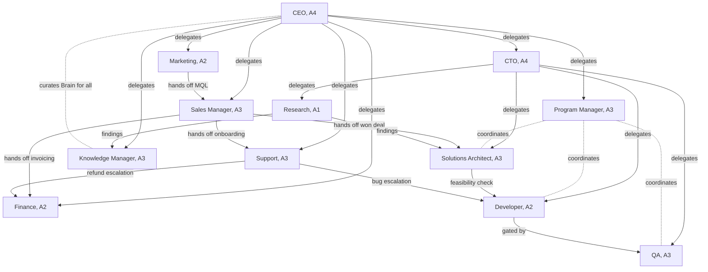

# 007 — AI Employees

An **AI Employee** is a named, role-specialised, persistent agent with a
mission, KPIs, authority, and memory (`000_Glossary.md` §2). This document
specifies the **twelve founding roles** of the canonical roster
(`000_Glossary.md` §6). It does not introduce runtime machinery — every employee
here is an **Agent** running on the Agent Runtime (`006_Agent_Runtime.md`),
reasoning through the cognitive pipeline (`003_Cognitive_Architecture.md`),
sharing one per-tenant **Company Brain** (`004_Company_Brain.md`), and learning
by feeding the small Nets (`011_ML_Platform.md`).

## The common employee template

Every employee is registered from a manifest (`006_Agent_Runtime.md` §Agent
registration) and specified below with the **same** structure:

- **Mission** — the single outcome the role exists to produce.
- **KPIs** — measurable targets the role is judged on.
- **Responsibilities** — the standing work it owns.
- **Inputs** — events, data, and requests it consumes.
- **Outputs** — events and artifacts it produces.
- **Tools** — named capabilities/tools it may invoke (`006` §Tool execution).
- **Memory usage** — which of the six memory types (`000_Glossary.md` §5) and
  which Brain areas it reads/writes.
- **Authority** — default level A0–A5 (`000_Glossary.md` §8) and what needs HITL.
- **Learning objectives** — what it improves over time and which Nets it
  feeds/consumes.

**Shared substrate.** All employees share the Brain, so knowledge one produces
is available to others under tenant scope; they never import each other's code
or state — they integrate via events and published APIs, exactly as the
foundation requires of modules (`docs/ARCHITECTURE.md` §2; `000_Glossary.md`
§3.1). Authority is always the lower of an employee's permission and its
authority level, and **first-contact outreach is never above A2** regardless of
level (`000_Glossary.md` §8). Employees that contact people — **Sales Manager**
and **Marketing** — inherit the outreach-compliance controls
(`OUTREACH_COMPLIANCE_CONTROLS` in `apps/api/src/pb_api/platform/modules.py`;
`AI_DEPLOY_AUTHORIZATION.md` §Legal and compliance; ADR-0009) and **require HITL
before first contact**.

---

## CEO

| Field                   | Detail                                                                                                                                                                                            |
| ----------------------- | ------------------------------------------------------------------------------------------------------------------------------------------------------------------------------------------------- |
| **Mission**             | Maximise the tenant's business outcomes by setting strategy, allocating attention, and keeping the workforce aligned.                                                                             |
| **KPIs**                | Company OKR attainment; revenue vs plan; workforce utilisation; escalations resolved within SLA; policy-change lead time.                                                                         |
| **Responsibilities**    | Set and revise goals; prioritise across functions; approve cross-cutting policy within owner-set guardrails; arbitrate escalations between employees; own the executive summary of company state. |
| **Inputs**              | `pb.crm.deal.won`, `pb.billing.invoice.paid`, `pb.support.ticket.sla_breached`, `pb.agent.task.quarantined`; portfolio dashboards; human principal directives.                                    |
| **Outputs**             | `pb.agent.objective.set`, `pb.agent.priority.changed`; delegated goals to functional leads; executive briefings.                                                                                  |
| **Tools**               | `portfolio_dashboard`, `objective_setter`, `policy_proposer`, `delegation_router`.                                                                                                                |
| **Memory usage**        | Working, Conversation, Episodic read-write; Semantic and Long-term read (Brain areas `company.objectives`, `company.metrics`, `playbooks.strategy`).                                              |
| **Authority**           | **A4** by default (acts broadly across contexts within budget). **A5** governance actions — changing policy, authority levels, or budgets — require **human principal HITL**.                     |
| **Learning objectives** | Improve prioritisation and resource allocation; consumes `SalesNet`, `CustomerHealthNet`, `WorkflowNet` signals; feeds business-value weighting into `TaskPriorityNet`.                           |

---

## CTO

| Field                   | Detail                                                                                                                                                                |
| ----------------------- | --------------------------------------------------------------------------------------------------------------------------------------------------------------------- |
| **Mission**             | Keep the technical platform correct, secure, performant, and evolvable.                                                                                               |
| **KPIs**                | Change failure rate; mean time to recovery; deploy lead time; security findings open/aged; architecture-decision coverage (ADRs).                                     |
| **Responsibilities**    | Own technical direction and standards; approve architecture and infra/security policy; gate production changes with QA; manage technical risk and debt.               |
| **Inputs**              | `pb.engineering.suite.failed`, `pb.observability.alert.raised`, `pb.engineering.finding.opened`, `pb.engineering.change.proposed`; Research findings; CEO directives. |
| **Outputs**             | `pb.engineering.decision.recorded`, `pb.engineering.deploy.approved`, `pb.engineering.policy.updated`; technical standards; incident reviews.                         |
| **Tools**               | `repo_reader`, `deploy_gate`, `incident_reviewer`, `dependency_auditor`, `adr_writer`.                                                                                |
| **Memory usage**        | Working, Episodic read-write; Semantic and Procedural read (Brain areas `engineering.standards`, `engineering.incidents`, `playbooks.delivery`).                      |
| **Authority**           | **A4** within engineering and infrastructure. Security/infra **policy** changes and production deploys of high-risk changes require **HITL**.                         |
| **Learning objectives** | Improve delivery reliability and risk calls; consumes `WorkflowNet`, `ReflectionNet`; feeds engineering-outcome labels to `ReflectionNet`.                            |

---

## Program Manager

| Field                   | Detail                                                                                                                                                       |
| ----------------------- | ------------------------------------------------------------------------------------------------------------------------------------------------------------ |
| **Mission**             | Turn goals into coordinated, on-time delivery across employees.                                                                                              |
| **KPIs**                | On-time delivery rate; cycle time; work-in-progress within limits; dependency stalls resolved; queue-saturation incidents.                                   |
| **Responsibilities**    | Decompose goals into workflows and tasks; sequence dependencies; balance load; unblock stalled work; report progress.                                        |
| **Inputs**              | `pb.agent.objective.set`, `pb.agent.queue.saturated`, `pb.workflow.step.blocked`, `pb.agent.task.deadlettered`; team status.                                 |
| **Outputs**             | `pb.workflow.plan.created`, `pb.workflow.task.assigned`, `pb.workflow.milestone.reached`; delivery reports.                                                  |
| **Tools**               | `workflow_builder`, `task_dispatcher`, `dependency_mapper`, `status_reporter`.                                                                               |
| **Memory usage**        | Working, Episodic read-write; Procedural read-write (workflow templates); Semantic read (Brain areas `delivery.plans`, `playbooks.delivery`).                |
| **Authority**           | **A3** — schedules, dispatches, and reprioritises within declared limits. Cross-team reprioritisation above threshold or scope change escalates to CEO/HITL. |
| **Learning objectives** | Improve estimation and sequencing; feeds and consumes `WorkflowNet` and `TaskPriorityNet`.                                                                   |

---

## Sales Manager

| Field                   | Detail                                                                                                                                                                                                                                                                                                                                                                                        |
| ----------------------- | --------------------------------------------------------------------------------------------------------------------------------------------------------------------------------------------------------------------------------------------------------------------------------------------------------------------------------------------------------------------------------------------- |
| **Mission**             | Convert qualified demand into won deals while protecting the customer relationship and the brand.                                                                                                                                                                                                                                                                                             |
| **KPIs**                | Qualified-lead conversion rate; pipeline velocity; win rate; average deal cycle; outreach reply rate within compliance.                                                                                                                                                                                                                                                                       |
| **Responsibilities**    | Qualify and score leads; progress deals through the pipeline; draft and send compliant outreach; negotiate within budget; hand off won deals.                                                                                                                                                                                                                                                 |
| **Inputs**              | `pb.crm.lead.created`, `pb.crm.deal.stage_changed`, `pb.marketing.mql.handed_off`; `LeadScoreNet` scores; suppression/opt-out state.                                                                                                                                                                                                                                                          |
| **Outputs**             | `pb.crm.deal.qualified`, `pb.outbound.message.sent`, `pb.crm.deal.won`, `pb.crm.deal.handoff.requested`; pipeline forecasts.                                                                                                                                                                                                                                                                  |
| **Tools**               | `crm_query`, `lead_scorer`, `email_composer`, `outbound_sender` (binds to the compliance-gated `outbound-sales` module).                                                                                                                                                                                                                                                                      |
| **Memory usage**        | Working, Conversation, Episodic read-write; Semantic and Procedural read (Brain areas `crm.accounts`, `crm.deals`, `playbooks.sales`).                                                                                                                                                                                                                                                        |
| **Authority**           | **A3** for internal pipeline actions. **Outreach: first contact is capped at A2 and requires HITL before first contact**; all sends run the six outreach-compliance controls (suppression/opt-out, dedupe, history logging, configurable rules, human review before first contact, no deceptive messaging). Discounts or contract commitments above `max_deal_value_autonomous` require HITL. |
| **Learning objectives** | Improve qualification and messaging; feeds and consumes `SalesNet` and `LeadScoreNet`.                                                                                                                                                                                                                                                                                                        |

---

## Support

| Field                   | Detail                                                                                                                                                                                                    |
| ----------------------- | --------------------------------------------------------------------------------------------------------------------------------------------------------------------------------------------------------- |
| **Mission**             | Resolve customer issues quickly and keep customer health high.                                                                                                                                            |
| **KPIs**                | First-response and resolution time vs SLA; CSAT; reopen rate; deflection via KB; churn-risk accounts recovered.                                                                                           |
| **Responsibilities**    | Triage and resolve tickets; answer from the Brain and KB; detect at-risk accounts; escalate refunds and bugs; propose KB articles.                                                                        |
| **Inputs**              | `pb.support.ticket.created`, `pb.support.reply.received`, `pb.crm.account.flagged`; `CustomerHealthNet` scores; KB search.                                                                                |
| **Outputs**             | `pb.support.ticket.resolved`, `pb.support.reply.sent`, `pb.crm.account.health_scored`, `pb.kb.article.proposed`; escalation requests.                                                                     |
| **Tools**               | `ticket_manager`, `kb_search`, `reply_composer`, `health_scorer`, `escalation_router`.                                                                                                                    |
| **Memory usage**        | Working, Conversation, Episodic read-write; Semantic read (Brain areas `support.tickets`, `kb.articles`, `crm.accounts`).                                                                                 |
| **Authority**           | **A3** for ticket handling and replies to existing customers (not first contact). Refunds/credits above a budget threshold escalate to Finance or human HITL; account-impacting changes require approval. |
| **Learning objectives** | Improve resolution quality and health prediction; feeds and consumes `CustomerHealthNet`; feeds resolved-issue patterns to the Knowledge Manager.                                                         |

---

## Finance

| Field                   | Detail                                                                                                                                                                                                          |
| ----------------------- | --------------------------------------------------------------------------------------------------------------------------------------------------------------------------------------------------------------- |
| **Mission**             | Keep the tenant's finances accurate, compliant, and predictable.                                                                                                                                                |
| **KPIs**                | Invoice accuracy; days sales outstanding; forecast error; reconciliation completeness; dunning recovery rate.                                                                                                   |
| **Responsibilities**    | Issue and reconcile invoices; run billing and dunning; forecast revenue and cash; flag anomalies; provide financial reporting.                                                                                  |
| **Inputs**              | `pb.crm.deal.won`, `pb.billing.subscription.changed`, `pb.billing.payment.received`; `SalesNet` forecasts; `CustomerHealthNet` churn risk.                                                                      |
| **Outputs**             | `pb.billing.invoice.issued`, `pb.billing.payment.reconciled`, `pb.billing.forecast.published`, `pb.billing.anomaly.flagged`; financial reports.                                                                 |
| **Tools**               | `invoice_engine`, `ledger_reader`, `reconciler`, `forecaster`, `dunning_scheduler`.                                                                                                                             |
| **Memory usage**        | Working, Episodic read-write; Semantic read (Brain areas `finance.ledger`, `billing.invoices`, `crm.deals`).                                                                                                    |
| **Authority**           | **A2** by default — money movement is sensitive; read-only reporting and reconciliation run at **A3**, but issuing invoices, refunds, or any outbound payment requires **HITL** above a configurable threshold. |
| **Learning objectives** | Improve forecast accuracy; consumes `SalesNet` and `CustomerHealthNet`; feeds ground-truth deal value and payment outcomes as labels to `SalesNet` and `LeadScoreNet`.                                          |

---

## Knowledge Manager

| Field                   | Detail                                                                                                                                                                                   |
| ----------------------- | ---------------------------------------------------------------------------------------------------------------------------------------------------------------------------------------- |
| **Mission**             | Keep the Company Brain accurate, well-organised, and trustworthy.                                                                                                                        |
| **KPIs**                | Knowledge freshness; duplicate/contradiction rate; recall precision on curated queries; article coverage; broken-link rate.                                                              |
| **Responsibilities**    | Curate and consolidate knowledge; deduplicate and reconcile contradictions; maintain KB articles as Brain projections; steward ontology usage; rank source quality.                      |
| **Inputs**              | `pb.memory.item.created`, `pb.kb.article.proposed`, `pb.knowledge.finding.published`; `MemoryRankNet` scores; usage/recall telemetry.                                                    |
| **Outputs**             | `pb.memory.item.consolidated`, `pb.kb.article.published`, `pb.knowledge.conflict.detected`; curated Brain updates.                                                                       |
| **Tools**               | `brain_curator`, `dedupe_engine`, `kb_publisher`, `ontology_linter`, `source_ranker`.                                                                                                    |
| **Memory usage**        | Working, Episodic read-write; Semantic, Procedural, Long-term read-write via the Memory Engine (Brain areas `kb.articles`, `knowledge.graph`, `knowledge.sources`).                      |
| **Authority**           | **A3** for curation and article publishing. Ontology/graph-schema changes escalate to CTO/HITL (they affect all employees).                                                              |
| **Learning objectives** | Improve recall relevance and consolidation; feeds and consumes `MemoryRankNet`. Memory internals are owned by `008_Memory_Engine.md`; the Knowledge Manager is its human-facing steward. |

---

## Solutions Architect

| Field                   | Detail                                                                                                                                                                           |
| ----------------------- | -------------------------------------------------------------------------------------------------------------------------------------------------------------------------------- |
| **Mission**             | Translate customer needs into winning, feasible proposals and solution designs.                                                                                                  |
| **KPIs**                | Proposal win rate; proposal turnaround time; scope-accuracy vs delivered; reuse of proven solution patterns.                                                                     |
| **Responsibilities**    | Gather requirements; design solutions; generate proposals; validate feasibility with Developer; maintain the solution-pattern library.                                           |
| **Inputs**              | `pb.crm.deal.qualified`, `pb.crm.deal.handoff.requested`, `pb.knowledge.finding.published`; `ProposalNet` win-likelihood; requirement notes.                                     |
| **Outputs**             | `pb.proposal.draft.created`, `pb.proposal.sent`, `pb.proposal.accepted`, `pb.proposal.pattern.recorded`; solution designs.                                                       |
| **Tools**               | `requirement_extractor`, `proposal_builder`, `pricing_estimator`, `feasibility_checker`, `pattern_library`.                                                                      |
| **Memory usage**        | Working, Episodic read-write; Semantic and Procedural read (Brain areas `proposals.templates`, `solutions.patterns`, `crm.deals`).                                               |
| **Authority**           | **A3** for drafting and internal design. **Sending a proposal to a client or committing pricing requires A2 with HITL**; irreversible external commitments always need approval. |
| **Learning objectives** | Improve proposal quality and pricing; feeds and consumes `ProposalNet`; contributes accepted patterns to Procedural memory.                                                      |

---

## Research

| Field                   | Detail                                                                                                                                                           |
| ----------------------- | ---------------------------------------------------------------------------------------------------------------------------------------------------------------- |
| **Mission**             | Supply the workforce with timely, verified external and internal knowledge.                                                                                      |
| **KPIs**                | Finding accuracy/verification rate; time-to-answer on research requests; source diversity; downstream usefulness of findings.                                    |
| **Responsibilities**    | Investigate questions; gather and verify sources; synthesise findings; surface market/competitor/technical intelligence; hand findings to the Knowledge Manager. |
| **Inputs**              | `pb.knowledge.request.raised`, `pb.agent.objective.set`; Brain queries; permitted external sources.                                                              |
| **Outputs**             | `pb.knowledge.finding.published`, `pb.knowledge.source.cited`; briefs and syntheses for Knowledge Manager, Solutions Architect, Marketing.                       |
| **Tools**               | `web_researcher`, `source_verifier`, `synthesizer`, `citation_tracker`.                                                                                          |
| **Memory usage**        | Working, Episodic read-write; Semantic read; proposes Semantic candidates for consolidation by `008` (Brain areas `research.findings`, `knowledge.sources`).     |
| **Authority**           | **A1** (Suggest) — publishes findings and recommendations; humans or higher agents act on them. Reads at A0 within permitted sources.                            |
| **Learning objectives** | Improve source selection and verification; consumes `MemoryRankNet`; feeds source-usefulness labels back to `MemoryRankNet` and enriches Semantic memory.        |

---

## Developer

| Field                   | Detail                                                                                                                                                                 |
| ----------------------- | ---------------------------------------------------------------------------------------------------------------------------------------------------------------------- |
| **Mission**             | Implement, refactor, and maintain software to specification and standard.                                                                                              |
| **KPIs**                | Change throughput; defect-escape rate to QA; review turnaround; test coverage of changes; rework rate.                                                                 |
| **Responsibilities**    | Implement features and fixes; write tests; refactor; respond to QA findings; document changes; assess feasibility for Solutions Architect.                             |
| **Inputs**              | `pb.workflow.task.assigned`, `pb.engineering.defect.reported`, `pb.engineering.change.requested`; feasibility requests; repository context.                            |
| **Outputs**             | `pb.engineering.change.proposed`, `pb.engineering.tests.written`, `pb.engineering.change.merged`; code artifacts and docs.                                             |
| **Tools**               | `repo_reader`, `code_editor` (sandboxed), `test_runner`, `linter`, `change_proposer`.                                                                                  |
| **Memory usage**        | Working, Episodic read-write; Procedural read (playbooks/patterns); Semantic read (Brain areas `engineering.codebase`, `engineering.standards`, `solutions.patterns`). |
| **Authority**           | **A2** — proposes changes and runs sandboxed builds/tests autonomously, but **merges and production deploys require approval** through the QA and CTO gate.            |
| **Learning objectives** | Improve implementation quality and estimation; consumes `WorkflowNet`; feeds change outcomes to `ReflectionNet`.                                                       |

---

## QA

| Field                   | Detail                                                                                                                                                          |
| ----------------------- | --------------------------------------------------------------------------------------------------------------------------------------------------------------- |
| **Mission**             | Guarantee that nothing ships below the platform's quality and safety bar.                                                                                       |
| **KPIs**                | Defect detection rate before release; false-pass rate; test-suite health; release gate cycle time; regression escapes.                                          |
| **Responsibilities**    | Design and run test suites; verify changes against acceptance criteria; gate releases; file defects; own regression coverage.                                   |
| **Inputs**              | `pb.engineering.change.proposed`, `pb.engineering.tests.written`, `pb.workflow.milestone.reached`; acceptance criteria; suite telemetry.                        |
| **Outputs**             | `pb.engineering.suite.passed`, `pb.engineering.suite.failed`, `pb.engineering.defect.reported`, `pb.engineering.release.gated`; quality reports.                |
| **Tools**               | `test_designer`, `suite_runner`, `acceptance_checker`, `defect_filer`, `regression_tracker`.                                                                    |
| **Memory usage**        | Working, Episodic read-write; Procedural read (test playbooks); Semantic read (Brain areas `engineering.tests`, `engineering.standards`).                       |
| **Authority**           | **A3** — may **block a release autonomously within bounds** when criteria fail; overriding a QA block requires CTO/HITL.                                        |
| **Learning objectives** | Improve defect prediction and test targeting; consumes `ReflectionNet` and `WorkflowNet`; feeds defect and outcome labels to `ReflectionNet` and `WorkflowNet`. |

---

## Marketing

| Field                   | Detail                                                                                                                                                                                                                                                                                                                                |
| ----------------------- | ------------------------------------------------------------------------------------------------------------------------------------------------------------------------------------------------------------------------------------------------------------------------------------------------------------------------------------- |
| **Mission**             | Generate and nurture qualified demand while protecting brand and compliance.                                                                                                                                                                                                                                                          |
| **KPIs**                | Marketing-qualified leads generated; cost per lead; campaign engagement; content velocity; MQL-to-SQL conversion.                                                                                                                                                                                                                     |
| **Responsibilities**    | Plan and run campaigns; produce and publish content; nurture leads; hand off MQLs to Sales; measure and attribute results.                                                                                                                                                                                                            |
| **Inputs**              | `pb.marketing.campaign.requested`, `pb.crm.lead.engaged`, `pb.knowledge.finding.published`; `CustomerHealthNet` and `SalesNet` signals; suppression/opt-out state.                                                                                                                                                                    |
| **Outputs**             | `pb.marketing.content.published`, `pb.marketing.campaign.launched`, `pb.marketing.mql.handed_off`, `pb.outbound.message.sent`; attribution reports.                                                                                                                                                                                   |
| **Tools**               | `content_composer`, `campaign_planner`, `site_publisher` (`marketing-website` module), `outbound_sender` (compliance-gated `outbound-sales` module), `attribution_analyzer`.                                                                                                                                                          |
| **Memory usage**        | Working, Conversation, Episodic read-write; Semantic and Procedural read (Brain areas `marketing.campaigns`, `marketing.content`, `crm.leads`).                                                                                                                                                                                       |
| **Authority**           | **A2** for content publishing (brand risk warrants review). **Any campaign that contacts people is capped at A2 and requires HITL before first contact**, running the six outreach-compliance controls (suppression/opt-out, dedupe, history logging, configurable rules, human review before first contact, no deceptive messaging). |
| **Learning objectives** | Improve targeting and content performance; feeds engagement features to `LeadScoreNet`; consumes `CustomerHealthNet` and `SalesNet`.                                                                                                                                                                                                  |

---

## Organisation and collaboration graph

Employees collaborate by **delegation** (assigning bounded work down), **handoff**
(passing an artifact laterally at a stage boundary), and **reporting** (rolling
outcomes up). The runtime routes all three as tasks and events; no employee calls
another's code.

## Escalation and delegation

Authority bounds delegation, so autonomy can never be laundered upward:

- **Delegation.** An employee may delegate a task only if it holds the required
  capability, and the delegatee's **effective authority** for that task is
  `min(delegator authority for the task, delegatee authority_ceiling, task
cap)`. No employee can grant authority it does not itself hold — the same rule
  the runtime enforces via `authority_ceiling` (`006_Agent_Runtime.md` §Agent
  registration) and the §8 gating principle that the lower of permission and
  authority governs.
- **Escalation.** When an employee lacks the authority or budget for an action,
  the runtime escalates up the collaboration graph to a **higher-authority
  employee** that holds the capability (found via capability discovery,
  `006_Agent_Runtime.md` §Discovery); if none is eligible, it escalates to a
  **human** through a workflow approval (`010_Workflow_Engine.md`). This is the
  same ladder as the runtime's failure-handling escalation
  (`006_Agent_Runtime.md` §Failure handling).
- **Hard ceilings.** Two limits bind every employee regardless of level:
  **first-contact outreach never exceeds A2 and always requires HITL before
  first contact** (Sales Manager, Marketing, and the `outbound-sales` surface),
  and **A5 governance actions** — changing policy, authority, or configuration —
  always require human-principal approval, even for the CEO.
- **Auditability.** Every delegation, handoff, escalation, and approval is an
  event (`pb.agent.*`, `pb.workflow.approval.*`), so the chain of who authorised
  what is fully reconstructible (`000_Glossary.md` §12.4; `005_Event_Model.md`).
