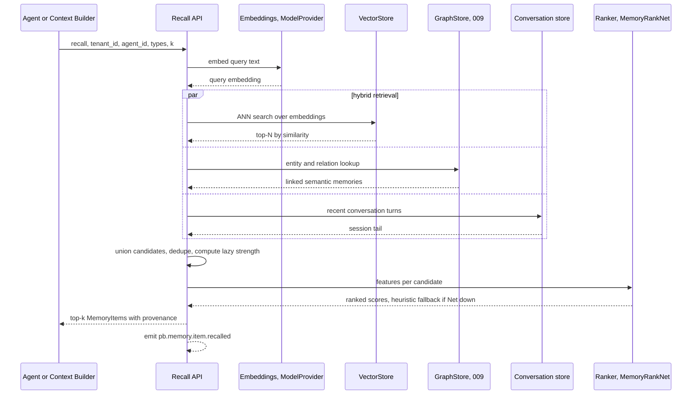
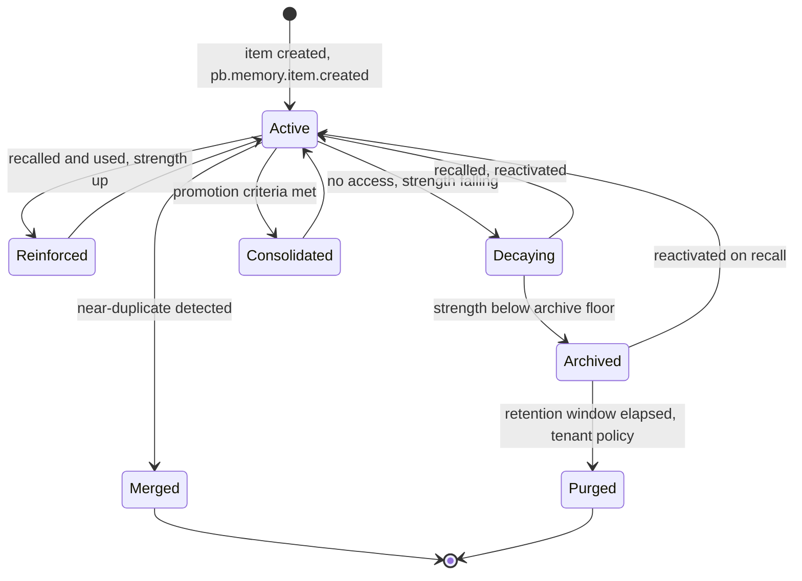

# 008 — Memory Engine

The **Memory Engine** governs the lifecycle of agent memory across the six
memory types fixed in `000_Glossary.md §5`: importance, decay, strength,
ranking, recall, promotion, archiving, compression/summarisation, deduplication,
and the generation of retraining datasets for the small Nets.

It is binding on memory mechanics. It does **not** redefine the memory taxonomy
(glossary `§5`), the cognitive access patterns (`003_Cognitive_Architecture.md`),
the physical storage of **Semantic** and **Long-term** memory or the knowledge
graph (`004_Company_Brain.md`, `009_Knowledge_Graph.md`), or how `MemoryRankNet`
and `ReflectionNet` are trained (`011_ML_Platform.md`). This document owns the
`MemoryItem` object and the engine that moves it through its life.

The engine depends only on ports (glossary `§3.2`): `VectorStore`
(`pgvector` default), `GraphStore`, `EventStore`, `EventBus` (Redis Streams),
`ModelProvider` (embeddings + summarisation), `ModelServer` (`MemoryRankNet`),
`FeatureStore`, `BlobStore` (cold archive), and `Scheduler` (the consolidation
job). Everything is scoped by `tenant_id` — cross-tenant memory access is
impossible by construction (glossary `§12.6`).

---

## 1. Scope

The Memory Engine is the single writer of memory _mechanics_. Cognition
(`003`) produces experiences and issues recall queries; the engine scores,
ranks, promotes, consolidates, archives, and de-duplicates. Truth (Semantic)
and the consolidated tier (Long-term) _physically live_ in the Brain (`004`);
the engine operates on them through the Brain's ports and never bypasses its
validation.

---

## 2. The MemoryItem object

`MemoryItem` is the unified record for every memory the engine manages,
regardless of type. Physical placement differs by `type` (glossary `§5`) but the
logical shape is uniform so ranking, decay, and consolidation are type-agnostic.

| Field             | Type           | Description                                                                                                                               |
| ----------------- | -------------- | ----------------------------------------------------------------------------------------------------------------------------------------- |
| `id`              | UUID           | Stable identifier.                                                                                                                        |
| `tenant_id`       | UUID           | Tenant scope (mandatory). Partition key.                                                                                                  |
| `owner`           | enum           | `agent` \| `team` \| `tenant` — visibility scope of the item.                                                                             |
| `agent_id`        | UUID \| null   | Producing/owning agent when `owner = agent`.                                                                                              |
| `type`            | enum           | `working` \| `conversation` \| `episodic` \| `semantic` \| `procedural` \| `long_term`.                                                   |
| `subtype`         | string \| null | Finer kind (e.g. ITO `kind`, `summary`, `playbook`).                                                                                      |
| `content`         | text           | Human-readable content or canonical serialisation.                                                                                        |
| `structured`      | JSON \| null   | Machine-readable payload (entities, scores, refs).                                                                                        |
| `embedding_ref`   | UUID \| null   | Pointer into `VectorStore` for the item's embedding (vector stored there, not inline).                                                    |
| `source_event_id` | UUID \| null   | Originating event (provenance, glossary `§12.4`).                                                                                         |
| `importance`      | float [0,1]    | Learned/heuristic importance (`§3`).                                                                                                      |
| `strength`        | float [0,1]    | Current memory strength / retrievability (`§4`, `§5`).                                                                                    |
| `half_life`       | float (days)   | Decay time constant; grows with reinforcement (`§4`).                                                                                     |
| `created_at`      | timestamptz    | Creation time.                                                                                                                            |
| `last_accessed`   | timestamptz    | Last recall time (drives recency decay).                                                                                                  |
| `access_count`    | int            | Number of recalls (drives frequency reinforcement).                                                                                       |
| `links`           | Link[]         | Typed relations to other items/entities (`{rel, target_id}`): `derived_from`, `summary_of`, `duplicate_of`, `about_entity`, `supersedes`. |
| `status`          | enum           | `active` \| `decaying` \| `archived` \| `merged` \| `purged`.                                                                             |
| `retention_class` | enum           | `standard` \| `pinned` \| `sensitive` — tenant policy for archive/purge windows.                                                          |
| `provenance`      | JSON           | Source authority, confidence, agent, model version.                                                                                       |

Notes:

- Embeddings are **referenced**, not inlined, so the row stays small and the
  `VectorStore` adapter can change (`pgvector` → Qdrant) without a schema
  migration.
- `working` items are ephemeral (Redis, glossary `§5`) and are usually not
  persisted as rows unless promoted.
- `semantic`/`long_term` rows are _projections/handles_ over Brain-owned storage
  (`004`); the engine holds the memory metadata (importance/strength/links)
  while the Brain holds the canonical fact and graph edges.

### 2.1 Example

```json
{
  "id": "6b1e2f7a-3c40-4d9b-9a11-2f8c7d6e5b40",
  "tenant_id": "b3d9a1c4-7e52-4c8a-9f10-1a2b3c4d5e6f",
  "owner": "agent",
  "agent_id": "3a7e5d21-9c44-4e0b-8a11-7f6e5d4c3b2a",
  "type": "episodic",
  "subtype": "decision",
  "content": "Renewal proposal for Acme drafted and sent; accepted 3 days later.",
  "structured": { "capability": "create_proposal", "value_eur": 4200, "outcome": "accepted" },
  "embedding_ref": "a1b2c3d4-e5f6-4a7b-8c9d-0e1f2a3b4c5d",
  "source_event_id": "e5f6a7b8-c9d0-41e2-83f4-5a6b7c8d9e0f",
  "importance": 0.71,
  "strength": 0.88,
  "half_life": 34.0,
  "created_at": "2026-07-13T09:14:05Z",
  "last_accessed": "2026-07-16T11:02:00Z",
  "access_count": 4,
  "links": [
    { "rel": "about_entity", "target_id": "acme-corp-node" },
    { "rel": "derived_from", "target_id": "d4e5f6a7-b8c9-40d1-9e2f-3a4b5c6d7e8f" }
  ],
  "status": "active",
  "retention_class": "standard",
  "provenance": { "source": "agent_action", "confidence": 0.9, "model": "claude-latest" }
}
```

---

## 3. Importance

**Importance** is a `[0,1]` estimate of how much an item matters, independent of
a specific query (unlike ranking `§6`, which is query-relative). It is scored at
write time and re-scored during consolidation.

Signals: source authority (human > agent > inferred), outcome impact
(`kpi_delta` from Reflection, `003 §7`), novelty (embedding distance from
existing memories), entity centrality (graph degree in `009`), explicit pin
(`retention_class = pinned`), and recency of creation.

The learned scorer is **`MemoryRankNet`** in its importance head (glossary `§10`;
trained in `011`). **Heuristic fallback** when the Net is unavailable:

```text
importance = 0.30 * source_authority
           + 0.30 * outcome_impact
           + 0.15 * novelty
           + 0.15 * entity_centrality
           + 0.10 * pin_flag          # each term normalised to [0,1]
```

Importance is a first-class decay input (`§4`) and a promotion criterion (`§8`).
Re-scoring emits `pb.memory.item.rescored` when it crosses a promotion/archive
threshold.

**Alternatives considered.** (a) _Uniform importance_ — simplest, but floods
recall with trivia. (b) _LLM scores importance per item_ — high quality, but too
costly at write volume. (c) _Learned Net + heuristic fallback_ (selected) —
cheap online scoring, improves from outcome labels, degrades gracefully.
**Future scaling risk:** importance drift as the tenant's business changes;
periodic re-scoring in the consolidation job (`§13`) keeps it current.

---

## 4. Decay

Memory **strength** decays with time and rises with use, mirroring human
forgetting. The engine uses a **half-life decay with a spacing effect**.

For an item with strength `S`, half-life `h` (days), and elapsed time since last
access `Δt = now - last_accessed`:

```text
retrievability(Δt) = 2 ^ ( -Δt / h )
S_effective        = S * retrievability(Δt)
```

Half-life `h` grows each time the item is successfully recalled (the _spacing
effect_, `§5`), so frequently-used memories decay ever more slowly. `pinned`
items have effectively infinite `h`; `sensitive` items may have a **shortened**
`h` to force earlier archival/purge for privacy.

Comparison of decay models:

| Model                    | Form                               | Pros                                                                                           | Cons                                                       |
| ------------------------ | ---------------------------------- | ---------------------------------------------------------------------------------------------- | ---------------------------------------------------------- |
| Ebbinghaus exponential   | `S = S0 * exp(-Δt / τ)`            | Classic, smooth, one parameter.                                                                | `τ` in odd units; no built-in frequency effect.            |
| **Half-life (selected)** | `S_eff = S * 2^(-Δt/h)`, `h` grows | `h` reads as "days to halve"; spacing effect natural; easy to reason about and tune per class. | Still needs an importance floor so key facts never vanish. |
| Learned decay Net        | `S_eff = f_theta(features)`        | Adapts per tenant/type from data.                                                              | Data-hungry, opaque, harder to audit; premature for v1.    |

**Selected:** half-life decay with reinforcement, with a floor
`S_eff = max(S_eff, importance * floor_factor)` so important memories resist
forgetting even when unused. A learned decay Net is a documented future upgrade
once enough recall-outcome data exists (`§12`), served like any small Net via
`ModelServer`. **Future scaling risk:** recomputing `S_effective` for every item
is wasteful; strength is computed _lazily at recall_ and only _materialised_
during the periodic job (`§13`), so decay costs nothing between accesses.

Crossing the archive floor moves an item to `decaying` then `archived` and emits
`pb.memory.item.decayed` / `pb.memory.item.archived`.

---

## 5. Strength and reinforcement

On a successful recall (the item is retrieved _and_ actually used — cited in an
ITO's `cited_memory`, `003 §4`), the engine reinforces the item:

```text
S           <- min(1.0, S + alpha * (1 - S))     # diminishing gains, alpha ~ 0.2
h           <- h * (1 + beta)                     # spacing effect, beta ~ 0.25
access_count += 1
last_accessed = now
```

Retrieval-without-use applies a smaller bump (recall counts, usage counts more),
distinguishing _retrievable_ from _useful_ — the same distinction that labels
the `MemoryRankNet` training set (`§12`). Reinforcement emits
`pb.memory.item.reinforced`. This closes the loop with decay (`§4`): use
strengthens, disuse weakens.

**Alternatives considered.** (a) _Fixed strength_ — no learning from use. (b)
_Linear increment_ — overshoots and saturates crudely. (c) _Diminishing-returns
increment + half-life growth_ (selected) — models both immediate reinforcement
and the spacing effect, bounded in `[0,1]`. **Future scaling risk:** popular
items could monopolise recall (rich-get-richer); the ranker's diversity term
(`§6`) and dedup (`§11`) counter this.

---

## 6. Ranking (recall relevance)

Ranking is **query-relative**: given a query embedding `q` and candidate item
`m`, produce a relevance score. The ranker is **`MemoryRankNet`** (glossary
`§10`), a learned model served via `ModelServer`, with a deterministic heuristic
fallback so recall never depends on ML availability.

Heuristic fallback (also the feature basis the Net consumes):

```text
score(q, m) = w_sim  * cosine(q, m.embedding)
            + w_imp  * m.importance
            + w_str  * S_effective(m)             # from §4, computed lazily
            + w_rec  * 2 ^ ( -age_days(m) / rec_h )
            + w_link * graph_proximity(q_entities, m)   # via 009
            - w_dup  * redundancy(m, already_selected)  # diversity penalty

default weights: w_sim 0.45, w_imp 0.20, w_str 0.15, w_rec 0.10,
                 w_link 0.10, w_dup 0.10
```

`MemoryRankNet` replaces the fixed weights with a learned function over the same
features plus context (agent role, task type, time of day), and outputs a
calibrated relevance used both to order results and to fill the Context Builder's
token budget (`003 §9`). The fallback flag is recorded on the recall event so
`011` can measure Net-vs-heuristic lift.

**Alternatives considered.** (a) _Cosine similarity only_ — ignores importance,
strength, recency, structure. (b) _Fixed weighted blend_ — transparent but
static and unable to learn per-tenant relevance. (c) _`MemoryRankNet` + heuristic
fallback_ (selected) — learned relevance with a safe, auditable default.
**Future scaling risk:** re-ranking large candidate sets is `O(n)` in features;
cap candidates via ANN pre-filter (`§7`) and score only the top-N.

---

## 7. Recall

Recall answers a cognition query with a ranked set of `MemoryItem`s across
types, using **hybrid retrieval**: dense vectors (`VectorStore`) + graph
proximity (`GraphStore`/`009`) + recent Conversation turns, unified by the
ranker (`§6`).

Query contract: `recall(tenant_id, agent_id, query_text, types[], k,
candidate_budget)`. The engine embeds the query (`ModelProvider`), fans out to
the stores in parallel, unions and de-duplicates candidates, ranks them, and
returns the top-`k` with provenance. Every recall emits
`pb.memory.item.recalled` (batched per query) carrying the returned ids and
scores — the raw material for reinforcement (`§5`) and dataset generation
(`§12`).



**Alternatives considered.** (a) _Vector-only recall_ — misses relational
context (who/what an entity connects to). (b) _Graph-only recall_ — precise on
known entities but weak on fuzzy semantic match. (c) _Hybrid vector + graph +
recency_ (selected) — complementary recall channels ranked together. **Future
scaling risk:** fan-out latency; mitigate with per-channel timeouts (return
partial results rather than block cognition), ANN indexes, and a Redis cache of
hot queries.

---

## 8. Promotion

Promotion moves an item up the durability ladder as it proves its value. The
paths (consistent with the cognition-level diagram in `003 §3.6`):

| From         | To           | Criteria                                                                           | Event                         |
| ------------ | ------------ | ---------------------------------------------------------------------------------- | ----------------------------- |
| working      | conversation | Turn recorded in a live session.                                                   | `pb.memory.item.promoted`     |
| working      | episodic     | Step produced a consequential outcome (an `observation`/`decision` worth keeping). | `pb.memory.item.promoted`     |
| conversation | episodic     | Session summarised at close.                                                       | `pb.memory.item.promoted`     |
| episodic     | long_term    | `importance ≥ θ_imp` **and** `strength ≥ θ_str` sustained across the job window.   | `pb.memory.item.consolidated` |
| episodic     | semantic     | Stable fact/entity extracted; proposed to and **validated by** the Brain (`004`).  | `pb.memory.item.consolidated` |
| episodic     | procedural   | A repeated successful trajectory generalised into a playbook (via `003 §7`).       | `pb.memory.item.consolidated` |

Promotion to `semantic`/`procedural` is always a **proposal** to `004`
(knowledge evolution, `003 §13`) — the engine never writes truth unilaterally.
Thresholds `θ_imp`, `θ_str` are tenant-tunable; defaults `θ_imp = 0.6`,
`θ_str = 0.5`. Promotion sets `links.derived_from` so the origin episode remains
traceable.

**Alternatives considered.** (a) _Promote on a single strong recall_ — fast but
noisy; a one-off spike promotes junk. (b) _Threshold sustained across the job
window_ (selected) — requires durable importance+strength, filtering flukes.
(c) _Manual curation only_ — high precision, unscalable. **Future scaling risk:**
threshold tuning per tenant; expose `θ` as policy and let `011` recommend values
from promoted-item outcomes.

---

## 9. Archiving

Low-value memories are moved to **cold storage** rather than deleted — archiving
is **reversible**. When `S_effective` falls below the archive floor and the item
is not `pinned`, the engine:

1. Serialises the full item (content + structured + links) to `BlobStore` under
   `archive/{tenant_id}/{yyyy}/{mm}/{id}.json`.
2. Replaces the hot row with a lightweight tombstone (`status = archived`,
   keeping `id`, `embedding_ref`, `importance`, `links`) so it remains
   _findable_ by recall but not loaded until needed.
3. Emits `pb.memory.item.archived`.

**Reactivation:** if recall selects an archived tombstone (its embedding still
matches), the engine rehydrates from `BlobStore`, sets `status = active`,
reinforces (`§5`), and emits `pb.memory.item.reactivated`. Purge (hard delete)
happens only when the tenant retention window for the `retention_class` elapses,
emitting `pb.memory.item.purged` — the sole irreversible transition, gated by
tenant policy and `012_Security.md` data-retention rules.

**Alternatives considered.** (a) _Hard-delete cold memories_ — cheapest storage,
but loses reversibility and audit. (b) _Keep everything hot_ — simplest, but the
hot store and recall latency grow unbounded. (c) _Tombstone + blob cold store_
(selected) — keeps items findable and reversible at low hot-storage cost.
**Future scaling risk:** archive volume dominates `BlobStore`; apply lifecycle
policies (compress, tier to cheaper storage) and per-tenant purge windows.

---

## 10. Compression and summarisation

Clusters of related episodic memories are rolled up into a single **summary**
`MemoryItem` (`subtype = summary`) to control volume and improve recall
signal-to-noise.

- **Clustering:** the job groups episodic items by embedding proximity + shared
  entity + time window (e.g. a week of interactions with one customer).
- **Summarisation:** the `ModelProvider` produces an abstractive summary; the
  summary item links to every original via `links.summary_of`, and originals are
  **not deleted** — they are marked `superseded_by` the summary and become
  eligible for archiving (`§9`). Recall prefers the summary but can drill down to
  originals via the links (lossless provenance).
- **Events:** `pb.memory.item.summarized` for the new summary, with the covered
  ids in the payload.

**Alternatives considered.** (a) _Extractive summary (pick key sentences)_ —
cheap and faithful but choppy and poor at synthesis across items. (b)
_Abstractive LLM summary_ (selected) — coherent rollups that compress well,
acceptable cost at batch cadence. (c) _No summarisation_ — recall drowns in
near-identical episodes. **Future scaling risk:** summaries can drift from
originals (hallucination); keep originals linked and archived, re-derive
summaries when the cluster changes materially, and carry a summary `confidence`.

---

## 11. Deduplication

Near-duplicate memories (the same fact recorded by different steps/agents) are
detected and merged to keep recall clean and strength meaningful.

- **Detection:** candidate pairs where cosine similarity `≥ 0.92` **and** they
  share a primary entity (`links.about_entity`) — combining embedding closeness
  with symbolic entity match avoids merging superficially similar but distinct
  facts. A short LLM check adjudicates borderline pairs `[0.88, 0.92)`.
- **Merge strategy:** keep the item with higher `importance` as the survivor;
  transfer the loser's `access_count`, take `max(strength)` and `max(half_life)`,
  union `links`, and record `links.duplicate_of → survivor` on the loser, which
  becomes `status = merged` (a redirect, not a delete — provenance preserved).
- **Events:** `pb.memory.item.deduplicated` (a.k.a. merged) with survivor and
  merged ids.

**Alternatives considered.** (a) _Embedding threshold only_ — fast but merges
distinct facts that phrase similarly. (b) _Exact/entity match only_ — precise but
misses paraphrases. (c) _Embedding + entity match, LLM tie-break_ (selected) —
high precision and recall on true duplicates. **Future scaling risk:** all-pairs
comparison is `O(n^2)`; restrict candidate generation to ANN neighbours within
the same entity bucket, run incrementally in the job (`§13`).

---

## 12. Retraining dataset generation

The engine turns lived memory into **labelled datasets** for the small Nets,
feeding `011_ML_Platform.md` (which owns training). This is the mechanism behind
the Learning Pipeline in `003 §12`.

Construction joins three event streams by `correlation_id` (`005`):
recall events (`pb.memory.item.recalled`, with candidate features and scores),
usage (whether a recalled item was cited via `cited_memory`, `003 §4`), and
outcomes/reflections (`pb.agent.reflection.recorded`, `kpi_delta`).

| Target Net        | Features                                                     | Label                                                             |
| ----------------- | ------------------------------------------------------------ | ----------------------------------------------------------------- |
| `MemoryRankNet`   | Recall candidate features (`§6`) + query/agent/task context. | Was the recalled item **used** and did it correlate with success. |
| `TaskPriorityNet` | Goal/task features at scheduling time.                       | Realised value / deadline-hit of the task.                        |
| `ReflectionNet`   | Reflection `net_features` (`003 §7`).                        | Did the reflection's lesson improve the next episode's KPI.       |
| `WorkflowNet`     | Procedure features + context.                                | Procedure outcome success rate.                                   |

Datasets are materialised to the `FeatureStore` (offline table + online store)
on the job cadence, versioned and tenant-partitioned, and announced with
`pb.memory.dataset.generated` (batch id, target Net, row count, window). Labels
are point-in-time correct (features as-of decision time, outcome as-of
resolution) to prevent leakage. Training, evaluation, and champion/challenger
promotion are strictly `011`'s responsibility.

**Alternatives considered.** (a) _Log-scrape training data ad hoc_ — brittle,
leakage-prone, unversioned. (b) _Event-joined, point-in-time datasets_
(selected) — reproducible, leak-safe, and reuses the audited event backbone.
**Future scaling risk:** label sparsity early on (few outcomes); bootstrap with
heuristic labels (`§6` fallback outputs, KPI deltas) until enough real outcomes
accumulate.

---

## 13. Memory lifecycle and the consolidation job

### 13.1 Lifecycle



### 13.2 The periodic consolidation job

A `Scheduler`-driven job runs the batch mechanics that must not sit on cognition's
hot path. Two cadences:

- **Fast sweep — every 15 minutes:** flush closed sessions to Episodic (`§8`),
  apply reinforcement/decay materialisation for recently-accessed items, and
  run incremental deduplication (`§11`) on the newest items.
- **Nightly consolidation — once per tenant, off-peak:** re-score importance
  (`§3`), evaluate promotions (`§8`), cluster-summarise (`§10`), archive items
  below the floor (`§9`), and materialise retraining datasets (`§12`).

**Idempotency.** The job is safe to re-run and to run concurrently across
replicas:

- A per-tenant **watermark** (last processed `EventStore` offset) bounds each
  run to new events; re-processing an offset is a no-op.
- All promotions/merges/summaries are keyed by a deterministic
  **content+source hash**, so a duplicate run finds the derived item already
  present and skips it (upsert, not insert).
- A per-tenant **advisory lock** (PostgreSQL) prevents two runners from
  consolidating the same tenant simultaneously.

**Events.** The job emits `pb.memory.consolidation.started` and
`pb.memory.consolidation.completed` (with counts of promoted/summarised/merged/
archived/purged items and the datasets generated), plus the per-item events from
`§8`–`§12`. All follow glossary `§9` naming and carry `tenant_id`,
`correlation_id`, and the watermark for full auditability and replay (`005`).

**Alternatives considered.** (a) _Fully streaming consolidation_ (do everything
inline on each event) — freshest, but heavy work (clustering, summarisation)
would stall cognition and cost LLM calls per event. (b) _Nightly batch only_ —
cheap but stale; sessions linger un-promoted for hours. (c) _Two-cadence
hybrid_ (selected) — fast sweep keeps recall fresh; nightly batch does the
expensive synthesis off-peak. **Future scaling risk:** the nightly window
shrinks as tenants grow; shard the job by tenant and by entity bucket, and move
from the PostgreSQL-backed `Scheduler` to Temporal (glossary `§3.2`) when
per-tenant runtimes exceed the window.

---

## 14. Events emitted (summary)

All names follow `pb.<context>.<aggregate>.<past-verb>` (glossary `§9`); the
context is `memory`. Envelope, correlation/causation IDs in `005_Event_Model.md`.

| Event                               | Emitted when                                      |
| ----------------------------------- | ------------------------------------------------- |
| `pb.memory.item.created`            | A new `MemoryItem` is persisted.                  |
| `pb.memory.item.recalled`           | A recall query returns items (batched).           |
| `pb.memory.item.reinforced`         | An item is strengthened on use (`§5`).            |
| `pb.memory.item.rescored`           | Importance re-score crosses a threshold (`§3`).   |
| `pb.memory.item.decayed`            | An item drops into `decaying` (`§4`).             |
| `pb.memory.item.promoted`           | Working/Conversation → Episodic promotion (`§8`). |
| `pb.memory.item.consolidated`       | Episodic → Long-term/Semantic/Procedural (`§8`).  |
| `pb.memory.item.summarized`         | A cluster is rolled up into a summary (`§10`).    |
| `pb.memory.item.deduplicated`       | Near-duplicates merged (`§11`).                   |
| `pb.memory.item.archived`           | An item moved to cold storage (`§9`).             |
| `pb.memory.item.reactivated`        | An archived item rehydrated on recall (`§9`).     |
| `pb.memory.item.purged`             | Retention window elapsed; hard delete (`§9`).     |
| `pb.memory.dataset.generated`       | A retraining batch materialised (`§12`).          |
| `pb.memory.consolidation.started`   | The periodic job began for a tenant (`§13`).      |
| `pb.memory.consolidation.completed` | The periodic job finished for a tenant (`§13`).   |

---

## 15. Cross-references

- `000_Glossary.md` — memory taxonomy `§5`, ports `§3.2`, events `§9`, small
  Nets `§10`.
- `003_Cognitive_Architecture.md` — cognitive access patterns, Context Builder,
  Internal Thought Objects, Reflection, knowledge evolution proposals.
- `004_Company_Brain.md` — physical Semantic/Long-term storage; validates
  promotion proposals.
- `005_Event_Model.md` — event envelope, correlation/causation, replay.
- `009_Knowledge_Graph.md` — entity nodes/edges used by graph-proximity ranking
  and dedup.
- `011_ML_Platform.md` — training, serving, and evaluation of `MemoryRankNet`,
  `TaskPriorityNet`, `ReflectionNet`, `WorkflowNet` from the datasets in `§12`.
- `012_Security.md` — tenant isolation, retention/purge policy for `§9`.
