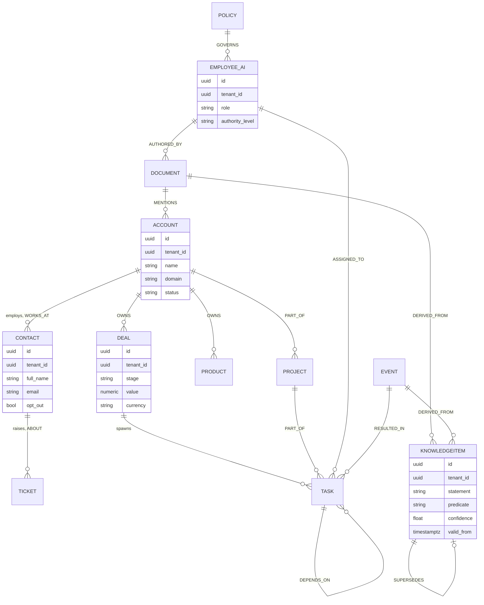
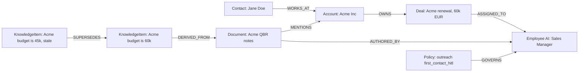

# 009 — Knowledge Graph

The **Knowledge Graph** is the structural backbone of the **Account Brain**
(`004_Company_Brain.md`) and the physical home of **Semantic** memory —
"what is true": entities, their attributes, and the typed relationships between
them (`000_Glossary.md` §5). It is one adapter behind the `GraphStore` port
(`000_Glossary.md` §3.2): **PostgreSQL adjacency tables traversed with recursive
CTEs, upgradable in place to Apache AGE (openCypher), with Neo4j as the scale-up
adapter.**

This document owns the **ontology, edge catalogue, traversal, embedding strategy,
inference and reasoning support**. It defers unstructured storage, vectors,
ingestion and search fusion to `004_Company_Brain.md`; the event envelope to
`005_Event_Model.md`; and the cognitive memory lifecycle and `MemoryItem` to
`003_Cognitive_Architecture.md` and `008_Memory_Engine.md`. It never contradicts
`000_Glossary.md`.

Every node, edge and query is scoped by `tenant_id`; **tenant isolation is
absolute** (`000_Glossary.md` §12.6). The physical store is described in
`004_Company_Brain.md` §Composition:

- `graph_nodes` — `id`, `tenant_id`, `node_type`, `canonical_key`,
  `attributes` (`jsonb`), `embedding_id?`, `confidence`, `valid_from`,
  `valid_to`, `created_at`, `updated_at`.
- `graph_edges` — `id`, `tenant_id`, `src_id`, `dst_id`, `edge_type`,
  `attributes` (`jsonb`), `confidence`, `provenance` (`jsonb`), `valid_from`,
  `valid_to`.

Both are partitioned by `tenant_id`, RLS-scoped, and bitemporal (see
`004_Company_Brain.md` §Versioning).

---

## Entities

The founding ontology has twelve core **node types**. `attributes` is a typed
`jsonb` bag validated against the type's schema (see **Ontology**); the columns
below are the keys that matter for identity, traversal and reasoning.

| Node type         | Purpose                                       | Key attributes                                                      | Canonical key (identity)   |
| ----------------- | --------------------------------------------- | ------------------------------------------------------------------- | -------------------------- |
| **Account**       | A tenant's customer/prospect/partner org      | `name`, `domain`, `industry`, `size`, `status`                      | `domain`                   |
| **Contact**       | A person                                      | `full_name`, `email`, `phone`, `title`, `opt_out`                   | `email`                    |
| **Deal**          | A sales opportunity                           | `title`, `value`, `currency`, `stage`, `close_date`                 | external CRM id            |
| **Ticket**        | A support case                                | `subject`, `priority`, `status`, `sla_due_at`                       | external ticket id         |
| **Document**      | A knowledge doc or artifact                   | `title`, `doc_kind`, `uri`, `version`                               | `document_id` (`004`)      |
| **Policy**        | A machine-readable governance constraint      | `policy_type`, `scope`, `enforced`                                  | `(policy_type, scope)`     |
| **Product**       | A thing sold or supported                     | `name`, `sku`, `category`, `lifecycle`                              | `sku`                      |
| **Employee(AI)**  | An AI Employee (`007_AI_Employees.md`)        | `role`, `authority_level`, `status`                                 | `employee_id`              |
| **Project**       | A unit of client/internal work                | `name`, `status`, `start`, `due`                                    | `project_id`               |
| **Task**          | An actionable step                            | `title`, `status`, `priority`, `assignee_ref`                       | `task_id`                  |
| **Event**         | A materialised fact node for a backbone event | `event_type`, `occurred_at`, `correlation_id`                       | `event_id` (`005`)         |
| **KnowledgeItem** | A discrete asserted fact / Semantic unit      | `statement`, `subject_ref`, `predicate`, `object_ref`, `confidence` | content hash of the triple |

`Employee(AI)` is written `Employee(AI)` in prose but stored with `node_type =
'employee_ai'` so the type token carries no parentheses. `KnowledgeItem` is the
node-level counterpart of the Memory Engine's `MemoryItem`
(`008_Memory_Engine.md`): the graph stores the _asserted fact and its provenance_;
the Memory Engine governs _its salience over time_. The graph does not redefine
ranking or decay.

---

## Relationships

Relationships are **typed, directional, provenance-bearing** edges. Direction is
`src → dst`. Cardinality is enforced at write time by the ontology validator.

| Edge type      | From → To                                          | Direction / cardinality            | Meaning                                              |
| -------------- | -------------------------------------------------- | ---------------------------------- | ---------------------------------------------------- |
| `WORKS_AT`     | Contact → Account                                  | many-to-one, current single-valued | Person is employed by org                            |
| `OWNS`         | Account → Deal, Account → Product                  | one-to-many                        | Org owns the deal/product relationship               |
| `CONTACT_OF`   | Contact → Account                                  | many-to-many                       | Person is a known contact at org                     |
| `ABOUT`        | Ticket/Deal/Document → Account/Product             | many-to-one                        | Record concerns this entity                          |
| `ASSIGNED_TO`  | Task/Ticket → Employee(AI)/Contact                 | many-to-one                        | Responsibility                                       |
| `PART_OF`      | Task → Project, Project → Account                  | many-to-one                        | Composition hierarchy                                |
| `MENTIONS`     | Document/Event → any entity                        | many-to-many                       | Text references entity (from entity linking, `004`)  |
| `AUTHORED_BY`  | Document/KnowledgeItem → Employee(AI)/Contact      | many-to-one                        | Provenance of authorship                             |
| `GOVERNS`      | Policy → any entity/action-type                    | one-to-many                        | Policy constrains target                             |
| `RELATES_TO`   | any → any                                          | many-to-many                       | Generic typed association, `attributes.kind` refines |
| `DERIVED_FROM` | KnowledgeItem → Document/Event/KnowledgeItem       | many-to-one                        | Fact's evidential source (provenance)                |
| `SUPERSEDES`   | KnowledgeItem → KnowledgeItem, Document → Document | one-to-one                         | New version replaces old (versioning, `004`)         |
| `RESULTED_IN`  | Event → Task/Deal/Ticket                           | one-to-many                        | Causal outcome of an event                           |
| `DEPENDS_ON`   | Task → Task, Project → Project                     | many-to-many                       | Ordering/dependency                                  |

Every edge carries `confidence` and `provenance` (`source_type`, `source_id`,
`asserted_by`, `asserted_authority`, `observed_at`, `recorded_at`) — an edge with
no provenance is rejected (`004_Company_Brain.md` §Relationships and provenance).
`SUPERSEDES` and `DERIVED_FROM` are the spine of versioning and explainability:
following `DERIVED_FROM` answers "why do we believe this", following `SUPERSEDES`
answers "what did this replace".

---

## Ontology

The ontology is the **schema / type system**: the registry of legal node types,
edge types, their attribute schemas, cardinality, and the contradiction
comparators used by conflict detection (`004_Company_Brain.md` §Knowledge
Evolution).

**Storage.** Two registry tables, themselves tenant-scoped:

- `graph_node_types` — `tenant_id`, `node_type`, `attribute_schema` (JSON Schema),
  `canonical_key_fields`, `embeddable` (bool).
- `graph_edge_types` — `tenant_id`, `edge_type`, `src_types`, `dst_types`,
  `cardinality`, `multi_valued` (bool), `contradiction_comparator`.

The twelve node types and the edge catalogue above are **seeded as a base
ontology** at tenant provisioning.

**Per-tenant extension.** A tenant may add node types, edge types and attributes
(e.g. a legal firm adds `Matter` and `REPRESENTS`) via
`POST /api/v1/ai/graph/ontology`. Extensions may only **add**; they may not
redefine base types incompatibly, so cross-tenant tooling and the base reasoning
patterns keep working.

| Ontology approach                                                                 | Trade-off                                                     | Verdict                                |
| --------------------------------------------------------------------------------- | ------------------------------------------------------------- | -------------------------------------- |
| Fixed, code-defined schema                                                        | Simple, safe, inflexible per tenant                           | Too rigid for a multi-tenant workforce |
| Schema-free property graph                                                        | Maximum flexibility, no validation, chaos                     | Rejected — unauditable                 |
| **Seeded base ontology + additive per-tenant extension + JSON-Schema validation** | Shared reasoning + tenant flexibility + write-time validation | **Selected**                           |

**Validation** runs on every node/edge write: attribute conformance (JSON Schema),
endpoint-type legality (`src_types`/`dst_types`), and cardinality. Violations are
rejected before persistence, so the graph is never structurally invalid.

**Future scaling risk:** unbounded tenant extension can fragment the ontology and
degrade shared tooling. Mitigation: extensions are namespaced per tenant, a
promotion path lifts common extensions into the base ontology deliberately, and a
lint job flags near-duplicate tenant types for the Knowledge Manager
(`007_AI_Employees.md`).

---

## Core ontology diagram



## Example graph

A concrete tenant fragment — a contact at an account with an open deal, a
supporting document, and a superseded fact:



---

## Graph traversal

Traversal answers connection questions: reachability, neighbourhood, shortest
path, multi-hop joins. The default adapter uses **PostgreSQL recursive CTEs** over
`graph_edges`; the same queries express in **Apache AGE** openCypher when a tenant
enables it, and in **Neo4j** at the scale-up tier.

**Adapter comparison and move trigger.**

| Adapter                                 | Pros                                                                                                          | Cons                                                                      | Role                                       |
| --------------------------------------- | ------------------------------------------------------------------------------------------------------------- | ------------------------------------------------------------------------- | ------------------------------------------ |
| **PostgreSQL recursive CTE (default)**  | No new infrastructure, transactional with the rest of the Brain, joins to vectors and provenance in one query | Deep/branchy traversals get expensive; no native graph algorithms         | **Selected v1**                            |
| **Apache AGE (openCypher on Postgres)** | Cypher ergonomics, still one PostgreSQL instance, in-place upgrade                                            | Extension maturity/ops; still not a distributed graph engine              | Same-instance upgrade for query ergonomics |
| **Neo4j**                               | Purpose-built traversal, graph algorithms, index-free adjacency at depth                                      | New system, cross-store consistency with Postgres vectors/blobs, cost/ops | Scale-up adapter                           |

**Move trigger (recorded):** migrate a tenant's `GraphStore` to Neo4j when
p95 latency of the standard 3-hop neighbourhood query breaches the retrieval SLO
despite indexing, **or** when average traversal depth for reasoning routinely
exceeds 4–5 hops (where CTE cost grows sharply and index-free adjacency wins). The
port boundary means callers (`004_Company_Brain.md`, `003_Cognitive_Architecture.md`)
do not change.

**Example — 2-hop neighbourhood (recursive CTE).** _"All entities within two hops
of a given Account, for context assembly."_

```sql
WITH RECURSIVE nbr(node_id, depth, path) AS (
    SELECT :root_id, 0, ARRAY[:root_id]
    UNION ALL
    SELECT e.dst_id, n.depth + 1, n.path || e.dst_id
    FROM nbr n
    JOIN graph_edges e
      ON e.src_id = n.node_id
     AND e.tenant_id = :tenant_id
     AND e.valid_to IS NULL              -- current facts only
    WHERE n.depth < 2
      AND NOT e.dst_id = ANY(n.path)     -- cycle guard
)
SELECT DISTINCT gn.*
FROM nbr JOIN graph_nodes gn ON gn.id = nbr.node_id
WHERE gn.tenant_id = :tenant_id;
```

**Example — provenance walk.** _"Why do we believe Acme's budget is 60k? Trace the
evidence chain."_

```sql
WITH RECURSIVE evidence(item_id, depth) AS (
    SELECT :knowledge_item_id, 0
    UNION ALL
    SELECT e.dst_id, ev.depth + 1
    FROM evidence ev
    JOIN graph_edges e
      ON e.src_id = ev.item_id
     AND e.edge_type = 'DERIVED_FROM'
     AND e.tenant_id = :tenant_id
)
SELECT gn.node_type, gn.attributes, ev.depth
FROM evidence ev JOIN graph_nodes gn ON gn.id = ev.item_id
ORDER BY ev.depth;
```

**Example — same query in openCypher (AGE / Neo4j).** _"Contacts at accounts that
own an open deal assigned to the Sales Manager."_

```cypher
MATCH (sm:EMPLOYEE_AI {role: 'sales_manager'})<-[:ASSIGNED_TO]-(d:DEAL)
MATCH (co:ACCOUNT)-[:OWNS]->(d)
MATCH (c:CONTACT)-[:WORKS_AT]->(co)
WHERE d.stage <> 'closed' AND c.opt_out = false
RETURN c.full_name, co.name, d.value
```

The last query is the kind an outbound workflow runs _before_ first contact — it
combines with the `opt_out` filter and the `outreach.*` policies
(`004_Company_Brain.md` §Account Policies) so compliance is enforced at the data
layer, not just in application code.

---

## Embedding strategy

Nodes and selected edges carry embeddings so **structure and semantics combine**.
Vectors live in `knowledge_embeddings` (`004_Company_Brain.md` §Vector Store) and
are referenced from `graph_nodes.embedding_id`.

- **Node embeddings.** A node's text signature (name + key attributes + a short
  generated gloss) is embedded, giving "entities like this one" similarity and a
  vector match target during entity linking.
- **Edge / path embeddings.** Frequently traversed paths (e.g. a Deal's
  surrounding subgraph) are serialised to text and embedded so a whole
  neighbourhood can be retrieved by similarity, not just a single node.
- **Combining structure with vectors — GraphRAG-style retrieval.** Retrieval is
  two-stage: (1) vector search seeds the most semantically relevant entities/
  chunks; (2) graph traversal **expands** each seed to its typed neighbourhood,
  pulling in structurally-connected facts a pure vector search would miss. The
  expanded, provenance-tagged subgraph — not a bag of disconnected chunks — is
  what feeds the Working Set.

| Retrieval strategy                          | Trade-off                                                            | Verdict                    |
| ------------------------------------------- | -------------------------------------------------------------------- | -------------------------- |
| Vectors only (`004` alone)                  | Finds semantically near text, blind to structure and multi-hop links | Insufficient for reasoning |
| Graph only                                  | Precise structure, misses paraphrase and unlinked prose              | Insufficient alone         |
| **GraphRAG: vector seed + graph expansion** | Semantic recall + structural precision + explainable paths           | **Selected**               |

**Future scaling risk:** node/edge embeddings must be refreshed as attributes
change or they drift from the graph. Mitigation: an embedding is invalidated by the
same `content_hash` mechanism as chunks (`004_Company_Brain.md` §Embeddings) and
re-computed on the projector that handles `pb.knowledge.entity.updated`.

---

## Search

Graph search composes with the Brain's hybrid search (`004_Company_Brain.md`
§Search); this section specifies the graph-native parts.

- **Entity search.** Resolve a query to candidate nodes by canonical key (exact),
  keyword (`tsvector` over name/attributes), and node-embedding similarity —
  the same three-way match entity linking uses.
- **Neighbourhood expansion.** From resolved seeds, expand 1–2 hops along
  reasoning-relevant edge types, ranking neighbours by edge `confidence`, recency
  (`valid_from`), and structural proximity (hop distance).
- **Hybrid with vectors.** Seeds come from vector search (`004`), expansion comes
  from the graph, and the fused, reranked result set is returned with citations.
  The Brain owns the Reciprocal Rank Fusion and reranking; the graph contributes
  the structural candidates and their provenance.

Endpoints (under the `ai` context, `000_Glossary.md` §4):

| Route                                        | Purpose                                              |
| -------------------------------------------- | ---------------------------------------------------- |
| `POST /api/v1/ai/graph/query`                | Parameterised traversal (CTE/Cypher behind the port) |
| `GET /api/v1/ai/graph/nodes/{id}`            | Node read, `?as_of=` for point-in-time               |
| `GET /api/v1/ai/graph/nodes/{id}/neighbours` | 1–n hop neighbourhood expansion                      |
| `POST /api/v1/ai/graph/ontology`             | Additive per-tenant ontology extension (A5)          |

---

## Inference

Inference adds edges/facts not explicitly asserted, always with `confidence` and
`provenance` so inferred knowledge is distinguishable from observed knowledge.

- **Rule-based inference.** Deterministic ontology rules materialise implied edges,
  e.g. `WORKS_AT ∘ OWNS ⇒ RELATES_TO(kind='stakeholder_of')`, or transitive
  `PART_OF`. Rules are expressed in the same CEL layer as business rules
  (`004_Company_Brain.md` §Business Rules); inferred edges carry
  `provenance.source_type = 'rule'` and the rule id.
- **Learned link prediction.** A small Net (`011_ML_Platform.md`) scores candidate
  missing edges (e.g. likely `DECISION_MAKER` for a Deal) from graph-structural
  features and node embeddings. It **proposes**, never silently commits: a
  prediction above the high threshold is written with modest `confidence`; between
  thresholds it becomes a Knowledge Manager curation task
  (`007_AI_Employees.md`); below it is dropped.
- **Confidence and provenance.** Every inferred edge records the method, inputs and
  score; conflict detection (`004_Company_Brain.md` §Knowledge Evolution) treats
  low-confidence inferences as losing to observed facts by default.

| Inference approach                                         | Trade-off                                                         | Verdict                      |
| ---------------------------------------------------------- | ----------------------------------------------------------------- | ---------------------------- |
| Rules only                                                 | Precise, explainable, limited coverage                            | Necessary but not sufficient |
| Learned only                                               | Broad coverage, opaque, can hallucinate edges                     | Risky unsupervised           |
| **Rules + learned proposals gated by confidence and HITL** | Explainable core + broad reach + human control of uncertain edges | **Selected**                 |

**Future scaling risk:** rule-materialised edges can explode combinatorially (a
dense account subgraph). Mitigation: materialise on read for cheap rules, cap
transitive-closure depth, and precompute only high-value inferred edge types.

---

## Reasoning support

The graph exists to make agents reason better. It feeds the **Decision Pipeline**
in `003_Cognitive_Architecture.md` and answers **multi-hop questions** the
foundation's relational tables cannot express cleanly.

- **Context assembly.** When the Context Builder (`003_Cognitive_Architecture.md`)
  constructs a Working Set, it issues a GraphRAG retrieval: vector-seed the
  relevant entities, expand the neighbourhood, and return the connected,
  provenance-tagged subgraph as structured context — so the LLM reasons over
  _facts and their sources_, not loose text.
- **Multi-hop question answering.** Questions like "which of Acme's contacts is
  the budget owner for the renewal that our Sales Manager is handling, and what
  did we last tell them" become one traversal joining Contact → Account → Deal →
  Employee(AI) → Timeline, returned with citations. A pure vector store cannot
  answer this; the graph can.
- **Decision inputs.** Business rules and policies attach to graph entities via
  `GOVERNS`, so the Decision Pipeline reads the constraints on an action _from the
  same graph_ it reads the facts from — including the outreach-compliance policies
  that cap first contact at authority A2 (`000_Glossary.md` §8;
  `004_Company_Brain.md` §Account Policies).
- **Explainability.** Because every fact carries `DERIVED_FROM` provenance and
  bitemporal validity, any answer the graph contributes to a decision can be traced
  to its evidence and its point in time — the audit property `012_Security.md`
  depends on.

The graph supplies candidates, structure and provenance; the _ranking of what is
important and durable_ is the Memory Engine's (`008_Memory_Engine.md`), and the
_reasoning and decision logic_ is the Cognitive Architecture's
(`003_Cognitive_Architecture.md`). This document does not redefine either.

**Future scaling risk:** deep, wide multi-hop retrieval for every reasoning step
can dominate latency and cost. Mitigation: cache stable neighbourhoods, bound
expansion depth per query class, and precompute the hot subgraphs (e.g. per active
Deal) as materialised views, escalating to the Neo4j adapter at the recorded move
trigger.

---

## Cross-references

- `000_Glossary.md` — ports (`GraphStore`), memory taxonomy, event naming, authority levels.
- `003_Cognitive_Architecture.md` — Context Builder, Working Set, Decision Pipeline; owns Internal Thought Objects (the `MemoryItem` object is owned by `008_Memory_Engine.md`).
- `004_Company_Brain.md` — the substrate this graph sits in: vectors, documents, ingestion, hybrid search, versioning, policies.
- `005_Event_Model.md` — event envelope and the `pb.knowledge.*` events the graph consumes and emits.
- `007_AI_Employees.md` — the Knowledge Manager who curates inferred and conflicting edges.
- `008_Memory_Engine.md` — `MemoryItem`, importance, decay, ranking, consolidation.
- `011_ML_Platform.md` — the link-prediction and reranking Nets.
- `012_Security.md` — tenant isolation, ABAC, audit and provenance requirements.
