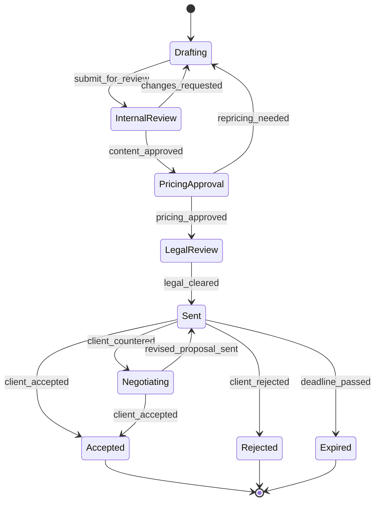
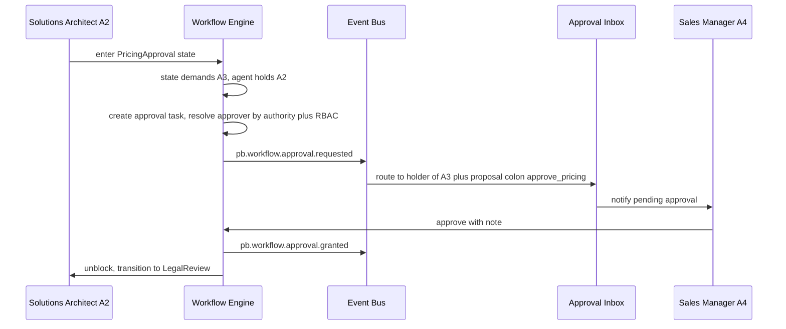

# 010 — Workflow Engine

The Workflow Engine is layer **L6** of the Genesis stack (`000_Glossary.md` §3.1):
durable orchestration of multi-step business processes that span AI Employees,
humans, and external systems. It sits above the Agent Runtime (`006_Agent_Runtime.md`)
and below the product modules (CRM, Ticketing, Proposal Engine, Billing) it
coordinates. It never redefines agent lifecycle, the cognitive Decision Pipeline,
events, or memory — those are owned by `006`, `003_Cognitive_Architecture.md`,
`005_Event_Model.md`, and `008_Memory_Engine.md` respectively, and are referenced
here.

Everything of consequence a workflow does is an **event** on the backbone
(`005_Event_Model.md`). Workflows both **emit** `pb.workflow.*` events and
**react** to events from any context, so orchestration stays auditable, replayable,
and decoupled — exactly the rule the foundation already enforces for `apps/`
(`docs/ARCHITECTURE.md` §2).

---

## Overview

A **Workflow** is a durable, long-lived, multi-actor process with an explicit,
inspectable state. It is the right tool when work must survive process restarts,
pause for hours or weeks awaiting a human, coordinate several agents and systems,
and leave a complete audit trail. Examples: taking a lead to a signed deal,
resolving a support ticket to an SLA, or dunning an overdue invoice.

This is deliberately distinct from the agent **Decision Pipeline**
(`003_Cognitive_Architecture.md`): the cognitive loop
(perceive → recall → reason → decide → act → reflect) is a single, in-the-moment
reasoning step scoped to one agent, optimised for open-ended judgement, and it
completes in seconds. A Workflow is the durable scaffolding _around_ many such
steps and around the humans and systems between them.

### When to use which

| Dimension            | Decision Pipeline (`003`)         | Workflow (this document)                            |
| -------------------- | --------------------------------- | --------------------------------------------------- |
| Time horizon         | Seconds to minutes                | Minutes to weeks                                    |
| Actors               | One agent                         | Many agents plus humans plus systems                |
| State                | Working memory, transient         | Persisted state machine, resumable                  |
| Shape of the problem | Open-ended judgement              | A known process with defined stages and gates       |
| Failure recovery     | Retry the reasoning step, reflect | Durable retry, timeout, compensation, escalation    |
| Human involvement    | Optional, ad hoc                  | First-class HITL approval gates tied to authority   |
| Auditability         | Reflection plus events            | Full transition history reconstructable from events |

The two compose. A Workflow **state** typically delegates a judgement call to an
agent, which runs its Decision Pipeline; the agent's decision produces an event
that drives the Workflow's next transition. Rule of thumb: reach for a Workflow
when the _sequence and the gates_ matter and must be governed; reach for the
Decision Pipeline when the _judgement inside a step_ matters. Encoding a fixed,
governed process as free-form agent reasoning would be non-deterministic,
unauditable, and impossible to gate — the anti-pattern this engine exists to
prevent.

Workflow templates are **Procedural memory** (`000_Glossary.md` §5): a published
`WorkflowDefinition` is a playbook the organisation has learned, stored alongside
the Company Brain and versioned.

---

## State machines

A workflow is a typed **state machine**. The definition is data (a versioned
JSONB spec), not code, so new processes ship without a deploy and every running
instance pins the exact version it started under.

### Model

- **State** — a named node. Typed as `task` (does work, usually via an agent or
  capability), `approval` (a HITL gate, see below), `wait` (blocks on a timer or
  an external event), `choice` (branches on guards, no side effects), `parallel`
  (fans out into concurrent branches that join), or `terminal`
  (`completed` / `failed` / `cancelled`).
- **Transition** — a directed edge `from → to` triggered by an **event** or a
  **signal**, permitted only if its **guard** passes.
- **Guard** — a side-effect-free boolean over the instance's variables and the
  triggering event payload, written in a small sandboxed expression language
  (CEL-style). Guards never call out; anything with a side effect is an action.
- **Action** — a typed effect run on state entry, on exit, or on a transition.
  The action vocabulary is closed and each is individually retryable and
  idempotent: `invoke_capability`, `call_agent`, `assign_task`, `emit_event`,
  `set_variable`, `schedule_timer`, `wait_for_event`, `compensate`.
- **Event** — the fuel. States subscribe to events (`on`); actions emit them.
  Internal progress is published as `pb.workflow.*` (see below).

### Emitted events (`pb.workflow.*`)

`pb.workflow.definition.published` · `pb.workflow.instance.started` ·
`pb.workflow.state.entered` · `pb.workflow.state.exited` ·
`pb.workflow.transition.fired` · `pb.workflow.instance.completed` ·
`pb.workflow.instance.failed` · `pb.workflow.instance.cancelled` ·
`pb.workflow.instance.suspended` · `pb.workflow.instance.resumed` ·
`pb.workflow.approval.requested` · `pb.workflow.approval.granted` ·
`pb.workflow.approval.denied` · `pb.workflow.approval.escalated` ·
`pb.workflow.step.retried` · `pb.workflow.step.failed` ·
`pb.workflow.timer.scheduled` · `pb.workflow.timer.fired` ·
`pb.workflow.timeout.breached` · `pb.workflow.sla.warned` ·
`pb.workflow.compensation.started` · `pb.workflow.compensation.completed` ·
`pb.workflow.task.assigned`.

All follow the `pb.<context>.<aggregate>.<event>` past-tense convention
(`000_Glossary.md` §9) and carry the envelope, correlation, and causation IDs
defined once in `005_Event_Model.md`. The `WorkflowInstance` `id` is the
correlation ID for everything the instance causes, so an auditor can reconstruct
the full run — including the agent decisions and human approvals inside it — by
correlation.

### Schema

`WorkflowDefinition` (published spec, immutable per version):

```json
{
  "id": "uuid",
  "tenant_id": "uuid",
  "slug": "proposal-approval",
  "version": 4,
  "name": "Proposal approval",
  "description": "Draft to signed proposal with pricing and legal gates.",
  "initial_state": "drafting",
  "variables_schema": { "json_schema": "..." },
  "states": [
    {
      "id": "pricing_approval",
      "type": "approval",
      "authority_required": "A3",
      "rbac_permission": "proposal:approve_pricing",
      "entry_actions": [{ "kind": "assign_task", "assignee_role": "sales_manager" }],
      "on": {
        "pb.workflow.approval.granted": [{ "target": "legal_review" }],
        "pb.workflow.approval.denied": [{ "target": "drafting" }]
      },
      "sla": { "warn_after": "PT4H", "breach_after": "PT24H" },
      "timeout": { "after": "PT48H", "on_breach": "escalate" }
    }
  ],
  "compensations": { "sent": [{ "kind": "invoke_capability", "capability": "retract_proposal" }] },
  "triggers": [{ "kind": "event", "match": "pb.proposal.draft.created" }]
}
```

`WorkflowInstance` (mutable runtime, event-sourced):

```json
{
  "id": "uuid",
  "tenant_id": "uuid",
  "definition_id": "uuid",
  "definition_version": 4,
  "business_key": "proposal:PR-2026-0142",
  "current_state": "pricing_approval",
  "status": "running",
  "variables": { "deal_value": 48000, "discount_pct": 12, "segment": "mid-market" },
  "correlation_id": "uuid",
  "idempotency_key": "sha256:...",
  "started_at": "2026-07-13T09:00:00Z",
  "updated_at": "2026-07-13T09:14:00Z",
  "deadline_at": "2026-07-20T09:00:00Z",
  "last_event_seq": 87
}
```

### Persistence tables (Postgres, default `Scheduler`/`EventStore` stack)

| Table                      | Purpose                                                                                            |
| -------------------------- | -------------------------------------------------------------------------------------------------- |
| `workflow_definitions`     | Versioned specs; `(tenant_id, slug, version)` unique; `published_at`.                              |
| `workflow_instances`       | Runtime rows, one per instance; projection of the instance event stream.                           |
| `workflow_snapshots`       | Periodic `(instance_id, event_seq, variables, current_state)` for fast rehydration.                |
| `workflow_tasks`           | Human tasks and approvals (assignee, `authority_required`, `rbac_permission`, `due_at`, decision). |
| `workflow_timers`          | Pending timers/timeouts/cron fires, claimed by the `Scheduler` port.                               |
| `workflow_step_executions` | One row per attempt keyed by idempotency key — the retry ledger.                                   |

`workflow_instances` and `workflow_tasks` are **projections** rebuilt from the
instance event stream; the append-only stream in the `EventStore` is the source
of truth (`005_Event_Model.md`), so a corrupted projection is regenerated by
replay. Every row carries `tenant_id`; isolation is absolute (`000_Glossary.md`
§12.6).

### Example — proposal approval



`Drafting` and `Negotiating` are `task` states delegated to the Solutions
Architect and Sales Manager (`007_AI_Employees.md`); `PricingApproval` and
`LegalReview` are `approval` gates; `Sent → Expired` is driven by a per-state
timer.

---

## Business workflows

Concrete v1 processes, each a short state list. Each state either delegates to an
AI Employee's Decision Pipeline or waits on a HITL gate or external event, and
each transition is an event.

**Lead-to-deal** (CRM · Sales Manager; scored by `LeadScoreNet` and `SalesNet`,
`011_ML_Platform.md`):
`Captured → Enriching → Scoring → Qualifying → Qualified → ProposalDrafting →
ProposalSent → Negotiating → Won | Lost`. `Won` starts the onboarding workflow;
`Lost` records a reflection for learning (`008_Memory_Engine.md`).

**Ticket resolution** (Ticketing · Support; prioritised by `TaskPriorityNet`):
`Received → Triaged → Assigned → InProgress → PendingCustomer → Resolved →
Closed`, with `Reopened → InProgress`. SLA timers attach to `Assigned` and
`InProgress`.

**Proposal approval** (Proposal Engine · Solutions Architect; win-modelled by
`ProposalNet`): `Drafting → InternalReview → PricingApproval → LegalReview →
Sent → Accepted | Rejected | Expired` (diagram above). Pricing and legal are
authority-gated approvals.

**Invoice dunning** (Billing · Finance; **outreach-gated** — every customer-facing
message inherits the compliance controls of `AI_DEPLOY_AUTHORIZATION.md` §Legal
and `OUTREACH_COMPLIANCE_CONTROLS`):
`Issued → DueSoon → Overdue → Reminder1 → Reminder2 → FinalNotice → Escalated →
Paid | WrittenOff`. Reminder states are timer-driven waits; `FinalNotice` and
`WrittenOff` require a HITL approval; each message checks suppression/opt-out and
logs outreach history before sending.

---

## Approval workflows

An `approval` state is a HITL gate. It couples the platform's two orthogonal
controls (`000_Glossary.md` §8): **authority** (what an agent may do without a
human, A0–A5) and **RBAC/ABAC** identity permission. An action requires _both_
and the **lower of the two governs**. When an agent's authority is below what a
state demands, the Workflow Engine opens an approval task and blocks the branch
until it is resolved.

The engine computes the required approver from the state's `authority_required`:
the task routes to the lowest-cost actor that holds _both_ the needed authority
and the `rbac_permission`. That may be a human or a higher-authority agent.

| State demands | Acting agent holds                               | Result                                                    |
| ------------- | ------------------------------------------------ | --------------------------------------------------------- |
| A2 (approval) | A0/A1                                            | Approval task raised; a human or an A2+ agent must grant. |
| A2 (approval) | A2+                                              | Agent may act directly; no gate.                          |
| A3 (bounded)  | A2                                               | Escalate to an A3+ agent or a human with the permission.  |
| Any           | Sufficient authority but missing RBAC permission | Denied by identity — never an authority override.         |

First-contact outreach is capped at A2 regardless of the employee's level
(`000_Glossary.md` §8), so any workflow whose state performs first contact
(e.g. the Outbound Sales Engine surface) always opens an approval gate on the
first message.

Approvals are events: `pb.workflow.approval.requested`,
`pb.workflow.approval.granted`, `pb.workflow.approval.denied`, and
`pb.workflow.approval.escalated`. A grant carries the approver identity, the
authority exercised, and an optional note; the pair (request, decision) is the
audit record.



If the approver denies, the engine emits `pb.workflow.approval.denied` and
follows the state's `on` mapping (here, back to `Drafting`). If no decision
arrives before the state SLA, the request auto-escalates (see Escalation).

API surface (internal namespace `/api/v1/ai/workflows`, RBAC-guarded via the
foundation's `require_roles`/permission dependency, `apps/api/.../api/deps.py`):

| Method + route                                    | Purpose                                       |
| ------------------------------------------------- | --------------------------------------------- |
| `POST /api/v1/ai/workflows/definitions`           | Publish a `WorkflowDefinition` version.       |
| `GET /api/v1/ai/workflows/definitions/{slug}`     | Fetch published spec(s).                      |
| `POST /api/v1/ai/workflows/instances`             | Start an instance (`Idempotency-Key` header). |
| `GET /api/v1/ai/workflows/instances/{id}`         | Read current state and variables.             |
| `GET /api/v1/ai/workflows/instances/{id}/history` | Full transition history (from events).        |
| `POST /api/v1/ai/workflows/instances/{id}/signal` | Deliver an external event/signal.             |
| `POST /api/v1/ai/workflows/instances/{id}/cancel` | Cancel; runs compensations.                   |
| `GET /api/v1/ai/workflows/tasks`                  | Approval/task inbox filtered by assignee.     |
| `POST /api/v1/ai/workflows/tasks/{id}/claim`      | Claim a task.                                 |
| `POST /api/v1/ai/workflows/tasks/{id}/approve`    | Grant (records authority + note).             |
| `POST /api/v1/ai/workflows/tasks/{id}/deny`       | Deny (records reason).                        |

---

## Long-running tasks

Instances live for days or weeks and must survive restarts, deploys, and partial
failures. Two mechanisms provide durability:

1. **Event-sourced state.** Every transition and action outcome is appended to
   the instance's event stream in the `EventStore`. The `workflow_instances` row
   is a projection; state is never _only_ in memory. On recovery the engine
   rehydrates from the latest `workflow_snapshots` row plus the events after it —
   snapshots bound replay cost so a long instance never replays from zero.
2. **Durable timers via the `Scheduler` port.** Waits, timeouts, and cron fires
   are rows in `workflow_timers` that a `Scheduler` worker claims with
   `SELECT ... FOR UPDATE SKIP LOCKED`. A crashed worker's timers are re-claimed;
   nothing is lost to a restart.

### Sagas and compensation

Genesis has no distributed transactions across product modules — modules
integrate only via events (`000_Glossary.md` §3.1). A workflow that performs
several external side effects is therefore an **orchestration saga**: each state
that mutates the outside world declares a **compensating action** in the
definition's `compensations` map. On unrecoverable failure or cancellation the
engine runs the compensations for completed side-effecting states in **reverse
order**, emitting `pb.workflow.compensation.started` / `.completed` for each, then
moves the instance to a terminal `failed`/`cancelled` state. Example: cancelling
a `Sent` proposal invokes `retract_proposal`; a failed provisioning saga
de-provisions in reverse. Compensations are themselves retryable and idempotent.

### Engine choice — build on Postgres vs Temporal vs Camunda

| Option                                                    | Pros                                                                                                                                                                                                                               | Cons                                                                                                                    |
| --------------------------------------------------------- | ---------------------------------------------------------------------------------------------------------------------------------------------------------------------------------------------------------------------------------- | ----------------------------------------------------------------------------------------------------------------------- |
| **Build on the `Scheduler`/Postgres backbone (selected)** | Zero new infrastructure — the foundation already runs Postgres and Redis (`docs/ARCHITECTURE.md`); event-sourced state reuses the `EventStore`; definitions are data; no lock-in; one Docker Compose stack (`docs/DEPLOYMENT.md`). | We own timer accuracy, retry, and scale; Postgres polling is a future hotspot at very high fan-out.                     |
| **Temporal**                                              | Battle-tested durable execution, code-as-workflow, mature timers, retries, history, visibility.                                                                                                                                    | New cluster to run and operate; workflow logic lives in Temporal SDK code, a partial lock-in; heavier for v1's volumes. |
| **Camunda 8 / Zeebe (BPMN)**                              | Rich BPMN modelling, analyst-friendly diagrams, human-task tooling.                                                                                                                                                                | JVM-centric operational surface; BPMN semantics are heavier than our closed action set; another cluster.                |

**Selected: build on the `Scheduler`/Postgres backbone.** It honours "prefer the
default adapter until scale forces the alternative, and record the trigger"
(`000_Glossary.md` §12.7) and "no new infrastructure beyond the foundation, no
lock-in" (§3.2). The `Scheduler` port already lists **Temporal** as its scale-up
adapter — the engine depends on the port, not on Postgres tables directly, so the
migration is an adapter swap, not a rewrite.

**Move-to-Temporal trigger (record this).** Migrate the `Scheduler` adapter to
Temporal when any of the following holds for a sustained window: concurrently
_active_ instances exceed ~10^4–10^5 and timer polling contends on Postgres;
p95 timer-fire latency breaches its SLO under load; durable step fan-out or
multi-region execution is required; or the retry/visibility burden of the
home-grown engine exceeds the cost of operating a Temporal cluster. Until a
measured signal crosses one of these lines, we do **not** adopt Temporal —
measure before optimising (`AI_DEPLOY_AUTHORIZATION.md` §Performance).

---

## Retries

Any action or step may fail transiently. Retry policy is declared per action and
defaulted per action kind:

- **Classification.** Errors are `retriable` (timeouts, 5xx, lock contention,
  rate limits) or `terminal` (validation, permission denied, business rejection).
  Only retriable errors retry; terminal errors fail the step immediately.
- **Backoff.** Exponential with full jitter — `min(cap, base * 2^attempt)` plus
  jitter — bounded by `max_attempts`. Defaults: `base=2s`, `cap=5m`,
  `max_attempts=6`. Approval and human tasks do not retry; they escalate.
- **Idempotency keys.** Every side-effecting action derives a deterministic
  idempotency key from `(instance_id, state_id, attempt_group)` and passes it to
  the capability/tool. The `workflow_step_executions` ledger records one row per
  attempt so a redelivered event or a worker crash never double-executes a
  payment, email, or provisioning call. Capabilities are expected to honour the
  key (the CRM/Billing modules dedupe on it).
- **Exhaustion.** When `max_attempts` is reached the step emits
  `pb.workflow.step.failed`, the instance moves to its declared failure handler or
  to the dead-letter path, and Escalation raises a human task. Nothing is silently
  dropped.

Each retry emits `pb.workflow.step.retried` with the attempt number, so retry
storms are observable in metrics (`docs/ARCHITECTURE.md` §6).

---

## Timeouts

Every state may declare a `timeout.after` (ISO-8601 duration) and the whole
instance may declare a `deadline_at`. Timeouts are durable `workflow_timers`
rows, not in-memory sleeps, so they survive restarts.

On breach the engine emits `pb.workflow.timeout.breached` and applies the state's
`on_breach` policy:

- `escalate` — raise a human/higher-authority task (see Escalation) and keep the
  instance alive.
- `transition:<state>` — move to an explicit timeout branch (e.g.
  `Sent → Expired`).
- `fail` — terminate via the failure path, running compensations.
- `retry` — re-enter the state (bounded by the retry policy).

Approval states additionally carry an `sla` (`warn_after`, `breach_after`).
`warn_after` emits `pb.workflow.sla.warned` (a nudge, no state change);
`breach_after` triggers escalation. Separating the soft SLA warning from the hard
timeout lets work be surfaced _before_ it is late.

---

## Escalation

Escalation moves stalled or at-risk work to someone who can unblock it, on a
defined ladder, so nothing sits silently past its SLA. It fires when an approval
SLA warns or breaches, a step exhausts retries, or a timer breaches with an
`escalate` policy.

The escalation ladder walks **up authority and up the org**:

1. Reassign to a **higher-authority agent** that holds the required permission
   (e.g. an A2 Sales Manager's blocked pricing gate escalates to an A4 peer or
   the Program Manager).
2. If none is available or the SLA has hard-breached, raise a **human task** to
   the accountable role.
3. On repeated breach, notify the **manager / CEO** role and mark the instance
   `at_risk` for dashboards.

Each hop emits `pb.workflow.approval.escalated` (or a task reassignment event)
with the reason and the new assignee, and resets the SLA clock for the new hop.
`WorkflowNet` (`011_ML_Platform.md`) feeds this loop: its **stall-probability**
output lets the engine escalate _predictively_ — before the SLA is breached —
when an instance is deviating from its expected path. Predictive escalation is
advisory (A1-style suggestion): it opens a task, it never auto-acts beyond an
agent's authority.

---

## Scheduling

Workflows start three ways, all via the `Scheduler` port (default:
PostgreSQL-backed queue; scale-up: Temporal — `000_Glossary.md` §3.2):

- **Cron / recurring.** A `trigger` of kind `cron` (e.g. nightly dunning sweep,
  weekly pipeline review). The `Scheduler` enqueues a start at each fire time.
- **Delayed / one-shot.** A future-dated start (`run_once_at`), e.g. a follow-up
  three days after a proposal is sent.
- **Event-triggered.** A `trigger` of kind `event` with a match filter subscribes
  to the `EventBus`; a matching `pb.*` event starts an instance and seeds its
  variables from the payload (e.g. `pb.proposal.draft.created` starts the
  proposal-approval workflow). This is the primary, most decoupled path.

Agent-internal scheduling (an agent waking itself to continue a task) is owned by
`006_Agent_Runtime.md` and is out of scope here; the Workflow Engine schedules
_process_ starts and _timers_, and both engines share the same `Scheduler` port
so there is one queue to operate.

### WorkflowNet integration

`WorkflowNet` (`011_ML_Platform.md`) consumes the `pb.workflow.*` event stream
and predicts, per running instance: the **next-state distribution**, the
**expected time-to-complete**, and the **stall probability**. The engine uses
these three signals to (1) prioritise which pending work agents pick up next
(feeding `TaskPriorityNet`), (2) pre-warm approval routing before a gate is
reached, and (3) escalate predictively as described above. `WorkflowNet` is
purely advisory — its predictions never change a transition; only guards and
events do that. Before any model is trained, the engine falls back to the
deterministic historical-average path per definition, so scheduling and
escalation work with zero models present (`011_ML_Platform.md`, heuristic
fallback).

---

## Observability and readiness

Per `AI_DEPLOY_AUTHORIZATION.md` §Observability, the engine exposes the
foundation's health/readiness/metrics/structured-log surfaces
(`docs/ARCHITECTURE.md` §6): counters and histograms for instances started,
transitions fired, active instances, timer-fire lag, retry rate, approval
latency, SLA breaches, and compensations run — labelled by definition slug, never
by instance ID. Because state is event-sourced, the full history of any instance
is reconstructable for audit (`005_Event_Model.md`), satisfying the "recoverable,
observable, auditable" bar of §Production readiness.

**Cross-references:** `003_Cognitive_Architecture.md` (Decision Pipeline),
`005_Event_Model.md` (event envelope and correlation), `006_Agent_Runtime.md`
(agent lifecycle and the shared `Scheduler`), `007_AI_Employees.md` (the roles
that act in states), `008_Memory_Engine.md` (procedural memory / playbooks),
`011_ML_Platform.md` (`WorkflowNet`, `TaskPriorityNet`), `012_Security.md`
(authority and RBAC/ABAC), `013_APIs.md` (workflow API contracts),
`014_Data_Model.md` (aggregate and table definitions).
