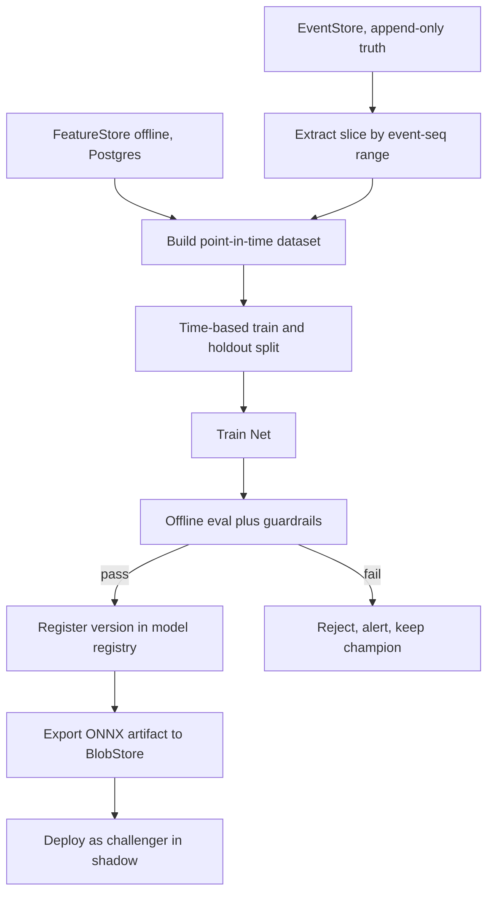
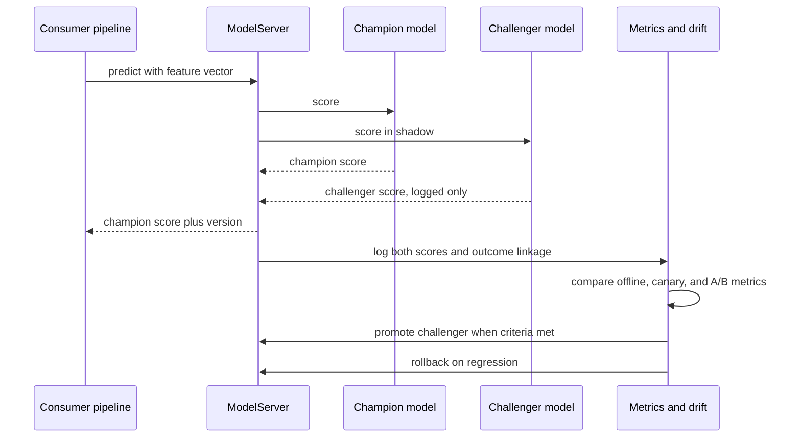

# 011 — ML Platform

Genesis **does not train foundation LLMs.** Open-ended reasoning, language
understanding, and generation are provided by **hosted LLMs via the
`ModelProvider` port** (default: Anthropic Claude; swappable to OpenAI, Google,
or a local vLLM — `000_Glossary.md` §3.2, §3.4). "ML" in this document means
exclusively **small, specialised Nets**: narrow models for ranking, scoring, and
prediction that make the reasoning layer faster, cheaper, and more consistent.
The two are complementary — the LLM decides _what_ to do in open situations; the
Nets rank and score the structured inputs and outputs around that decision.

Every Net in this platform ships with a **deterministic heuristic fallback**, so
the platform is fully operational **before any model is trained**. A Net is an
optimisation over a working heuristic, never a prerequisite for the feature.

This document owns the ML strategy, the eight-Net roster, and the training,
feature, evaluation, serving, and monitoring machinery. It defers to
`005_Event_Model.md` for the events that become training labels,
`008_Memory_Engine.md` and `003_Cognitive_Architecture.md` for the memory and
reflection consumers, and `010_Workflow_Engine.md` for the workflow consumer.

---

## Strategy and rationale

The question is how Genesis should get structured predictions — rank memories,
score leads, predict deal progression. Three approaches were compared.

| Approach                                 | Cost / latency                                                  | Explainability                                   | Data efficiency                                   | Verdict                                     |
| ---------------------------------------- | --------------------------------------------------------------- | ------------------------------------------------ | ------------------------------------------------- | ------------------------------------------- |
| **A. Hosted LLM prompting only**         | High per call, 100s of ms to seconds, token cost per prediction | Opaque, non-deterministic across calls           | Zero training data needed                         | Fallback / cold start, not the primary path |
| **B. Fine-tune a large model per task**  | High training and serving cost, GPU footprint, latency          | Still largely opaque                             | Needs large labelled corpora we do not have early | Rejected                                    |
| **C. Small specialised Nets (selected)** | Cheap, sub-10 ms CPU inference via `ModelServer`                | Feature attributions on tree models; inspectable | Learns from thousands, not millions, of examples  | **Selected**                                |

**Selected: small specialised Nets (C).** For the ranking/scoring/prediction
tasks Genesis actually has, a gradient-boosted tree or small MLP over a few dozen
engineered features beats both alternatives on the axes that matter here:

- **Cost & latency.** A Net runs in single-digit milliseconds on CPU behind the
  `ModelServer` port (ONNX Runtime). Calling an LLM to rank every memory item in
  every Working Set assembly (`008_Memory_Engine.md`) would dominate both the
  latency budget and the token bill — measured before committing, per
  `AI_DEPLOY_AUTHORIZATION.md` §Performance.
- **Explainability.** Governance and the "auditable" principle
  (`000_Glossary.md` §12.4) need to know _why_ a lead scored high or a customer
  was flagged at-risk. Tree models give feature attributions; a fine-tuned LLM
  does not.
- **Data efficiency.** Early tenants have thousands of events, not millions.
  Small models learn useful signal at that scale; fine-tuning a large model would
  overfit or starve.
- **No lock-in.** A Net is an ONNX artifact behind a port; nothing binds us to a
  framework or vendor (`000_Glossary.md` §12.3). LLM reasoning stays behind
  `ModelProvider` and is never fine-tuned, so we never inherit a custom-weights
  maintenance burden.

The trade-off: small Nets need feature engineering and per-Net pipelines, and
they do not generalise beyond their task. That is acceptable — each Net's task is
narrow and stable, and the heuristic fallback covers the cold-start gap while
labels accumulate.

---

## The model roster

Exactly eight Nets, per `000_Glossary.md` §10. Each is a small model with a
single job, a single primary consumer, an explicit label source drawn from the
event backbone (`005_Event_Model.md`) or reflections (`008_Memory_Engine.md`),
and a documented heuristic fallback.

### MemoryRankNet

- **Purpose.** Rank candidate memory items when the Context Builder assembles a
  Working Set for a reasoning step.
- **Consumer.** The Memory Engine (`008_Memory_Engine.md`) / Context Builder —
  every agent, every Decision Pipeline step (`003_Cognitive_Architecture.md`).
- **Input features.** Query-item embedding similarity, recency, importance score,
  access frequency, source authority, memory type (`000_Glossary.md` §5), decay
  weight, tenant-normalised popularity.
- **Output.** A pointwise relevance score per candidate, used to order and
  truncate the Working Set to the context budget.
- **Model family.** Learning-to-rank via gradient-boosted ranking (LambdaMART,
  objective `rank:ndcg`). **Alternative considered:** a small bi-encoder MLP with
  pairwise hinge loss — richer, but heavier to serve and harder to explain;
  rejected for v1.
- **Label source.** Which recalled items were actually cited/used in the step and
  correlated with a good outcome — derived from `pb.memory.item.recalled`,
  `pb.agent.reflection.recorded` (`008`), and downstream outcome events.
- **Offline metric.** NDCG@k (primary), MRR (secondary).
- **Heuristic fallback.** `0.5*similarity + 0.2*recency + 0.2*importance +
0.1*frequency`, decay-weighted — the same signals, hand-weighted.

### ProposalNet

- **Purpose.** Predict a proposal's win probability and recommend a pricing band
  and template.
- **Consumer.** Solutions Architect / Proposal Engine (`007_AI_Employees.md`),
  driving the proposal-approval workflow (`010_Workflow_Engine.md`).
- **Input features.** Deal value, industry/segment, product mix, discount,
  turnaround time, historical acceptance by segment, contact engagement, prior
  proposal count.
- **Output.** Calibrated win probability plus a recommended price band and
  template id.
- **Model family.** Gradient-boosted trees (binary classification with isotonic
  calibration). **Alternative considered:** logistic regression — a strong,
  explainable baseline retained as the challenger floor, but weaker on
  interactions.
- **Label source.** `pb.proposal.accepted` / `pb.proposal.rejected` / expiry
  events (`005`).
- **Offline metric.** PR-AUC (primary, class-imbalanced), plus Brier score for
  calibration.
- **Heuristic fallback.** Segment-level historical acceptance rate adjusted by a
  discount elasticity table.

### SalesNet

- **Purpose.** Predict deal progression and rank next-best-action for open
  opportunities.
- **Consumer.** Sales Manager / CRM (`007_AI_Employees.md`), lead-to-deal
  workflow (`010_Workflow_Engine.md`).
- **Input features.** Stage, days-in-stage, activity counts, `LeadScoreNet`
  output, engagement recency, contract value, seasonality.
- **Output.** Probability of advancing the stage, an expected close-date estimate,
  and a ranked next-best-action list.
- **Model family.** Gradient-boosted trees (multi-output: classification plus a
  survival-style time-to-close). **Alternative considered:** a GRU over the
  activity timeline — better for long sequences, deferred until sequence volume
  justifies it.
- **Label source.** `pb.crm.deal.stage_changed`, `pb.crm.deal.won`,
  `pb.crm.deal.lost` (`005`).
- **Offline metric.** AUC-ROC and calibration for advance probability; top-k
  accuracy for next-best-action.
- **Heuristic fallback.** Stage-transition base rates from historical pipeline,
  penalised by days-in-stage.

### WorkflowNet

- **Purpose.** Predict the next state, expected time-to-complete, and stall
  probability of a running workflow instance.
- **Consumer.** The Workflow Engine (`010_Workflow_Engine.md`) — scheduling,
  predictive escalation, and prioritisation.
- **Input features.** Definition slug, current state, elapsed time-in-state,
  instance variables, assignee load, historical path statistics for the
  definition.
- **Output.** Next-state probability distribution, expected time-to-complete
  (regression), stall probability.
- **Model family.** Gradient-boosted multiclass (next state) plus gradient-boosted
  regression (duration). **Alternative considered:** a first-order Markov model
  over states — a cheap, interpretable baseline kept as the heuristic; loses the
  variable and load context.
- **Label source.** `pb.workflow.transition.fired`,
  `pb.workflow.instance.completed`, `pb.workflow.timeout.breached`,
  `pb.workflow.approval.escalated` (`010`, `005`).
- **Offline metric.** Next-state top-1 and top-3 accuracy; MAE on duration.
- **Heuristic fallback.** Empirical per-definition transition frequencies and mean
  time-in-state (the Markov baseline).

### TaskPriorityNet

- **Purpose.** Rank an agent's pending task queue.
- **Consumer.** The Agent Runtime scheduler (`006_Agent_Runtime.md`) — every AI
  Employee.
- **Input features.** Due-date proximity, business value, blocker/dependency
  status, SLA-breach risk (from `WorkflowNet`), requester authority, effort
  estimate, age.
- **Output.** A priority score used to order the queue.
- **Model family.** Learning-to-rank (gradient-boosted ranking). **Alternative
  considered:** a fixed weighted-linear scorer — which is exactly the heuristic
  fallback, kept as the interpretable floor.
- **Label source.** Which tasks were completed on time and led to positive
  outcomes — `pb.agent.task.completed`, SLA-breach events, and reflections
  (`008_Memory_Engine.md`).
- **Offline metric.** NDCG on realised business value; on-time-completion lift.
- **Heuristic fallback.** `w1*urgency + w2*value + w3*sla_risk - w4*effort`, with
  documented weights.

### CustomerHealthNet

- **Purpose.** Predict account health and churn risk.
- **Consumer.** Support and Sales Manager (`007_AI_Employees.md`); CEO dashboards.
- **Input features.** Ticket volume and sentiment trend, product-usage trend,
  invoice/payment timeliness, NPS, engagement recency, contract tenure.
- **Output.** A 0–100 health score plus a calibrated churn probability with a
  predicted horizon.
- **Model family.** Gradient-boosted trees (classification with calibration).
  **Alternative considered:** logistic regression — retained as the challenger
  baseline for its transparency.
- **Label source.** `pb.billing.subscription.cancelled`,
  `pb.crm.account.churned`, renewal events, and ticket-sentiment signals (`005`,
  `008`).
- **Offline metric.** AUC-ROC with churn lead-time; calibration (Brier).
- **Heuristic fallback.** Weighted rule: recent payment lateness, negative-ticket
  spike, and usage decline each add risk points above thresholds.

### LeadScoreNet

- **Purpose.** Score inbound and outbound leads for conversion likelihood.
- **Consumer.** Sales Manager and Marketing (`007_AI_Employees.md`); the CRM
  lead-to-deal workflow (`010_Workflow_Engine.md`).
- **Input features.** Firmographics, source channel, ICP-fit score, web/email
  engagement behaviour, enrichment completeness.
- **Output.** Conversion probability and an A–D grade.
- **Model family.** Gradient-boosted trees. **Alternative considered:** logistic
  regression — kept as the transparent baseline and challenger floor.
- **Label source.** `pb.crm.lead.qualified`, `pb.crm.lead.converted`, and
  disqualification events (`005`).
- **Offline metric.** PR-AUC and lift@decile (top-decile precision matters most
  for rep prioritisation).
- **Heuristic fallback.** Additive ICP-fit and engagement points banded into A–D.
- **Governance note.** Outbound use is compliance-gated — a high score never
  bypasses the outreach controls (`AI_DEPLOY_AUTHORIZATION.md` §Legal;
  `OUTREACH_COMPLIANCE_CONTROLS`) or the first-contact A2 cap
  (`000_Glossary.md` §8).

### ReflectionNet

- **Purpose.** Score the salience and quality of an agent's reflection and
  recommend whether its learning should be promoted to long-term memory.
- **Consumer.** The Reflection subsystem (`003_Cognitive_Architecture.md`) and the
  Memory Engine (`008_Memory_Engine.md`) consolidation/promotion loop.
- **Input features.** Reflection embedding, outcome delta (expected vs actual),
  novelty versus existing memory, action type, agent confidence, agent role.
- **Output.** A salience/quality score plus a promote / retain / decay
  recommendation.
- **Model family.** Small MLP over the reflection embedding concatenated with
  tabular features (alternatively gradient-boosted trees on the same). **Alternative
  considered:** LLM-as-judge via `ModelProvider` — higher quality on nuance but
  more costly, slower, and non-deterministic; used only as a sampled auditor and
  as the cold-start heuristic, not the online path.
- **Label source.** Whether a promoted learning was later recalled and correlated
  with good outcomes — `pb.agent.reflection.recorded`,
  `pb.memory.item.consolidated` (`008`), and downstream outcome events.
- **Offline metric.** AUC on "later-recalled-and-helpful"; correlation of score
  with realised usefulness.
- **Heuristic fallback.** Promote when `|outcome_delta|` and novelty both exceed
  thresholds; decay otherwise.

---

## Training pipelines

Pipelines are batch jobs orchestrated by the `Scheduler` port (`000_Glossary.md`
§3.2), reading from the `EventStore` (append-only source of truth) and the
`FeatureStore`, and writing to the model registry. No pipeline reads a live
projection for labels — it reads the immutable event stream, so a run is
reproducible from a fixed event-sequence range.

- **Cadence.** Per-Net and event-driven. Defaults: `MemoryRankNet` and
  `TaskPriorityNet` weekly (high label velocity); `WorkflowNet`, `SalesNet`,
  `LeadScoreNet` weekly; `ProposalNet`, `CustomerHealthNet`, `ReflectionNet`
  monthly (slower outcomes). Any Net also retrains **on a drift trigger** (see
  Metrics).
- **Reproducibility.** Every training run records a manifest: the event-sequence
  range consumed, the dataset content hash, the feature-definition versions, the
  code git SHA, hyperparameters, and the random seed. Re-running the manifest
  reproduces the artifact bit-for-similar. The manifest is linked from the model
  registry row and emitted as `pb.ml.training.completed` (or `.failed`).
- **Isolation.** Datasets are built per `tenant_id`; a global model, when used, is
  trained only on tenants that opted into pooled learning. Cross-tenant leakage is
  impossible by construction (`000_Glossary.md` §12.6).

---

## Feature stores

The `FeatureStore` port has two backings, per `000_Glossary.md` §3.2:
**offline in PostgreSQL** (training and backfill) and **online in Redis**
(low-latency serving). The foundation already runs both, so no new infrastructure
is introduced.

- **Feature definitions.** Declared as data: `name`, `entity`
  (e.g. `lead_id`, `deal_id`, `memory_id`, `account_id`, `workflow_instance_id`),
  `dtype`, `source` (the event type or projection it derives from), the
  transformation, a freshness SLO, and an online TTL. Definitions are versioned;
  a model version pins the feature-definition versions it was trained on.
- **Point-in-time correctness.** The offline store stamps every feature value with
  the event timestamp at which it became known. Training joins are **as-of joins**
  on label time: a row may use only feature values known _strictly before_ the
  label event. This prevents target leakage — the single most common way an ML
  platform silently overfits — and is enforced in the dataset builder, not left to
  discipline.
- **Offline/online parity.** The same feature-definition code computes offline
  (batch backfill into Postgres) and online (incremental update into Redis on the
  triggering event), so serving-time features match training-time features. Parity
  is asserted by a reconciliation check in offline evaluation.
- **Serving path.** At prediction time the consumer passes entity IDs; the online
  store hydrates features from Redis (falling back to Postgres on a miss) and hands
  the vector to `ModelServer`.

---

## Offline evaluation

Before any version is registered it must clear offline evaluation on a **temporal
holdout** — the most recent time slice is held out, never a random split, because
random splitting leaks future information across correlated events.

- **Per-Net primary metrics** are listed in the roster (NDCG, PR-AUC, AUC-ROC,
  top-k accuracy, MAE, calibration as appropriate).
- **Guardrail metrics** must not regress even if the primary metric improves:
  calibration (Brier), latency budget of the exported ONNX model, prediction
  stability versus the current champion, and per-segment performance floors.
- **Bias checks.** Per-segment slices (industry, company size, region, channel)
  are evaluated so a model that improves on aggregate but degrades a protected or
  material segment is rejected. This matters most for `LeadScoreNet`,
  `CustomerHealthNet`, and `ProposalNet`, which influence how people and accounts
  are treated.
- **Leakage checks.** Automated: assert the as-of join used no post-label
  features; flag any feature with implausibly high single-feature AUC; confirm
  train/holdout entity disjointness. A leakage flag fails the run.

A failing evaluation emits an alert and **keeps the current champion**; it never
promotes a weaker or unsafe model.

---

## Champion vs Challenger

A new version earns production traffic through a staged rollout, never a hard
cutover. Three stages:

1. **Shadow.** The challenger scores the same live requests as the champion but
   its output is only logged — never used. This validates offline/online parity
   and latency on real traffic at zero risk.
2. **Canary.** The challenger serves a small traffic slice (e.g. 5%) for a subset
   of entities; its **business** metric is compared to the champion's on matched
   cohorts.
3. **A/B.** A controlled split with a powered readout on the downstream business
   KPI (e.g. proposal win rate, on-time task completion, churn-flag precision).

**Promotion criteria (all must hold).** Offline primary metric ≥ champion by a
material margin; every guardrail passes; shadow prediction agreement and latency
within bounds; canary/A/B business metric non-inferior (or better) with
statistical significance; no bias-slice regression. Promotion emits
`pb.ml.model.promoted` (and `pb.ml.challenger.promoted`); the demoted champion is
retained for instant rollback.

---

## Deployment

- **Serving.** Nets are served through the `ModelServer` port — **ONNX Runtime
  behind FastAPI by default**, scale-up to Triton or TorchServe
  (`000_Glossary.md` §3.2). Standardising on **ONNX** as the artifact format
  decouples serving from the training framework (LightGBM, scikit-learn, PyTorch
  all export to ONNX), which is the no-lock-in guarantee (`000_Glossary.md` §12.3).
  **Alternative considered:** serving native framework objects (a LightGBM
  booster, a pickled sklearn model) — simpler initially but couples the serving
  runtime to each training framework and its version; rejected.
- **Serving contract.** `POST /predict` on `ModelServer` takes `{net, entity_ids
or feature_vector}` and returns `{score, model_version, confidence}`.
- **Model registry.** A `model_registry` table: `net`, `version`, `framework`,
  `onnx_uri` (in `BlobStore`), `training_run_id`, `dataset_hash`, `metrics`
  (JSONB), `status` (`shadow` / `canary` / `champion` / `retired`), `created_at`,
  `promoted_at`. It is the single source of truth for which artifact is live.
- **Versioning.** `net@vN`, monotonically increasing; a consumer may pin a version
  or float to `champion`. Every served prediction is stamped with its
  `model_version` for audit and for outcome attribution.
- **Admin API** (internal namespace `/api/v1/ai/ml`, RBAC-guarded via the
  foundation's permission dependency): `GET /models`, `GET /models/{net}`,
  `POST /models/{net}/promote`, `POST /models/{net}/rollback`,
  `GET /features/{net}`, `POST /training-runs`, `GET /metrics/{net}`.
- **Heuristic fallback (mandatory for every Net).** `ModelServer` returns the
  deterministic heuristic result — the one documented in each roster entry — when
  **no champion is registered**, when **`confidence` is below the Net's threshold**,
  or when **`ModelServer` is unavailable**. Consumers always receive a usable
  score; the fallback path is a first-class, tested code path, and its usage rate
  is a served metric. Registration emits `pb.ml.model.registered`.

---

## Rollback

Rollback is automatic and fast, because a regression in a scoring model degrades
business decisions silently if left in place.

- **Triggers.** A promoted model whose online business metric or guardrail
  regresses beyond its threshold over a monitoring window, a drift alarm crossing
  the retrain-or-revert line, or a serving error/latency SLO breach.
- **Action.** Demote the current champion and re-point `ModelServer` to the
  previous champion (retained by the registry); if none is safe, fall back to the
  **heuristic**. Rollback is a registry status flip — no redeploy — so it is
  seconds, not minutes. It emits `pb.ml.model.rolled_back` with the reason, and
  raises an alert for a human to investigate before the next promotion.
- **Safety.** Because every prediction is version-stamped and every Net has a
  heuristic floor, there is always a correct, available answer during and after a
  rollback.

---

## Metrics

Three layers of metrics, exposed on the foundation's `/metrics` and structured
logs (`docs/ARCHITECTURE.md` §6; `AI_DEPLOY_AUTHORIZATION.md` §Observability),
labelled by `net` and `model_version`, never by entity:

- **Serving metrics.** Prediction latency (p50/p95), throughput, error rate,
  **fallback rate** (how often the heuristic answered), and the confidence
  distribution. A rising fallback rate is an early failure signal.
- **Business metrics.** Per-Net downstream KPI attributed via the version stamp:
  `ProposalNet` → realised win rate; `LeadScoreNet` → conversion by predicted
  grade; `TaskPriorityNet` → on-time completion; `CustomerHealthNet` → churn-flag
  precision and lead-time; `MemoryRankNet` → recalled-item usefulness;
  `WorkflowNet` → next-state accuracy and escalation precision.
- **Drift detection.** Feature drift (PSI / KL divergence against the training
  distribution), label drift, and prediction drift are computed continuously.
  Crossing a threshold emits `pb.ml.drift.detected` and **feeds the retraining
  trigger** — closing the loop: events become features and labels, models are
  trained and evaluated, served predictions produce outcomes, outcomes and drift
  trigger the next training round.

All ML events use the `ml` context and the past-tense naming convention
(`000_Glossary.md` §9, `005_Event_Model.md`): `pb.ml.training.completed`,
`pb.ml.training.failed`, `pb.ml.model.registered`, `pb.ml.model.promoted`,
`pb.ml.challenger.promoted`, `pb.ml.model.rolled_back`, `pb.ml.drift.detected`,
and a sampled `pb.ml.prediction.served` for audit.

**Cross-references:** `000_Glossary.md` (ports, Net roster, memory taxonomy),
`002_System_Architecture.md` (port/adapter boundaries),
`003_Cognitive_Architecture.md` (reasoning and reflection consumers),
`004_Company_Brain.md` (knowledge substrate), `005_Event_Model.md` (label
sources and envelope), `006_Agent_Runtime.md` (`TaskPriorityNet` consumer, the
`Scheduler`), `007_AI_Employees.md` (Net consumers), `008_Memory_Engine.md`
(`MemoryRankNet`, `ReflectionNet` consumers), `010_Workflow_Engine.md`
(`WorkflowNet` consumer), `012_Security.md` (RBAC on the ML admin API).
