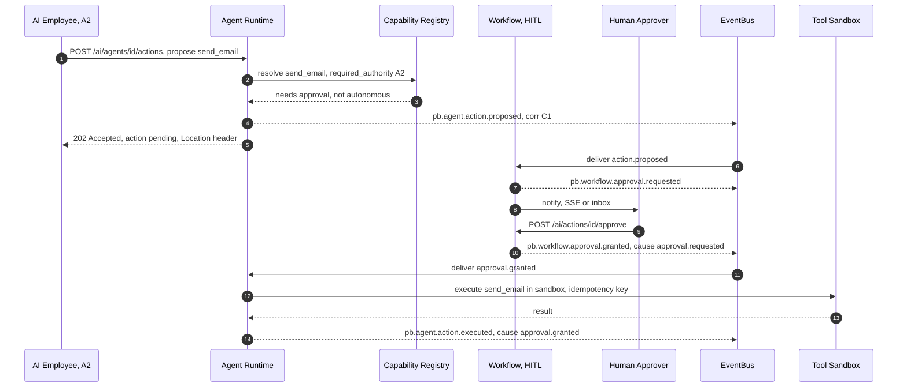

# 013 — APIs

This document specifies the **API surfaces** of Genesis: the routes, the auth and
**authority** required, the standard request/response and error envelope,
versioning and deprecation policy, idempotency, streaming, and the protocol
choice for each surface. It is the L8 contract of the layered architecture
(`002_System_Architecture.md`).

It builds directly on the foundation's real HTTP machinery: the `/api/v1` prefix
(`API_V1_PREFIX` in `apps/api/src/pb_api/main.py`), JWT bearer auth with the
`require_roles` RBAC dependency (`api/deps.py`), `X-Request-ID` propagation
(`middleware/request_context.py`), Prometheus metrics, and the module registry at
`GET /api/v1/platform/modules`. Every binding term — authority levels A0–A5,
memory types, contexts, event names — comes from `000_Glossary.md` (the spine);
where this document and the glossary appear to disagree, the glossary wins.

Genesis exposes **four surfaces**, each with a distinct audience and trust model:

| Surface      | Audience                                    | Trust                               | Base path(s)                     |
| ------------ | ------------------------------------------- | ----------------------------------- | -------------------------------- |
| **Public**   | External customers, partners, integrations  | Untrusted; JWT + tenant-scoped      | `/api/v1/<module>`               |
| **Internal** | Service-to-service (post module extraction) | Trusted mesh; mTLS + service tokens | `/internal/v1/<module>`          |
| **Agent**    | AI Employees acting through the runtime     | Semi-trusted; authority-gated       | `/api/v1/ai/agents`              |
| **UI / BFF** | First-party web/portal apps                 | Session JWT                         | `/api/v1/*` via `@pb/api-client` |

Domain surfaces (Memory, Knowledge, Workflow, Search) live primarily under the
Company Brain namespace `/api/v1/ai` (`000_Glossary.md` §4) and are consumed by
both agents and first-party UIs.

---

## Standard request and response envelope

Consistency with the foundation is a hard requirement. The foundation returns
resources directly and errors as `{"detail": ...}` (FastAPI default;
`main.py` unhandled handler returns `{"detail": "Internal Server Error"}`).
Genesis **preserves `detail`** and adds a structured superset via a single
error-handling middleware, so existing clients keep working while new clients get
machine-actionable errors.

**Success — single resource:** the resource object directly (as the foundation's
`UserRead` does), plus standard headers (`X-Request-ID`, `ETag` where
applicable).

**Success — collection:** the foundation's list shape (`UserList`:
`items`, `total`, `limit`, `offset`) is the canonical pagination envelope:

```json
{ "items": [ ... ], "total": 1234, "limit": 50, "offset": 100 }
```

**Error envelope (all non-2xx):**

```json
{
  "detail": "Lead 7f3a... not found",
  "error": {
    "code": "crm.lead.not_found",
    "message": "Lead 7f3a... not found",
    "status": 404,
    "request_id": "req-8f2c1a90",
    "trace_id": "4bf92f3577b34da6a3ce929d0e0e4736",
    "fields": {},
    "retryable": false,
    "docs": "https://api.pb-solutions.today/docs/errors#crm.lead.not_found"
  }
}
```

| Error field        | Meaning                                                                                                      |
| ------------------ | ------------------------------------------------------------------------------------------------------------ |
| `detail`           | Human string, **kept for foundation compatibility** (equals `error.message`).                                |
| `error.code`       | Stable, namespaced, greppable code (`<context>.<aggregate>.<reason>`). Clients switch on this, not on prose. |
| `error.status`     | HTTP status mirror.                                                                                          |
| `error.request_id` | The `X-Request-ID` (joins logs/metrics/events).                                                              |
| `error.trace_id`   | W3C trace id for distributed tracing.                                                                        |
| `error.fields`     | Per-field validation errors (`{ "email": "invalid" }`), for 422.                                             |
| `error.retryable`  | Whether a retry may succeed (429/503 true; 404/409 false).                                                   |

Canonical status usage matches the foundation: `401` unauthenticated (with
`WWW-Authenticate: Bearer`), `403` insufficient permission **or authority**,
`404` not found, `409` conflict, `422` validation, `429` rate limited, `503`
degraded dependency. Every response carries `X-Request-ID`; rate-limited
responses carry `Retry-After`.

**Authority on every mutating route.** Beyond RBAC (`require_roles`), agent-
initiated and mutating calls are gated by **Authority Level** (`000_Glossary.md`
§8). A call must satisfy **both** the caller's RBAC permission and sufficient
authority; the lower governs. Insufficient authority returns `403` with
`error.code = "authority.insufficient"` and the required level in `error.fields`.

---

## Public APIs

External customer/partner surface. Versioned REST under `/api/v1`, JWT bearer
(the foundation's access token, carrying `sub`, `role`, `jti`), tenant-scoped by
the `tenant_id` claim, rate-limited by the foundation's Redis-backed fixed-window
limiter. Representative routes across product modules:

| Method | Path                                   | Purpose                                | Auth    | Authority                       |
| ------ | -------------------------------------- | -------------------------------------- | ------- | ------------------------------- |
| GET    | `/api/v1/platform/modules`             | Module manifest (foundation)           | Public  | A0                              |
| POST   | `/api/v1/auth/login`                   | Obtain token pair (foundation)         | Public  | —                               |
| GET    | `/api/v1/crm/leads`                    | List leads (paged, filterable)         | client+ | A0                              |
| POST   | `/api/v1/crm/leads`                    | Create a lead                          | client+ | A2                              |
| GET    | `/api/v1/crm/leads/{lead_id}`          | Read a lead                            | client+ | A0                              |
| PATCH  | `/api/v1/crm/leads/{lead_id}`          | Update a lead                          | staff+  | A2                              |
| POST   | `/api/v1/crm/deals/{deal_id}/close`    | Close a deal (won/lost)                | staff+  | A3                              |
| GET    | `/api/v1/ticketing/tickets`            | List support tickets                   | client+ | A0                              |
| POST   | `/api/v1/ticketing/tickets`            | Open a ticket                          | client+ | A1                              |
| POST   | `/api/v1/billing/invoices/{id}/pay`    | Pay an invoice                         | client+ | A2                              |
| POST   | `/api/v1/proposals`                    | Generate a proposal draft              | staff+  | A1                              |
| POST   | `/api/v1/outbound/campaigns/{id}/send` | Start outbound send (compliance-gated) | staff+  | A2 (never above, first-contact) |

**Cross-cutting conventions.**

- **Auth:** `Authorization: Bearer <access_token>`; `client` is the lowest
  self-service role, `staff`/`admin` provisioned via CLI (foundation).
- **Rate limits:** per-client fixed-window (foundation default 120/min,
  configurable via `PB_API_RATE_LIMIT_PER_MINUTE`); `429` + `Retry-After`;
  health/metrics exempt. Public API keys (for partners) get their own tier.
- **Pagination:** `limit`/`offset` (foundation shape) for admin/list views;
  **opaque cursor** (`?cursor=...`, returns `next_cursor`) for large or
  event-ordered feeds where offset paging drifts.
- **Filtering/sorting:** explicit query params (`?status=open&sort=-created_at`),
  never arbitrary query languages, to keep the surface auditable and cacheable.
- **Idempotency:** all `POST`/state-creating calls accept `Idempotency-Key`
  (see [Idempotency](#idempotency-keys)).

**Outbound is compliance-gated.** Any outreach route inherits
`OUTREACH_COMPLIANCE_CONTROLS` (`apps/api/src/pb_api/platform/modules.py`) and
requires HITL before first contact — first-contact outreach is **never above
A2** regardless of the employee's level (`000_Glossary.md` §8;
`AI_DEPLOY_AUTHORIZATION.md` §Legal).

**Protocol choice — REST vs gRPC vs GraphQL.**

| Option                   | Pros                                                                                                                               | Cons                                                                                          | Verdict                                                |
| ------------------------ | ---------------------------------------------------------------------------------------------------------------------------------- | --------------------------------------------------------------------------------------------- | ------------------------------------------------------ |
| **REST/JSON (selected)** | Matches the foundation and its generated OpenAPI + `@pb/api-client`; cacheable; universally consumable by partners; auditable URLs | Over/under-fetch; multiple round-trips for graphs                                             | **Selected** for public                                |
| GraphQL                  | Flexible fetch; one endpoint                                                                                                       | Hard to rate-limit and cache; query-cost attacks; foundation is REST; auditing by URL is lost | Rejected for public (revisit as a BFF-only read layer) |
| gRPC                     | Efficient, typed, streaming                                                                                                        | Poor browser/partner ergonomics; not JSON; diverges from OpenAPI                              | Rejected for public                                    |

**Future scaling risk:** REST fan-out for graph-shaped reads (a lead with its
company, deals, and tickets) causes N+1 client calls; mitigated by targeted
composite read endpoints and `include=` expansion params, not by adopting
GraphQL platform-wide.

---

## Internal APIs

Service-to-service surface used once modules are extracted from the monolith
(`002_System_Architecture.md` — split-out trigger). Until then these are
in-process service calls; the routes below define the contract they harden into.

| Method | Path                                              | Purpose                                           | Auth          | Authority |
| ------ | ------------------------------------------------- | ------------------------------------------------- | ------------- | --------- |
| POST   | `/internal/v1/events/publish`                     | Publish an event to the `EventBus` (outbox relay) | service token | system    |
| GET    | `/internal/v1/events/stream`                      | Consume an event stream from a checkpoint         | service token | system    |
| POST   | `/internal/v1/crm/projections/rebuild`            | Trigger a projection rebuild (replay)             | service token | A5        |
| GET    | `/internal/v1/identity/principals/{id}/authority` | Resolve a principal's authority level             | service token | system    |
| GET    | `/internal/v1/health/ready`                       | Deep readiness for the mesh                       | service token | —         |

**Conventions.** mTLS on the internal network plus short-lived **service tokens**
(distinct JWT `type`, not user tokens); never exposed through Traefik; every call
carries `correlation_id`, `causation_id`, and `traceparent` for end-to-end
tracing (`005_Event_Model.md`). Internal APIs are **not** public API — they may
break between internal releases under consumer-driven contract tests.

**Protocol choice.** Internal is where **gRPC** earns its place (typed contracts,
streaming, low overhead). v1 keeps REST/JSON for uniformity with the foundation
and zero new tooling; gRPC is the scale-up once high-volume service-to-service
traffic (especially event streaming and `ModelServer` inference) justifies it —
the same "default until a trigger" discipline as the ports. GraphQL is rejected
for internal (no benefit over typed RPC).

---

## Agent APIs

How an AI Employee **perceives and acts** through the Agent Runtime (L4,
`006_Agent_Runtime.md`): task intake, tool invocation, and — the safety-critical
path — action **proposals and approvals**. These are consumed by the runtime on
behalf of agents, and by human operators supervising them.

| Method | Path                                         | Purpose                                 | Auth        | Authority                   |
| ------ | -------------------------------------------- | --------------------------------------- | ----------- | --------------------------- |
| GET    | `/api/v1/ai/agents`                          | List agents (AI Employee instances)     | staff+      | A0                          |
| GET    | `/api/v1/ai/agents/{id}`                     | Agent detail + lifecycle state          | staff+      | A0                          |
| POST   | `/api/v1/ai/agents/{id}/tasks`               | Intake: assign a task to an agent       | staff+      | A1                          |
| GET    | `/api/v1/ai/agents/{id}/tasks/{task_id}`     | Task status/result                      | staff+      | A0                          |
| GET    | `/api/v1/ai/agents/{id}/capabilities`        | List capabilities the agent may perform | staff+      | A0                          |
| POST   | `/api/v1/ai/agents/{id}/tools/{tool}:invoke` | Invoke a tool/capability (sandboxed)    | agent/staff | tool's `required_authority` |
| POST   | `/api/v1/ai/agents/{id}/actions`             | Propose an action (may need HITL)       | agent       | A1                          |
| GET    | `/api/v1/ai/actions/{action_id}`             | Read a proposed action + approval state | staff+      | A0                          |
| POST   | `/api/v1/ai/actions/{action_id}/approve`     | Human/higher-agent approves             | staff+      | A2 grant                    |
| POST   | `/api/v1/ai/actions/{action_id}/deny`        | Deny with reason                        | staff+      | A2 grant                    |
| GET    | `/api/v1/ai/agents/{id}/stream`              | SSE stream of agent perceptions/steps   | staff+      | A0                          |

**Perceive → decide → act.** An agent _perceives_ via task intake and Memory/
Knowledge/Search reads; _decides_ via the Cognitive Core (`003`); _acts_ by
invoking a tool or proposing an action. The runtime enforces the capability's
declared `required_authority` and `required_permissions` before any tool runs
(`002_System_Architecture.md` — capability registration): the **lower of
authority and permission governs**. An agent below the required authority cannot
execute directly — it must emit a **proposal** that a human or a higher-authority
agent approves.

### Sequence — agent proposes an action needing HITL approval



The `202 Accepted` + `Location` pattern is deliberate: proposing an action is
asynchronous and auditable — the client polls the `Location` or subscribes to the
SSE stream. Every step is an event (`005_Event_Model.md`), so the full causal
chain (`proposed → approval_requested → approval_granted → executed`) is the audit
record of _who authorised what_.

**Streaming.** Agent perception/step streams use **SSE** (`text/event-stream`) —
one-way server-to-client, works through Traefik and standard proxies, trivial to
consume. Bidirectional interactive sessions (a human co-driving an agent) use
**WebSocket** under `/api/v1/ai/agents/{id}/session`. Token-by-token LLM output
is SSE.

**Protocol choice.** REST for command/query + SSE for streaming (selected):
matches the foundation, HITL approvals are naturally resource-shaped, and SSE is
proxy-friendly. gRPC bidi streaming is a stronger fit for high-frequency agent
telemetry and is the internal scale-up. GraphQL rejected — action approval is a
state machine, not a query problem.

---

## Memory APIs

Read/write across the **six memory types** (`000_Glossary.md` §5: Working,
Conversation, Episodic, Semantic, Procedural, Long-term). The Memory Engine
(`008_Memory_Engine.md`) governs importance, decay, ranking, recall, promotion,
consolidation, and archiving; these routes are its surface. All are
tenant-scoped and, for agent callers, authority-gated.

| Method | Path                                   | Purpose                                         | Auth        | Authority |
| ------ | -------------------------------------- | ----------------------------------------------- | ----------- | --------- |
| POST   | `/api/v1/ai/memory/items`              | Write a memory item (type in body)              | agent/staff | A2        |
| GET    | `/api/v1/ai/memory/items/{id}`         | Read a memory item                              | agent/staff | A0        |
| POST   | `/api/v1/ai/memory/recall`             | Recall relevant memories for a context (ranked) | agent/staff | A0        |
| POST   | `/api/v1/ai/memory/consolidate`        | Consolidate episodic → long-term                | agent/staff | A3        |
| POST   | `/api/v1/ai/memory/working-set`        | Build the Working Set for a reasoning step      | agent       | A0        |
| GET    | `/api/v1/ai/memory/conversations/{id}` | Read a conversation memory (turns)              | agent/staff | A0        |
| POST   | `/api/v1/ai/memory/items/{id}/archive` | Archive/cold-tier a memory                      | staff+      | A3        |

**Recall** takes a query context and returns a ranked set across memory types,
scored by the `MemoryRankNet` small Net (`000_Glossary.md` §10;
`011_ML_Platform.md`); the response includes provenance (source events,
`correlation_id`) so recalls are auditable. **Consolidate** and **working-set
build** are the write-heavy cognitive operations and emit
`pb.memory.item.consolidated` / `pb.memory.item.recalled` events. Working memory
is ephemeral (in-process/Redis) and is **not** persisted as events
(`005_Event_Model.md` — retention).

**Protocol choice.** REST/JSON (selected) — memory items and conversations are
resource-shaped and the surface must be uniformly auditable. Recall's ranked,
nested result is a fit for GraphQL's fetch flexibility, but the cost-control and
caching problems (and divergence from the foundation) rule it out; expansion
params (`?include=provenance`) cover the need. gRPC is the internal transport for
the hot working-set path once latency-critical.

---

## Knowledge APIs

The **Company Brain** surface (L2, `004_Company_Brain.md`, `009_Knowledge_Graph.md`):
entities, relationships, documents, and semantic queries over the per-tenant
knowledge graph + vector store + document store.

| Method | Path                                        | Purpose                                | Auth        | Authority |
| ------ | ------------------------------------------- | -------------------------------------- | ----------- | --------- |
| POST   | `/api/v1/ai/knowledge/entities`             | Create/upsert an entity                | agent/staff | A2        |
| GET    | `/api/v1/ai/knowledge/entities/{id}`        | Read an entity + attributes            | agent/staff | A0        |
| POST   | `/api/v1/ai/knowledge/relationships`        | Assert a relationship (edge)           | agent/staff | A2        |
| GET    | `/api/v1/ai/knowledge/entities/{id}/graph`  | Traverse neighbourhood (depth-limited) | agent/staff | A0        |
| POST   | `/api/v1/ai/knowledge/documents`            | Ingest a document (chunk + embed)      | agent/staff | A2        |
| GET    | `/api/v1/ai/knowledge/documents/{id}`       | Read a document + metadata             | agent/staff | A0        |
| POST   | `/api/v1/ai/knowledge/query`                | Semantic query over the Brain          | agent/staff | A0        |
| POST   | `/api/v1/ai/knowledge/facts/{id}:supersede` | Supersede a fact with a newer one      | staff+      | A3        |

Entity/relationship writes emit `pb.knowledge.entity.created` /
`pb.knowledge.relationship.asserted`; superseding a fact emits
`pb.knowledge.fact.superseded` rather than mutating in place (immutability;
`005_Event_Model.md`). Graph traversal is **depth-limited** (`?depth=2` default,
capped) to bound query cost — a hard requirement given the default `GraphStore`
adapter is PostgreSQL edges + recursive CTE (`000_Glossary.md` §3.2).

**Protocol choice.** REST for entity/document CRUD (selected). Graph traversal is
the one place **GraphQL's** shape genuinely fits (nested, client-chosen depth),
and a **read-only, cost-limited GraphQL endpoint** for internal Brain exploration
is a sanctioned future option — but the default remains REST with explicit
`depth`/`include` params so cost and audit stay controllable. Full graph query
languages (Cypher/Gremlin) are an internal capability behind the Neo4j scale-up
adapter, never a public surface.

---

## Workflow APIs

Start/step/approve/query for long-running business processes and HITL
(`010_Workflow_Engine.md`, L6). Workflows are sagas coordinated by events;
these routes are the control surface.

| Method | Path                                                        | Purpose                        | Auth        | Authority |
| ------ | ----------------------------------------------------------- | ------------------------------ | ----------- | --------- |
| POST   | `/api/v1/ai/workflows/{def}/instances`                      | Start a workflow instance      | staff+      | A2        |
| GET    | `/api/v1/ai/workflows/instances/{id}`                       | Query instance state + history | staff+      | A0        |
| POST   | `/api/v1/ai/workflows/instances/{id}/steps/{step}:complete` | Complete a step (advance)      | staff/agent | A2        |
| POST   | `/api/v1/ai/workflows/instances/{id}/approvals/{aid}:grant` | Grant a HITL approval          | staff+      | A2 grant  |
| POST   | `/api/v1/ai/workflows/instances/{id}/approvals/{aid}:deny`  | Deny a HITL approval           | staff+      | A2 grant  |
| POST   | `/api/v1/ai/workflows/instances/{id}:cancel`                | Cancel an instance             | staff+      | A3        |
| GET    | `/api/v1/ai/workflows/instances/{id}/stream`                | SSE stream of step transitions | staff+      | A0        |

Each transition emits an event (`pb.workflow.instance.started`,
`pb.workflow.step.completed`, `pb.workflow.approval.granted`, …), so an
instance's state is a projection over its stream and is fully replayable
(`005_Event_Model.md`). Starting and advancing are **idempotent** on
`Idempotency-Key` + instance id, so a retried "complete step" never double-
advances. Long-running instances stream transitions over SSE.

**Protocol choice.** REST with **RPC-style sub-resource verbs**
(`:complete`, `:grant`) — selected, because workflow operations are actions on a
state machine, not CRUD, and the verb form reads clearly while staying REST-
routable and OpenAPI-describable. gRPC is the internal transport once the
Workflow Engine is extracted and the Scheduler scale-up (Temporal,
`000_Glossary.md` §3.2) drives it. GraphQL rejected — advancing a saga is a
command, not a query.

---

## Search APIs

**Hybrid retrieval** combining vector similarity (`VectorStore`/pgvector), graph
traversal (`GraphStore`), and keyword/full-text (PostgreSQL FTS). Used by agents
during reasoning and by first-party UIs.

| Method | Path                        | Purpose                                  | Auth        | Authority |
| ------ | --------------------------- | ---------------------------------------- | ----------- | --------- |
| POST   | `/api/v1/ai/search`         | Hybrid search (vector + graph + keyword) | agent/staff | A0        |
| POST   | `/api/v1/ai/search/vector`  | Pure vector/semantic search              | agent/staff | A0        |
| POST   | `/api/v1/ai/search/keyword` | Full-text/keyword search                 | agent/staff | A0        |
| POST   | `/api/v1/ai/search/graph`   | Graph-constrained search                 | agent/staff | A0        |

Hybrid search fuses the three retrievers (reciprocal-rank fusion by default) and
re-ranks with a small Net; the request body specifies `query`, `filters`
(tenant-scoped), `modes` (subset of vector/graph/keyword), `limit`, and optional
`rerank`. Results carry per-hit `source`, `score`, and provenance so downstream
reasoning and audit can trace _why_ a result surfaced. Search is **read-only**
(A0) and heavily cached; results never cross tenant boundaries by construction
(every query is `tenant_id`-scoped).

**Protocol choice.** REST `POST` with a JSON query body (selected) — the query is
a structured object (filters, modes, weights) that does not fit a `GET` query
string cleanly, and keeping it REST preserves foundation uniformity, caching, and
auditability. GraphQL is tempting for result shaping but reintroduces query-cost
and caching problems for an already expensive operation. gRPC is the internal
transport for the latency-critical agent retrieval path.

**Future scaling risk:** hybrid fusion over the PostgreSQL defaults (pgvector +
CTE graph + FTS) is CPU-heavy; the trigger to move is sustained search latency
breaching budget → swap the `VectorStore`/`GraphStore` scale-up adapters (Qdrant,
Neo4j) behind the same routes.

---

## Idempotency keys

Every non-idempotent write (all `POST` that create state or trigger side effects)
accepts an **`Idempotency-Key`** request header (client-generated UUID).

- The server records `(tenant_id, route, idempotency_key) → response` for a
  retention window (default 24h).
- A repeat with the same key returns the **stored original response** (same
  status, same body) without re-executing — safe client retries.
- A repeat with the same key but a **different body** returns `409` with
  `error.code = "idempotency.key_reuse"`.
- For agent tool execution, the idempotency key is derived from the
  `causation_id` + tool name (`005_Event_Model.md` — replay/idempotency), so a
  redelivered `approval.granted` never sends two emails.

This is the client-facing mirror of the backbone's at-least-once + idempotent-
consumer contract: the system is safe to retry at every layer.

---

## Versioning and deprecation policy

- **URL-major versioning.** The major version is in the path (`/api/v1`, matching
  the foundation's `API_V1_PREFIX`). A breaking change to a public contract ships
  under `/api/v2`; `v1` and `v2` run side by side during migration.
- **Additive within a version.** New optional fields, new endpoints, and widened
  enums ship within `v1` without a version bump (tolerant-reader clients ignore
  unknowns) — the same additive rule as event schemas (`005_Event_Model.md`).
- **Deprecation signalling.** A sunsetting endpoint returns `Deprecation: true`
  and a `Sunset: <date>` header (RFC 8594) and is marked deprecated in the
  OpenAPI spec (exported by `make openapi` into `shared/openapi/`). The generated
  `@pb/api-client` surfaces the warning to first-party consumers.
- **Minimum deprecation window.** Public: two minor releases or 90 days,
  whichever is longer. Internal: covered by consumer-driven contract tests, may
  move faster.
- **Contract tests.** The foundation already generates and tests the OpenAPI
  contract; Genesis extends this with per-surface contract tests and event-schema
  snapshot tests so a breaking change cannot merge unversioned
  (`002_System_Architecture.md` — enforcement).

**Why URL-major + header-deprecation over media-type or query versioning.** URL
versioning is explicit, cache-friendly, matches the foundation's existing
`/api/v1`, and is trivially routable at Traefik. Media-type (`Accept:
application/vnd.pb.v2+json`) versioning is more "correct" REST but invisible in
logs/URLs and awkward for partners; query-param versioning pollutes caching.
**Future scaling risk:** maintaining `v1` and `v2` in one codebase doubles
surface area; mitigated by keeping version differences at the L8 router/schema
edge and sharing the L7 services beneath.

---

## Cross-references

- `000_Glossary.md` — authority levels (§8), memory taxonomy (§5), context/
  namespace map (§4), event naming (§9), ports (§3.2). Binding.
- `002_System_Architecture.md` — the L8 surface in the layers, module `api/`
  sub-package, capability registration, no-cross-module-import rule.
- `005_Event_Model.md` — the event envelope, idempotency/replay, correlation/
  causation, streaming events, audit trail.
- `003_Cognitive_Architecture.md`, `008_Memory_Engine.md` — behaviour behind the
  Memory APIs.
- `004_Company_Brain.md`, `009_Knowledge_Graph.md` — behaviour behind the
  Knowledge and Search APIs.
- `006_Agent_Runtime.md` — behaviour behind the Agent APIs; tool sandbox and
  authority enforcement.
- `010_Workflow_Engine.md` — behaviour behind the Workflow APIs; HITL.
- `012_Security.md` — authN/Z, RBAC/ABAC, authority, tenant isolation, rate
  limits, zero trust.
