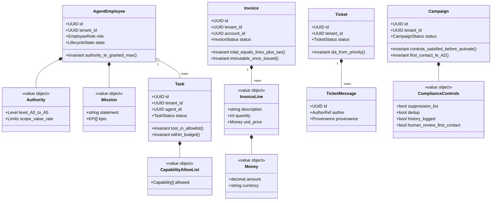
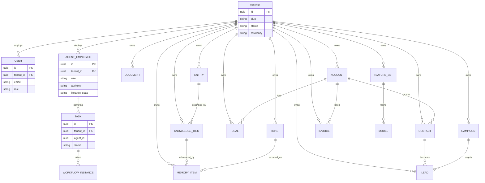

# 014 — Data Model

This document defines the high-level **domain model** for Genesis — the bounded
contexts, aggregates, entities, and value objects that the platform's data is
organised into. It is deliberately domain-level, not physical DDL: concrete
enough to implement from, abstract enough that a context can choose its own
storage adapter behind a `Port`.

Every term and structural rule derives from `000_Glossary.md` (the spine): the
bounded-context map (§4), the DDD vocabulary — Aggregate, Bounded Context,
Event (§2) — the six-type memory taxonomy (§5), the founding employee roster
(§6), authority levels (§8), event naming (§9), the small-Net roster (§10), and
the **absolute tenant isolation** principle (§12.6). Security attributes on
these entities (provenance, classification, `tenant_id` enforcement) are
specified in `012_Security.md`; the event envelope in `005_Event_Model.md`; the
Brain and graph internals in `004_Company_Brain.md` and `009_Knowledge_Graph.md`;
memory lifecycle in `008_Memory_Engine.md`; workflow state machines in
`010_Workflow_Engine.md`; ML artifacts in `011_ML_Platform.md`. This document
references those and does not redefine them. Physical API shapes are owned by
`013_APIs.md`.

---

## Modelling approach

Genesis models its domain with **Domain-Driven Design (DDD)**, matching the
foundation's `routes → services → models` layering and the glossary's DDD
vocabulary. The building blocks:

- **Bounded Context** — a domain with its own model and language. Contexts own
  their data exclusively and integrate **only** via events (the `EventBus`
  backbone) and published APIs — never shared tables or cross-context foreign
  keys. This is the same rule the foundation enforces for `apps/` and product
  modules (`../ARCHITECTURE.md` §2, `000_Glossary.md` §3.1).
- **Aggregate** — a consistency boundary with a single **aggregate root** that
  owns its internal entities and value objects, enforces invariants, and is the
  only entry point for mutation. State changes are emitted as events; the
  aggregate can be rebuilt by replaying them (`005`).
- **Entity** — an object with identity and a lifecycle _inside_ an aggregate
  (e.g. a `TicketMessage` within a `Ticket`).
- **Value Object** — an immutable, identity-less descriptor (e.g. `Money`,
  `Authority`, `ComplianceControls`).

**Why DDD over a single shared relational schema.** A shared schema is simplest
to start and to join across, but it couples every module to every other module's
tables and makes independent evolution and eventual service extraction
impossible — the opposite of the foundation's "apps never import apps" rule.
An anemic-CRUD model (rows + services, no aggregates/invariants) is familiar but
scatters business rules and cannot be event-sourced cleanly. **Selected: DDD
aggregates emitting events**, consistent with the event-sourced backbone (§3.3).
**Future scaling risk:** over-fine aggregates create chatty cross-aggregate
transactions; the mitigation is to size aggregates by their true invariant
boundary (what must be consistent _now_) and let everything else be
eventually-consistent via events.

**Consistency rule.** Strong consistency holds **within** an aggregate;
**between** aggregates and contexts, consistency is eventual, carried by events.
No transaction spans two aggregates.

---

## Bounded contexts

Contexts map onto the reserved platform namespaces (`000_Glossary.md` §4;
`apps/api/src/pb_api/platform/modules.py`). Each owns the aggregates listed.

| Bounded context                     | Slug / namespace            | Purpose                                                    | Aggregates owned                                                  |
| ----------------------------------- | --------------------------- | ---------------------------------------------------------- | ----------------------------------------------------------------- |
| **Identity & Access**               | `identity`                  | Tenants, users, principals, roles, authority, policy.      | `Tenant`, `User`, `ServicePrincipal`, `ApiKey`, `Policy`          |
| **Observability / Events & Audit**  | `observability`             | Health, metrics, structured logs, and the audit event log. | `Event` (append-only; envelope owned by `005`), audit projections |
| **Company Brain / Knowledge**       | `ai` → `/api/v1/ai`         | Shared per-tenant knowledge substrate.                     | `KnowledgeItem`, `Entity`, `Document`                             |
| **Memory** _(internal)_             | `ai` (memory sub-domain)    | Agent cognitive state across the six memory types (§5).    | `MemoryItem`                                                      |
| **Agent Workforce** _(internal)_    | `ai` (workforce sub-domain) | AI Employees and the work they perform.                    | `AgentEmployee`, `Task`                                           |
| **Workflows** _(internal)_          | `ai` (workflow sub-domain)  | Long-running processes, approvals, HITL.                   | `WorkflowInstance` (definitions owned by `010`)                   |
| **CRM**                             | `crm`                       | Contacts, customer accounts, pipeline.                     | `Contact`, `Account`, `Deal`                                      |
| **Ticketing (Support)**             | `ticketing`                 | Support tickets, SLAs, agent inbox.                        | `Ticket`                                                          |
| **Outbound Sales Engine (Sales)**   | `outbound-sales`            | Prospecting and outreach — **compliance-gated**.           | `Lead`, `Campaign`                                                |
| **Billing & Invoicing (Finance)**   | `billing`                   | Invoices, payments, revenue.                               | `Invoice`, `Payment`                                              |
| **ML & Feature Store** _(internal)_ | `ai` (ml sub-domain)        | Small specialised Nets and their features.                 | `Model`, `FeatureSet`                                             |
| **Client Portal**                   | `client-portal`             | Customer-facing workspace (reads projections).             | — (projection consumer)                                           |
| **Knowledge Base**                  | `knowledge-base`            | Curated articles — a Brain projection.                     | `Article` (projection of `KnowledgeItem`)                         |
| **Proposal Engine**                 | `proposal-engine`           | Proposal generation and acceptance.                        | `Proposal`                                                        |
| **Marketing Website**               | `marketing-website`         | Public site and lead capture.                              | — (emits `Lead` intake events)                                    |

> **Naming note (see reconciliation):** the CRM customer-account aggregate is
> named **`Account`** here, _not_ `Company`, to avoid colliding with the
> glossary's **Company = Tenant** definition (§2). The task brief's
> "CRM(Contact, Company, Deal)" refers to this aggregate.

---

## Aggregate roots

Every aggregate root below is **tenant-scoped** (`tenant_id` on the root, §12.6),
uses a **UUID** primary key (see [Identifiers](#identifiers)), and emits
past-tense events named `pb.<context>.<aggregate>.<event>` (§9). Only the root's
invariants that matter for correctness are listed; child entities and value
objects live _inside_ the aggregate.

### Aggregate shapes

### Identity & Access

**`Tenant`** — the root of all isolation. Key fields: `id`, `slug` (globally
unique), `name`, `status` (`active`/`suspended`/`terminated`), `residency`
(region), `plan`, `created_at`. Invariants: `slug` unique platform-wide; a
`suspended` tenant's agents may not act (all authority effectively A0); erasure
is crypto-shredding, not row deletion (`012_Security.md`).

**`User`** — a human principal. Key fields: `id`, `tenant_id`, `email`,
`hashed_password` (Argon2id), `full_name`, `role` (`admin`/`staff`/`client`),
`is_active`, `created_at`, `updated_at`. Invariants: email unique **within a
tenant** (`(tenant_id, email)`); the DB record is authoritative for auth
(`api/deps.py`); public registration only mints `client`.

**`ServicePrincipal`** / **`ApiKey`** — non-human principals (agents/services and
external callers). Key fields: `id`, `tenant_id`, `principal_type`, `roles`,
`granted_authority`, and (for `ApiKey`) a hashed secret + capability allow-list.
Invariants: a principal's `granted_authority` never exceeds what an A5 grant set;
tokens/keys are revocable.

**`Policy`** — a machine-readable org policy (autonomy, outreach, data-handling,
budget). Key fields: `id`, `tenant_id` (or platform default), `family`, `rules`
(JSON DSL, `012_Security.md`), `version`. Invariant: only A5 may mutate; changes
are audited (`pb.identity.policy.updated`).

### Company Brain / Knowledge

**`KnowledgeItem`** — a unit of "what is true". Key fields: `id`, `tenant_id`,
`kind`, `content`, `source_ref`, `provenance` (`trusted`/`user`/`untrusted`),
`confidence`, `classification`, `embedding_id`, `superseded_by`, `created_at`.
Invariants: `provenance` required; `untrusted` items may **not** be promoted to
Long-term memory without attestation (poisoning defence T6); tenant-scoped.

**`Entity`** — a node in the knowledge graph (`009` owns traversal/ontology).
Key fields: `id`, `tenant_id`, `kind`, `canonical_name`, `aliases`,
`attributes`. Invariant: `canonical_name` unique per `(tenant_id, kind)`.

**`Document`** — a stored knowledge document. Key fields: `id`, `tenant_id`,
`title`, `blob_ref` (`BlobStore`), `classification`, `provenance`, `checksum`,
`version`. Invariants: versions immutable; `blob_ref` resolves within the
tenant's namespace.

### Memory

**`MemoryItem`** — an agent-readable/writable cognitive record spanning the six
canonical memory types (§5). Key fields: `id`, `tenant_id`, `owner_ref`
(agent/employee), `memory_type` (`working`/`conversation`/`episodic`/`semantic`/
`procedural`/`long_term`), `content_ref`, `importance`, `decay`,
`last_recalled_at`, `provenance`, `source_event_id`. Invariants: `memory_type`
is one of exactly six; Semantic/Long-term **reference** Brain items rather than
duplicating them (§5 — they physically live in the Brain); lifecycle (importance,
decay, promotion, consolidation) governed by `008`. Tenant- and owner-scoped.

### Agent Workforce

**`AgentEmployee`** — a named, role-specialised, persistent agent (§6). Key
fields: `id`, `tenant_id`, `role` (one of the twelve roles), `name`, `mission`,
`kpis`, `granted_authority` (A0–A5), `lifecycle_state` (§7), `config`,
`created_at`. Invariants: effective authority ≤ `granted_authority`; lifecycle
transitions follow the §7 state machine (owned by `006`); one AI Employee maps to
one or more runtime agent instances.

**`Task`** — a unit of work an agent performs. Key fields: `id`, `tenant_id`,
`agent_id`, `goal`, `status`, `capability_allowlist`, `parent_task_id`,
`correlation_id`, `budget` (tokens/spend), `loop_depth`, `result`. Invariants:
tools invoked must be within `capability_allowlist` (T4); execution halts on
budget or loop-depth breach (runaway defence T5); tenant-scoped;
`correlation_id` ties the task to its event chain (`005`).

### Workflows

**`WorkflowInstance`** — a running long-lived process (definitions owned by
`010`). Key fields: `id`, `tenant_id`, `definition_id`, `state`, `current_step`,
`subject_ref` (the aggregate it acts on, by ID + context), `approvals`,
`correlation_id`. Invariants: state transitions valid per the definition's
machine; HITL steps block until resolved; approvals are single-use and expiring
(`012_Security.md`).

### CRM

**`Contact`** — a person. Key fields: `id`, `tenant_id`, `account_id`, `name`,
`emails`, `phones`, `consent_state`, `owner_id`. Invariant: `consent_state`
governs outreach eligibility (feeds the outreach policy).

**`Account`** — a customer organisation record (the CRM "company"). Key fields:
`id`, `tenant_id`, `name`, `domain`, `industry`, `owner_id`. Invariant:
tenant-scoped; distinct from platform `Tenant`.

**`Deal`** — a pipeline opportunity. Key fields: `id`, `tenant_id`,
`contact_id`, `account_id`, `stage`, `value` (`Money`), `owner_id`,
`expected_close`. Invariants: `value` non-negative; stage transitions follow the
pipeline definition; tenant-scoped.

### Ticketing (Support)

**`Ticket`** — a support request. Key fields: `id`, `tenant_id`, `requester_ref`,
`assignee_ref` (human or `AgentEmployee`), `subject`, `status`, `priority`,
`sla_due_at`, `messages` (child `TicketMessage` entities). Invariants: `sla_due_at`
derived from `priority`; status follows the support state machine; each
`TicketMessage` carries `provenance`.

### Outbound Sales Engine (Sales)

**`Lead`** — a prospect. Key fields: `id`, `tenant_id`, `contact_ref`, `source`,
`score` (from `LeadScoreNet`, `011`), `stage`, `suppression_state`. Invariants:
cannot be outreached if suppressed/opted-out; **first contact ≤ A2** regardless
of employee authority (§8).

**`Campaign`** — an outreach campaign, the compliance choke-point. Key fields:
`id`, `tenant_id`, `name`, `channel`, `audience_query`, `compliance_controls`
(the `OUTREACH_COMPLIANCE_CONTROLS` value object), `status`, `schedule`.
Invariants: **may not activate unless every compliance control is satisfied**
(suppression/opt-out lists, dedup, outreach-history logging, configurable rules,
human review before first contact, no deceptive messaging —
`AI_DEPLOY_AUTHORIZATION.md` §Legal; `apps/api/src/pb_api/platform/modules.py`);
duplicate outreach prevented; every send logged as an event.

### Billing & Invoicing (Finance)

**`Invoice`** — a bill. Key fields: `id`, `tenant_id`, `account_id`,
`lines` (child `InvoiceLine` value objects), `subtotal`, `tax`, `total`
(`Money`), `status`, `issued_at`, `due_date`. Invariants:
`total = sum(lines) + tax`; **immutable once issued** (corrections are credit
notes, not edits); tenant-scoped.

**`Payment`** — a settlement against an invoice. Key fields: `id`, `tenant_id`,
`invoice_id`, `amount` (`Money`), `method`, `status`, `settled_at`. Invariant:
sum of payments never exceeds invoice `total`.

### ML & Feature Store

**`Model`** — a trained small Net (§10; never a foundation LLM). Key fields:
`id`, `scope` (`platform` or `tenant`), `tenant_id` (nullable for platform
scope), `net_name` (e.g. `MemoryRankNet`, `LeadScoreNet`), `version`,
`artifact_ref`, `deployment` (`champion`/`challenger`), `metrics`. Invariants:
exactly one `champion` per `net_name` per scope; served via `ModelServer` (`011`).
_See reconciliation:_ a `platform`-scoped model is the one controlled exception
to universal `tenant_id`, allowed only for models trained on aggregated data and
carrying no tenant-identifying weights.

**`FeatureSet`** — features for training/serving. Key fields: `id`, `tenant_id`,
`entity_ref`, `features`, `computed_at`, `version`. Invariants: always
tenant-scoped (no cross-tenant feature leakage); point-in-time correctness for
training (owned by `011`).

---

## Core entities

The cross-context domain, every entity **tenant-scoped** (the `Tenant` root fans
out to all). Relationships drawn across contexts are **soft references by ID**
(dashed intent), resolved via events/APIs — never database foreign keys across
contexts (see [Relationships](#relationships)).

Every box carries a `tenant_id` (shown on the four detailed entities; identical
on the rest). No relationship crosses a tenant boundary — cross-tenant edges are
impossible by construction (§12.6).

---

## Relationships

Aggregates reference each other **by ID across contexts, never by shared tables
or cross-context foreign keys.** A reference is resolved either by subscribing to
the owner context's events (preferred, decoupled) or by calling its published
API (`013`). Within a single aggregate, child entities are owned outright and may
use real foreign keys.

Key cross-context references:

| From aggregate (context)       | Reference field    | To aggregate (context)                | Cardinality | Integration mechanism                 |
| ------------------------------ | ------------------ | ------------------------------------- | ----------- | ------------------------------------- |
| `AgentEmployee` (Workforce)    | `tenant_id`        | `Tenant` (Identity)                   | many→1      | by-ID, tenant scope                   |
| `Task` (Workforce)             | `agent_id`         | `AgentEmployee` (Workforce)           | many→1      | same context, FK ok                   |
| `WorkflowInstance` (Workflows) | `subject_ref`      | any aggregate (any context)           | 1→1         | by-ID + context tag                   |
| `Deal` (CRM)                   | `owner_id`         | `User` (Identity)                     | many→1      | by-ID                                 |
| `Lead` (Sales)                 | `contact_ref`      | `Contact` (CRM)                       | many→1      | by-ID / event                         |
| `Campaign` (Sales)             | `audience_query` → | `Lead` (Sales)                        | 1→many      | query + events                        |
| `Ticket` (Ticketing)           | `assignee_ref`     | `AgentEmployee` (Workforce) or `User` | many→1      | by-ID (polymorphic)                   |
| `Invoice` (Finance)            | `account_id`       | `Account` (CRM)                       | many→1      | by-ID / event                         |
| `MemoryItem` (Memory)          | `source_event_id`  | `Event` (Events/Audit)                | many→1      | by-ID (event log)                     |
| `MemoryItem` (Memory)          | `content_ref`      | `KnowledgeItem` (Brain)               | many→1      | by-ID (Semantic/LT live in Brain, §5) |
| `KnowledgeItem` (Brain)        | `source_ref`       | `Document` (Brain) / `Event`          | many→1      | by-ID                                 |
| `Model` (ML)                   | `training_source`  | `FeatureSet` (ML)                     | 1→many      | by-ID                                 |
| `Article` (KB)                 | projection of      | `KnowledgeItem` (Brain)               | 1→1         | event projection                      |

**Why by-ID + events, not shared FKs.** Shared foreign keys across contexts
recreate the tight coupling DDD exists to prevent and block independent
deployment/extraction (`../ARCHITECTURE.md` §2). By-ID references with
event-carried updates keep contexts autonomous and let read models
(projections) be rebuilt from the log (§3.3). **Trade-off:** referential
integrity across contexts is not database-enforced — it becomes an application
concern (a referenced ID may be tombstoned). **Future scaling risk:** dangling
references and reconciliation lag; mitigated by treating each context as the sole
source of truth for its IDs and emitting tombstone events that consumers honour.

---

## Multi-tenancy

Tenant isolation is **absolute** (§12.6): every aggregate root carries a
`tenant_id`, and every query is scoped to it. The isolation _strategy_ is a
storage decision, compared here.

| Strategy                              | Isolation                            | Cost / ops                                                     | Chosen?          |
| ------------------------------------- | ------------------------------------ | -------------------------------------------------------------- | ---------------- |
| **Shared schema, `tenant_id` column** | Logical, enforced in the query layer | Lowest: one schema, one migration set, cheap onboarding        | **Default (v1)** |
| **Schema-per-tenant**                 | Stronger (separate namespaces)       | Migrations fan out per tenant; connection/catalog bloat        | Scale-up         |
| **Database-per-tenant**               | Strongest (physical)                 | Highest ops cost; per-tenant backups/tuning; enables residency | Enterprise       |

**Selected default: shared schema with a `tenant_id` column**, matching the
foundation's stated growth path ("Tenant column + scoping in services — a single
choke-point for queries", `../ARCHITECTURE.md` §7). Isolation is enforced by:

- `tenant_id` (non-null) on every aggregate root and every event;
- a **single query choke-point** (a tenant-scoped session/repository) that
  injects the `tenant_id` predicate so no service can forget it — the human
  equivalent of the ABAC `pol.tenant-isolation` deny rule (`012_Security.md`);
- optionally, PostgreSQL **row-level security** as defence in depth on the shared
  schema.

**Move trigger.** Adopt **schema-per-tenant** when a tenant needs independent
migration cadence or noisy-neighbour isolation on hot tables; adopt
**database-per-tenant** when a tenant contractually requires physical isolation,
independent key custody, or data residency in a specific region (the ports model
already allows per-tenant storage adapters — `012_Security.md` §Compliance). The
`tenant_id` column travels unchanged through every tier, so the migration is
additive, never a remodel.

**Future scaling risk:** the shared schema makes the largest tables hotspots and
one migration touches all tenants at once. Mitigated by partitioning large
tables by `tenant_id`, and by the documented move trigger before a single tenant
dominates the shared tables.

---

## Identifiers

- **UUID primary keys everywhere**, matching the foundation (`User.id` is a
  `Uuid` column defaulting to `uuid.uuid4`, `db/models/user.py`). Every aggregate
  root, entity, and event uses a UUID; cross-context references are UUIDs.
- **No natural keys as primary keys.** Emails, slugs, and names are unique
  _constraints_ where required, not identity — they change; UUIDs do not, which
  keeps by-ID references stable across contexts.
- **UUIDv4 today; UUIDv7 as a scale option.** v4 is random and unguessable
  (good: non-enumerable IDs). Its downside is poor index locality on
  high-write tables. **Future scaling risk / trigger:** for the highest-write
  aggregates (`Event`, `Task`, `MemoryItem`) adopt **UUIDv7** (time-ordered) to
  restore B-tree insert locality without exposing sequential counts — a
  drop-in change since the column type is unchanged.
- **IDs are opaque and never encode tenant or type** in a security-relevant way;
  authorisation is by the `tenant_id` attribute and ABAC, not by ID structure
  (`012_Security.md`).

---

_See also: `000_Glossary.md` (bounded-context map §4, memory taxonomy §5,
employee roster §6, authority §8, event naming §9, Net roster §10),
`004_Company_Brain.md` and `009_Knowledge_Graph.md` (Brain/graph internals),
`005_Event_Model.md` (event envelope), `006_Agent_Runtime.md` (agent lifecycle
and capabilities), `008_Memory_Engine.md` (memory lifecycle),
`010_Workflow_Engine.md` (workflow definitions), `011_ML_Platform.md` (Nets and
features), `012_Security.md` (tenant isolation, provenance, classification), and
`013_APIs.md` (published context APIs)._
