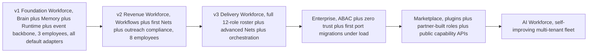
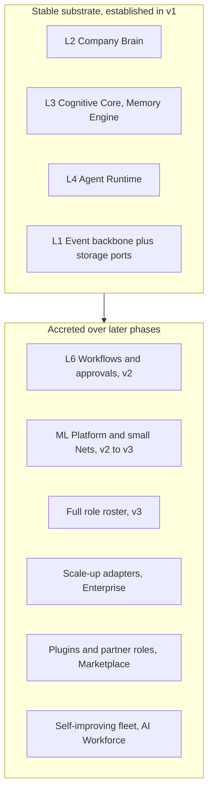

# 015 — Roadmap

This document owns the phased execution plan for Genesis: v1 → v2 → v3 →
Enterprise → Marketplace → AI Workforce. It derives every term, layer, port,
employee, memory type, authority level, and small-Net name from `000_Glossary.md`
— the spine — and never contradicts it. The strategic framing lives in
`001_Vision.md`.

The organising rule is **capability accretion on a stable substrate**: each phase
adds capability without rewriting the layer below it, and each phase moves a port
from its default adapter to a scale-up adapter _only when a recorded trigger
fires_ (`000_Glossary.md` §3.2, §12.7). Nothing here overrides the governance in
`../../AI_DEPLOY_AUTHORIZATION.md`; every phase preserves its acceptance rule.

---

## Phase progression and capability accretion

A per-phase summary of which ports move off their defaults is collected in
[Port migration ledger](#port-migration-ledger); a per-phase completion bar is in
[Definition of done per phase](#definition-of-done-per-phase).

---

## v1 — Foundation Workforce

**Theme / goal.** Prove the substrate on the existing foundation. Stand up the
Company Brain, the Memory Engine, the Agent Runtime, and the event backbone on
the foundation's PostgreSQL and Redis, running on a single Docker Compose stack
(`../DEPLOYMENT.md`), and put the first two to three low-risk employees to work.
No new infrastructure beyond the foundation.

**Capabilities and documents that land.**

- Layers L0–L4 of `000_Glossary.md` §3.1 become real: L1 event backbone, L2
  Company Brain, L3 Cognitive Core (memory + basic reasoning/planning/reflection),
  L4 Agent Runtime (lifecycle, scheduling, tools, permissions).
- `002_System_Architecture.md` (layer/module wiring), `003_Cognitive_Architecture.md`
  (memory → reasoning → decision pipeline), `004_Company_Brain.md` (shared
  substrate), `005_Event_Model.md` (event taxonomy, sourcing, replay, audit),
  `006_Agent_Runtime.md` (lifecycle states `Provisioned → … → Retired`,
  `000_Glossary.md` §7), `008_Memory_Engine.md` (all six memory types,
  `000_Glossary.md` §5), and the first slices of `013_APIs.md` (agent, memory,
  knowledge APIs) and `014_Data_Model.md` (Brain + Memory + Events aggregates)
  land. `012_Security.md` lands its core: RBAC from the foundation extended with
  authority A0–A5 and `tenant_id` scoping on every record.
- The Genesis-internal contexts **Memory** and **Events/Audit** and **Agent
  Workforce** are added to the platform module registry when implemented
  (`000_Glossary.md` §4), joining the reserved `ai` namespace at `/api/v1/ai`.

**AI Employees online (first 2–3).** Chosen for low blast radius — internal,
read-heavy, or inbound — so autonomy can be earned before anyone is customer-facing:

- **Knowledge Manager** — curates the Company Brain; authority A0–A2, internal.
- **Research** — read-only synthesis over the Brain and permitted sources;
  authority A0–A1 (Observe/Suggest).
- **Support** — acts through the `ticketing` surface on _inbound_ tickets;
  authority A1–A2 with HITL required on any outbound customer message. Specified
  in `007_AI_Employees.md`.

**Ports — all on default adapters (`000_Glossary.md` §3.2).** `EventStore` =
PostgreSQL append-only table; `EventBus` = Redis Streams; `VectorStore` =
PostgreSQL + `pgvector`; `GraphStore` = PostgreSQL edges + CTE; `DocumentStore` =
PostgreSQL + object store; `BlobStore` = MinIO; `ModelProvider` = Anthropic
Claude; `ModelServer` = ONNX Runtime behind FastAPI (idle in v1); `FeatureStore`
= PostgreSQL; `SecretStore` = environment; `Scheduler` = PostgreSQL-backed queue.
**No port migrates in v1** — that is the point of v1.

**Small Nets.** None trained yet. Memory ranking and prioritisation use
deterministic heuristics; `011_ML_Platform.md` is scaffolded but the first Net
lands in v2. Recording this avoids shipping placeholder ML.

**Entry criteria.** The PB Platform foundation is green: `make lint typecheck
test` pass, the stack boots via `docker-compose.yml`, and `000_Glossary.md`
through `006`/`008` are ratified.

**Exit criteria.** The three employees run through their full lifecycle against
real tenant data; every consequential action is an event with correlation and
causation IDs (`005_Event_Model.md`); the Brain answers recall queries across all
six memory types; a projection can be rebuilt from the event log; tenant
isolation holds under test; no employee acts above its authority; Support's
outbound path is HITL-gated.

**Key risks.** (1) `pgvector` recall latency degrades as embeddings grow — watched,
migration deferred to a trigger, not pre-optimised. (2) LLM cost per reasoning
step with no Net offload yet — bounded by per-employee budget/rate caps in the
runtime. (3) Over-scoping v1 by pulling Workflow/ML forward — mitigated by the
hard scope line: substrate + three employees only.

## v2 — Revenue Workforce

**Theme / goal.** Turn the substrate into revenue-generating work: orchestrated,
multi-step processes with human approvals, the first small Nets, and the
outreach-capable employees under full compliance.

**Capabilities and documents that land.**

- L6 Workflow & Orchestration (`000_Glossary.md` §3.1) via `010_Workflow_Engine.md`
  — state machines, approvals, HITL steps, long-running work.
- L5 richer: more of `007_AI_Employees.md` comes online.
- `009_Knowledge_Graph.md` matures beyond v1's edges-plus-CTE usage: ontology and
  traversal for the sales/proposal domain.
- `011_ML_Platform.md` ships its first Nets with champion/challenger deployment.
- Outreach compliance becomes load-bearing: the `outbound-sales` surface
  enforces all six `OUTREACH_COMPLIANCE_CONTROLS`
  (`apps/api/src/pb_api/platform/modules.py`; Marketing reaches prospects
  _through_ `outbound-sales`, so those sends inherit the controls) —
  suppression/opt-out lists,
  duplicate-outreach prevention, outreach-history logging, configurable rules,
  human review before first contact, no deceptive messaging.

**AI Employees online (target: ~8 total).** Add **Sales Manager**, **Marketing**,
**Solutions Architect** (Proposal Engine surface), **Program Manager**, and
**Finance**. Sales Manager and Marketing are outreach-gated: first-contact
outreach is **never above A2** regardless of the employee's ceiling
(`000_Glossary.md` §8) and requires HITL.

**Ports moving to scale-up adapters, and the trigger.**

- `VectorStore`: PostgreSQL + `pgvector` → **Qdrant** when p95 semantic-recall
  latency exceeds the Working-Set assembly budget (target: > 150 ms at the tenant
  with the largest Brain) _or_ embedding count per tenant crosses the point where
  `pgvector` index build/refresh contends with OLTP.
- `ModelServer`: activates (still ONNX Runtime behind FastAPI) to serve the first
  Nets; no adapter swap yet.

**Small Nets landing.** `MemoryRankNet` (recall ranking, replacing v1 heuristics),
`LeadScoreNet` and `SalesNet` (pipeline scoring/next-best-action for Sales
Manager), `ProposalNet` (proposal quality/win-likelihood for Solutions Architect).
Each ships with a training source, an offline metric, and champion/challenger
(`011_ML_Platform.md`).

**Entry criteria.** v1 exit met and stable in production for a defined soak
period; outreach compliance controls implemented and tested _before_ any employee
sends a first message.

**Exit criteria.** A multi-step workflow with at least one HITL approval runs
end-to-end and is fully event-sourced; `MemoryRankNet` beats the v1 heuristic on
its offline metric and is promoted to champion; an outreach campaign runs with
zero compliance-control violations in audit; per-employee budgets hold under real
volume.

**Key risks.** (1) Compliance gaps on first contact — the single highest-severity
risk; gated by making the controls a ship-blocker, not a checklist. (2) Net
quality regressions reaching customers — contained by champion/challenger and
shadow evaluation. (3) Workflow state explosion — bounded by the state-machine
model in `010_Workflow_Engine.md`.

## v3 — Delivery Workforce

**Theme / goal.** Complete the founding organisation and make it deliver
end-to-end. Full twelve-role roster, advanced Nets, and genuine multi-agent
orchestration where employees hand work to one another through events and
workflows.

**Capabilities and documents that land.**

- The full `007_AI_Employees.md` roster is online (see below).
- `011_ML_Platform.md` completes the small-Net roster (`000_Glossary.md` §10).
- `010_Workflow_Engine.md` gains long-running, cross-employee orchestration
  (e.g. Sales Manager → Solutions Architect → Finance on a won deal).
- `003_Cognitive_Architecture.md` reflection and learning loops mature: outcomes
  feed `ReflectionNet` and consolidate into Long-term memory (`000_Glossary.md` §5).

**AI Employees online (all 12).** Add **CEO**, **CTO**, **Developer**, **QA**,
and any remaining role, completing the roster in `000_Glossary.md` §6. Strategic
roles (CEO, CTO) operate at higher authority but strictly under policy and budget;
Developer/QA act through engineering surfaces under HITL for anything that reaches
production.

**Ports moving to scale-up adapters, and the trigger.**

- `EventBus`: Redis Streams → **NATS JetStream** when fan-out consumer count or
  sustained event throughput exceeds Redis Streams' comfortable envelope, or when
  cross-employee orchestration needs stronger delivery/replay semantics per
  consumer group.
- `GraphStore`: PostgreSQL edges + CTE → **Neo4j** when multi-hop traversal depth
  or graph size makes recursive-CTE latency exceed the reasoning budget.

**Small Nets landing.** `WorkflowNet` (next-step/branch prediction),
`TaskPriorityNet` (runtime scheduling priority), `CustomerHealthNet` (churn/health
for Support and Finance), `ReflectionNet` (scores reflections to drive learning).
The roster is now complete.

**Entry criteria.** v2 exit met; workflow engine proven on at least one revenue
workflow; ML platform operating champion/challenger reliably.

**Exit criteria.** A deal or delivery flows across three or more employees with no
human touch except mandated HITL gates, fully event-sourced and auditable; all
eight Nets are in production with monitored metrics; reflection measurably
improves at least one KPI over a defined window; the full roster runs within tenant
budget and isolation.

**Key risks.** (1) Multi-agent coordination failures (deadlock, duplicated work,
conflicting actions) — contained by event-driven choreography and idempotent
handlers (`005_Event_Model.md`). (2) Higher-authority roles overreaching —
contained by authority ceilings, budgets, and audit. (3) Net sprawl raising
operational load — contained by shared serving and evaluation harness.

## Enterprise

**Theme / goal.** Make the workforce safe and operable at enterprise scale and
scrutiny: fine-grained access control, zero-trust posture, and the first port
migrations driven by real load and durability requirements.

**Capabilities and documents that land.**

- `012_Security.md` completes: ABAC layered over RBAC, authority policy engine,
  zero-trust service-to-service auth, and compliance/audit reporting built on the
  event log (`005_Event_Model.md`).
- Cross-cutting hardening from `000_Glossary.md` §3.1 (Security, Observability,
  Event Backbone, ML Platform) is production-grade across all tenants.
- Formal data-residency and retention controls over the Company Brain and event
  store.

**AI Employees online.** No new roles; the existing twelve run under stricter
policy, higher-assurance authority checks, and per-tenant customisation of
authority ceilings and budgets.

**Ports moving to scale-up adapters, and the trigger.**

- `EventStore`: PostgreSQL append-only table → **EventStoreDB or Kafka with
  compaction** when append/replay volume or retention-window audit queries exceed
  what a single PostgreSQL table serves within SLO.
- `SecretStore`: environment → **Vault or AWS SSM** on the first enterprise
  contract that requires managed secret rotation and access audit.
- `FeatureStore`: PostgreSQL (+ Redis online) → **Feast** when offline/online
  feature parity and point-in-time correctness across many Nets demand it.
- `Scheduler`: PostgreSQL-backed queue → **Temporal** when durable, long-horizon
  workflow execution needs stronger guarantees than the default queue provides.
- `BlobStore`: MinIO self-host → **AWS S3 or GCS** per customer residency/hosting
  requirements.

**Entry criteria.** v3 exit met; a security review of the pending posture passes;
compliance controls audited clean over a sustained period.

**Exit criteria.** ABAC and zero trust enforced and tested; at least the
`EventStore` and `SecretStore` migrations executed behind unchanged ports with no
caller changes; audit reporting reconstructs any employee's full action history on
demand; data-residency controls demonstrated per tenant.

**Key risks.** (1) Migration risk on the system of record (`EventStore`) —
mitigated by the port boundary, dual-write/replay validation, and roll-forward
discipline (`../DEPLOYMENT.md` §7). (2) Policy misconfiguration locking out
legitimate work — mitigated by policy simulation before enforcement. (3)
Residency/compliance scope creep — bounded by explicit per-tenant configuration.

## Marketplace

**Theme / goal.** Open the substrate: let third parties extend the workforce with
new **Capabilities**, **Tools**, plugins, and partner-built roles — on the same
governed, event-sourced, tenant-isolated foundation, with no loss of auditability
or compliance.

**Capabilities and documents that land.**

- L7/L8 plugin architecture from `002_System_Architecture.md`: modules integrate
  only via events (L1 backbone) and published APIs (L8), never by importing each
  other (`000_Glossary.md` §3.1) — the same rule the foundation enforces for
  `apps/`.
- Public capability and knowledge APIs graduate in `013_APIs.md`, with authority
  and permission gating applied to third-party capabilities identically to
  first-party ones.
- A partner-role packaging format layered on `007_AI_Employees.md` (mission, KPIs,
  authority ceiling, tools, memory usage) so a partner ships a role, not raw code.

**AI Employees online.** Partner-built roles beyond the founding twelve, each
constrained by the same lifecycle (`000_Glossary.md` §7) and authority model
(§8); outreach-capable partner roles inherit `OUTREACH_COMPLIANCE_CONTROLS`
unconditionally.

**Ports moving to scale-up adapters, and the trigger.**

- `ModelServer`: ONNX Runtime behind FastAPI → **Triton or TorchServe** when
  third-party Nets and higher aggregate serving throughput justify a dedicated
  serving tier.
- `ModelProvider`: multi-vendor routing (Claude default plus OpenAI/Google/local
  vLLM, `000_Glossary.md` §3.2) becomes first-class so partner roles can pin or
  fail over providers — reinforcing no-lock-in as a marketplace guarantee.

**Small Nets.** Third parties may publish Nets that plug into the same
champion/challenger and evaluation harness (`011_ML_Platform.md`); the founding
roster is unchanged.

**Entry criteria.** Enterprise exit met; plugin isolation, capability sandboxing,
and third-party authority gating designed and security-reviewed.

**Exit criteria.** A third-party capability runs in production sandboxed, gated by
authority and permissions, fully event-sourced and tenant-isolated; a partner role
is deployed by a customer without platform-team involvement; a partner Net passes
the evaluation harness before promotion; every marketplace action is auditable and
compliant.

**Key risks.** (1) Untrusted third-party code breaking isolation or compliance —
the defining risk; contained by capability sandboxing, hard authority ceilings on
partner roles, and mandatory compliance inheritance. (2) Quality dilution from
low-grade partner roles/Nets — contained by the evaluation harness and
champion/challenger gate. (3) Tenant-isolation leaks via plugins — contained by
the `tenant_id`-on-everything invariant enforced below the plugin boundary.

## AI Workforce

**Theme / goal.** The end state of `001_Vision.md`: a self-improving,
multi-tenant fleet where deploying a business function is configuration, not
engineering. Employees continuously learn from reflection, spawn and coordinate
sub-agents within authority limits, and the workforce compounds.

**Capabilities and documents that land.**

- Full cross-employee, cross-workflow autonomy under governed autonomy: employees
  plan, delegate to sub-agent instances (`000_Glossary.md`: one AI Employee → one
  or more agent instances), and reflect at fleet scale.
- Continuous learning loop across `008_Memory_Engine.md` (consolidation, decay,
  promotion) and `011_ML_Platform.md` (online Net improvement) with human-set
  guardrails.
- Fleet-level observability and governance: authority, budget, and compliance
  enforced across the whole multi-tenant fleet with per-tenant isolation intact.

**AI Employees online.** The full first-party roster plus marketplace roles,
operating as a coordinated organisation per tenant; higher-authority roles (up to
A5 Govern) may adjust policy/config _only_ within human-set meta-policy and always
under audit.

**Ports moving to scale-up adapters, and the trigger.** The highest-throughput
paths reach their top-tier adapters as fleet volume dictates: `EventStore`/
`EventBus` on **Kafka** where a unified, high-throughput, compacted log serves
both system-of-record and distribution at fleet scale; all other ports already at
their scale-up adapters from Enterprise/Marketplace. Every migration remains
trigger-driven and invisible to callers behind its port.

**Small Nets.** The roster operates in continuous online improvement with
champion/challenger always live; new Nets are added by data-driven need, not by
schedule.

**Entry criteria.** Marketplace exit met; continuous-learning guardrails,
fleet-level budget/authority governance, and rollback of learned behaviour designed
and reviewed.

**Exit criteria.** The fleet measurably self-improves on tracked KPIs over a
sustained window without human intervention beyond mandated HITL and meta-policy;
deploying a new business function for a tenant is a configuration act completed
without platform engineering; fleet-scale governance holds — no authority breach,
no compliance violation, no cross-tenant leak in audit.

**Key risks.** (1) Emergent misbehaviour from self-improvement — contained by
meta-policy ceilings, reflection review (`ReflectionNet`), event-sourced
reversibility, and the ability to roll learned behaviour back. (2) Fleet-scale
cost runaway — contained by fleet and per-tenant budgets and Net offload. (3)
Multi-tenant blast radius — contained by the absolute `tenant_id` isolation
invariant, unchanged since v1.

---

## Port migration ledger

Every migration is trigger-driven per `000_Glossary.md` §3.2 and §12.7 ("prefer
the default adapter until scale forces the alternative — and record that
trigger"). Callers never change; only the adapter behind the port does.

| Port            | Default (v1)              | Scale-up                        | Phase                         | Trigger                                                                                            |
| --------------- | ------------------------- | ------------------------------- | ----------------------------- | -------------------------------------------------------------------------------------------------- |
| `VectorStore`   | PostgreSQL + `pgvector`   | Qdrant                          | v2                            | p95 recall latency exceeds Working-Set budget, or embedding volume contends with OLTP              |
| `ModelServer`   | ONNX behind FastAPI       | Triton / TorchServe             | v2 activate, Marketplace swap | First Nets serve (v2); third-party Nets and throughput justify a serving tier (Marketplace)        |
| `EventBus`      | Redis Streams             | NATS JetStream                  | v3                            | Consumer fan-out or throughput exceeds Redis Streams envelope; stronger per-consumer replay needed |
| `GraphStore`    | PostgreSQL edges + CTE    | Neo4j                           | v3                            | Traversal depth or graph size makes recursive-CTE latency exceed reasoning budget                  |
| `EventStore`    | PostgreSQL append-only    | EventStoreDB / Kafka+compaction | Enterprise                    | Append/replay volume or audit queries exceed single-table SLO                                      |
| `SecretStore`   | Environment               | Vault / AWS SSM                 | Enterprise                    | Contract requires managed rotation and access audit                                                |
| `FeatureStore`  | PostgreSQL (+ Redis)      | Feast                           | Enterprise                    | Point-in-time feature parity across many Nets required                                             |
| `Scheduler`     | PostgreSQL-backed queue   | Temporal                        | Enterprise                    | Durable long-horizon workflows need stronger guarantees                                            |
| `BlobStore`     | MinIO self-host           | AWS S3 / GCS                    | Enterprise                    | Customer residency / hosting requirement                                                           |
| `ModelProvider` | Anthropic Claude          | OpenAI / Google / local vLLM    | Marketplace                   | Multi-vendor routing and failover become a product guarantee                                       |
| `DocumentStore` | PostgreSQL + object store | —                               | —                             | No scale-up adapter defined; default is sufficient by design                                       |

## Definition of done per phase

A phase is done only when it satisfies the governance **acceptance rule**
(`../../AI_DEPLOY_AUTHORIZATION.md`) at phase scope: all requested functionality
implemented; automated validation passes; documentation updated; deployment
succeeds; no known critical defects remain. Concretely, for every phase:

| Criterion                         | What it means at phase scope                                                                                                                    |
| --------------------------------- | ----------------------------------------------------------------------------------------------------------------------------------------------- |
| Validation loop green             | `make lint typecheck test` (plus `make test-e2e` for cross-service work) passes locally before any commit lands — this repo runs no CI service. |
| Production-ready, no placeholders | Every new surface is shipped complete: no prototypes, no placeholder logic, no fabricated capability (`../../AI_DEPLOY_AUTHORIZATION.md`).      |
| Observable by default             | Every new service exposes health, readiness, metrics, and structured logs.                                                                      |
| Event-sourced and auditable       | Every consequential action is an event (`000_Glossary.md` §3.3, §9); a projection can be rebuilt from the log.                                  |
| Tenant isolation intact           | Every new record, memory, and event carries `tenant_id`; cross-tenant access impossible by construction (`000_Glossary.md` §12.6).              |
| Authority respected               | No agent acts above its authority; permission and authority both required, the lower governing (`000_Glossary.md` §8).                          |
| Ports honoured                    | New dependencies enter behind a port with a default adapter; any migration is trigger-recorded (`000_Glossary.md` §3.2).                        |
| Docs updated                      | The relevant `001`–`014` documents and, where applicable, the platform module registry reflect what shipped.                                    |

### How each phase preserves the governance acceptance rule

The acceptance rule and the outreach-compliance controls are **phase-gate
blockers**, identical at every phase — they never relax as scope grows:

- **Outreach compliance is a ship-blocker, from v2 onward.** Any employee or
  surface that contacts customers or prospects (Sales Manager, Marketing, the
  `outbound-sales` surface, and any marketplace role that does the same) must ship
  all six `OUTREACH_COMPLIANCE_CONTROLS` — suppression/opt-out lists,
  duplicate-outreach prevention, outreach-history logging, configurable compliance
  rules, human review before first contact by default, and no deceptive messaging
  (`apps/api/src/pb_api/platform/modules.py`; `../../AI_DEPLOY_AUTHORIZATION.md`
  §Legal). First-contact outreach is **never above A2**, regardless of the
  employee's authority ceiling (`000_Glossary.md` §8), in every phase including
  AI Workforce.
- **The validation loop is invariant.** `Analyse → Plan → Implement → Compile →
Test → Fix → Repeat` continues until zero known failures at each phase — no
  phase is "done" on first successful implementation if defects remain.
- **Governance precedence holds.** Where any phase implementation conflicts with
  `../../AI_DEPLOY_AUTHORIZATION.md`, the governance document wins, and the
  conflict is a defect to fix before the phase gate — exactly as
  `000_Glossary.md` wins over any sibling spec document.

See `001_Vision.md` for strategic context and `000_Glossary.md` for every
canonical term, layer, port, memory type, authority level, employee, and Net
referenced above.
