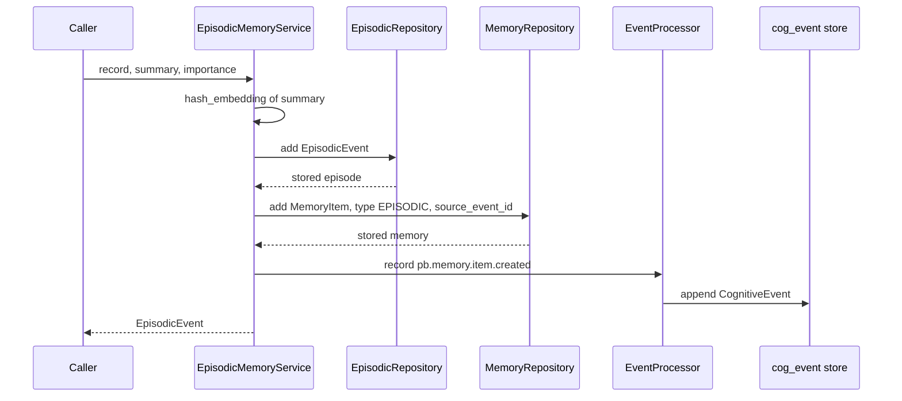
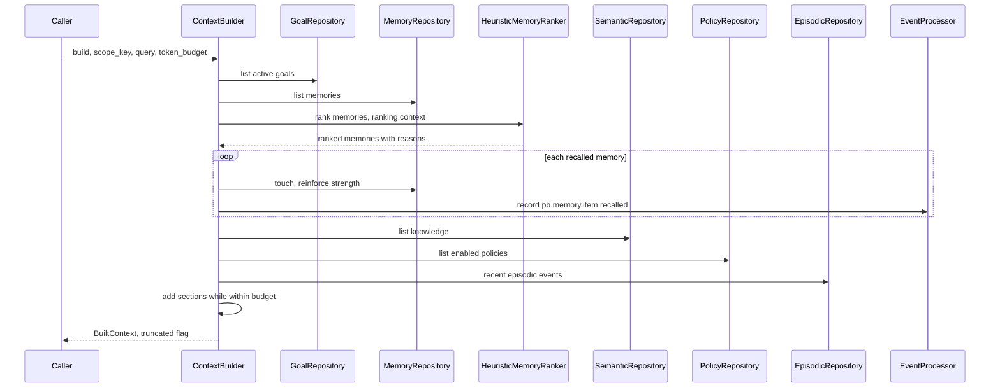
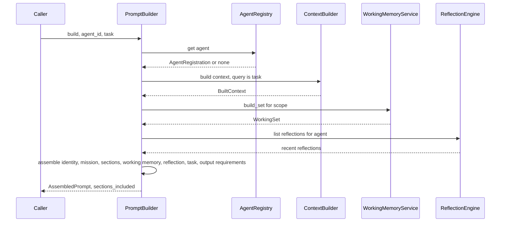
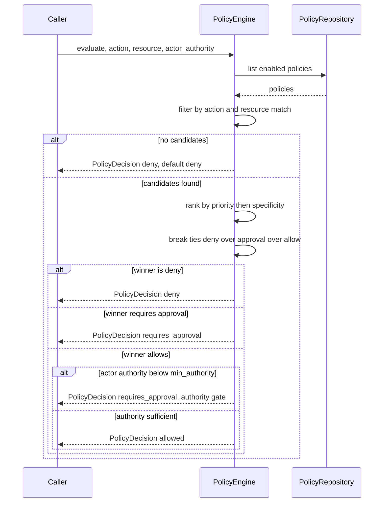

# 016 — Cognitive Core (Implementation)

This document is the implementation reference for the **Cognitive Core** shipped in Genesis
Phase 7. It describes what actually exists in code and how it maps to the specification in
`003_Cognitive_Architecture.md` and `008_Memory_Engine.md`. The design rationale — why it is
placed and layered the way it is — lives in [ADR-0010](../adr/0010-cognitive-core.md).

## Overview

The Cognitive Core is the cognitive operating system that autonomous **AI Employees**
consume. It owns working / episodic / semantic / procedural memory, memory consolidation
and ranking, the context and prompt builders, the reflection / planning / goal engines, the
agent and tool registries, the policy engine, and the event processor.

It is a **top-level bounded context** at `apps/api/src/pb_api/cognitive/`, deliberately not
nested under `pb_api/core/` (which holds cross-cutting infrastructure), and is addressable
at `/api/v1/cognitive`. The package is strictly layered:

```
domain/        pure Pydantic models + value objects (persistence-agnostic)
  ->  db/            SQLAlchemy rows on the shared platform Base
  ->  repositories/  tenant-scoped async data access
  ->  services/      the 15 subsystems + the CognitiveCore facade
  ->  api/           FastAPI routers, request schemas, per-request dependency
```

`CognitiveCore` (`services/core.py`) is the single composition root: given one
`AsyncSession` it wires every repository and service and exposes them as attributes.

How it maps to the spec:

- `003_Cognitive_Architecture.md` — reasoning loop, planning, reflection, goal management,
  context building, and authority levels A0-A5 are realised as the cognition services and
  the `AuthorityLevel` enum.
- `008_Memory_Engine.md` — the unified `MemoryItem`, importance / strength / decay, ranking,
  recall, promotion, consolidation, and archiving are realised as the memory services, the
  `MemoryRanker` interface, and `MemoryConsolidationService`.
- `000_Glossary.md` — the six-type memory taxonomy (§5), authority levels (§8), and the
  canonical event naming (§9) are encoded directly as `MemoryType`, `AuthorityLevel`, and
  the `EventType` constants.

## The 15 subsystems

Each subsystem is a service class assembled by the `CognitiveCore` facade. Paths are
relative to `apps/api/src/pb_api/cognitive/`.

| Subsystem       | Service class                | File                            | Responsibility                                                                                                |
| --------------- | ---------------------------- | ------------------------------- | ------------------------------------------------------------------------------------------------------------- |
| Working Memory  | `WorkingMemoryService`       | `services/working_memory.py`    | Short-lived, token-aware, versioned, auto-expiring task/conversation-scoped memory; assembles a `WorkingSet`. |
| Episodic        | `EpisodicMemoryService`      | `services/episodic_memory.py`   | Record and recall time-indexed experiences; also writes a unified `MemoryItem` and emits an event.            |
| Semantic        | `SemanticMemoryService`      | `services/semantic_memory.py`   | Persistent knowledge (concepts and facts) plus typed relationships; versioned with provenance.                |
| Procedural      | `ProceduralMemoryService`    | `services/procedural_memory.py` | Reusable workflow definitions (`Procedure`); ships seedable example templates.                                |
| Consolidation   | `MemoryConsolidationService` | `services/consolidation.py`     | Merge duplicates, promote important memories, archive stale ones, backfill embeddings, summarise.             |
| MemoryRanker    | `HeuristicMemoryRanker`      | `services/ranking.py`           | Deterministic, explainable ranking behind the `MemoryRanker` interface; no ML.                                |
| Context Builder | `ContextBuilder`             | `services/context_builder.py`   | Gather goals, ranked memories, knowledge, policies, and recent events into a token-bounded `BuiltContext`.    |
| Reflection      | `ReflectionEngine`           | `services/reflection_engine.py` | Capture a reflection per completed task; store it, emit an event, and write it to episodic memory.            |
| Planning        | `PlanningEngine`             | `services/planning_engine.py`   | Decompose a goal or objective into a `Plan` — a DAG of tasks.                                                 |
| Goal Manager    | `GoalManager`                | `services/goal_manager.py`      | Hierarchical goals with priority, dependencies, status, progress, and append-only history.                    |
| Agent Registry  | `AgentRegistry`              | `services/agent_registry.py`    | Register and manage AI Employees: identity, role, authority, tools, memory access, goals, policies.           |
| Tool Registry   | `ToolRegistry`               | `services/tool_registry.py`     | Register tools with permissions, input/output schemas, side-effect class, health, and timeout.                |
| Policy Engine   | `PolicyEngine`               | `services/policy_engine.py`     | Deterministic evaluation by specificity and priority, with an authority gate; secure by default.              |
| Prompt Builder  | `PromptBuilder`              | `services/prompt_builder.py`    | Dynamically assemble a system prompt — never a static template.                                               |
| Event Processor | `EventProcessor`             | `services/event_processor.py`   | The single write path for immutable cognitive events into the append-only store.                              |

The liveness endpoint `GET /api/v1/cognitive/health` reports these subsystems by their
facade attribute names (`api/routes/health.py`).

## Core domain models

The domain layer is pure Pydantic (`domain/`), independent of persistence. Key models and
the two canonical enums:

```mermaid
classDiagram
  class MemoryType {
    <<enumeration>>
    WORKING
    CONVERSATION
    EPISODIC
    SEMANTIC
    PROCEDURAL
    LONG_TERM
  }
  class AuthorityLevel {
    <<enumeration>>
    OBSERVE
    SUGGEST
    ACT_WITH_APPROVAL
    ACT_BOUNDED
    ACT_BROAD
    GOVERN
  }

  class MemoryItem {
    +UUID id
    +UUID tenant_id
    +MemoryType memory_type
    +str content
    +list~float~ embedding
    +float importance
    +float confidence
    +float strength
    +int access_count
    +bool archived
  }
  class WorkingMemoryEntry {
    +UUID id
    +UUID tenant_id
    +str scope_key
    +str content
    +int token_estimate
    +float relevance
    +int version
    +datetime expires_at
  }
  class EpisodicEvent {
    +UUID id
    +datetime timestamp
    +str actor
    +UUID organization
    +float importance
    +str summary
    +list~float~ embedding
  }
  class SemanticItem {
    +UUID id
    +UUID tenant_id
    +KnowledgeKind kind
    +str name
    +str content
    +float confidence
    +int version
    +UUID superseded_by
  }
  class Relationship {
    +UUID id
    +UUID tenant_id
    +UUID source_id
    +UUID target_id
    +str relation
    +float confidence
  }
  class Procedure {
    +UUID id
    +UUID tenant_id
    +str slug
    +str name
    +int version
    +list~ProcedureStep~ steps
  }
  class Goal {
    +UUID id
    +UUID tenant_id
    +GoalLevel level
    +UUID parent_id
    +str title
    +int priority
    +GoalStatus status
    +float progress
  }
  class AgentRegistration {
    +UUID id
    +UUID tenant_id
    +str name
    +str role
    +AuthorityLevel default_authority
    +list~str~ tools
    +AgentStatus status
    +int version
  }
  class ToolDefinition {
    +UUID id
    +UUID tenant_id
    +str name
    +str version
    +SideEffect side_effect
    +int timeout_seconds
    +ToolHealth health
  }
  class Policy {
    +UUID id
    +UUID tenant_id
    +str action
    +str resource
    +PolicyEffect effect
    +AuthorityLevel min_authority
    +int priority
    +bool enabled
  }
  class Reflection {
    +UUID id
    +UUID tenant_id
    +str objective
    +str outcome
    +bool success
    +list~str~ lessons_learned
    +float confidence
  }
  class Plan {
    +UUID id
    +UUID tenant_id
    +UUID goal_id
    +str objective
    +list~PlanTask~ tasks
    +PlanStatus status
  }
  class CognitiveEvent {
    +UUID id
    +str type
    +UUID tenant_id
    +datetime occurred_at
    +UUID aggregate_id
    +UUID correlation_id
    +UUID causation_id
    +dict payload
  }
  class BuiltContext {
    +UUID id
    +UUID tenant_id
    +str scope_key
    +list~ContextSection~ sections
    +int total_tokens
    +int token_budget
    +bool truncated
  }

  MemoryItem --> MemoryType
  AgentRegistration --> AuthorityLevel
  Policy --> AuthorityLevel
```



All A0-A5 levels are integer-valued (`AuthorityLevel(IntEnum)`) so an effective authority
composes with `min()` and comparisons are natural. `MemoryType` is the six-type taxonomy
from `000_Glossary.md` §5.

## Persistence

The ORM layer (`db/models.py`) defines one `cog_*` table per aggregate, all on the shared
platform `Base` (`pb_api.db.base`), so a single Alembic chain and one `metadata.create_all`
cover them. Migration `0002_cognitive_core_tables.py` (revision `0002`, down-revision
`0001`) creates every table.

| Table                | Aggregate                                  |
| -------------------- | ------------------------------------------ |
| `cog_memory_item`    | Unified `MemoryItem`                       |
| `cog_working_entry`  | `WorkingMemoryEntry`                       |
| `cog_episodic_event` | `EpisodicEvent`                            |
| `cog_semantic_item`  | `SemanticItem`                             |
| `cog_relationship`   | `Relationship`                             |
| `cog_procedure`      | `Procedure`                                |
| `cog_goal`           | `Goal`                                     |
| `cog_goal_history`   | `GoalHistoryEntry`                         |
| `cog_agent`          | `AgentRegistration`                        |
| `cog_tool`           | `ToolDefinition`                           |
| `cog_policy`         | `Policy`                                   |
| `cog_reflection`     | `Reflection`                               |
| `cog_plan`           | `Plan`                                     |
| `cog_event`          | `CognitiveEvent` (append-only event store) |

Conventions:

- **Tenant scoping.** An abstract `_Base` gives every table `id`, an indexed `tenant_id`,
  and `created_at`. Every repository query filters on `tenant_id`, so cross-tenant access is
  impossible in the data-access layer (see `repositories/base.py`).
- **Portable columns.** Embeddings and every list/dict field are stored as `JSON`; enums are
  stored as `String` (non-native). This keeps the identical schema and test suite runnable
  on both SQLite (tests) and PostgreSQL (production). Embeddings on JSON are the default
  `VectorStore` shape; pgvector is the scale-up (`004_Company_Brain.md`).
- **Immutability where it matters.** `cog_event` is append-only; semantic knowledge is
  superseded (new version + `superseded_by` pointer) rather than mutated in place; goal
  changes append to `cog_goal_history`.

## Key sequences

### (a) Record an episode

`EpisodicMemoryService.record` writes the episodic event, mirrors it into a unified
`MemoryItem` (type `EPISODIC`) so the memory engine ranks and consolidates it alongside
everything else, and emits `pb.memory.item.created`.



### (b) Build a context

`ContextBuilder.build` assembles sections in priority order into a token-bounded
`BuiltContext`; when the budget is exhausted, later sections are dropped and `truncated` is
set (never silently). Recalling ranked memories reinforces them (`touch`) and emits a
recall event per memory.



### (c) Build a prompt

`PromptBuilder.build` never uses a static template. It looks up the agent, builds a context,
assembles a working set, pulls recent reflections, then emits Identity, Mission, the context
sections, Working Memory, Reflection, Current Task, and Output Requirements as an
`AssembledPrompt`.



If the agent is not registered, `build` raises `ValueError`, which the route maps to
HTTP 422.

### (d) Evaluate a policy

`PolicyEngine.evaluate` is deterministic. Among enabled policies matching the action and
resource, the highest priority plus most specific rule wins; ties resolve
deny-over-approval-over-allow. An ALLOW whose `min_authority` exceeds the actor's authority
is escalated to REQUIRE_APPROVAL — autonomy never silently exceeds its bound. No match means
deny.



## API surface

Everything is mounted under `/api/v1/cognitive` (`api/router.py` aggregates one router per
subsystem; the platform mounts it beneath `/api/v1`). Tenant authentication is not yet in
place, so write bodies carry an explicit `tenant_id` (`api/schemas.py`), and `AuthorityLevel`
travels the wire as a plain integer 0-5.

| Group          | Prefix         | Representative endpoints                                                                                                                                                                      |
| -------------- | -------------- | --------------------------------------------------------------------------------------------------------------------------------------------------------------------------------------------- |
| Health         | `/health`      | `GET /health` — liveness and subsystem self-description, no database                                                                                                                          |
| Memory         | `/memory`      | `POST /working`, `GET /working/{scope_key}`, `POST /working/{scope_key}/merge`, `DELETE /working/{scope_key}`, `POST /episodic`, `GET /episodic`, `GET /episodic/recent`, `POST /consolidate` |
| Semantic       | `/semantic`    | `POST ""`, `GET ""`, `POST /relate`, `GET /{item_id}`, `PUT /{item_id}`, `GET /{entity_id}/neighbors`                                                                                         |
| Procedural     | `/procedures`  | `POST ""`, `GET ""`, `POST /seed-defaults`, `GET /{slug}`                                                                                                                                     |
| Goals          | `/goals`       | `POST ""`, `GET ""`, `GET /{goal_id}`, `GET /{goal_id}/children`, `GET /{goal_id}/history`, `POST /{goal_id}/status`, `POST /{goal_id}/progress`                                              |
| Agents         | `/agents`      | `POST ""`, `GET ""`, `GET /{agent_id}`, `POST /{agent_id}/status`                                                                                                                             |
| Tools          | `/tools`       | `POST ""`, `GET ""`, `GET /{tool_id}`, `POST /{tool_id}/health`                                                                                                                               |
| Policies       | `/policies`    | `POST ""`, `GET ""`, `DELETE /{policy_id}`, `POST /evaluate`                                                                                                                                  |
| Reflections    | `/reflections` | `POST ""`, `GET ""`, `GET /{reflection_id}`                                                                                                                                                   |
| Plans          | `/plans`       | `POST ""`, `GET ""`, `GET /{plan_id}`, `POST /{plan_id}/status`                                                                                                                               |
| Context/Prompt | `/context`     | `POST /build`, `POST /prompt`                                                                                                                                                                 |
| Events         | `/events`      | `GET ""` — read the append-only cognitive event history                                                                                                                                       |

Each request runs against a per-request `CognitiveCore` bound to the platform DB session
(`api/deps.py`, `CoreDep`); the session is committed when the handler returns cleanly.

## Observability

- **HTTP metrics** at `GET /metrics` (Prometheus), produced by `MetricsMiddleware`
  (`pb_api/middleware/metrics.py`). Path labels use the matched **route template** (for
  example `/api/v1/cognitive/goals/{goal_id}`), never the raw URL, so cognitive routes add
  bounded label cardinality. Counters and histograms cover request totals, latency, and
  in-flight requests.
- **Structured logging** via the platform's structlog configuration (`pb_api/core/logging.py`),
  which the cognitive routes share by running inside the same app.
- **The event store as the audit and trace trail.** Every consequential cognitive operation
  appends an immutable `CognitiveEvent` to `cog_event`, carrying `correlation_id` and
  `causation_id`, so a causal chain of cognition is reconstructable per tenant via
  `GET /api/v1/cognitive/events`.

## How to use it

In application code, wire a `CognitiveCore` to an `AsyncSession` and call the services on the
facade:

```python
from pb_api.cognitive.services import CognitiveCore

core = CognitiveCore(session)  # single composition root

# Register an AI Employee.
agent = await core.agents.register(
    tenant_id=tenant_id, name="Ada", role="sales_manager"
)

# Record an experience (writes a MemoryItem + emits pb.memory.item.created).
await core.episodic.record(
    tenant_id=tenant_id, actor=str(agent.id), summary="Closed the ACME deal.", importance=0.8
)

# Assemble a task-tailored system prompt.
prompt = await core.prompt_builder.build(
    tenant_id=tenant_id, agent_id=agent.id, task="Draft a renewal proposal for ACME."
)
```

Inside a FastAPI handler, depend on `CoreDep` (`pb_api.cognitive.api.deps`) instead of
constructing the core yourself.

To provision the tables and verify the module:

```bash
make migrate                    # alembic upgrade head — applies migration 0002
curl localhost:8000/api/v1/cognitive/health
```

The health endpoint returns `status: ok`, the module version, and the list of subsystems
without touching the database.

## Testing

The suite lives in `apps/api/tests/cognitive/` — **36 tests** across eight modules. Each test
runs against an isolated in-memory SQLite database with a real `CognitiveCore` wired to a
real session and real repositories (no mocks); see `conftest.py`.

| Module                              | Covers                                                                                                                                                                  |
| ----------------------------------- | ----------------------------------------------------------------------------------------------------------------------------------------------------------------------- |
| `test_working_memory.py`            | Token-aware, versioned entries; relevance ordering and budget truncation; scope merge and clear; tenant isolation.                                                      |
| `test_memory_and_recall.py`         | Episodic record writing a `MemoryItem` and event; ranked recall; recall reinforcing strength; tenant isolation.                                                         |
| `test_semantic_and_procedural.py`   | Knowledge add and supersede preserving history; relationships and neighbors; seeding and versioning procedures.                                                         |
| `test_consolidation.py`             | Duplicate merge, promotion of important episodic memories, archival of stale memories, and idempotency.                                                                 |
| `test_goals_and_planning.py`        | Goal hierarchy and history; unknown-parent rejection; dependency gating; plan decomposition from goal children and explicit tasks.                                      |
| `test_registries_and_policy.py`     | Idempotent agent registration with version bump; status transitions; tool registration and health; policy default-deny, specificity, and the authority-gate escalation. |
| `test_reflection_context_prompt.py` | Reflection storing an event and episodic memory; context assembly within budget; the prompt builder being dynamic and complete; unknown-agent error.                    |
| `test_events_and_repositories.py`   | Event recording with correlation and causation; event tenant isolation; memory repository CRUD and isolation; knowledge domain events.                                  |

## Implementation choices that differ from the spec

These are deliberate, documented deviations from `003`/`008`, each chosen so the core runs
end-to-end today while leaving the spec's target open (see ADR-0010):

- **Heuristic ranker instead of `MemoryRankNet`.** `HeuristicMemoryRanker` is deterministic
  and explainable, sitting behind the `MemoryRanker` interface; the learned model
  (`011_ML_Platform.md`) is future work.
- **JSON embeddings and in-process cosine instead of a vector index.** Deterministic
  `hash_embedding` plus `cosine_similarity` make similarity work without pgvector; pgvector
  is the scale-up.
- **Consolidation on demand, no background scheduler.** `MemoryConsolidationService` is
  idempotent and invoked via the service or the consolidate endpoint.
- **Events persisted, not yet published.** The `EventProcessor` appends to `cog_event`; an
  `EventBus` publish adapter is future work and will not change its interface.
- **Explicit `tenant_id` in request bodies.** Tenant authentication is not built yet, so
  writes carry `tenant_id`; the foundation delta for multi-tenancy is recorded in
  `000_Glossary.md` §13.

## Cross-references

- [ADR-0010](../adr/0010-cognitive-core.md) — the placement, layering, and default-adapter
  decisions.
- `003_Cognitive_Architecture.md` — the cognitive loop, planning, reflection, goals, context.
- `008_Memory_Engine.md` — memory taxonomy, ranking, recall, consolidation.
- `000_Glossary.md` — memory types (§5), authority levels (§8), event naming (§9), foundation
  deltas (§13).
- `005_Event_Model.md` — the canonical event envelope and naming this core follows.
