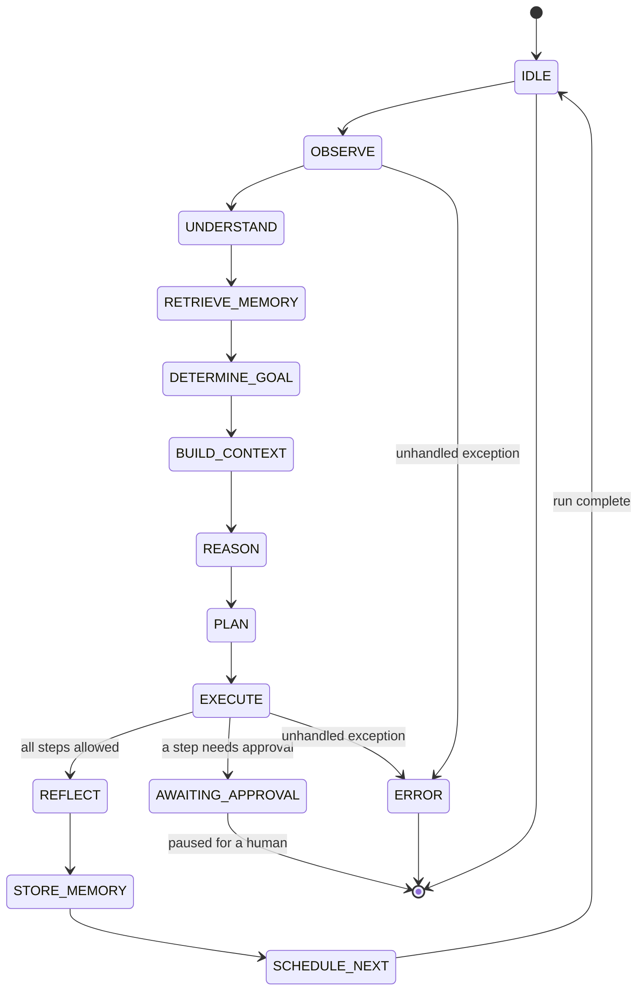
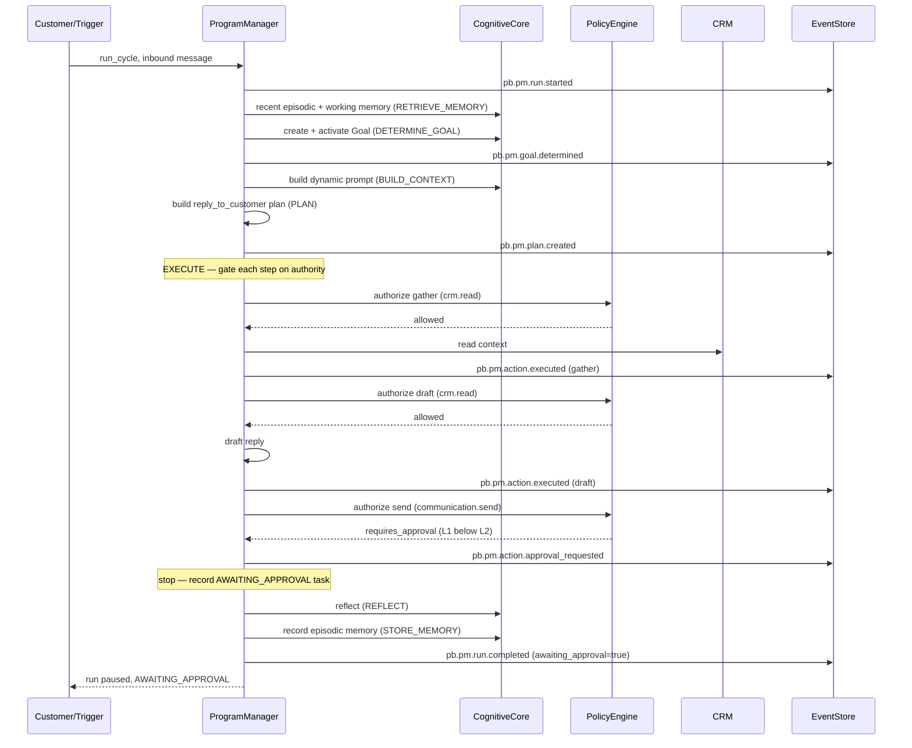

# 017 — Program Manager (Implementation)

The **Program Manager** is the first fully functional Genesis **AI Employee** — and the
reference implementation every future AI Employee follows. It is not a chatbot; it is an
autonomous business employee that owns customer communication, CRM, opportunity and project
management, proposal preparation, scheduling, follow-ups, and organizational memory, and it
operates a governed cognitive lifecycle within explicit authority limits. It is built on and
reuses the **Cognitive Core** (`docs/genesis/016_Cognitive_Core.md`,
[ADR-0010](../adr/0010-cognitive-core.md)) rather than re-implementing memory, goals,
planning-grade context, policy, reflection, or events. This document describes what exists in
code today (present tense).

## Overview

The Program Manager is a bounded context at `apps/api/src/pb_api/agents/program_manager/`,
addressable at `/api/v1/agents/program-manager`. It consumes the Cognitive Core the way any
AI Employee is meant to: it wires a `CognitiveCore` facade from a single `AsyncSession` and
calls the core's services for the cognitive substrate, while adding only the domain,
services, and API that make it specifically a program manager.

The core principle is **reuse, not re-implementation**. The Program Manager delegates to the
Cognitive Core for:

- **Memory** — episodic recall and writes, working memory, and the unified memory engine.
- **Goals** — every run creates and activates a cognitive `Goal` via the `GoalManager`.
- **Context and prompt assembly** — a dynamic, planning-grade system prompt from the
  `PromptBuilder` (never a static template).
- **Policy** — all authorization is evaluated by the deterministic `PolicyEngine`.
- **Reflection** — every run captures a `Reflection` through the `ReflectionEngine`.
- **Events** — every consequential act is appended through the single `EventProcessor` write
  path.

The composition root is `ProgramManager`
(`application/program_manager.py`); the HTTP surface is `program_manager_router`
(`api/router.py`).

## Placement & layering

The module is strictly layered, each layer depending only on the one below:

```
domain/          pure Pydantic models + enumerations (persistence-agnostic)
  ->  infrastructure/   tenant-scoped async repositories (SQLAlchemy on the shared Base)
  ->  application/      services + the ProgramManager orchestrator
  ->  api/              FastAPI routers, request schemas, per-request dependency, metrics
```

- **Domain** (`domain/`) — `common.py` (the `PMState`, `PMGoalType`, `PMAuthorityLevel`,
  `RiskLevel`, `FollowUpCadence` enums; it re-exports the core's `utcnow`, `new_id`,
  `AuthorityLevel` so PM code never diverges from the core's identity/time semantics),
  `crm.py`, `proposal.py`, `scheduling.py`, `plan.py`, `run.py`, and the `PMEventType`
  constants in `events.py`.
- **Application** (`application/`) — `AuthorityService`, `CrmService`, `ProposalService`,
  `Scheduler`, `FollowUpEngine`, `TaskPlanner`, the `PersonalityProfile` /
  `CommunicationStyle`, and the `ProgramManager` orchestrator.
- **Infrastructure** — tenant-scoped async repositories; every query filters on `tenant_id`,
  so cross-tenant access is impossible in the data-access layer.
- **API** (`api/`) — FastAPI routers under `/agents/program-manager`, Pydantic request
  schemas, a per-request `ProgramManager` dependency, and Prometheus metrics.

`ProgramManager` is the single composition root: given one `AsyncSession` it constructs a
`CognitiveCore`, every Program-Manager repository, and every service, and exposes them as
attributes (`pm.crm`, `pm.proposals`, `pm.scheduler`, `pm.planner`, `pm.authority`,
`pm.core`). The API layer and the tests both consume this facade, so there is exactly one
assembly point — mirroring the Cognitive Core's design.

`bootstrap(tenant_id)` idempotently registers the Program Manager as a cognitive agent
(carrying its mission and authority tier in agent metadata), seeds the default per-tenant
policy set, and seeds the core's default procedures. It is safe to call repeatedly.

## The cognitive lifecycle

A single run is one governed pass through the lifecycle. The happy path advances through
twelve states in declaration order, bookended by `IDLE`; `AWAITING_APPROVAL` and `ERROR` are
off-path terminal states for a run. The order and the two off-path branches are driven by
`ProgramManager._drive()` and `run_cycle()`.



What each state does (grounded in `_drive()`):

- **IDLE** — the resting state; a `PMRun` record is created before the drive begins and the
  `pb.pm.run.started` event is emitted.
- **OBSERVE / UNDERSTAND** — the run takes in its trigger and input; the situational inputs
  are carried in a `RunContext` (tenant, agent, tier, trigger, input text, and any CRM
  entity ids).
- **RETRIEVE_MEMORY** — pulls the ten most recent episodic memories from the Cognitive Core
  and, when an organization is in context, loads its three relationship scores and writes
  them into working memory (`pm:run:{id}`) so downstream reasoning can see the relationship
  state. The recalled-memory count and relationship score are recorded on the run's metadata.
- **DETERMINE_GOAL** — selects a `PMGoalType` (deterministic keyword intent with a
  CRM-context fallback; see below), derives a plain-language objective, and creates a
  cognitive `Goal` (level `AGENT`, owned by the PM agent) which it immediately sets to
  `ACTIVE`. Emits `pb.pm.goal.determined`.
- **BUILD_CONTEXT** — assembles a dynamic system prompt via the Cognitive Core's
  `PromptBuilder`, passing the objective as the task, the input text (or objective) as the
  query, the configured reasoning token budget, and the communication-style rules as output
  requirements. The prompt's token estimate is recorded on the run.
- **REASON** — the deliberation checkpoint over the assembled context, ahead of planning.
- **PLAN** — builds and persists a `PMPlan` for the goal via the `TaskPlanner`.
- **EXECUTE** — executes plan steps in order, gating each on authority; it stops at the first
  step that requires approval (pausing the run) or is denied. Allowed steps perform their
  real, persisted effect and emit `pb.pm.action.executed`; an approval-gated step records an
  `AWAITING_APPROVAL` task and emits `pb.pm.action.approval_requested`.
- **REFLECT** — captures a `Reflection` through the Cognitive Core describing the objective,
  the outcome, and whether it succeeded (with lessons/recommendations when it did not or is
  awaiting approval).
- **STORE_MEMORY** — writes an episodic memory of the run through the Cognitive Core and, for
  an in-context organization on an acting goal, nudges its relationship scores upward in
  small bounded increments.
- **SCHEDULE_NEXT** — when the run did not pause, may queue a follow-up `ScheduledAction`
  against a concrete subject.
- **AWAITING_APPROVAL** — the run pauses here (setting `awaiting_approval`, leaving `success`
  unresolved) when a step required approval. Reflection and memory still run; the follow-up
  is skipped.
- **ERROR** — any unhandled exception ends the run in `ERROR` with the error recorded and a
  `pb.pm.run.failed` event.

A completed or paused run is finalised with its outcome and end time, then persisted, and
`pb.pm.run.completed` is emitted carrying `success` and `awaiting_approval`. The states a run
actually visited are appended to `states_visited` on the run, so the traversal is itself part
of the audit record.

## Goal system

`PMGoalType` (`domain/common.py`) enumerates what the Program Manager decides to accomplish
in a run:

| Goal type | Meaning |
| --- | --- |
| `reply_to_customer` | Reply to the customer's message |
| `qualify_lead` | Assess and score a lead |
| `follow_up_lead` | Re-engage a lead at cadence |
| `book_meeting` | Book a meeting with the customer |
| `advance_opportunity` | Move an opportunity to its next open stage |
| `create_proposal` | Prepare an eleven-section proposal |
| `update_crm` | Update a CRM record |
| `coordinate_project` | Review project health and create coordination tasks |
| `escalate_issue` | Escalate an issue to a human |
| `request_approval` | Ask a human to decide |
| `no_action` | Observe; nothing to do |

Goal determination (`_determine_goal`) is deterministic. If input text is present, it is
matched against ordered intent keyword groups — escalation, proposals, meetings, follow-ups
take precedence, in that order, over a generic reply. When no keyword matches, it falls back
to CRM context: an in-context opportunity implies `advance_opportunity`, a lead implies
`qualify_lead`, a project implies `coordinate_project`; otherwise text present implies
`reply_to_customer`, and an empty trigger yields `no_action`. A caller may also override the
goal explicitly (used, for example, when a scheduled follow-up fires with a known goal).

## Authority & governed autonomy

The Program Manager operates at one of three coarse tiers (`PMAuthorityLevel`, an `IntEnum`
so `>=` reads as "has at least this authority"):

- **L0 `OBSERVE_ONLY`** — read, analyse, and draft internally; every outward or
  state-changing action requires approval.
- **L1 `ACT_WITH_APPROVAL`** — take reversible internal actions (update CRM, create tasks,
  schedule follow-ups, draft proposals) autonomously; outward-facing or high-value actions
  require approval. This is the default tier.
- **L2 `ACT_BOUNDED`** — send communications, book meetings, and execute follow-ups
  autonomously within configured bounds; only exceptional actions require approval.

These map onto the Cognitive Core's fine-grained A0-A5 `AuthorityLevel`
(`application/authority.py`, `PM_AUTHORITY_TO_COGNITIVE`):

| PM tier | Cognitive level |
| --- | --- |
| `OBSERVE_ONLY` | `OBSERVE` |
| `ACT_WITH_APPROVAL` | `ACT_WITH_APPROVAL` |
| `ACT_BOUNDED` | `ACT_BOUNDED` |

**Authorization is delegated, not re-implemented.** `AuthorityService` maps the actor's tier
to a cognitive level and calls the Cognitive Core's deterministic `PolicyEngine.evaluate`.
The Program Manager seeds a default, tenant-scoped policy set at bootstrap:
`seed_default_policies` installs **one `ALLOW` policy per catalogue action** (priority 100),
each gated at the action's required authority (`min_authority`). Because the Cognitive Core
escalates an `ALLOW` to `REQUIRE_APPROVAL` whenever the actor's authority is below the
policy's `min_authority`, a single `ALLOW` rule expresses "permitted at or above this tier,
approval below it". Seeding is idempotent (keyed by the `pm-default:` policy-name prefix).

The canonical action catalogue (`ACTION_CATALOG`) and the tier each action requires:

| Action | Required tier |
| --- | --- |
| `crm.read` | L0 `OBSERVE_ONLY` |
| `crm.create` | L1 `ACT_WITH_APPROVAL` |
| `crm.update` | L1 `ACT_WITH_APPROVAL` |
| `task.create` | L1 `ACT_WITH_APPROVAL` |
| `note.create` | L1 `ACT_WITH_APPROVAL` |
| `schedule.create` | L1 `ACT_WITH_APPROVAL` |
| `proposal.draft` | L1 `ACT_WITH_APPROVAL` |
| `opportunity.advance` | L1 `ACT_WITH_APPROVAL` |
| `communication.send` | L2 `ACT_BOUNDED` |
| `meeting.book` | L2 `ACT_BOUNDED` |
| `proposal.send` | L2 `ACT_BOUNDED` |
| `opportunity.close` | L2 `ACT_BOUNDED` |
| `issue.escalate` | L0 `OBSERVE_ONLY` |

**Secure by default.** The Cognitive Core's `PolicyEngine` denies any action with no matching
policy, and `required_authority` returns the top tier for an unknown action — so autonomy is
bounded from first boot and can never silently exceed its tier. During execution the Program
Manager stops at the first step it may not take, and never performs a partial outward action
past its authority bound.

## The task planner

`TaskPlanner` (`application/task_planner.py`) is deterministic and dependency-free: each goal
type has a canonical decomposition into ordered `PMPlanStep`s, and the plan is persisted so
every autonomous action is traceable to the step that authorised it (emitting
`pb.pm.plan.created`). The number of steps is bounded by `max_plan_steps`.

Each `PMPlanStep` (`domain/plan.py`) declares more than the Cognitive Core's generic
`Plan`/`PlanTask` models: an `objective`, `depends_on` dependencies, `required_tools`, a
`risk` level, an `expected_outcome`, a `fallback`, the `authority_required`, and the
canonical policy `action`/`resource` strings it is gated on. Because the generic
`cognitive.Plan` does not model these fields, the Program Manager's plan is a
**specialisation** of the core's planning, not a duplicate of it — the same relationship the
Cognitive Core has between its interfaces and their heuristic defaults.

Worked example — the `reply_to_customer` plan (gather → draft → send):

| Step | Action | Authority | Risk |
| --- | --- | --- | --- |
| `gather` — retrieve the customer's context and history | `crm.read` | L0 | low |
| `draft` — draft a reply in the Program Manager's voice | `crm.read` | L0 | low |
| `send` — send the reply to the customer | `communication.send` | L2 | medium |

`draft` depends on `gather`; `send` depends on `draft`. For an L1 Program Manager, `gather`
and `draft` are allowed (they need only L0) but `send` requires L2, so the run pauses in
`AWAITING_APPROVAL` at the send step. An L2 Program Manager executes all three autonomously.

## CRM abstraction

The CRM (`domain/crm.py`, `application/crm_service.py`) is the Program Manager's model of the
outside world — a tenant-agnostic graph it reasons over. **An `Organization` is a company the
Program Manager does business *with*, scoped under a tenant — it is distinct from the platform
tenant (the Company operating the Program Manager).**

Aggregates, each tenant-scoped and hanging off an `organization_id` spine:

- **Organization** — a customer or prospect account. Carries the three relationship scores
  (`relationship_score`, `trust_score`, `importance_score`), each a bounded `0.0-1.0` float,
  plus status (`prospect`/`active`/`dormant`/`churned`), industry, size, and tags.
- **Contact** — a person at an organization, with a role (`decision_maker`, `champion`,
  `influencer`, `user`, `gatekeeper`, `unknown`) and its own relationship score.
- **Lead** — an unqualified or qualifying interest, with a source, status
  (`new`/`contacted`/`qualified`/`unqualified`/`converted`), and a score.
- **Opportunity** — a qualified deal in the pipeline, with a stage, amount, currency,
  probability, and computed `weighted_amount`.
- **Project** — delivery work won from an opportunity, with status and health
  (`on_track`/`at_risk`/`off_track`).
- **Meeting** — a scheduled interaction with an organization's contacts.
- **CRM Task** — a human- or agent-owned to-do attached to a CRM entity (distinct from a
  `PMTask`, which is a unit of the Program Manager's own plan execution).
- **Note** — a free-text observation attached to any CRM entity.

Business rules live in `CrmService`, not the repositories. **Lead → opportunity conversion**
(`convert_lead`) requires the lead to reference an organization, refuses a
double-conversion, creates the opportunity, marks the lead `converted`, and back-links the
two so the funnel stays traceable — emitting both `pb.crm.lead.converted` and
`pb.crm.opportunity.created`. **Opportunity stage advancement** (`advance_opportunity`) moves
a deal between stages, sets probability to 1.0 on `closed_won` and 0.0 on `closed_lost`, and
emits `pb.crm.opportunity.advanced`, `.won`, or `.lost` as appropriate. During a run the
Program Manager only ever advances to the next *open* stage (`_NEXT_OPEN_STAGE`) — it never
auto-closes a deal.

## Organizational memory

The three relationship scores on an `Organization` are the Program Manager's durable read on
a relationship. As runs succeed, `CrmService.adjust_scores` moves them in small bounded
increments — a successful acting run nudges `relationship_score` by `+0.02` and `trust_score`
by `+0.01` — and always clamps every score to `[0, 1]`. Score changes emit
`pb.crm.organization.scored` with the reason (the run id), so the relationship's trajectory
is reconstructable.

Beyond the CRM scores, each run writes into the Cognitive Core: an **episodic memory** of
what the run did (via `core.episodic.record`, which also mirrors into the unified memory
engine) and a **reflection** (via `core.reflection.reflect`). Working memory is populated with
the organization's current scores at retrieval time. In this way the Program Manager's memory
is layered — durable relationship scores it owns, plus the general-purpose episodic/reflective
memory the Cognitive Core owns.

## Proposal preparation

A proposal (`domain/proposal.py`, `application/proposal_service.py`) is an ordered set of the
**eleven canonical sections**, in presentation order: `executive_summary`, `understanding`,
`objectives`, `proposed_solution`, `scope_of_work`, `timeline`, `team`, `pricing`, `terms`,
`why_us`, `next_steps`. Every proposal is scaffolded with all eleven sections (empty until
filled), so structure is guaranteed and only content varies.

Two gates govern whether a draft may progress to `READY`/`SENT` (`mark_ready`):

1. **Complete** — the proposal's `is_complete` property is true only when all eleven
   sections are present and non-empty.
2. **Approved when high-value** — if the proposal's `total_value` is at or above the
   configured `proposal_approval_value_threshold` (default `25,000`), `requires_approval` is
   set at draft time and `mark_ready` refuses to promote it without a human `approved_by`.

Sending (`send`) is only possible once the proposal is `READY`. These guardrails keep
proposal automation from committing the business beyond the Program Manager's authority.
Drafting emits `pb.proposal.draft.created`; readiness and sending emit `pb.proposal.ready`
and `pb.proposal.sent`.

## Scheduling & follow-ups

There is exactly **one** deferred-work primitive: `ScheduledAction` (`domain/scheduling.py`),
of kind `followup`, `task`, `reminder`, or `review`. Every future action the Program Manager
owns is one `ScheduledAction` due at `run_at`, against a CRM subject
(`SubjectType`) and carrying the `PMGoalType` to realise when it fires. There is deliberately
no second "follow-up" table.

`Scheduler` (`application/scheduler.py`) owns the primitive's lifecycle — create, list, list
what is `due`, and mark `executed`/`failed`/`cancelled` — emitting `pb.pm.schedule.created`,
`.executed`, and `.cancelled`. The `SCHEDULE_NEXT` lifecycle step and the follow-up engine
both funnel through this one mechanism, so there are no parallel timers.

`FollowUpEngine` (`application/followup_engine.py`) is a deliberately thin façade: a follow-up
*is* a `ScheduledAction` of kind `followup` whose `run_at` is derived from a named
`FollowUpCadence` — `first_touch` (24h), `second_touch` (72h), `nurture` (7d), `long_nurture`
(30d), or `custom` (an explicit positive delay). The cadences and thresholds are the levers
that shape autonomous behaviour and are configurable per deployment (`config.py`).

`ProgramManager.execute_due` runs a full lifecycle pass for each `ScheduledAction` that is
due: it starts a run (trigger `scheduled_action`) with the action's goal and subject, then
marks the action `executed` or `failed` based on the run's outcome. Follow-ups thus close the
loop — a run schedules the next touch, and a later `execute_due` realises it.

## Action execution & the transport port

An honest boundary matters here. When a plan step is authorised, `_execute_step` performs its
real, persisted effect against the CRM, scheduler, or proposal service:

- **CRM/scheduling/proposal-draft effects are real.** Reading context, updating the CRM,
  qualifying a lead, advancing an opportunity, booking a meeting record (persisting a
  `Meeting`), drafting a proposal, creating tasks/notes, and scheduling follow-ups all commit
  genuine state and emit events.
- **Outward transport is an explicit port.** Actions that transmit outside the platform —
  sending a message, booking on an external calendar, sending a proposal — record the
  **prepared artifact** and emit the event, but the actual transmission is a **channel /
  calendar port** to be fulfilled by a future adapter. For example, `communication.send`
  drafts the reply in the Program Manager's voice and records it as an `[outbound draft]`
  note, returning "Reply prepared and recorded (delivery via channel port)".

This is **preparation the Program Manager genuinely owns**, with transport drawn as a clean
boundary — no vendor is assumed, so there is no vendor lock-in. It is a real port, not a mock.

## Events

The Program Manager reuses the Cognitive Core's immutable `CognitiveEvent` envelope and its
append-only `EventProcessor` — it never builds a second event store. `domain/events.py`
declares only the Program Manager's event *type* constants (`PMEventType`), following the
canonical Genesis pattern `pb.<context>.<aggregate>.<past-verb>` (`005_Event_Model.md`) across
three contexts — `crm`, `proposal`, and `pm` — which correspond to reserved module
namespaces.

Representative event types (all verified against `PMEventType`):

| Context | Event types |
| --- | --- |
| `pm` (lifecycle) | `pb.pm.run.started`, `pb.pm.goal.determined`, `pb.pm.plan.created`, `pb.pm.action.executed`, `pb.pm.action.approval_requested`, `pb.pm.action.approval_granted`, `pb.pm.run.completed`, `pb.pm.run.failed` |
| `pm` (schedule) | `pb.pm.schedule.created`, `pb.pm.schedule.executed`, `pb.pm.schedule.cancelled` |
| `crm` | `pb.crm.organization.created`/`.updated`/`.scored`, `pb.crm.contact.created`, `pb.crm.lead.created`/`.qualified`/`.converted`, `pb.crm.opportunity.created`/`.advanced`/`.won`/`.lost`, `pb.crm.project.created`/`.updated`, `pb.crm.meeting.scheduled`/`.completed`, `pb.crm.task.created`/`.completed`, `pb.crm.note.recorded` |
| `proposal` | `pb.proposal.draft.created`, `pb.proposal.section.updated`, `pb.proposal.ready`, `pb.proposal.sent`, `pb.proposal.accepted`, `pb.proposal.rejected` |

Every event goes through the Cognitive Core's `EventProcessor` — the single write path — so
the Program Manager's entire history lands in the same append-only, tenant-scoped store as the
rest of cognition.

## HTTP API

Every route is mounted under `/api/v1/agents/program-manager` (`api/router.py` aggregates one
router per concern; the platform mounts it beneath `/api/v1`). Tenant authentication is not
yet in place, so write bodies carry an explicit `tenant_id`. Each request runs against a
per-request `ProgramManager` bound to the platform DB session, committed when the handler
returns cleanly.

| Method & path | Purpose |
| --- | --- |
| `POST /bootstrap` | Idempotently register the agent and seed its governance |
| `POST /runs` | Trigger one governed cognitive run |
| `GET /runs` | List runs (optionally filtered by `awaiting_approval`) |
| `GET /runs/{run_id}` | Fetch a run record |
| `GET /runs/{run_id}/tasks` | List the per-step tasks of a run (optional `status` filter) |
| `POST /tasks/{task_id}/approve` | Approve a task paused awaiting approval |
| `POST /scheduled-actions/execute-due` | Run a lifecycle pass for every due scheduled action |
| `GET /scheduled-actions` | List scheduled actions (optional `status`/`kind` filters) |
| `POST /scheduled-actions/{action_id}/cancel` | Cancel a pending scheduled action |
| `POST /crm/organizations` | Create an organization |
| `GET /crm/organizations` | List organizations (optional `status` filter) |
| `GET /crm/organizations/{organization_id}` | Fetch an organization |
| `POST /crm/contacts` | Create a contact |
| `POST /crm/leads` | Create a lead |
| `GET /crm/leads` | List leads (optional `status` filter) |
| `POST /crm/leads/{lead_id}/convert` | Convert a lead into an opportunity |
| `GET /crm/opportunities` | List opportunities (optional `stage` filter) |
| `POST /proposals` | Draft an eleven-section proposal |
| `GET /proposals` | List proposals (optional `organization_id`/`status` filters) |
| `GET /proposals/{proposal_id}` | Fetch a proposal |
| `POST /proposals/{proposal_id}/ready` | Promote a complete proposal to `READY` |
| `GET /health` | Liveness (`status: ok`, `employee: program_manager`), no database |

Domain rule violations surfaced by the services (an unconvertible lead, an incomplete or
unapproved proposal) map to HTTP 422; missing entities map to 404.

## A run that ends in approval

A single run of an inbound customer message for an **L1** Program Manager. `gather` and
`draft` need only L0 and are allowed; `send` needs L2, so the run pauses in
`AWAITING_APPROVAL`. Reflection and memory still run before the run is finalised as paused.



A later `POST /tasks/{task_id}/approve` marks the task completed, clears the run's
`awaiting_approval`, and emits `pb.pm.action.approval_granted`; the approved action is then
re-driven on the next run for its subject.

## Observability

- **Business metrics** (`api/metrics.py`, `ProgramManagerMetrics`) are registered on the
  application's existing Prometheus `CollectorRegistry` — the same one backing `/metrics` —
  so they are per-app and never collide across the many app instances a test suite builds:
  - `pm_runs_total{goal, outcome}` — lifecycle runs by goal and outcome (`success`,
    `failed`, `awaiting_approval`, `error`).
  - `pm_approvals_requested_total` — runs that paused awaiting human approval.
  - `pm_run_duration_seconds` — a histogram of wall-clock run duration.
- **The domain event log is the authoritative audit trail.** The metrics complement, but do
  not replace, the immutable `CognitiveEvent` stream: every autonomous decision — the goal
  determined, the plan created, each action executed or paused for approval, and the run's
  completion — is reconstructable from the events plus the persisted `PMRun`/`PMTask`
  records.

## Testing

The suite lives in `apps/api/tests/agents/program_manager/`. Each test runs against an
isolated in-memory SQLite database with every platform table created and a real
`ProgramManager` (composing a real `CognitiveCore`) wired to a real session and real
repositories — **no mocks**, exactly as in production (`conftest.py`).

| Module | Covers |
| --- | --- |
| `test_config_and_domain.py` | Settings, cadence resolution, and the domain enums/models. |
| `test_authority.py` | Tier→cognitive mapping, default-policy seeding, and the authority-gate escalation. |
| `test_crm_service.py` | Organization/contact/lead/opportunity operations, conversion, and score clamping. |
| `test_proposal_service.py` | Eleven-section scaffolding, completeness, and the value-threshold approval gate. |
| `test_scheduler_followup.py` | The single scheduling primitive, cadence-derived follow-ups, and due execution. |
| `test_task_planner.py` | Deterministic, authority-aware plan decomposition per goal. |
| `test_lifecycle.py` | A full lifecycle visiting every state, and the L1 approval pause. |
| `test_repositories.py` | Tenant-scoped repository CRUD and isolation. |
| `test_api.py` | The HTTP API end-to-end. |

## Persistence & portability

The module defines **13 tenant-scoped tables** on the shared platform `Base`, created by
Alembic migration `0003_program_manager_tables.py` (revision `0003`, down-revision `0002`):

| Table | Aggregate |
| --- | --- |
| `pm_organization` | `Organization` (with the three relationship scores) |
| `pm_contact` | `Contact` |
| `pm_lead` | `Lead` |
| `pm_opportunity` | `Opportunity` |
| `pm_project` | `Project` |
| `pm_meeting` | `Meeting` |
| `pm_crm_task` | `CrmTask` |
| `pm_note` | `Note` |
| `pm_proposal` | `Proposal` (eleven sections stored as JSON) |
| `pm_scheduled_action` | `ScheduledAction` (the single deferred-work primitive) |
| `pm_plan` | `PMPlan` (steps stored as JSON) |
| `pm_run` | `PMRun` (the lifecycle execution record) |
| `pm_task` | `PMTask` (a unit of plan-step execution) |

Every table carries an indexed `tenant_id`, and every repository query filters on it, so
cross-tenant access is impossible in the data-access layer. Column types are portable — lists
and dicts (steps, sections, states visited, metadata) are stored as `JSON`, enums as
`String`, and `authority_required` as an integer — which keeps the identical schema and test
suite runnable on **SQLite** (tests) while production runs **PostgreSQL**. This mirrors the
Cognitive Core's persistence conventions exactly.

## Cross-references

- [ADR-0011](../adr/0011-program-manager-ai-employee.md) — the decision record for this module:
  placement under `agents/`, composition over re-implementation, the L0/L1/L2 authority model,
  and transport-as-a-port.
- `016_Cognitive_Core.md` — the cognitive operating system the Program Manager consumes.
- [ADR-0010](../adr/0010-cognitive-core.md) — the Cognitive Core placement/layering decision
  the Program Manager follows.
- `003_Cognitive_Architecture.md` — the cognitive loop, planning, reflection, goals, context,
  and authority levels.
- `005_Event_Model.md` — the canonical event envelope and `pb.<context>.<aggregate>.<past-verb>`
  naming.
- `000_Glossary.md` — authority levels, event naming, and the multi-tenancy foundation delta.
