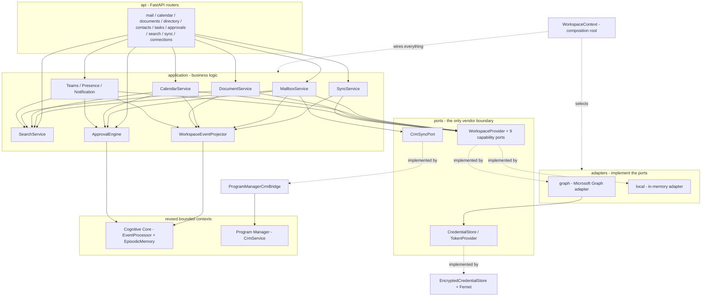
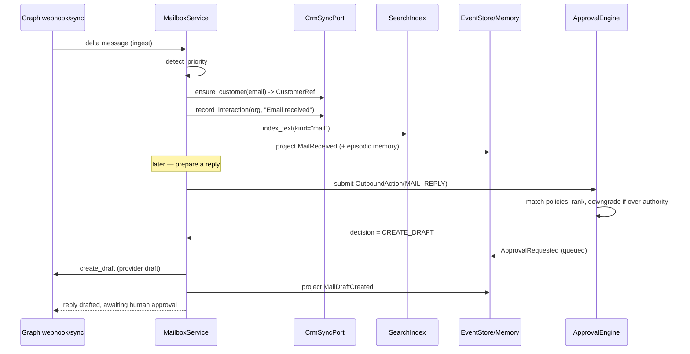

# 018 — Enterprise Digital Workspace Integration (Implementation)

The **Workspace Integration** (Epic 009) turns Genesis from an autonomous employee that
*reasons* about a business into one that *works inside* the business's digital workspace.
It gives Genesis a governed presence in Microsoft 365 — a shared mailbox it reads and
replies from, a calendar it schedules against, a directory and contacts it knows, Teams it
posts to, SharePoint/OneDrive it ingests as knowledge, and tasks and presence it tracks —
and it does so **provider-agnostically**. Business logic depends only on a set of provider
**ports**; Microsoft Graph is the primary **adapter**, and a fully-functional **in-memory**
adapter runs the same logic for development, tests, and air-gapped deployments. This document
describes what exists in code today (present tense). The rationale lives in
[ADR-0012](../adr/0012-workspace-integration.md).

## Overview

The integration is a bounded context at `apps/api/src/pb_api/integrations/workspace/`,
addressable at `/api/v1/integrations/workspace`. It reuses the **Cognitive Core**
(`016_Cognitive_Core.md`) for events and memory and the **Program Manager**'s CRM
(`017_Program_Manager.md`) through a narrow port — it never re-implements an event store, a
memory engine, or a CRM. Everything it does obeys the manifesto's first principles: every
workspace activity becomes an immutable **event**, every event updates **memory**, every
outbound action passes an **approval** gate, and no vendor is assumed anywhere in the business
logic.

The composition root is `WorkspaceContext` (`application/workspace.py`): given one
`AsyncSession` it wires the chosen provider adapter, every repository, the Cognitive Core, the
CRM bridge, security (credential cipher + audit), and all capability services, and exposes them
as attributes (`ctx.mailbox`, `ctx.calendar`, `ctx.documents`, `ctx.approvals`, `ctx.sync`,
`ctx.search`, …). The API layer and the tests both consume this one facade.

## Design principle — depend on ports, never on Graph

The load-bearing rule of Epic 009: **workspace business logic depends only on the provider
ports in `ports/providers.py`, never on Microsoft Graph.** Adapters implement the ports;
services import the ports. Adding a new provider (Google Workspace, etc.) means implementing
these Protocols and nothing else — no business-logic change (see
`PROVIDER_ABSTRACTION_GUIDE.md`).

The ten capability ports (all `@runtime_checkable` `Protocol`s, all tenant- and
connection-scoped):

| Port | Responsibility |
| --- | --- |
| `WorkspaceProvider` | The aggregate provider: exposes every capability sub-provider plus `healthcheck` and the webhook subscription lifecycle (`create`/`renew`/`delete_subscription`). |
| `MailProvider` | List/delta/get messages, attachments, drafts, send, move, categorize, flag, mark read, search. |
| `CalendarProvider` | List/delta events, create/update/cancel, respond, and compute `availability`. |
| `ContactsProvider` | List/delta contacts and `upsert_contact`. |
| `DirectoryProvider` | List/delta users, list groups, get a user. |
| `StorageProvider` | List SharePoint sites, list/download/upload drive items, search. |
| `MeetingProvider` | Teams channels, channel/chat messages, post a message. |
| `PresenceProvider` | Batch presence lookup for a set of users. |
| `NotificationProvider` | Send a notification. |
| `TaskProvider` | List To Do / Planner tasks, create, complete. |

Every port method takes `tenant_id` and `connection_id` and returns **provider-agnostic
domain models** wrapped in `Page` / `DeltaPage` containers (`domain/page.py`) — the same
cursor and delta-token abstraction regardless of vendor.

Two further ports keep other concerns vendor- and context-neutral:

- **`CredentialStore` / `TokenProvider`** (`ports/credentials.py`) — OAuth grants and access
  tokens as value objects; storage and token acquisition are ports so secrets can live in the
  environment, a secret manager, or an encrypted DB column without business logic caring.
- **`CrmSyncPort`** (`ports/crm_sync.py`) — the *only* thing the workspace needs from the CRM
  (`identify_customer`, `ensure_customer`, `record_interaction`). The workspace never imports
  the Program Manager's services; an adapter at the composition boundary wires this port to the
  PM's `CrmService`.

## Placement & layering

The module is strictly layered, each layer depending only on those beneath it:

```
domain/          pure Pydantic models + enums (persistence-agnostic; no vendor types)
ports/           the Protocols business logic depends on (providers, credentials, crm_sync)
security/        credential encryption (Fernet) + the audit log
graph/           the Microsoft Graph adapter (the only code that speaks Graph)
local/           the in-memory adapter (a first-class alternate backend, not a mock)
db/              SQLAlchemy rows on the shared platform Base (the ws_ tables)
infrastructure/  tenant-scoped async repositories
application/     capability services + WorkspaceContext (the composition root) + worker
api/             FastAPI routers, request schemas, per-request dependency, metrics
```

- **Domain** (`domain/`) — `common.py` (the `Provider`, `SyncResource`, `SyncStatus`,
  `MessagePriority`, `ApprovalDecisionType`, `WorkspaceScope` enums; it re-exports the
  Cognitive Core's `utcnow`/`new_id`/`ensure_aware` so workspace data shares the platform's
  identity/time semantics), plus `mail`, `calendar`, `contacts`, `directory`, `files`, `teams`,
  `presence`, `tasks`, `search`, `approval`, `connection`, `sync`, `page`, and the
  `WorkspaceEventType` constants in `events.py`.
- **Application** (`application/`) — `MailboxService`, `CalendarService`, `DocumentService`,
  `TeamsService`/`PresenceService`/`NotificationService` (`collaboration.py`), `SearchService`,
  `ApprovalEngine`, `WorkspaceEventProjector`, `SyncService`, `EncryptedCredentialStore`, the
  `ProgramManagerCrmBridge`, the `build_graph_provider` factory, `WorkspaceContext`, and the
  background `WorkspaceSyncWorker`.
- **Infrastructure** — tenant-scoped async repositories; every query filters on `tenant_id`,
  so cross-tenant access is impossible in the data-access layer.
- **API** (`api/`) — routers under `/integrations/workspace`, Pydantic request schemas, a
  per-request `WorkspaceContext` dependency (`WsDep`), and Prometheus metrics.

### Component & wiring diagram



`WorkspaceContext` defaults `self.provider` to the in-memory adapter, so the platform runs with
no external credentials; the API dependency injects the Microsoft Graph adapter when
`PB_WS_PROVIDER=microsoft_graph` and Graph credentials are configured (`api/deps.py`).

## Microsoft Graph adapter

The Graph adapter (`graph/`) is the **only** place in the workspace that speaks Microsoft
Graph. It composes nine capability sub-providers behind `GraphWorkspaceProvider`
(`graph/provider.py`) and centralises every cross-cutting concern in `GraphClient`
(`graph/client.py`).

- **OAuth (`graph/auth.py`, `GraphTokenProvider`).** Two flows, chosen per stored `OAuthGrant`:
  - *Application / client-credentials* — no refresh token; the `client_credentials` grant with
    the `.default` scope (the app's admin-consented **application** permissions).
  - *Delegated with refresh-token rotation* — a `refresh_token` grant that requests
    `offline_access`; because refresh tokens are single-use in Entra ID, the rotated token
    Microsoft returns is persisted back via `CredentialStore.rotate_refresh_token`. Tokens are
    cached per `(tenant_id, connection_id)` and re-minted only once `AccessToken.is_expired`
    (with a safety skew) reports expiry; refreshes are serialized by a lock so a burst of
    callers triggers a single token request.
- **Secure credential storage** — the `TokenProvider` reads grants through
  `EncryptedCredentialStore`, which keeps client secrets and refresh tokens Fernet-encrypted at
  rest (see *Security*).
- **Retry / backoff honouring `Retry-After`** — `GraphClient._request` retries `429` and `503`
  up to `max_retries`, sleeping `retry_base_delay_seconds · 2^attempt` capped at
  `retry_max_delay_seconds`, but a numeric `Retry-After` header overrides the backoff. A `401`
  raises `GraphAuthError`; other `>= 400` raise `GraphError` carrying Graph's `error.code`.
- **Client-side rate limiting** — an app-scoped `AsyncRateLimiter` (`graph/rate_limit.py`), a
  monotonic token bucket paced to `rate_limit_per_second`, throttles every request so Genesis
  stays under Graph's per-app throttle. It uses the event-loop clock, never wall-clock.
- **`@odata.nextLink` pagination** — `GraphClient.paginate` fetches one page and returns the
  next cursor; capability providers supply only an item mapper.
- **Delta sync (`@odata.deltaLink`)** — `GraphClient.delta` resumes in Graph's precedence
  order (in-sweep `nextLink` cursor > stored `deltatoken` > a fresh `{path}/delta`), maps
  items, routes `@removed` tombstones into `removed_ids`, and extracts the new delta token from
  the final page's `@odata.deltaLink`.
- **Webhook subscriptions** — `GraphWorkspaceProvider.create_subscription` /
  `renew_subscription` / `delete_subscription` manage Graph change-notification subscriptions,
  defaulting a ~3-day expiry and echoing a `clientState` secret.

## Mailbox

`MailboxService` (`application/mailbox_service.py`) is the shared mailbox as a governed Genesis
surface, depending only on the `MailProvider` port.

- **Read & thread** — `list_messages`, `conversation` (all messages for a
  `conversation_id`), and `search`. The Graph adapter maps Graph's reply/reply-all/forward
  affordances; messages carry `conversation_id` for threading and `attachments` metadata.
- **Ingestion** — `ingest` runs each new/changed message end-to-end: **priority detection**
  (`detect_priority` — provider signal first, then an urgent-term scan), **customer
  identification** and **CRM linking** via the `CrmSyncPort` (`ensure_customer` +
  `record_interaction`), **indexing** for unified search, and a `MailReceived` **event + episodic
  memory** through the projector. `sync` delta-syncs the mailbox, ingesting every page and
  advancing the persisted delta token.
- **Outbound (approval-gated)** — `prepare_reply` builds a `DraftReply`, submits an
  `OutboundAction` to the approval engine, and acts on the ruling: an auto-approved reply is
  **sent** (`MailSent`); a draft-only or approval-required reply is stored as a provider draft
  (`MailDraftCreated`) and an approval request is queued. `categorize`, `move`, and `set_flag`
  perform their provider effect and emit the corresponding event.

Every email thus becomes an **event**, updates **memory**, and updates the **CRM** — the CRM
strictly through the narrow `CrmSyncPort`, never the Program Manager's internals.

## Calendar

`CalendarService` (`application/calendar_service.py`) reads and writes events through the
`CalendarProvider` port. It computes `availability` and `suggest_slots` (the first slots where
every attendee is free), `detect_conflicts` against existing events, and `summarize_meeting`
(records a summary + action items onto the event and indexes them). Creating an invite
(`create_event` → `MeetingCreated`) and responding to one (`respond` → `MeetingAccepted` /
`MeetingDeclined`) are outbound actions and pass the approval engine first.

## Contacts & Directory

`ContactsProvider` and `DirectoryProvider` back read endpoints for the tenant's synchronized
contacts, users, and groups. `SyncService` delta-syncs contacts and directory users, indexing
each for unified search and emitting `ContactUpdated` / `DirectoryUserUpdated`.

## Teams, SharePoint/OneDrive, Tasks, Presence, Notifications

- **Teams** (`TeamsService`, `collaboration.py`) — lists channels and messages over the
  `MeetingProvider` port, indexes messages for search, and gates `post_message` on the approval
  engine (`TEAMS_MESSAGE`).
- **SharePoint/OneDrive** (`DocumentService`, `document_service.py`) — reads through the
  `StorageProvider` port, lists sites and drive items, and **ingests** documents into the
  knowledge index: `ingest_document` chunks text (`document_chunk_chars`) and indexes each chunk;
  binary formats whose text cannot be extracted are indexed by metadata rather than dropped.
  Ingestion emits `DocumentIndexed`.
- **Tasks** (`TaskProvider`) — lists To Do / Planner tasks; `SyncService` indexes them and emits
  `TaskCreated` / `TaskCompleted`.
- **Presence** (`PresenceService`) — batch presence lookup, emitting `PresenceChanged`.
- **Notifications** (`NotificationService`) — sending a notification is an outbound action gated
  by the approval engine (`NOTIFICATION`), emitting `NotificationSent`.

## Approval engine

`ApprovalEngine` (`application/approval_engine.py`) governs **every outbound action** — send
mail, accept a meeting, post to Teams, send a notification. Evaluation is deterministic. Among
enabled policies whose match facets (communication type, customer organization, customer
contact, agent) match the action, the engine takes the **maximum** under the ranking tuple
`(priority, specificity, restrictiveness)` — so highest priority dominates, then the most
specific rule, then the most restrictive decision breaks any remaining tie. The four possible
rulings (`ApprovalDecisionType`):

| Decision | Meaning |
| --- | --- |
| `APPROVE_AUTOMATICALLY` | Perform the action now, no human needed. |
| `CREATE_DRAFT` | Prepare the artifact (e.g. a provider draft) and queue it for review. |
| `REQUIRE_HUMAN_APPROVAL` | Do not act; enqueue an approval request for a human. |
| `REJECT` | Refuse the action. |

Two safeguards enforce the manifesto's autonomy limits:

- **Authority downgrade.** An `APPROVE_AUTOMATICALLY` whose `min_authority` exceeds the actor's
  `actor_authority` is downgraded to `REQUIRE_HUMAN_APPROVAL` — autonomy never silently exceeds
  its bound.
- **Secure by default.** With **no** matching policy, the engine requires human approval.

`seed_default_policies` installs a conservative set on first connection (idempotent): a
`default-require-approval` fallback (`REQUIRE_HUMAN_APPROVAL`, priority 10) and a
`default-draft-replies` rule (`CREATE_DRAFT` for `MAIL_REPLY`, priority 20). `submit` evaluates,
audits the outcome, and — for `REQUIRE_HUMAN_APPROVAL` / `CREATE_DRAFT` — enqueues an
`ApprovalRequest` and emits `ApprovalRequested`; a `REJECT` emits `ApprovalRejected`. `decide`
resolves a pending request and emits `ApprovalGranted` / `ApprovalRejected`. The model is
covered in depth in `APPROVAL_WORKFLOW_GUIDE.md`.

## Events

The workspace reuses the Cognitive Core's immutable `CognitiveEvent` envelope and its
append-only `EventProcessor` — it never builds a second event store. `domain/events.py` declares
only the workspace event *type* constants (`WorkspaceEventType`), following the canonical Genesis
pattern `pb.<context>.<aggregate>.<past-verb>` (`005_Event_Model.md`).

| Context | Event types (verified against `WorkspaceEventType`) |
| --- | --- |
| `mail` | `pb.mail.message.received`, `pb.mail.draft.created`, `pb.mail.message.sent`, `pb.mail.message.moved`, `pb.mail.message.categorized` |
| `calendar` | `pb.calendar.meeting.created`, `.updated`, `.cancelled`, `.accepted`, `.declined` |
| `contact` / `directory` | `pb.contact.contact.updated`, `pb.directory.user.updated`, `pb.directory.group.updated` |
| `document` | `pb.document.document.indexed` |
| `task` | `pb.task.task.created`, `pb.task.task.completed` |
| `presence` | `pb.presence.presence.changed` |
| `workspace` | `pb.workspace.connection.established`, `pb.workspace.sync.completed`, `pb.workspace.sync.failed`, `pb.workspace.approval.requested`, `pb.workspace.approval.granted`, `pb.workspace.approval.rejected`, `pb.workspace.notification.sent` |

The single write path is `WorkspaceEventProjector.project` (`event_projector.py`): it appends
the immutable event through the Cognitive Core's `EventProcessor` and, when the activity is worth
remembering (`memorize=True`), writes an **episodic memory** through `EpisodicMemoryService`. No
service records events or memory on its own — **everything becomes an event, and every event
updates memory**.

## Unified search

`SearchService` (`search_service.py`) provides **one** semantic search across every workspace
surface. Mail, meetings, documents, contacts, directory, tasks, Teams, and knowledge are all
projected into a single index (`ws_index_entry`). Search reuses the Cognitive Core's
deterministic, portable embedding (`hash_embedding`, dimension `embedding_dim`, default 64) and
`cosine_similarity` — the same representation the rest of Genesis uses, so it survives vendor and
model changes. No external vector service is required; **pgvector is the production scale-up**
behind the same interface (`004_Company_Brain.md`).

## Background services

`WorkspaceSyncWorker` (`application/worker.py`) drives periodic delta synchronization and webhook
renewal outside the request path. A **tick** opens its own session, builds a `WorkspaceContext`,
and for each of the tenant's connections runs `sync.sync_all`, then renews webhook subscriptions
nearing expiry:

```python
summary = await WorkspaceSyncWorker(session_factory).tick(tenant_id)
# {"connections": N, "jobs": M, "failures": K, "webhooks_renewed": R}
```

An optional `provider_for` factory lets the worker use the same Graph adapter as the request
path (built from the tick's own session). `SyncService` (`sync_service.py`) runs **per-resource
delta sync with retry + a dead-letter queue**: `sync_resource` records a `SyncJob`, retries the
resource with exponential backoff (`_run_with_retry`), and on final failure captures a
`DeadLetter` and emits `SyncFailed` — work is never silently lost.
`WorkspaceContext.renew_due_webhooks` renews subscriptions inside
`webhook_renew_before_seconds` of expiry.

## Security

- **Least-privilege scopes.** `WorkspaceScope` classes operations as `READ` / `WRITE` / `SEND` /
  `ADMIN`; the Graph app is granted only the permissions the implemented capabilities exercise
  (see `GRAPH_INTEGRATION_GUIDE.md`).
- **Fernet-encrypted credentials with rotation.** `CredentialCipher` (`security/crypto.py`) wraps
  a `MultiFernet` — the primary key encrypts, any number of retired keys still decrypt, so a key
  rotates without a flag-day re-encryption. `EncryptedCredentialStore` encrypts client secrets and
  refresh tokens **before** they touch the database and decrypts only in memory when a token must
  be minted; `WorkspaceCredentialRow` stores only ciphertext.
- **Audit log.** `AuditLog` (`security/audit.py`) records security-relevant actions — credential
  access, approval evaluations and decisions — as immutable `AuditRecord`s through an `AuditSink`
  port (a structlog sink and a DB-backed sink). Auditing never raises into the caller.
- **No hardcoded secrets.** All configuration is sourced from `PB_WS_*` environment variables
  (`config.py`); the client secret is read from the secret store, never from config.

## Observability

Business-level Prometheus metrics (`api/metrics.py`, `WorkspaceMetrics`) are registered on the
application's `CollectorRegistry` (the same one backing `/metrics`), so they are per-app and
never collide across the many app instances a test suite builds:

| Metric | Type | Meaning |
| --- | --- | --- |
| `ws_sync_runs_total{resource, outcome}` | Counter | Synchronization runs by resource and outcome. |
| `ws_sync_items_total{resource}` | Counter | Items processed by synchronization, per resource. |
| `ws_sync_duration_seconds{resource}` | Histogram | Wall-clock duration of a sync run. |
| `ws_sync_retries_total{resource}` | Counter | Sync attempts that were retried. |
| `ws_dead_letter_total` | Counter | Units of work sent to the dead-letter queue. |
| `ws_dead_letter_queue_size` | Gauge | Current size of the dead-letter queue. |
| `ws_approvals_total{decision}` | Counter | Approval-engine decisions by decision type. |
| `ws_provider_rate_limited_total` | Counter | Provider requests that hit a rate limit (HTTP 429). |
| `ws_webhook_subscriptions_active` | Gauge | Currently-active provider webhook subscriptions. |
| `ws_worker_runs_total{outcome}` | Counter | Background worker ticks, by outcome. |

The metrics complement — never replace — the immutable event log and the audit log, which remain
the authoritative audit trail.

## Persistence

The ORM layer (`db/models.py`) defines **11 tenant-scoped tables** on the shared platform `Base`,
all prefixed `ws_`, created by Alembic migration `0004_workspace_integration_tables.py`
(revision `0004`, down-revision `0003`):

| Table | Aggregate |
| --- | --- |
| `ws_connection` | `WorkspaceConnection` (a connected mailbox/tenant) |
| `ws_credential` | Encrypted OAuth grant (ciphertext only) |
| `ws_sync_state` | Per-`(connection, resource)` delta cursor + status |
| `ws_sync_job` | A single synchronization run (observability) |
| `ws_dead_letter` | The dead-letter queue |
| `ws_webhook_subscription` | A change-notification subscription + expiry |
| `ws_approval_policy` | An approval rule |
| `ws_approval_request` | A queued action awaiting a human decision |
| `ws_audit_log` | Immutable audit records |
| `ws_message` | An ingested mail message |
| `ws_index_entry` | The unified search index (with its embedding) |

Column types are **portable** — lists/dicts (scopes, embeddings, categories, payloads) as `JSON`,
enums as `String`, ids as `Uuid` — which keeps the identical schema and test suite runnable on
**SQLite** (tests) while production runs **PostgreSQL**. Every table carries an indexed
`tenant_id`; the domain field `metadata` maps to the row column `meta` (`metadata` is reserved on
the declarative base). This mirrors the Cognitive Core and Program Manager persistence
conventions exactly.

## HTTP API

Every route is mounted under `/integrations/workspace` (`api/router.py`); the platform mounts it
beneath `/api/v1`, so endpoints are addressable at `/api/v1/integrations/workspace/...`. Tenant
authentication is not yet in place, so write bodies carry an explicit `tenant_id`. Each request
runs against a per-request `WorkspaceContext` (`WsDep`) bound to the platform DB session,
committed when the handler returns cleanly.

| Method & path | Purpose |
| --- | --- |
| `GET /live` | Liveness (`status: ok`, `integration: workspace`), no DB |
| `POST /connections` | Register a connection, store credentials, seed default policies |
| `GET /connections` | List connections for a tenant |
| `GET /connections/health` | Provider reachability + dead-letter and webhook snapshot |
| `POST /sync/run` | Sync every resource for a connection (records `SyncJob`s + metrics) |
| `GET /sync/status` | Recent sync jobs (optional `connection_id`) |
| `GET /mail` | List messages in a folder |
| `POST /mail/sync` | Delta-sync the mailbox end-to-end |
| `GET /mail/search` | Search stored messages |
| `GET /mail/conversation/{conversation_id}` | Thread a conversation |
| `POST /mail/reply` | Prepare a reply/forward through the approval engine |
| `POST /mail/{message_provider_id}/categorize` | Set categories |
| `POST /mail/{message_provider_id}/move` | Move to a folder |
| `POST /mail/{message_provider_id}/flag` | Flag/unflag |
| `GET /calendar` | List events |
| `POST /calendar/availability` | Compute attendee availability slots |
| `POST /calendar/events` | Create an invite (approval-gated) |
| `POST /calendar/events/{event_provider_id}/respond` | Respond to an invite |
| `GET /directory/users` | List directory users |
| `GET /directory/groups` | List directory groups |
| `GET /contacts` | List contacts |
| `GET /documents/sites` | List SharePoint sites |
| `GET /documents` | List drive items (`drive_id`) |
| `POST /documents/ingest` | Ingest a drive into the knowledge index |
| `GET /tasks` | List To Do / Planner tasks (`source`) |
| `GET /approvals/pending` | List pending approval requests |
| `POST /approvals/{request_id}/decide` | Approve or reject a pending request |
| `GET /approvals/policies` | List approval policies |
| `POST /approvals/policies` | Add an approval policy |
| `GET /search` | One semantic query across every indexed surface (`kinds`, `limit`) |

## An inbound customer email, end to end

A single inbound customer email for a mailbox whose approval policy drafts replies. The message
is ingested (priority detected, customer identified and linked in the CRM, indexed, event +
episodic memory), then a proposed reply is evaluated and — being a `MAIL_REPLY` under the
`default-draft-replies` policy — drafted and queued rather than sent.



An auto-approved decision would instead `send` the reply and emit `MailSent`; a human later
resolves the queued request via `POST /approvals/{id}/decide`.

## Testing

The suite lives in `apps/api/tests/integrations/workspace/`. Each test runs against an isolated
in-memory SQLite database with every platform table created and a real `WorkspaceContext` wired
to the **fully-functional in-memory adapter** whose `InMemoryStore` the test seeds (the simulated
external Microsoft 365) — **no production mocks** (`conftest.py`).

| Module | Covers |
| --- | --- |
| `test_security.py` | Fernet encrypt/decrypt round-trip, key rotation (primary + retired), credential store, audit. |
| `test_approval_engine.py` | The four decisions, policy facets/specificity, authority downgrade, secure-by-default, decide flow. |
| `test_mailbox_sync.py` | End-to-end mailbox ingest — priority, CRM link, index, event + memory — and approval-gated replies. |
| `test_sync_recovery.py` | Retry with backoff and the dead-letter queue when a resource keeps failing. |
| `test_pagination_delta.py` | Cursor pagination and delta-token resumption against the in-memory adapter. |
| `test_webhook_calendar.py` | Webhook subscription lifecycle/renewal and calendar availability/conflicts. |
| `test_graph_client.py` | The Graph adapter against an `httpx.MockTransport`: token minting, bearer attach, `429` + `Retry-After` retry, `@odata.nextLink` pagination, `@odata.deltaLink` delta extraction. |

## Cross-references

- [ADR-0012](../adr/0012-workspace-integration.md) — the placement, ports-and-adapters, and
  reuse decisions for this module.
- `GRAPH_INTEGRATION_GUIDE.md` — operating the Microsoft Graph adapter (env, Azure AD app,
  token rotation, key rotation, webhooks, running a sync).
- `PROVIDER_ABSTRACTION_GUIDE.md` — adding a new workspace provider.
- `APPROVAL_WORKFLOW_GUIDE.md` — the approval model in depth.
- `016_Cognitive_Core.md` — the event store and memory engine the workspace reuses.
- `017_Program_Manager.md` — the CRM the workspace links to through `CrmSyncPort`.
- `005_Event_Model.md` — the canonical event envelope and `pb.<context>.<aggregate>.<past-verb>`
  naming.
- [`GENESIS_EXECUTION_MANIFESTO.md`](../governance/GENESIS_EXECUTION_MANIFESTO.md) — the
  constitution this integration implements: ports/adapters, everything-is-an-event, memory, no
  vendor lock-in, approval-gated autonomy, observability.
