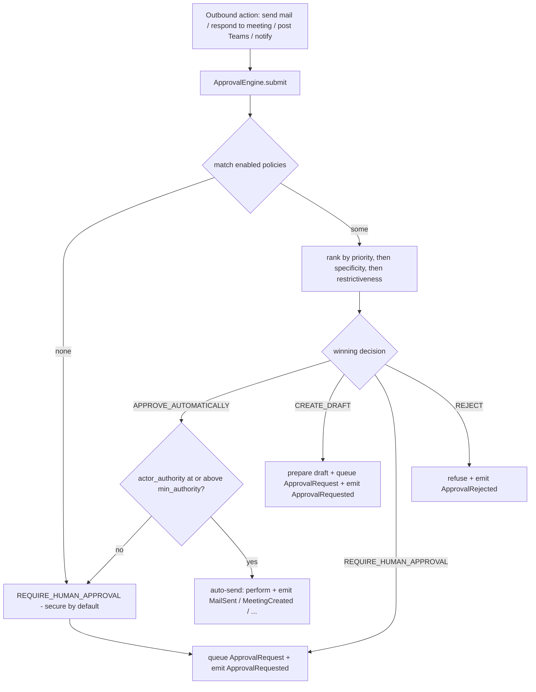

# Approval Workflow Guide

The **approval engine** is how the Workspace Integration (Epic 009) enforces the manifesto's
**Autonomy Limits**: Genesis may read, analyse, draft, categorize, and schedule autonomously, but
anything that *leaves the building* — sending mail, accepting a meeting, posting to Teams, sending
a notification — passes a policy-driven approval gate first. This guide describes the model in
depth, grounded in `application/approval_engine.py` and `domain/approval.py`. For the wider
architecture see `018_Workspace_Integration.md`; for the decision, [ADR-0012](../adr/0012-workspace-integration.md).

## The four decisions

Every evaluation yields one `ApprovalDecisionType` (`domain/common.py`):

| Decision | Effect on the outbound action |
| --- | --- |
| `APPROVE_AUTOMATICALLY` | Perform it now — no human. (`ApprovalDecision.is_automatic` is `True`.) |
| `CREATE_DRAFT` | Prepare the artifact (e.g. a provider draft) and queue an approval request for review. |
| `REQUIRE_HUMAN_APPROVAL` | Do not act; enqueue an approval request for a human. |
| `REJECT` | Refuse the action; emit a rejection event. |

The mailbox, calendar, Teams, and notification services all follow the same shape: build an
`OutboundAction`, call `ApprovalEngine.submit`, and act on the ruling — auto-approved actions are
performed, draft/approval-required actions are prepared and queued, rejects are refused.

## Policy facets

An `ApprovalPolicy` maps a matched action to a decision. Its optional **match facets** (each
`None` means "any") are:

| Facet | Matches on |
| --- | --- |
| `communication_type` | The `CommunicationType` of the action (`MAIL_REPLY`, `MAIL_FORWARD`, `MAIL_NEW`, `MEETING_INVITE`, `MEETING_RESPONSE`, `TEAMS_MESSAGE`, `TASK_ASSIGNMENT`, `NOTIFICATION`). |
| `customer_organization_id` | The customer org the action targets. |
| `customer_contact_id` | The specific contact. |
| `agent_id` | The acting AI Employee. |

Plus three non-facet fields: `min_authority` (the authority an actor must hold for an
`APPROVE_AUTOMATICALLY` to apply as-is), `priority` (higher wins), and `enabled`. A policy also
carries a `decision`, a `name`, and a `description`.

## Evaluation order

`ApprovalEngine.evaluate` is deterministic:

1. Load the tenant's **enabled** policies and keep those whose facets **match** the action
   (`_matches`: a facet set on the policy must equal the action's value; unset facets match
   anything).
2. If **no** policy matches, return `REQUIRE_HUMAN_APPROVAL` — *secure by default*.
3. Otherwise take the **maximum** candidate under the ranking tuple
   `(priority, specificity, restrictiveness)`:
   - **`priority`** — the explicit priority integer; highest dominates.
   - **`specificity`** (`_specificity`) — the count of set facets (0–4); the more specific rule
     breaks a priority tie.
   - **`restrictiveness`** (`_RESTRICTIVENESS`) — `REJECT` (3) > `REQUIRE_HUMAN_APPROVAL` (2) >
     `CREATE_DRAFT` (1) > `APPROVE_AUTOMATICALLY` (0); the most restrictive decision breaks any
     remaining tie.

So a highly specific, high-priority policy for one organization overrides a broad default, and
when two equally-ranked rules disagree the safer decision wins.

## Authority downgrade

If the winning decision is `APPROVE_AUTOMATICALLY` but the action's `actor_authority` is **below**
the policy's `min_authority`, the engine downgrades the ruling to `REQUIRE_HUMAN_APPROVAL` and
records why:

> `Policy '<name>' auto-approves, but actor authority <n> is below required <m>; requiring human
> approval.`

Autonomy therefore never silently exceeds its bound — the identical rule the Cognitive Core's
`PolicyEngine` applies, expressed for outbound workspace actions.

## The outbound flow

`submit` audits every evaluation (`approval.evaluated`), enqueues a `ws_approval_request` for
`CREATE_DRAFT` / `REQUIRE_HUMAN_APPROVAL` and emits `pb.workspace.approval.requested`, and emits
`pb.workspace.approval.rejected` for a `REJECT`.

## Seeding defaults

`seed_default_policies` installs a conservative set the first time a tenant connects (idempotent —
it does nothing if any policy already exists):

| Policy | Decision | Facets | Priority |
| --- | --- | --- | --- |
| `default-require-approval` | `REQUIRE_HUMAN_APPROVAL` | none (any action) | 10 |
| `default-draft-replies` | `CREATE_DRAFT` | `communication_type = MAIL_REPLY` | 20 |

The result: mail replies are **drafted** for human review, and every other outbound action
**requires human approval** — Genesis is bounded from first boot. Operators then add more specific,
higher-priority policies (per organization, contact, agent, or communication type) to widen
autonomy deliberately, e.g. an `APPROVE_AUTOMATICALLY` for `MEETING_RESPONSE` from a trusted agent
at a sufficient `min_authority`.

## The approval queue + decide flow

- `GET /approvals/pending?tenant_id=...` — `list_pending` returns the tenant's `PENDING`
  requests.
- `POST /approvals/{request_id}/decide` — `decide(tenant_id, request_id, approve, decided_by)`
  resolves a pending request to `APPROVED` or `REJECTED`, stamps `decided_by`/`decided_at`, emits
  `pb.workspace.approval.granted` or `pb.workspace.approval.rejected`, and audits
  `approval.decided`. A non-pending or missing request is returned unchanged / `404`.
- `GET /approvals/policies` and `POST /approvals/policies` — inspect and add policies.

An `ApprovalRequest` carries the `communication_type`, a `summary`, the target
`customer_organization_id`/`agent_id`, and the action `payload`, so a human sees exactly what
they are approving and the approved artifact can be acted on.

## How it enforces the manifesto's autonomy limits

- **Every outbound action is gated.** No service transmits outside the platform without a
  `submit` call — the gate is not optional.
- **Secure by default.** No matching policy means human approval; the default seed requires
  approval for everything but drafted replies.
- **Authority is policy-driven and never silently exceeded.** The `min_authority` downgrade makes
  "permitted at or above this authority, approval below it" a single expressible rule.
- **Auditable.** Every evaluation and decision is both an immutable event (through the Cognitive
  Core's single write path) and an audit record — the authoritative trail of who let what leave
  the building, and why.

## Cross-references

- `018_Workspace_Integration.md` — the services that call the approval engine and the event
  catalogue.
- [ADR-0012](../adr/0012-workspace-integration.md) — approval-gated autonomy as a first-class
  decision.
- `017_Program_Manager.md` — the analogous L0/L1/L2 authority gate the Cognitive Core's
  `PolicyEngine` applies to an AI Employee's own actions.
- [`GENESIS_EXECUTION_MANIFESTO.md`](../governance/GENESIS_EXECUTION_MANIFESTO.md) — the Autonomy
  Limits this engine implements.
