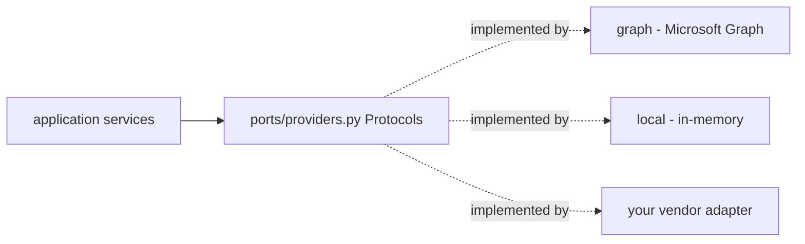

# Provider Abstraction Guide

How to add a new workspace **provider** (for example Google Workspace) to the Workspace
Integration (Epic 009) without touching a single line of business logic. This is the manifesto's
replaceability and no-vendor-lock-in principle made concrete: services depend only on the
provider **ports**; a provider is an **adapter** that implements them. See
`018_Workspace_Integration.md` for the architecture and [ADR-0012](../adr/0012-workspace-integration.md)
for the decision.

## The core idea



Business logic imports the ports in `ports/providers.py`; it never imports an adapter. Adding a
provider therefore means: **implement the ports in a new package, register a `Provider` enum
value, and add one branch to the factory/deps.** Nothing in `application/` changes.

## Step 1 — add a `Provider` enum value

`Provider` (`domain/common.py`, a `StrEnum`) names the vendor an adapter registers under. A value
for Google Workspace is already reserved:

```python
class Provider(enum.StrEnum):
    MICROSOFT_GRAPH = "microsoft_graph"
    IN_MEMORY = "in_memory"
    GOOGLE_WORKSPACE = "google_workspace"  # reserved for a future adapter
```

Add a new member here for any other vendor.

## Step 2 — implement the ports in a new `<vendor>/` package

Create `apps/api/src/pb_api/integrations/workspace/<vendor>/` and implement the port Protocols
from `ports/providers.py`. There are ten: the aggregate `WorkspaceProvider` plus the nine
capability ports it exposes — `MailProvider`, `CalendarProvider`, `ContactsProvider`,
`DirectoryProvider`, `StorageProvider`, `MeetingProvider`, `PresenceProvider`,
`NotificationProvider`, `TaskProvider`. The Graph adapter (`graph/`) is the reference for a
network-backed provider: one class per capability plus a `<Vendor>WorkspaceProvider` aggregate
that exposes each as a property and owns `healthcheck` and the webhook subscription lifecycle.

The ports are `@runtime_checkable` `Protocol`s, so an adapter needs no base class — it need only
provide methods with matching signatures. The full aggregate contract:

```python
class WorkspaceProvider(Protocol):
    @property
    def provider(self) -> Provider: ...
    @property
    def mail(self) -> MailProvider: ...
    @property
    def calendar(self) -> CalendarProvider: ...
    @property
    def contacts(self) -> ContactsProvider: ...
    @property
    def directory(self) -> DirectoryProvider: ...
    @property
    def storage(self) -> StorageProvider: ...
    @property
    def meetings(self) -> MeetingProvider: ...
    @property
    def presence(self) -> PresenceProvider: ...
    @property
    def notifications(self) -> NotificationProvider: ...
    @property
    def tasks(self) -> TaskProvider: ...
    async def healthcheck(self, tenant_id, connection_id) -> bool: ...
    async def create_subscription(self, tenant_id, connection_id, subscription) -> WebhookSubscription: ...
    async def renew_subscription(self, tenant_id, connection_id, subscription) -> WebhookSubscription: ...
    async def delete_subscription(self, tenant_id, connection_id, provider_subscription_id) -> None: ...
```

### Port contracts you must honour

- **Tenant + connection scoping.** Every method takes `tenant_id: uuid.UUID` and
  `connection_id: uuid.UUID` as its first arguments. The adapter resolves those to vendor
  resources (the Graph adapter uses a `resolver` to map a connection to a mailbox / drive / user);
  it must never leak data across tenants.
- **Provider-agnostic return types.** Methods return the domain models in `domain/` (e.g.
  `WorkspaceMessage`, `CalendarEvent`, `DirectoryUser`, `DriveItem`, `WorkspaceTask`,
  `Presence`) — never vendor JSON. Map vendor payloads into these models inside the adapter.
- **`Page` / `DeltaPage` containers** (`domain/page.py`):
  - `Page[T]` — one page of results plus an opaque `next_cursor` (`None` when exhausted); models
    cursor pagination (Graph's `@odata.nextLink`).
  - `DeltaPage[T]` — one page of a delta sweep: `next_cursor` walks the current sweep,
    `delta_token` appears only on the final page and is what the caller persists to resume from
    changes, and `removed_ids` carries tombstones. Map your vendor's change-feed semantics onto
    these three fields; the calling `SyncService` is written entirely against them.
- **Credentials via ports, not config.** If your vendor uses OAuth, reuse
  `CredentialStore` / `TokenProvider` (`ports/credentials.py`) exactly as the Graph adapter does,
  so secrets remain Fernet-encrypted at rest.

Capabilities a vendor does not support can raise or return empty pages, but keep the signatures
intact so the ports stay uniform.

## Step 3 — register the adapter in the factory and deps

`provider_factory.py` is "the one place that constructs the concrete adapter." Add a branch that
builds your adapter for its `Provider` value, mirroring `build_graph_provider` (which wires the
per-session encrypted credential store, a resource resolver, an app-scoped HTTP client, and a
rate limiter). Then extend `api/deps.py::_provider_for` so the API selects your adapter when
`PB_WS_PROVIDER=<vendor>` and its credentials are configured — otherwise it falls back to the
in-memory adapter. Selecting a provider is **configuration, not code**: one enum value, one
adapter package, one factory branch.

`WorkspaceContext` and every service already accept a `WorkspaceProvider` by port, so once the
factory returns your adapter, all of mail, calendar, documents, search, sync, approvals, events,
and memory work against it unchanged.

## The in-memory adapter — reference implementation and test backend

`local/` (`InMemoryWorkspaceProvider` over `InMemoryStore`) is a **first-class alternate
backend, not a mock**. It is a complete, fully-functional implementation of every port and is the
best reference when writing a new adapter, because it documents the exact pagination and delta
semantics the ports expect:

- **Cursor pagination** — the `cursor` string is a decimal integer offset into a
  deterministically ordered result set; a page returns `next_cursor = str(offset + page_size)`
  while more remain, else `None`.
- **Delta tokens** — the `delta_token` string is the last-seen value of the resource's monotonic
  version counter; a sweep with token `V` yields objects changed after `V` plus tombstoned
  `removed_ids`, and the final page carries `delta_token = str(current_version)` with
  `next_cursor = None`. A first sweep (no token) returns everything and no removals.

Because it needs no network or credentials, the in-memory adapter is also the test backend: the
workspace suite (`tests/integrations/workspace/`) seeds its `InMemoryStore` as a simulated
external Microsoft 365 and runs the real services against it — no production mocks. A new adapter
should have its own transport-level tests (see `test_graph_client.py`, which drives the Graph
adapter through an `httpx.MockTransport`), while the business-logic tests keep running against the
in-memory adapter unchanged.

## Checklist

1. Add a `Provider` enum value (`domain/common.py`).
2. Implement the ten ports in `integrations/workspace/<vendor>/`, returning domain models in
   `Page`/`DeltaPage`, scoped by `(tenant_id, connection_id)`.
3. Reuse `CredentialStore`/`TokenProvider` for OAuth so secrets stay encrypted.
4. Add a factory branch (`provider_factory.py`) and a deps branch (`api/deps.py`).
5. Add transport-level adapter tests; business-logic tests are already covered by the in-memory
   backend.
6. Confirm **no file under `application/` changed** — if one did, a vendor detail leaked past the
   port boundary.

## Cross-references

- `018_Workspace_Integration.md` — the architecture and the port list.
- `GRAPH_INTEGRATION_GUIDE.md` — the reference network adapter, end to end.
- [ADR-0012](../adr/0012-workspace-integration.md) — ports-and-adapters with the in-memory
  adapter as a first-class backend.
